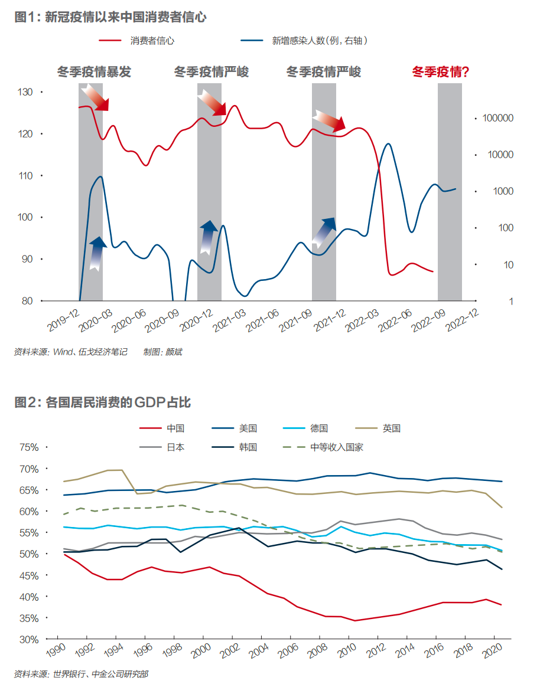

# 消费是刺激出来的吗？怎么花钱不用专家教

**文｜朱长征**

近日，经济学家、国民经济研究所副所长王小鲁在采访中称，消费不是刺激出来的，消费是人的自然需要，吃穿旅游、丰富文化生活等都不是靠刺激消费才出现的；把老百姓的切身问题解决好，住房、医疗、养老、孩子上学等等社保问题全覆盖，消费自然会恢复。
**要让老百姓敢消费，而不是刺激消费。**

王小鲁还提出，有很多方面问题导致百姓不敢消费，不解决这些问题去刺激消费，这种刺激是没有后劲的、起不了多大作用；没有老百姓消费，经济是没有支撑的经济，光靠房地产支撑、靠货币放水不是长久之计。

“如何提振消费”在疫情暴发以来已经几番讨论，那么，消费，是靠刺激出来的吗？怎么花钱，还用专家教吗？

**疫下消费冷暖**

10月24日发布的三季度经济数据显示，消费对三季度国内生产总值（GDP）增长的贡献依然较弱。前三季度GDP同比增长3%，同期服务业增加值增长2.3%。

其中，三季度GDP同比增长3.9%，服务业同比增长3.2%；9月社会消费品零售总额同比增长2.5%，增速比8月回落2.9个百分点。

今年国庆假期就是消费偏冷的最明显体现。
**由于疫情面广量多，且管控强度升至三年来高位，宾馆旅游、交通运输、会展演出等出行消费及服务业都降到了历史同期最低水平。**

**出行方面，交通运输部的数据显示，国庆七天假期内，旅客发送量较2020年、2021年同期分别下降41.4%和36.4%。**

据文化和旅游部数据中心测算，国内旅游出游4.22亿人次，同比减少18.2%，按可比口径恢复至2019年同期的60.7%；实现国内旅游收入2872亿元，同比减少26.2%，恢复至2019年同期的44.2%。

旅游人次的降幅比旅客发送量降幅小，可能是因为计入了短途旅行和自驾游等，而后者通常是跨省区的。

国庆期间，全国百度迁徙指数均值为527.29，和2020年、2021年的同期相比分别下降12.7%和23.8%。百度迁徙指数是利用百度地图定位可视化展现人口的迁徙情况，样本可能略有局限。

最典型的莫过于九寨沟景区，由于实行“预约、错峰、限流”和落地“3天3检”等防疫措施，今年黄金周七天入园游客人数仅为211人，其中10月1日仅1人，出现了历年未见的极值。

景区门票预订系统显示，10月8日至10日，入园人数记录依旧只有13人、28人和22人，而8月中旬入园人次曾达2万左右，景区目前的每日限流人次为4.1万。

**文化娱乐方面，国家电影专资办数据显示，国庆假期（10月1日至7日）全国票房总收入14.96亿元，同比大跌65.84%，仅为疫情前2019年国庆档票房的33.5%，是2015年以来同期成绩的最低水平。**

假期进入影院的观众大幅减少。猫眼电影专业版统计显示，国庆档放映总场次270.5万场，同比增加10.36%，虽平均票价比2021年有所降低，但观影人次还是下降61.47%，仅为3609.2万。

灯塔专业版数据也显示，今年国庆档观影人次为3326.1万，远低于2018年-2021年同期5408.6万、1.18亿、9994.8万以及9368.1万的人次。

与电影行业类似，会议、展览、演出、大型体育赛事等大为减少，或延期举办，或转移至线上。

住房成交可以看作装修装饰、家电、家具等居民消费的先行指标。9月底，楼市刺激政策集中出台，包括允许部分城市下调首套住房贷款利率，对卖房一年内再买房者给予退税优惠，调降首套个人住房公积金贷款利率等。

这样的“组合拳”终于给黄金周的楼市带来些买气，但中指研究院对企业的跟踪显示，虽然部分大城市商品房销售略有恢复，不同城市、不同项目分化明显，其重点监测的21个城市新建商品住宅成交面积较去年同期下降37.7%，北京、上海、广州、深圳四个一线城市成交量均同比下降，其中北京降幅最大，达64%。

**房地产市场的持续转冷，导致新房销售大幅减少，甚至出现较多存量房贷提前还清全部贷款的情况。**
中指研究院的数据显示，今年前九个月百强房企销售额均值为540.8亿元，同比下降45.1%。

克而瑞研究中心的统计显示类似结果，百强房企1月-9月累计销售操盘金额46697.9亿元，同比下降45.4%，居较高水平，虽然三季度以来降幅呈收窄状。

**汽车销售似乎成了今年难得的消费亮点，特别是新能源车。**
中国汽车工业协会统计，1月-9月国内汽车销量1947万辆，同比增长4.4%。其中新能源汽车销售456.7万辆，同比增长1.1倍。

最新财新服务业采购经理指数（PMI）从企业端反映了整体消费的疲弱——9月财新通用服务业经营活动指数经历了三个月的扩张之后，重现收缩态势，降至49.3，比8月下滑了5.7个百分点，再次降落到荣枯线以下。

**除了疫情，什么阻碍人们花钱？**

到九寨沟的游客大幅减少，自然是当地严格防疫的结果，当前整体服务业和出行情况显示人们消费缩减，也主要与疫情反复和防疫措施收紧相关。可能有些人认为，如果防疫政策放松、就业生活休闲等均恢复正常，消费也自然就恢复了。

实际上，多重因素损毁了部分居民家庭的资产负债表，使他们在背负房贷、子女教育和老人养老等压力下还须面对收入的不确定或减少，疫情只是其中一个诱因。
**即使疫情过去，他们的消费复苏仍将是缓慢的。**

我们把时间拉长一点，观察近十年来居民消费与收入的动态变化。

“十二五”期间（2011年-2015年），中国社会消费品零售总额从18.7万亿元上升到30.1万亿元，简单地平均计算，年均增长12.2%；到“十三五”期间（2016年-2020年），社会消费品零售总额从31.2万亿元上升到39.2万亿元，年均增幅降到了5.1%。去年社零虽有恢复性增长，但2020年和2021年两年平均增长率仅有4%。

**消费增速的明显下滑，与居民收入增速下滑相互映照。**
“十二五”期间中国居民人均可支配收入的年均实际增速为8.9%，“十三五”期间为5.6%，2020年和2021年两年平均为5.1%。

国务院发展研究中心研究员张文魁认为，这里所说的居民收入这个大盘子，实际还不能完全用于消费，其中还有买房子，这在统计数据中算到了投资中，还有真正的储蓄和投资，因此，能用于消费的收入就更少了。

在2021年全国居民五等份收入分组中，底层的两个分组（低收入户、中间偏下户）的可支配收入都低于2万元/年，即使是中等收入组，年可支配收入也仅为2.9万元。

对于数量众多的中低收入阶层的消费不振问题，学者和决策智囊们存在着两种解释：
**一种认为这是收入问题，是因为他们收入不高带来的消费水平低的问题，“想消费但没钱”；另一种认为这是消费率（平均消费倾向）低导致的消费水平低的问题，“有钱不想消费”。**

长期研究收入分配问题的浙江大学文科资深教授李实认为，对于中低收入人群来说，更大的问题是他们的收入问题。这与王小鲁的观点类似。

根据李实团队的测算，
**2019年中国家庭人均月收入在500元以下的，约有1亿人，人均月收入在1000元以下的约3.1亿人，2000元以下的约7.1亿人。**

如果进一步考虑收入差别，这其中至少5亿-6亿人主要是收入低导致他们的消费水平低。“不是他们不愿意消费，而是他们收入水平低，这些收入只能满足其基本的生活需要，不会有什么结余，怎么去刺激他们的消费”？

与此相关联的是，对于中低收入人群，用什么政策来提高他们的消费水平。
**如果刺激消费的政策不是将重心放在提高收入上，而只是想到家电下乡、汽车下乡之类，那这些政策很可能只是改变了这部分人群的消费结构，总体上可以说是无效的。**

**这也是近几年居民消费倾向持续下滑、需求收缩压力更加明显的原因所在。**

解决这部分人“没钱不敢消费”的问题，需要有机制调整和政策组合。所谓机制调整，就是确保居民部门在国民收入分配中的比例。最近几年，居民可支配收入在国民收入中的占比有所提升，平均在60%左右，企业部门、政府部门占比大约各为20%左右。

与发达国家相比，中国居民部门的占比还应该提高。此外，中国居民劳动报酬在国民收入中所占比重只有40%上下，即使考虑测度偏差问题，也明显低于发达国家百分之五六十以上的水平（张文魁）。

政策组合则包括就业优先政策、公共教育支出保障、社保全覆盖且提高标准、提升公共服务均等化水平，以及必要的再分配政策等，比如以公共教育的免费和补助缓解居民刚性储蓄趋向、确保农村居民看病实际报销比例等等，这些都需要公共政策和公共财政提供强有力支持。

**发钱发消费券有没有作用**

确实，有了钱，谁都知道要吃点营养更高的，娱乐休闲多一点，住得更宽畅些，每年再长途旅行一两趟……怎么花钱，哪需要别人来操心，需要专家来教？

因此，从上面的分析中我们也对王小鲁等学者的大部分观点予以支持。这从学理上、从长期来讲无疑是正确的。

**我们应当检讨的是为什么居民收入增速这十来年不断下行；检讨在初次分配中，居民部门占比为何没有明显提高；检讨公共财政支出是否切实花在了刀刃上（以人为中心的民生、教育、医疗、保障房、发展事项等）；检讨社会保障覆盖网是否完善、保障水平是否足够，等等。**

但在疫情持续将近三年的今天谈论居民消费话题，我们绝不能脱离疫情这个特殊背景，脱离其持续时间，脱离其影响程度。为此我们对王小鲁的观点存有一点保留，给居民发钱发消费券真的没用吗？那为何中国香港特区、那么多国家都这样做了？

安信证券首席经济学家高善文不久前谈到，今年以来中国住户部门出现了广泛的资产负债表收缩，其变化多年未见。一方面住户储蓄率年内上升了超过3个百分点，这伴随着消费减速和可选消费的明显下降。另一方面，住户显著降低了资产负债表的风险暴露，减少债务及风险资产并转向存款及货币基金等。

居民资产负债表收缩，是其收入收缩的表现形式。疫情，叠加在此前后出台的对影视、互联网、教培、房地产等行业的严格管控整肃，产生了合成谬误和分解谬误的效果共振，企业纷纷裁员或冻结、压缩招聘，服务业雪上加霜。需求收缩、预期转弱等多重压力进一步制约了经济活动。

**面对疫情冲击，一些海外国家首先采取措施拯救居民消费。**
美国政府先后通过六轮针对普通民众和企业的财政援助刺激法案。联邦政府债务从2019年底的22.7万亿美元增至最近的31万亿美元，两年间额外增加约8万亿美元债务，其中的最大头是对居民部门的补助。

美国发钱主要针对年收入7.5万美元以下的个人和15万美元以下的家庭；过去两年多，按照三口之家估算，每户平均得到的现金补助至少3万美元，就连离开美国已经20来年的李稻葵，还收到了美国政府开出的2000美元支票。

前不久，鉴于通胀居高，美国加州给2300万符合条件的纳税人（不限于本地居民）退税，预计面向中产阶级和低收入者的退税合计补贴额为95亿美元。

这类直接补助居民的疫情应对政策，在加拿大、日本、新西兰、新加坡及欧洲各国普遍运用。

2020年以来的三年间，中国香港特区政府每年都向居民直接发钱，每个18岁以上永久居民分别获得1万港元现金、5000港元消费券和1万港元消费券。

**虽然有些国家补贴居民刺激过头出现通胀，但整体上这类“取之于民用之于民”的公共财政政策还是发挥了作用。**

有人说，给每个人发钱容易滋生“养懒汉”的毛病，而且国家也发不起。笔者建议是否可以考虑，优先给疫情中受困地区、受困人员、失业人员及低收入家庭发钱。

还有人担心发钱或消费券对提高消费作用不大。香港中文大学经济系宋铮教授等的研究显示，2021年香港特区政府推出的5000港元/人的数字消费券计划，从总量上看，消费券用户的额外支出达到消费券面额的80%以上，近于世界各地以往财政刺激政策效果的上限，对香港经济复苏起了积极作用。

浙江省商务厅的数据显示，今年一季度浙江发放各类消费券近20亿元，截至3月底，平均兑付率达74%，消费拉动作用明显。

**这类消费券对改善商家运营状况、增加服务业收入效用很直接。**

历年来，我们的决策机制和执行机制擅长审批基建投资项目，而对激励消费并实现经济增长动力结构的转型欠缺方式，消费政策也常常似曾相识，缺乏新意和针对性。

面对如此严重、如此长时间损坏居民收入和消费的新冠肺炎疫情，我们的公共财政如何化解民众困难，政策创新势在必行。

（作者为独立学者，“长平投研”主持人；编辑：王延春）

