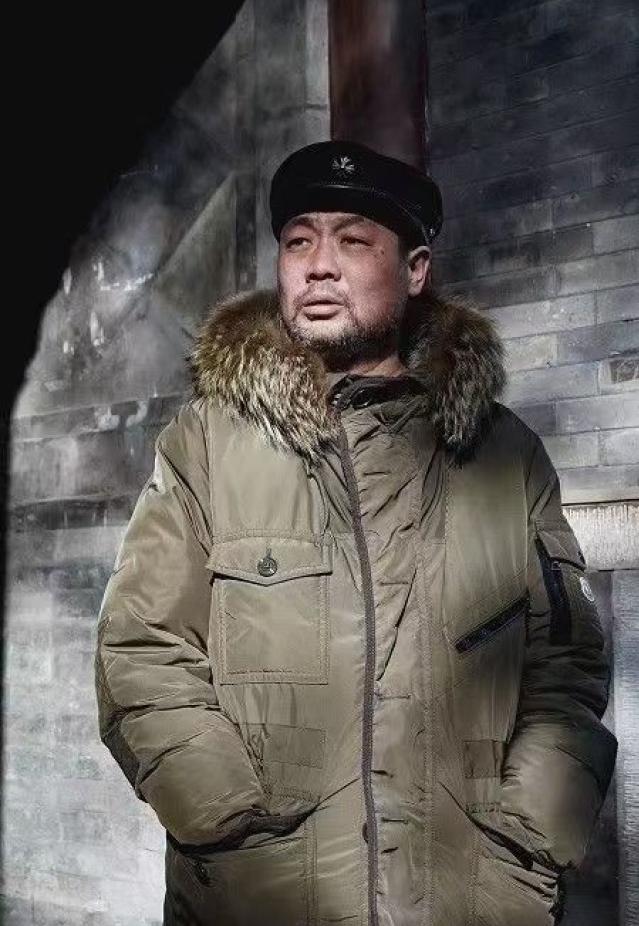
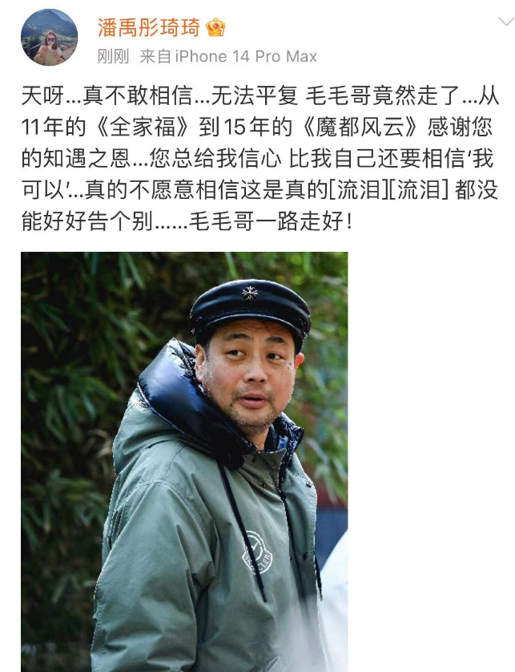
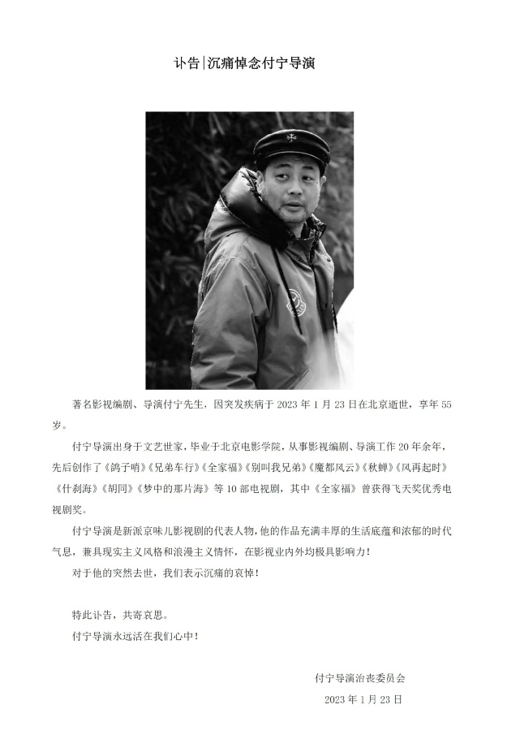
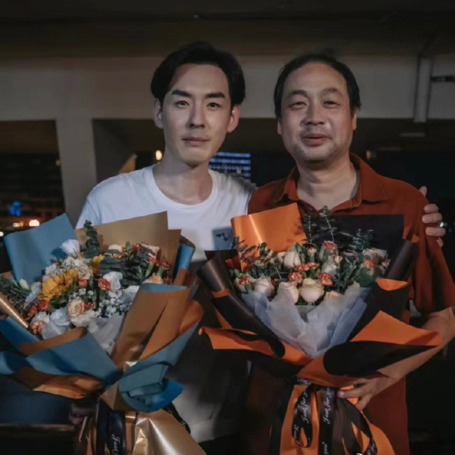
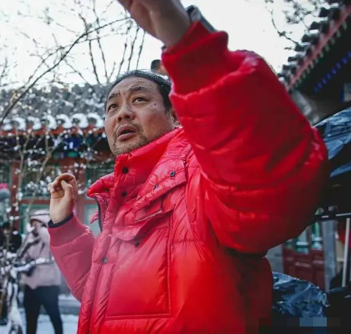
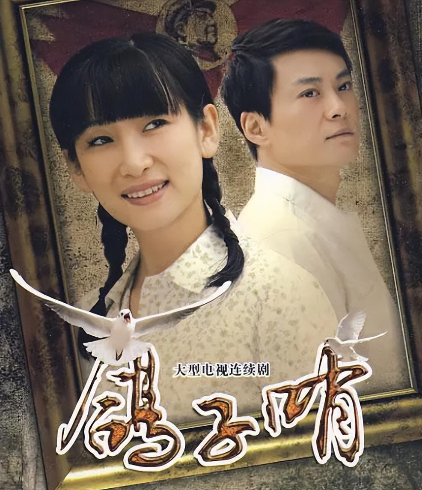
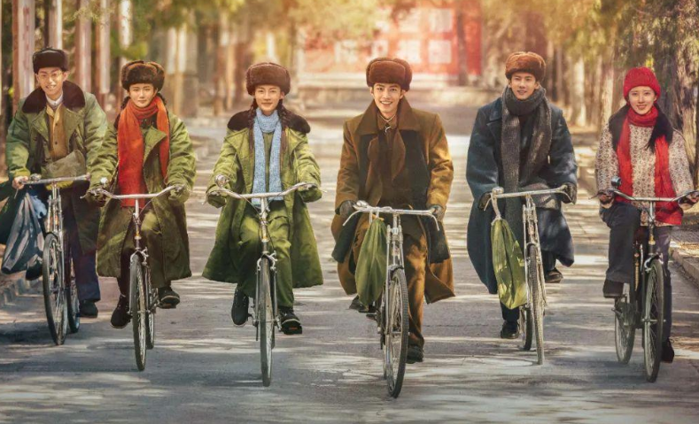
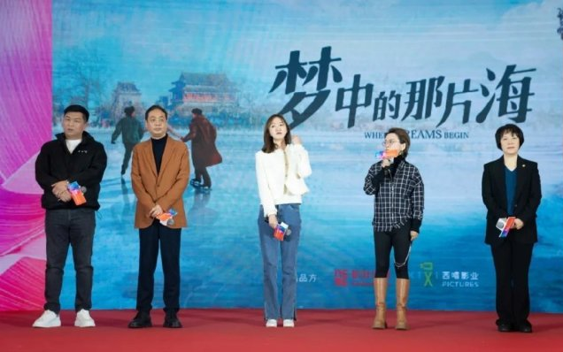
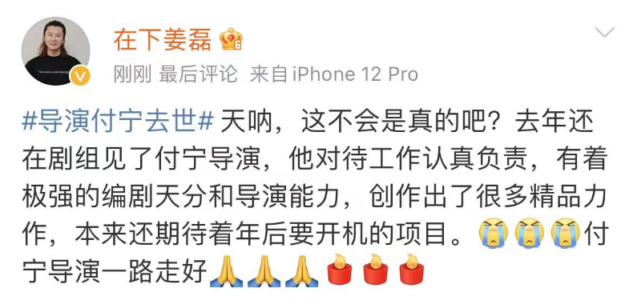

# 55岁导演付宁突发疾病去世，曾与肖战关晓彤合作，去世前两天还好好的

1月23日晚，娱乐圈再传悲痛噩耗，演员钱波悲痛宣布金牌导演付宁去世，作为朋友他难以接受，之前两人曾合作拍摄过7部戏，是他人生中的贵人，对于这个噩耗，不少网友也难以置信，纷纷询问消息是否属实。

后经过多位圈内人的证实，付宁导演确实走了，关于他去世的原因好友没有透露，目前已有多位演员悲痛送别付宁导演，学生崔自豪连发多个大哭的表情，直言太突然了，他送别付宁老师一路走好。

另一演员得知噩耗无法平复心情，回忆两人从11年合作《全家福》到15年的《魔都风云》，感谢付宁导演的知遇之恩，不愿意相信这是真的，也没能和付宁好好告个别，希望毛毛哥一路走好。

目前，付宁导演治丧委员会发布了讣告，透露他是因突发疾病在北京逝世，走得很突然，也简单介绍了付宁导演的生平。

演员刘欢透露两人大年三十还在打电话呢，难以置信怎么就走了呢，而通过刘欢的发文可以确定，付宁导演走得很突然，去世前两天还好好的，所以付宁去世的原因也引发外界猜测。

刘欢还晒出与付宁的合影，据悉两人曾合作过电视剧《胡同》《秋蝉》，私下关系一直很不错，每次付宁写剧本都会给刘欢留一个最好的角色，带着他去吃大江南北好吃的，还约着说要带刘欢去吃老莫儿呢，没想到这竟然成了两人的遗憾，刘欢得知噩耗后也将赶回去送别付宁导演。

据悉，付宁今年才55岁，
从小在北京胡同跟着奶奶长大，之前付宁拍摄的电视剧《胡同》就是根据奶奶的故事在作品中反映出来，这部电视剧是由赵露思、关晓彤、侯明昊等主演，取得了不错的口碑。

另外，付宁还拍摄了很多收视率不错的影视剧，包括早年搭档秦海璐拍摄了《鸽子哨》和《全家福》，后续和陆毅袁泉拍摄了《风再起时》。

直到2018年和任嘉伦合作拍摄了《秋蝉》，付宁导演的名声才彻底响亮，这部剧的收视率曾一度破2，成了年度爆款。

他还与老演员刘佩琦、曹翠芬、吴彦姝拍摄了都市家庭剧《什刹海》，这部剧中同样有不少人气很高的流量艺人，包括关晓彤、吴磊，该剧还曾荣获2020年度创新剧集奖。

去年，付宁导演拍摄了两部影视剧，其中一部是搭档肖战李沁拍摄的《梦中的那片海》，另一部就是《胡同》，目前《梦中的那片海》还没有播出，也成了付宁导演的遗作，这部剧目前的关注度很高，没想到付宁导演却再也看不到该剧播出，令人无比遗憾。

翻看付宁导演的社交账号，他在去年10月还曾发文，从动态中看不出他有任何异常，还特别宣传了《胡同》这部剧，也一直为工作忙碌着。

白玉兰奖的评委悼念付宁导演时透露，他去年还在剧组见了付宁，夸他对待工作认真负责，有着极强的编剧天分和导演能力，创作出了很多精品力作，本来还期待着年后要开机的项目，没想到走得那么突然。

付宁导演最后一次公开露面是在去年6月，《梦中的那片海》杀青时，付宁导演和肖战等人一起合影，大家对着镜头比手势，没想到仅仅半年付宁导演就走了，相信肖战得知付宁导演去世的噩耗后，也会悲痛不已。

斯人已去，留下的是无尽的怀念，他的这些作品将被永远铭记，希望付宁导演到另一个世界继续追寻自己的艺术梦想，一路走好。

