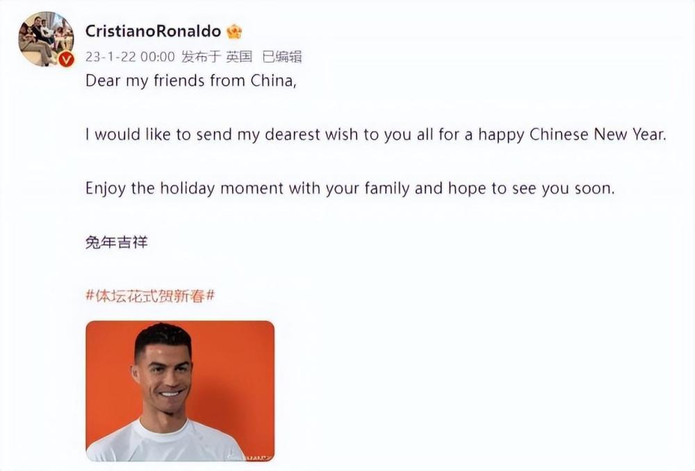

# C罗给中国球迷送新春祝福，韩媒怒了：“中国新年”属用词不当

北京时间1月22日零点，葡萄牙球星C罗更新社交媒体，准时给中国的球迷送上新春祝福，“亲爱的中国朋友们，送上我最诚挚的祝福，祝大家新年快乐！祝愿你和家人可以享受新春假期，期待很快见面，兔年吉祥！”

对此，韩国媒体starnewskorea撰文表示，C罗在祝福中写“中国新年（Chinese New Year）”是用词不当，应当写作“农历新年（Lunar
New Year）”。该媒体表示：农历新年不仅在中国，而且在韩国、越南、菲律宾等亚洲国家都是被庆祝的节日。

文章最后指出，热刺、曼联等欧洲豪门在祝贺新年的时候写的就是“农历新年（Lunar New Year）”。

此外，“jtbc”“xportsnews”等多家韩媒也发文认为C罗的发言不妥。

近日，韩国女团NewJeans成员丹妮尔（Danielle Marsh）也因称呼春节为“Chinese New
Year”而遭到部分韩国网民围攻。1月21日，她发文道歉，称自己正在反省，因为“春节是包括韩国在内的多个国家和地区纪念的节日，所以我的表达方式不恰当”。

然而，评论区“翻车”了，俄罗斯、美国、法国、澳大利亚、泰国、新加坡等国网友纷纷留言称“不必道歉”，“在我们国家，也称春节为Chinese New
Year”。

春节作为中国农历新年，来源于中国，是中华民族传承几千年的重要节日。同时，受到中国文化的影响，世界上一些国家和地区也有庆贺新春的习俗，还有多个国家和地区将春节定为整体或是部分辖区的法定节假日，但春节始终是带有浓重中国风味的节日。在英语国家，春节更多被称为“Chinese
new year”。但近年来，一些韩国人一直尝试在国际语境中将其替换成“Lunar New Year”，以削弱春节所含的中国文化背景。

来源：羊城晚报•羊城派、观察者网

