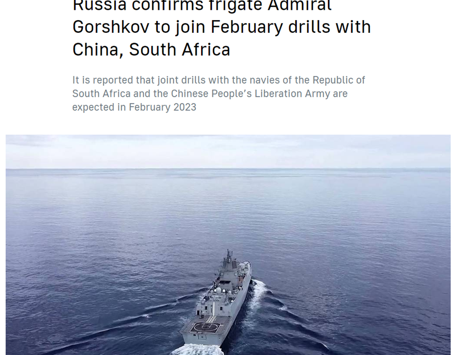

# “俄中南非下月举行联合演习”，这艘军舰不一般

25日，俄罗斯国防部宣布，装备“锆石”高超音速导弹的俄罗斯“戈尔什科夫海军上将”号护卫舰将参加与中国和南非海军联合举行的海上演习。

报道称，演习计划于2月初在南非海岸举行。

美国有线电视新闻网称，“戈尔什科夫海军上将”号于1月4日出海执行任务，在前往大西洋之前，这艘护卫舰在挪威海进行了防空演习。“戈尔什科夫海军上将”号的指挥官称，该舰配备了“锆石”高超音速导弹，并于25日成功进行了该导弹的发射测试。

在俄罗斯国防部发布的一段视频中，“戈尔什科夫海军上将”号舰长伊戈尔·克罗赫马尔称：“今天举行了一场战斗训练演习，模拟对敌方水面目标实施导弹打击。‘锆石’导弹命中了超过900公里外的目标。”

对于这次三国联合演习，西方尚未有明确表态，但对于参加演习的俄军舰艇，西方关注度却异常的高。

美国“海军侦察”网站称，配备“锆石”高超音速导弹的“戈尔什科夫海军上将”号护卫舰很可能成为乌克兰的新威胁。报道提到，它是俄海军22350型护卫舰首舰，于2015年服役。

最近，完成升级后的该护卫舰离开俄罗斯，开始了穿越大西洋、印度洋以及地中海的航行。“戈尔什科夫海军上将”号排水量约4500吨，配备了新型130毫米舰炮、防空系统和卡-27反潜直升机等，最大航速可达30节。

但最关键的是，该舰携带的“锆石”高超音速导弹被看作是俄罗斯最具威慑效果的现代化武器。它的飞行速度最高可达9马赫，接近7000英里/小时，并在低空飞行以躲避雷达探测。该导弹的射程约为1000公里，能击中敌方的纵深目标。在俄国防部的最新演练中就证明了这一点。此外，该导弹还能够在飞行过程中进行躲避机动，使对手的拦截变得非常困难。

也正因为搭载有这种强大的武器，“戈尔什科夫海军上将”号这次出海执行战备巡航任务时，俄总统普京还专门以视频方式出席远航启动仪式。俄安全会议副主席梅德韦杰夫之前也在社交媒体“电报”上调侃称，“戈尔什科夫海军上将号”护卫舰前往北约国家海岸，“是送给它们的新年大礼”。“就让它待在北约海岸100英里的地方，离（美国东部河流）波托马克河更近一些，让你们高兴高兴！”外界普遍认为，该舰这次巡航的目的之一，就意在警告美国、北约谨慎介入俄乌冲突。

