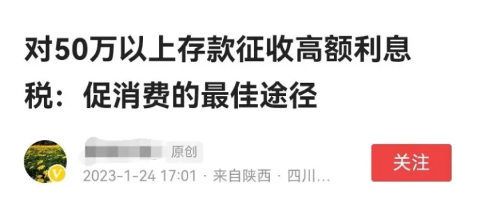
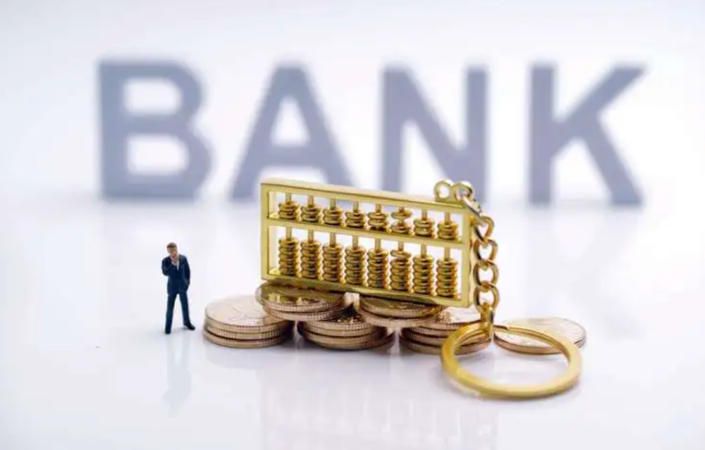
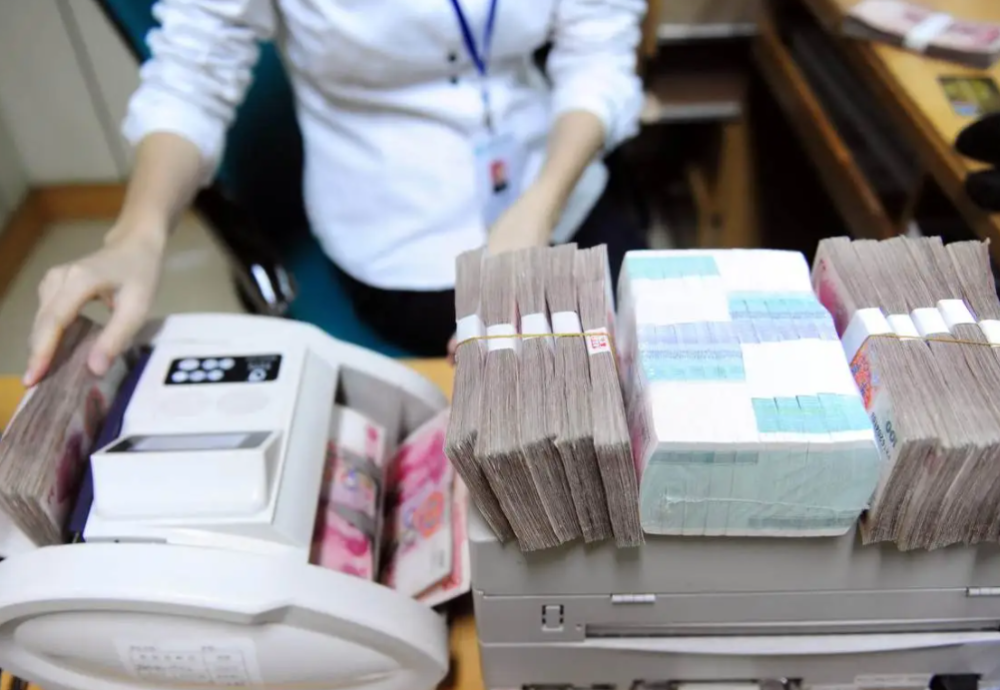

# 专家建议对50万以上存款征收高额利息税以刺激消费！可行吗？

  * _1_ 对存款征收利息可以当成是降低存款利率，问题变成了降低存款利率能否刺激拥有大额存款的人取钱消费。
  * _2_ 2022年存款利率下调了，根据央行给出的数据显示2022年住户部门（个人）存款余额增加了17.84万亿元，而2021年只增加了9.9万亿元；
  * _3_ 无论从新增存款数据还是逻辑上来看对50万元以上存款征收利息税并一定能达到刺激消费的目的，相反还增加了苛捐杂税，与我国目前正在实施的减税降负政策不符。

看了标题是不是就想骂专家了，别急，专家的目的是想刺激消费。咱们分析一下如果按照这位专家说的对50万元以上存款征收利息税的话到底能不能起到刺激消费的作用。

根据我国税法规定存款利息免税，但投资股票、购买债券获得的投资收益是要按照股息、红利所得征收20%的个人所得税的。比如，买了100万元某企业的债券，年利率为5%，一年下来能够拿到5万元利息，按照20%的税率缴纳个税后实际到手4万元，缴纳的个税为1万元（5万*20%）。

如果大额存款不再免税的话，利息收入也要按照20%的税率上税。还是以100万元为例，假设一年的定存利率为3%，那么利息就是3万元，需要缴纳6000元个人所得税，实际到手的存款利息为2.4万元。

专家认为一旦对50万元以上的存款征收个人所得税“有钱人”就会觉得存款不划算，还不如取出来消费，从而达到扩大内需、刺激消费的作用。可我不这么认为，原因如下。

对存款征收利息可以当成是降低存款利率，不就是在原有的利率基础上打了八折吗？换言之，50万元以上的存款利率为银行给出的80%，比如，3%的定存利率变为2.4%，2.5%的定存利率变为2%。

这么一来问题变成了降低存款利率能否刺激拥有大额存款的人取钱消费。

熟悉存款市场的朋友应该都知道2022年存款利率下调了吧。不仅六大国有银行下调了定期存款的挂牌利率，就连股份制银行和城商行也下调了几句，那么2022年的存款增加额变少了还是变多了呢？

根据央行给出的数据显示2022年住户部门（个人）存款余额增加了17.84万亿元，而2021年只增加了9.9万亿元。

2022年的平均存款利率低于2021年，可老百姓新存入银行的钱比2021年多了不少，这意味着存款利率虽然下降、储户拿到的利息变少了，可人们并没有因此减少存款额度，反而越存越多。

请问这位经济专家如何解释这一现象，又如何为自己的建议自圆其说呢？

另外一方面，对大额存款收利息税确实可能让部分储户“放弃”存款，但这不表示他们会增加消费。不存钱可以投资其它金融产品，比如理财产品、信托、股票、债券等，要知道“有钱人”的投资渠道可比底层民众多，人家会找到替代存款的投资方式，所以不一定会增加消费。

无论从新增存款数据还是逻辑上来看对50万元以上存款征收利息税并一定能达到刺激消费的目的，相反还增加了苛捐杂税，与我国目前正在实施的减税降负政策不符。

要刺激消费就得增加老百姓的收入，包括劳动收入和资本性收入，而不是变着办法减少实际到手的钱。建议这位经济专家好好想点提高大家收入预期的办法，不要为了提建议而建议，更不反其道而行，做出不利于老百姓的事情。

以上纯属个人观点，欢迎关注、点赞，您的支持是对原创最好的鼓励！

