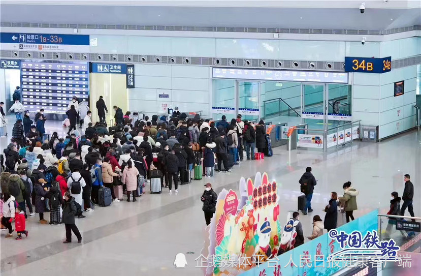

# 从家乡返回后会有再次感染新冠风险？专家：概率很低

**人民日报健康客户端记者 周学津**

“大年初一到今天，因为发热、咳嗽等新冠疑似症状前来就诊的患者不多。昨天只有3位，今天上午还没有。”1月25日，山东省青岛市高新区社区卫生服务中心的工作人员告诉人民日报健康客户端记者。

_1月24日，西安北站等待检票的旅客。中国铁路
图_

人民日报健康客户端记者致电山东省青岛市市北区宁夏路街道和平社区卫生服务中心、四川省成都市成华区龙潭社区卫生服务中心等多地社区医院，工作人员均表示，春节后因为发热、干咳就诊的患者并不多。

春节假期即将结束，不少将要返程的人担心从家乡返回后是否有再次感染的风险。南方医科大学公共卫生学院生物安全研究中心主任赵卫告诉人民日报健康客户端记者，目前全国报送的本土病例新冠病毒基因组有效序列全部为奥密克戎变异株。

“据这一情况，在外地已经感染过的人，从目前看，应该还在半年的有效保护期内，加之目前的流行株仍然为奥密克戎变异株，出现免疫逃逸现象的可能性很小，因此返程后被感染的风险也很小。”赵卫表示，如果在返乡后注意尽量居家，减少外出和聚集，或者没有和有症状感染者发生无保护接触的经历，被感染的风险就更小了。

“从家乡返程后是否会有感染风险？从全国的表现上来看，这种担忧已经多余。春节假期已过半，并没有出现大规模的疫情。”上海市肺科医院呼吸与危重症医学科副主任胡洋也向人民日报健康客户端记者表示，从家乡返回后再次感染的风险很低，“大家都刚感染过，身体内还有抗体，短期内再感染的概率是比较低的。”

“就目前公布的数据来看，社会面的传染源已大为减少，客观上大大降低了从家乡返回工作地路上的感染风险。当然，从谨慎的态度出发，为了避免感染，在返回路上的密闭场所，如乘坐公共交通工具时，除了餐饮期间，建议全程戴口罩。回到住处后，建议立即洗手和换洗外套。同时关注自己的身体情况，一旦出现新冠病毒感染的临床症状，及时治疗。”赵卫说。

