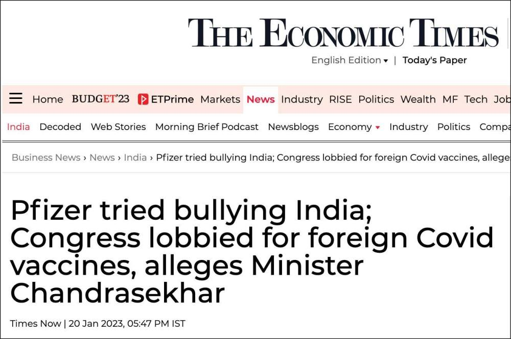
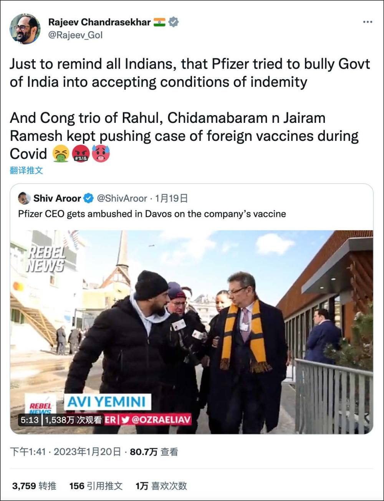

# 印度信息技术国务部长：辉瑞公司试图威胁印度政府

【文/观察者网 熊超然】据印度《经济时报》（The Economic
Times）当地时间1月20日报道，印度信息技术国务部长拉杰夫·钱德拉塞卡（Rajeev
Chandrasekhar）当天在推特发文指责美国制药商辉瑞（Pfizer）试图“威胁印度政府”，迫使印度接受新冠疫苗损失赔偿条款。

_印度《经济时报》报道截图_

据报道，钱德拉塞卡当天在推特上写道：“只是为了提醒所有印度人，辉瑞公司试图胁迫印度政府接受赔偿条款。”与此同时，他还将矛头指向了印度国内反对党国大党的三名领导人及政客。

此三人分别是拉胡尔·甘地（Rahul Gandhi）、帕拉尼亚潘·奇丹巴拉姆（P Chidambaram）和贾伊拉姆·拉梅什（Jairam
Ramesh），钱德拉塞卡在推特上指控他们在新冠疫情期间，一直在推销外国疫苗，即不断施压印度政府购买外国制造疫苗，而非印度疫苗。

据印度媒体介绍，在印度出现疫情时，辉瑞公司要求提供损失赔偿保证金或法律保护。根据这一赔偿条款，在接种疫苗时出现任何严重副作用甚至死亡的情况下，受害者方面不能根据印度法律起诉辉瑞公司，辉瑞公司也不承担任何责任。

在发布这些推文的同时，钱德拉塞卡也分享了一段时长约6分钟的视频，内容为辉瑞CEO阿尔伯特·布拉（Albert
Bourla）在瑞士达沃斯参加2023年世界经济论坛年会时被记者“围追堵截”的画面。

_图自推特_

当地时间1月18日，当布拉正走在达沃斯街头时，加拿大右翼媒体反叛者新闻网（Rebel News）的两名记者埃兹拉·黎凡特（Ezra
Levant）和阿维·耶米尼（Avi Yemini）注意到他，快速径直地走到他面前，开始向他提问一系列问题。

“你什么时候知道疫苗不能阻止病毒传播？你知道这一点多久了？”对此，双手插兜的布拉脚步不停，只答非所问地回了句“非常感谢”。

记者继续追问布拉：“我们现在知道疫苗根本不能阻止病毒传播，但你们为什么要保密？你们曾说它（疫苗）的有效性是100%，然后改口说是90%，再是80%，又到70%——但现在我们知道疫苗不能阻止传播。你为什么要保守这个秘密？”

这段连环发问让布拉眉头紧皱，他看了眼记者后，继续回避提问道：“祝你今天过得愉快。”记者则回怼道：“在我知道答案之前，我不会过得愉快。你为什么要隐瞒你的疫苗没能阻止病毒传播？”

视频截图

另一名记者语气尖锐地质问布拉道：“先生，是时候向全世界道歉、把钱还给那些把钱都花在无效疫苗上的国家了吗？你不为你过去几年的所作所为感到羞愧吗？”对此，布拉嘴巴紧抿，继续以沉默应对提问。

此时，这名记者则加强火力，继续问道：“你对过去几年所做的事情感到自豪吗？你靠别人的生计赚了大钱。作为百万富翁走在街道上的感觉如何？尤其你还是靠利用澳大利亚、英国和加拿大普通人成为的百万富翁……”

布拉对此的反应仍是一言不发，在其他工作人员的陪同下，他无视了两名记者总共提出的29个问题，没有为他们及公众提供任何答案。最终，黎凡特和耶米尼冲他喊道：“你真该感到羞耻！”

多年以来，印度都是以仿制药闻名的“世界药房”，但也与欧美制药企业在专利问题上纠纷不断。

世界各大制药厂，如美国辉瑞等公司，研制一种特效药的投入都达几十亿甚至上百亿美元。印度仿制药厂可以直接绕过研发阶段，在原研药新药上市3个月内就能制成仿制品，生产成本大大降低。原因在于印度推行“强制许可”制度，在一定情况下，国家依法授权第三方未经专利权人的许可使用受专利保护的技术，包括生产、销售、进口相关专利产品等。

辉瑞研发的新冠药物Paxlovid，成为美国首个获批的新冠口服物。根据辉瑞与联合国支持的公共卫生项目“药品专利池”（MPP）达成的协议，包括印度在内的95个国家及地区获授权仿制Paxlovid。

**本文系观察者网独家稿件，未经授权，不得转载。**

