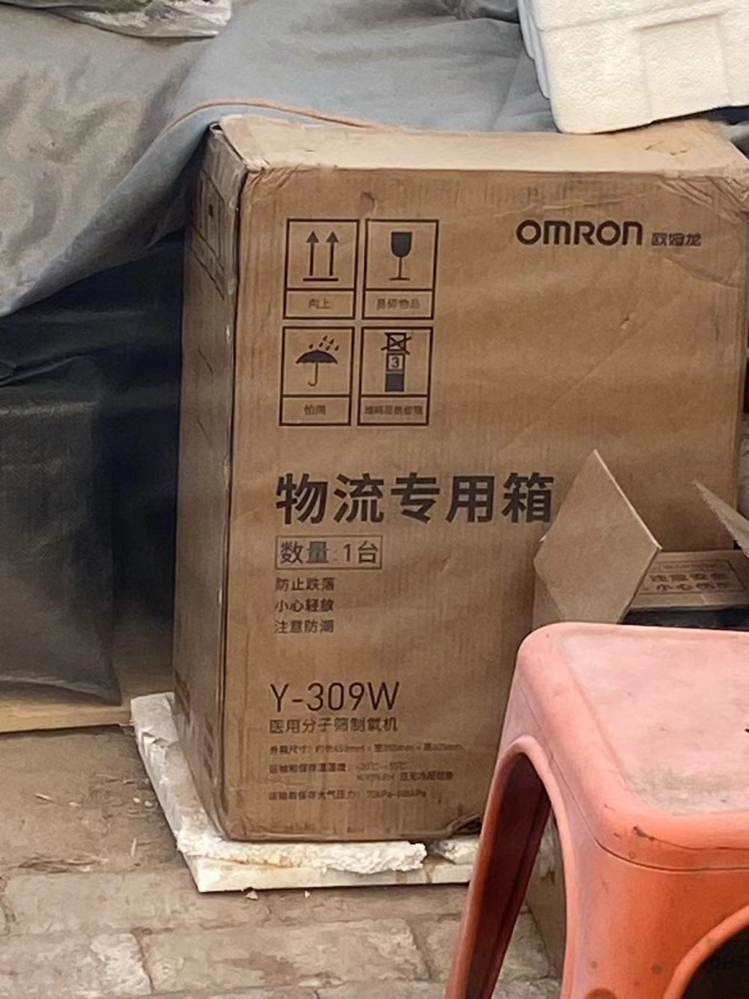

# 我寄给爸妈的制氧机，被冷落在院子里

_我过年回家时，一个多月前买给爸妈的制氧机还搁在院子里。（南方周末记者
庞礴/图）_

下动车，出站，我一眼看见我妈——卷卷的短发从橘黄色羽绒服的帽兜里露出来，热情地往出站口大步走。实际上，跟我擦肩而过的时候，她根本没认出哪个是女儿。

我大声叫住她，她一张口，就吭吭地干咳，于是我们不得不进行这段已经在视频聊天里重复过好几次的对话。

“是不是新冠后遗症？你去看看医生买点止咳药，家里有雾化机，正好用上。”

“哪是后遗症，每年冬天都这样。”

“好几年了不更得去医院吗？”

“一直都这样，看啥看。”

每一次我提出关于健康的建议，都会这样轻飘飘地被爸妈带过去。跨越代际的交流之难，往往在于“听你的还是听我的”。试图就事论事的人遇上想讲等级制和老规矩的人，简直就是秀才遇上兵。

**只胜了一粒泰诺**

腊月二十八晚上到家，第二天早上往窗外一看，我一个月多前买了寄到家的制氧机、雾化机和电动吸痰器，全部都在院子角落里。猫回家的时候要从栅栏上往下跳，这些纸箱好歹能给它垫个脚。

我挨个看了一眼，制氧机的箱子打开过，又贴好胶带放了回去，吸痰器和雾化器干脆没有拆开。“咋就晾在院里了？”我妈没接茬：“你看这个花开挺好。”

过一会，我看她在下唇上涂了白白的一层牙膏，才知道她长了口唇疱疹，牙膏能带来清凉。我说我从外卖软件上买个阿昔洛韦软膏。“你净瞎花钱，家里啥药膏没有？”牙膏、红狗营养膏都有，阿昔洛韦就没有。

在新冠以前，我一直以为在健康这个领域里，我家是在经历一场用药的大战。家里时不时地出现一些来路不明的棕黑色药丸，我妈夏天会到社区诊所里贴“三伏贴”，还在我爸“上火”的时候给他拔罐、刮痧。她用硬币刮痧，银色的棱在背上划过，背上就浮现隐隐的红色，过一会变成紫黑色，他俩越看越觉得疗效过关，特能下火。

在无数次互相指责和互相原谅之后，新冠大流行来了。以往的大战也就变成了我和爸妈之间的话语权之争：第一回合在2022年11月底，我要他们买退烧药，我爸嘴上答应，可到了药店连花清瘟都售罄了才坦白自己没买药，我马上寄回一盒泰诺；第二回合在2022年12月初，我买的血氧仪送到了，在纸盒里放了三四天，才在我声泪俱下的动情科普里被拆出来，夹在我爸的手指上；第三回合在几天之后，制氧机、吸痰器和雾化器纷纷到货，并开始了冷宫生活。

这不是我一个人的困扰。室友八十多岁的姥姥发着烧，可就是不肯吃降压药和降血糖药，负责照料的女儿们一筹莫展，几乎每天都要为母亲的服药问题掉一次眼泪；一位好朋友人在海外，母亲觉得胸闷，一测血氧水平只有93％，她让母亲去做个CT，但怎么都劝不动；一位朋友的几位长辈发烧，但一次抗体检测都不愿意做，他们喝着她买的小柴胡颗粒退了烧，在持续不断的争论里捱过了这一波“重感冒”。

在这一场持续了半个月的斗争里，我唯一的胜利就是一粒泰诺。2022年12月上旬的一次视频电话里，我妈说她吃了一粒泰诺——在持续整晚39度多的高烧之后。

但她随即拒绝了隔离的建议，我爸拿着手机站在床边，拍下了这一次新冠大流行里唯一的受益者——猫。它快乐地在我妈的脖子和胸口蹭来蹭去，欣喜地发出第一次睡火炕的咕噜声。

_猫在窗外围观我写稿。（南方周末记者
庞礴/图）_

**“我还年轻”**

说服爸妈不算易事，我过去几年在这个战场上摸爬滚打，终于在职业规划、婚恋等话题上以“每个人是自己人生的第一责任人”的态度和爸妈达成共识：我不劝你们离婚，你们也别来劝我结婚。但在新旧年之交的这场流行病里，急的反而是我们这群90后——我们开始试图在父母和其他长辈的健康问题上“指手画脚”。

朋友和我试过“易母而劝”——那位血氧含量低于93%的阿姨，由我打电话给她，不是作为她女儿的朋友，而是作为记者，讲“沉默型缺氧”，讲医院中越来越严重的收治情况，请她尽早做个CT以防万一。

阿姨客气地听了我的建议，可是第二天、第三天依然没有去医院。于是朋友在亚欧大陆的另一边无奈承认，健康依然是个人自由的一部分，并暂时接受自己母亲的判断：“没那么严重。”

但这样的游说只会一次又一次重复。过年回家第一天，我试图把制氧机从院子搬回屋，但人还没出家门，就被我爸阻止了：“你拿回来我也不用。”

那以后万一有用呢？“万一的时候再说。”他终结了这个话题。

作为父亲，他并不习惯解释自己行为的动机，但禁不住我三番五次地问，于是说：“那个制氧机，戴上就摘不下来了。”言外之意，只有脆弱的老年人才有必要使用这种辅助设备。

这让我想起一个月以前在劝说他使用血氧仪时的争执：“朋友，请你用一下血氧夹。”

“我还年轻。”他回答。

吸痰器也都得到了类似的点评：“吸痰器是瘫痪了才要用的”。

事实上，他们对健康知识并不完全抗拒，我甚至会感到他们只是抗拒我转发的文章、提出的意见和买回家的保健品。我妈一边吃着软骨素，表示它缓解了她的膝痛，但同时拒绝吃我买的鱼油、钙片，也拒绝做骨质疏松的检查。“没到那么严重。”她终结了这段对话。

我意识到，在这种“秀才遇上兵”的场合里，叠加了另一重因素：“兵”对“秀才”的恐惧。来自女儿的关心成了岁月耀武扬威的催逼，在家里的这些天，我时时刻刻能体会到爸妈这种微妙的恐惧——他们一个掩饰着自己的咳嗽，另一个和我抢着搬重物；时而感慨自己“老了”，时而又觉得自己能干；向我炫耀自己在短视频平台上看到的保健知识，但是拒绝我给出的健康建议。

我只能承认，自己无从知道爸妈对新冠及一切健康问题的真正态度——这似乎是某种程度上的“观测者效应”，我的关注本身就在提醒他们岁月与健康的流逝。

这样的争论暂时无法结束，直到爸妈能够看清自己健康受到的挑战，并接受我的帮助。于是现在，制氧机只能冻在零下20℃的院子里，而关于它的讨论，会在我回家过年的日子里不断重复：

“你拿进来学一下怎么用。”

“用了就拔不下来，人就完了。”

南方周末记者 庞礴

