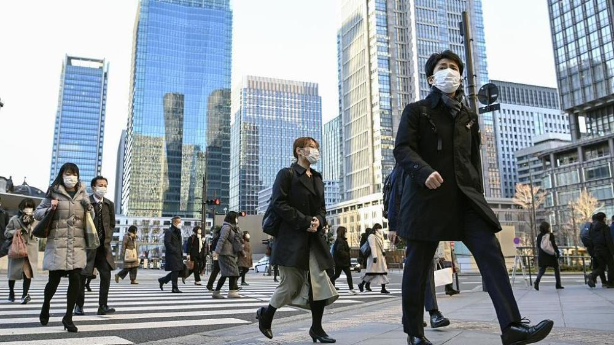

# 日本决定于5月8日将新冠下调为与季节性流感相同的“5类”

日本政府于1月27日下午召开对策总部会议，正式决定在5月8日把新冠病毒在《感染症法》上的定位下调为与季节性流感相同的“5类”。在此之前，由专家组成的厚生劳动省感染症小组会当天上午召开会议，同意了将其定位为5类。

据日本共同社报道，新冠目前的定位是可采取较结核等“2类”更广泛措施的“新型流感等感染症”。小组会上以见解草案为基础展开讨论，并获得了大致同意。见解草案提出，依据《感染症法》可限制私权的状态是“可能对国民的生命和健康造成重大影响”，而目前无法认为处于该状态。今后力争参考流感的诊疗体制，构筑医疗体制等。

出席者中有不少意见赞成改为5类。但也有出于新冠病毒一年流行多次等，认为“与其他5类疾病特征迥异”等谨慎意见。见解草案指出，门诊和住院自费部分的公费支援应分阶段缩小。为了让患者能够在各类医疗机构就诊，有必要在采取所需感染对策的同时实施过渡。

日本政府拟分阶段推进随着下调为5类的措施变更，正就将医疗费划定期限，暂时维持一定的公费负担展开讨论。关于佩戴口罩，打算无论室内与室外都由个人判断。但据公明党党首山口那津男透露，岸田称“将关注情况，临近5月8日时作出判断”。

