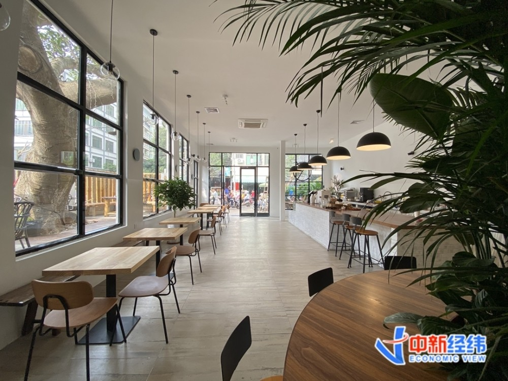
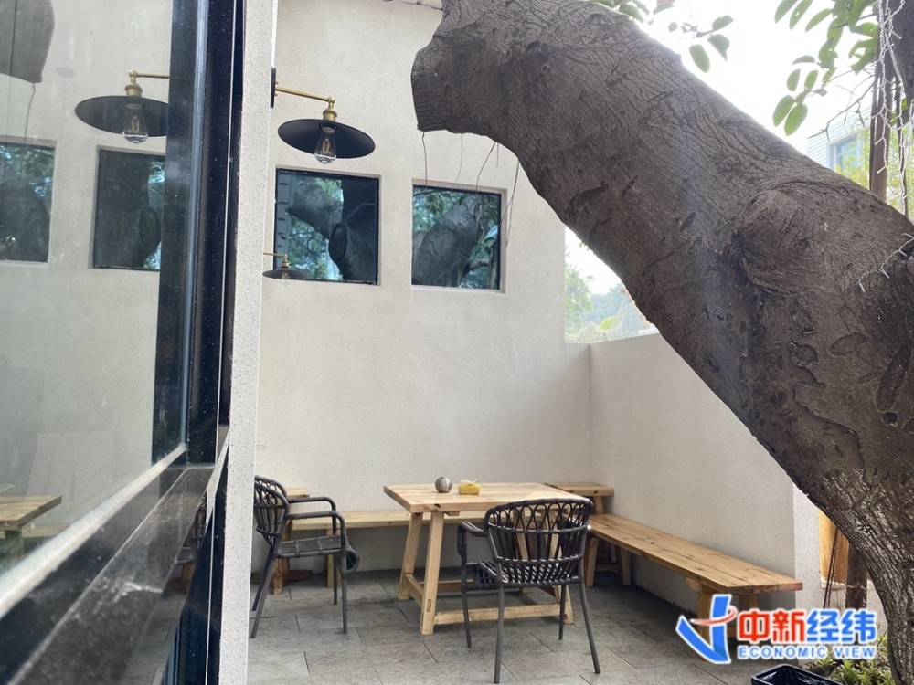
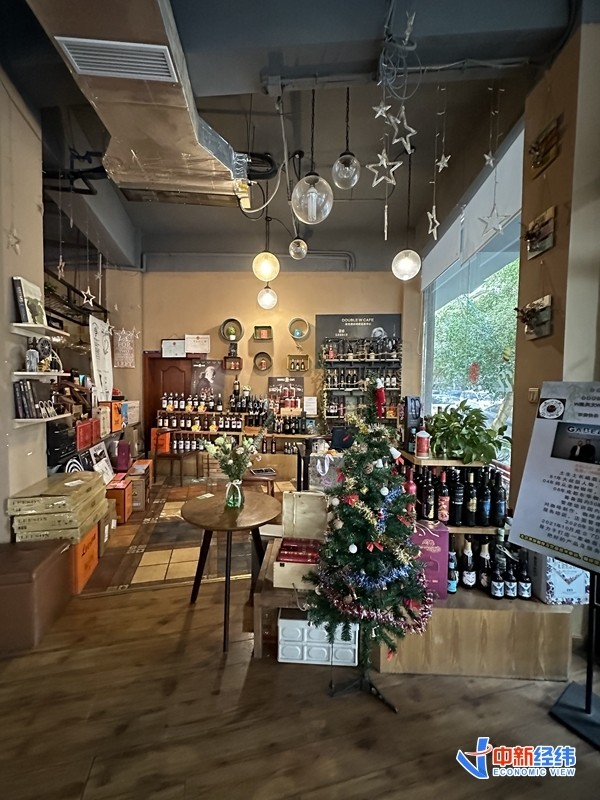
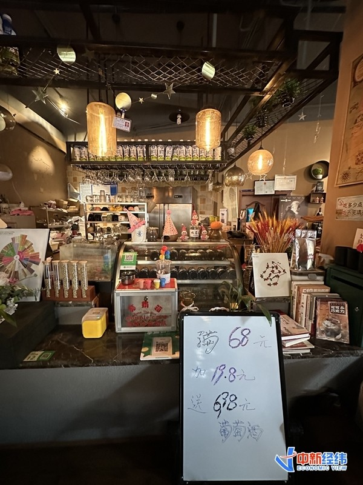

# 春节返乡观察｜在小县城开咖啡店的年轻人，如何赚钱？

中新经纬1月27日电 (马静
邓芷若)“每次回来都发现有新开的咖啡店。”在北京工作的李女士回到四川省峨眉山市后感叹。尽管只是一个人口42万左右的县级市，但2020年-2022年间，新开的咖啡店至少有10余家，大都是年轻人自主设计的品牌。

返乡的峨眉山“土著”万诚(化名)就在市里开了一家咖啡店。他告诉中新经纬，相较大城市的高租金、高人力成本，县城开店利润率更可观，还容易有稳定的回头客。就其自身而言，投入约10万元，第一年就赚了20多万元，直接回本了。

事实上，像万诚一样扎根下沉市场掘金的人不是个例，在县城开咖啡店已成为“潮流”。但咖啡店下沉县城后，都能赚钱吗？万诚的故事是否是大多数“县城咖啡店主”的故事？中新经纬就此采访了三位90后县城咖啡店主。

_小野的咖啡店 来源：受访者供图_

**到县城去开一家咖啡店**

“我很爱喝咖啡，平常一天要喝两杯，但回来之后发现这里都没有一家像样的现磨咖啡店，当时也没有其他喜欢的工作，于是开了咖啡店。”江西一家咖啡店店主徐洁(化名)是其他几位受访年轻人的缩影：在深圳等大城市打拼多年，带着把咖啡文化普及到家乡县城的初衷，在小区门口、干洗店、奶茶店等附近开一家精品咖啡店，以或ins或复古的装修风格在县城吹起涟漪。

徐洁的店70平方米左右，可以容纳9张桌子。阿畅(化名)的咖啡店面积与其差不多，开在山东莒南县。小野(化名)的咖啡店店面较大，140多平米，带一个环抱百年老树的小院子，开在广东徐闻县。

_小野咖啡店的院子一角
来源：受访者供图_

尽管三位90后分处中国南部、东部和中部的不同小县城，但他们店铺的共同点是：咖啡店都是2021年以后开业，所在县城的GDP在所归属的市级行政区中并不突出。

在开店之前，阿畅考虑过加盟品牌店，但由于县城没有商圈，大一点的品牌都拒绝了。“既然品牌不来，那我们就自己搞。”原本在山东临沂从事证券行业的阿畅和两位高中同学一拍即合，装修、设备采购、房租等共投入了10万元左右。

小野和徐洁原本打算20万元就搞定，但不知不觉就花了30万元左右，主要都“砸”在了装修上。据徐洁介绍，硬装花了10万元，一台咖啡机4万元，全部弄好之后差不多用完了所有积蓄。

**新鲜劲过后，都能赚到钱吗？**

由于是“县城首店”，开业前几个月，人流如织是上述咖啡店的常态。阿畅的店试营业期间一天最高曾卖出400杯；小野的店开业前几天客流量在300到400人左右，顾客慕名前来拍照打卡的热度持续了半年。

不过，新鲜劲过去之后，情况发生了变化。“开业近两年了，成本大概只回了一半。”小野表示，每个月水电、房租等支出约5000元，对于140平方米的店来说是可以接受的成本，
**但客流量没有达到预期，一般一天也就十几二十个客人**
。由于客流较少，备料比较受限，备得越多，损耗越多，但备少又不能充分满足客人的需求，现在只好精简菜单，保留一些点单率比较高的产品。

_万诚的咖啡店 来源：受访者供图_

徐洁的咖啡店刚开业也迎来了客流高峰，不过，去年9月，店铺对面的五月广场新开了一家瑞幸，这距离她试营业刚刚过了三个月。

徐洁对瑞幸的入场显得并不怎么在意，“客流确实显著被分走了一些，不过，即使买我们一杯的钱可能买两杯瑞幸，但定位不一样，我们是精品咖啡。”徐洁表示，目前杯量已经从高峰期的100杯逐渐稳定在50杯左右，
**算上每个月5000元的房租水电物业费、2个人7000元的工资，以及咖啡豆、奶等费用，每个月要投入近2万元** ，目前堪堪保持盈亏平衡。

和徐洁他们不同的是，阿畅的店在试营业两个月后就回了本， **咖啡定价在13元-25元左右，去年7月至今共售出2万杯，每天的杯量目前稳定在100杯左右。**

**“大约有90%的顾客都是因为我们短视频平台上分享而来。”阿畅称** 。阿畅表示，店铺是和粉丝一起成长的，试营业初期就有很多粉丝从临沂市等地方远道而来，
**还有一位客人开车4个小时就为了过来喝一杯咖啡，再打包两杯回去。**

当“网红打卡地”慢慢趋于平静，外地客人逐渐减少，本地客人增加。据阿畅观察，来喝咖啡的不只是年轻人，也有一些中年或老年人点杯“一看就很专业”的咖啡
**在外面站着喝完就走了** 。总体看，年轻消费者占比约七成，中年占比二成，老年占一成。

徐洁则发现，相对而言，大城市上班族喝咖啡多是出于需要，但县城的咖啡并不是“必需品”，而是社交属性更浓。来
**店里消费的多是公务员和老师，还有谈恋爱的“小年轻”** ，选择来咖啡店相聚，一般都会待1-2个小时左右。

**县城的咖啡卖得“有点甜”**

谈及当前的经营状态，阿畅直言满意，甚至超出预期。但徐洁和小野都表示有一些不太满意，小野称“并没有感觉当初的想法完全实现”。

“坦白讲，在县城开咖啡店不容易。”小野提到，
**有时候也会遇到一些顾客质疑，“为什么卖这么贵？”甚至有顾客表示，“为什么你的美式不能拉花？”也有外地返乡顾客会问，“为什么你的口味和星巴克不一样？”**
但这些都只能去耐心解释。

_万诚的咖啡店 来源：受访者供图_

徐洁则表示：“仅做到收支平衡并不够，销量还可以提升，毕竟还是要挣钱吃饭，可能有时候也会后悔，当初投入的时候能不能再省点，会不会下一家店会更好。”

值得一提的是，县城咖啡店的竞争也正在变得越来越激烈。在小野之后，徐闻县又相继开了4家咖啡店。在进贤县，一些甜品店也买了咖啡机，制作现磨咖啡出售。

而除此之外，瑞幸等咖啡品牌也已加速瞄准下沉市场。

据《2020城市商业魅力排行榜》，全国共有90个四线城市、128个五线城市，合计共218个。若以行政区划计算，《中国统计年鉴2021》显示，2020年底中国共有2844个县城、38741个乡镇。

而据窄门餐眼数据，按照城市分布，截至1月3日，瑞幸在四、五线城市(县镇店会归属到地级市)的门店数为668个，幸运咖为561个，星巴克为279个；按照选址分布，瑞幸共有250家乡镇门店，幸运咖有180家，星巴克有140家。若由此粗略计算，每个四五线城市至少有2家瑞幸或幸运咖，1家星巴克；同时，瑞幸已入驻0.65%的乡镇，幸运咖和星巴克的这一数据分别为0.46%和0.36%。

中新经纬注意到，为了吸引更多的顾客，县城咖啡店主们也“各显神通”，要么适应县城消费者的口味研发新产品，要么搭配甜品丰富品类，或者开发新的商业变现途径。

小野提到 **，为了能让顾客尽快接受，做了很多偏甜的特调咖啡，类似奶茶的口味** 。此外，店里也卖奶茶、简餐， **奶茶的收入约占总体的六成**
。下一步，小野打算外出“学艺”，除烘焙技术外，再看看其他人的县城咖啡店如何应对逆境。

**(文中观点仅供参考，不构成投资建议，投资有风险，入市需谨慎。)**

**中新经纬版权所有，未经书面授权，任何单位及个人不得转载、摘编或以其它方式使用。**

责任编辑：李中元

