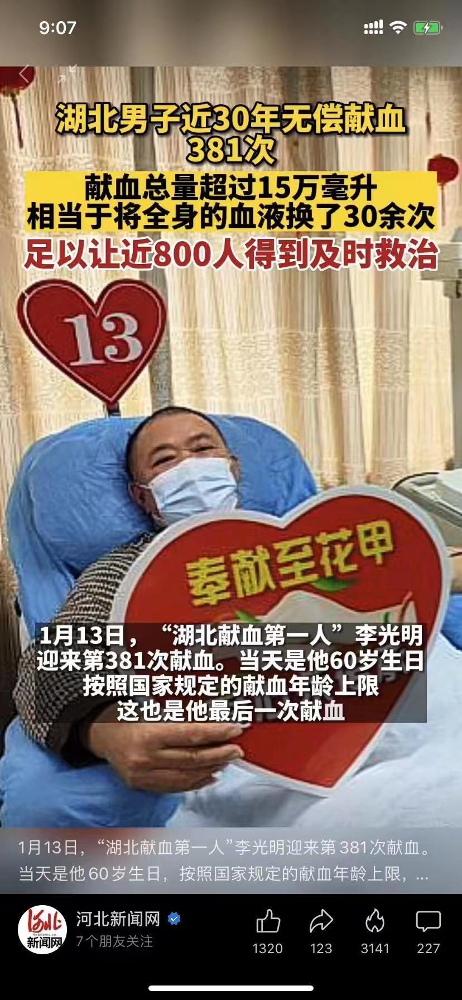
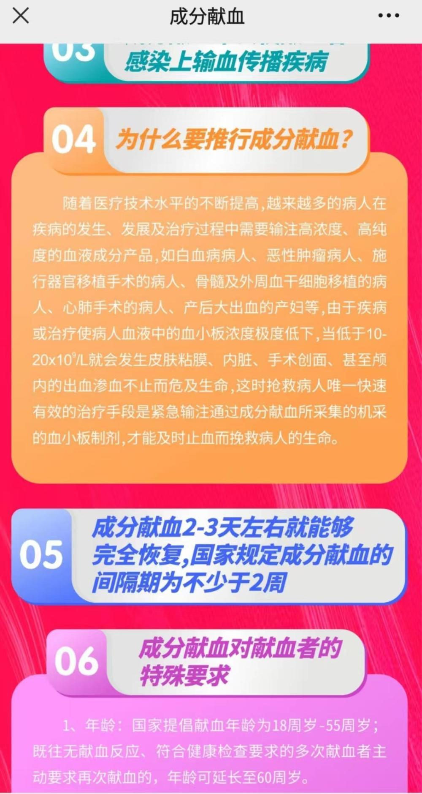
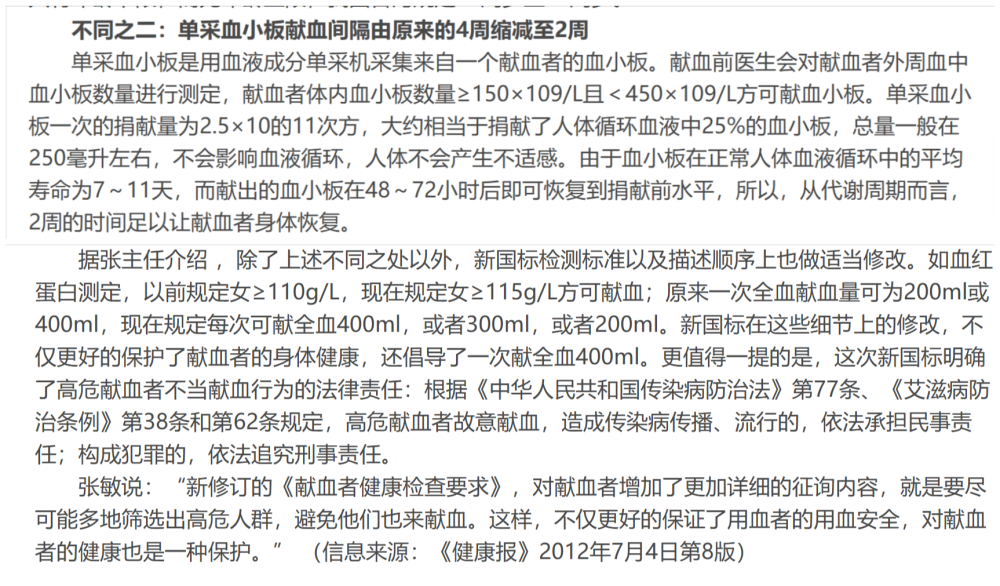

# 湖北男子29年无偿献血381次被疑夸张？专家：理论最高可献696次，为当事人点赞

红星新闻记者丨李文滔

编辑丨彭疆

“29年献血381次，献血总量超15万毫升……”日前，“湖北献血第一人”李光明因已满60岁，在献血之路上光荣“退役”。但李光明几十年来献血的次数却引发了一些争议。有网友称，按规定无偿献血者间隔6个月才能献1次，按报道所述，此人平均每月献1次，一次近400毫升，如此宣传是不是太离谱？

对此，血液专家、青岛大学附属医院输血科主任王海燕告诉红星新闻记者，《中华人民共和国献血法》规定，血站对献血者每次采集血液量一般为200毫升，最多不得超过400毫升，两次采集间隔期不少于6个月，该规定是指献全血的剂量和间隔时间。我国新版《献血者健康检查要求》中对无偿献血者年龄、献血时间有非常具体的要求，单采血小板献血间隔为不少于两周。

1月25日下午，红星新闻记者就网友质疑联系武汉血液中心释疑未果，亦未能通过该中心联系到李光明本人。记者查阅报道发现，李光明最后一次献血是在武汉血液中心成分献血科。报道称，2003年起，他（李光明）就将每月的成分献血视作习惯，“雷打不动。”

王海燕表示，根据李光明献血时间和献血量估算，“李光明应该是只要身体状况一符合法规要求，就去献血奉献爱心了。我觉得李光明这样把献血视作习惯的无私奉献精神非常伟大。”

**29年献血381次**

**献血总量超15万毫升**

据湖北当地媒体报道，1月13日，李光明在武汉血液中心成分献血科迎来自己第381次献血。当天是他60岁生日，按规定达到国家献血年龄上限，这也是他最后一次献血。

据悉，李光明现在武汉光谷从事小区物业保安工作。自1994年起，他累计献血达381次（含外地献血），献血总量超过15万毫升，相当于将全身血液换了30余次，捐献的血液足以让近800人得到及时救治。因在湖北省献血次数最多，多次获“全国无偿献血奉献奖金奖”、武汉市“最美志愿者”等荣誉称号，他被誉为湖北省“献血第一人”。

报道称，李光明自幼家庭贫困，小学毕业后便进入社会谋生。1994年冬天，他外出捡废品时，偶然得知一位残疾人为救生命垂危的陌生女孩无偿献血，内心受到触动，便萌生了参与无偿献血的想法。“一个残疾人能有如此善举，我身体这么健康，肯定也能献血救人。”

在武汉血液中心献血的过程中，李光明了解到献血不仅可以献全血，还可以捐献血小板，其中捐献血小板的间隔期更短，参与频次更高，可以帮助更多人。从2003年起，他就将每月的成分献血视作习惯，雷打不动。

不仅自己献血，李光明也带动家人无偿献血。起初，家人并不理解，但他渐渐用事实说服了家人，献血对身体并无害处。在他潜移默化及感召下，他的子女、弟弟、外甥女婿、侄儿都加入了无偿献血的队伍。

“我这一辈子没有大本事，只能为社会做点小贡献。无偿献血就是我奉献社会的方式。”李光明在接受媒体采访时称。

除了无偿献血，李光明还参与各项公益活动。多年来，他资助脑瘫儿、大学生，捐助白血病患儿，参与各类公益捐款，金额已超10万元。每年年底前还会用献血积分兑换各种礼品送给孩子们。家里的献血证及奖章证书，甚至一个行李箱都装不下。

据报道，为了帮助他人，李光明省吃俭用，还每天坚持工作13小时。

**专家：**

**理论上可献696次，献血者精神可贵**

但李光明多年来的献血次数却遭到了部分网友质疑。有网友称，按照29年381次献血量超15万毫升来算，李光明平均每年献血13次，每次献血393毫升。而根据相关规定，无偿献血者间隔6个月才能献1次，且每次将近400毫升，如此宣传是否太离谱？

1月25日，红星新闻记者就前述质疑联系武汉血液中心释疑未果，亦未能通过该中心联系到李光明本人。

不过，有血液专家向红星新闻记者表示，29年无偿献血381次并非夸张。“网友说6个月才能献一次血是肯定的，但这是指的献全血。对于成分献血即献血小板来说，14天一次就可以。”

_成分献血相关科普知识
据武汉血液中心官方微信_

_成分献血的间隔周期 据河南省人民医院_

“我觉得这位李先生真的是付出了很多爱心。”青岛大学附属医院输血科主任王海燕在对李光明的鲜血次数进行计算后如是表示，“他近30年来如一日地献血，应该是把时间计算得很好，一到时间他就去献血。”

王海燕称，按照我国《献血法》第九条规定，血站对献血者每次采集血液量一般为200毫升，最多不得超过400毫升，两次采集间隔期不少于6个月。同时根据我国新版《献血者健康检查要求》规定，单采血小板献血间隔不少于2周，不大于24次/年。因特殊配型需要，由医生批准，最短间隔时间不少于1周。

_我国2012年颁布的新版《献血者健康检查要求》中的相关变动及要求
据国家卫健委官网_

“按照规定，如果李先生每半年献一次全血的话，那么29年可以献58次；如果李先生每年献一次全血，剩下时间用来献血小板的话，因为献完全血要休息3个月，那么29年可以献血200次左右；如果单算献血小板的话，29年就是696次，从2003年开始计算也可达到456次。”王海燕告诉红星新闻记者。

“全血是指包含了所有的血液成分，如红细胞、血小板、白细胞、血浆的一种血液制剂，我们平时做血常规从静脉血里抽出来的就是全血。成分血是指含其中一种或两种血液成分的血制剂。”王海燕解释道，红细胞的生理作用是运输氧气和二氧化碳，对身体非常重要。红细胞释放入血液后平均寿命约为120天，这也是国家为什么规定要求献全血6个月才能再次捐献。

“对于血小板来说，它的寿命是7~14天，身体内的血小板到14天新陈代谢也差不多了。”王海燕进一步解释道，现在采集血小板一般采用机器采集，“简单说就是应用一次性的封闭管道，在无菌条件下把人体的部分血小板连同250毫升血浆分离出来，而红细胞、白细胞等都不会被分离出来。”

王海燕称，目前我国对献血的标准非常规范，首先《献血法》及新版《献血者健康检查要求》都要求献血者是18周岁至60周岁的健康公民，其次在到血站或献血点献血时，要填写调查问卷。血站有专业医师对献血者身体状况进行评价，比如询问近期有没有拔牙或发烧吃药，心肺功能是否正常，是否有先天性疾病等，以保护献血者和受血者。

“抽血之前还要做一遍血常规，看血红蛋白是否符合国家标准，能不能进行献血。”王海燕告诉记者，血液采集好后会送到血站进行传染病以及病毒方面的检测，通过质检达到国家标准后才能进行发放。

“我国出台《献血法》，既是为了保障献血者的权益，也是为了保障受血者的权益。”王海燕称，每年国家都会对血液进行严格检查，“每一个献血记录包括从采血开始到医院患者输用都是可以闭环追踪的。”

—END—

