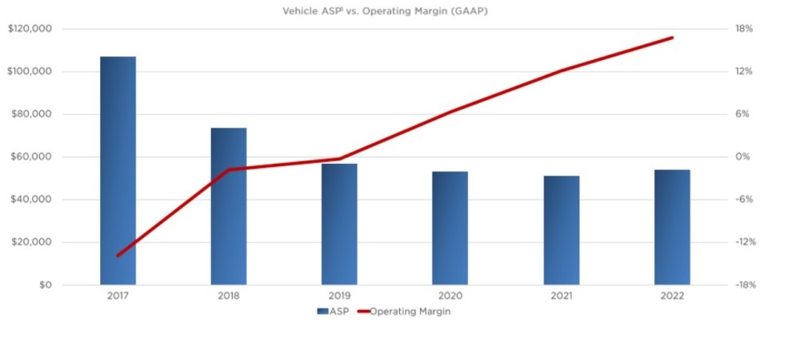

# 特斯拉降价后订单量暴增达产能两倍 促销的下一步棋该怎么走

北京时间1月26日是农历大年初五，人们都在忙着迎“财神”。特斯拉在这一天公布了2022年第四季度和全年财报，也迎来了属于自己的“财神”。

“2022年对特斯拉来说在各个层面上都是有史以来最好的一年”，特斯拉CEO埃隆·马斯克在电话会议上提到。

的确，2022年全年，特斯拉总收入同比增长51%，达到815亿美元；2022年全年GAAP净利润为126亿美元，同比翻了一倍多。在2022年第四季度中，特斯拉实现了有史以来单季度最高营业收入、最高营业利润和最高净利润。2022年，特斯拉实现131万辆的交付纪录。

但不可忽视的是，2023年初的大幅降价已经为特斯拉引来了消费者的观望与维权、投资者的质疑与审视。财报电话会议上，马斯克表示，在特斯拉降价后，订单量在2023年1月达到历史新高，几乎是工厂产能的两倍。

在当初展望2022年时，特斯拉曾寄语称，公司年度销售额要增长50%、年度销量超越150万辆的目标，但特斯拉并未达成这个年度目标。新的一年，特斯拉为自己定下了180万辆年销量的目标，而马斯克甚至认为特斯拉可以实现200万辆的销量。烈火烹油之下，特斯拉2023年还能实现新目标吗
？

（特斯拉车辆平均售价及营运利润率）

**5年来特斯拉平均售价减半 引来购车者维权**

在特斯拉年初降价之时，每逢傍晚6点左右，小张就知道，维权车主又快来了。

小张是特斯拉长沙国金中心体验店的销售，自从特斯拉1月6日宣布全线降价后，这家地处市中心的旗舰店就成为了长沙车主维权据点，“白天一般还好，（维权车主）等下班就来‘打卡’了”。

同样地处西南，成都最重要门店之一的成都太古里体验店的销售小李的工作并没有太受到维权影响，他甚至有心情开玩笑，“我们店里的零食怎么可能都被（维权车主）吃光了，你要是过来，我再给你拿零食”。

回顾过去的2022年，在3月至6月四次涨价之后，特斯拉在10月开始进入降价通道，先是于10月1日推出7000元保险补贴，不足一个月后再度提出降价，Model
3及Model Y最大降价幅度达到3.7万元。

此后，特斯拉延续降价策略，降价幅度4000元-1万元不等。在外界看来，在新能源车加速渗透阶段，低价冲量扩大市场占有率是明智的企业策略。相比2022年上半年，下半年的汽车供应链更加顺畅，也为特斯拉提升销量扫清障碍。

2023年1月6日，特斯拉中国宣布国产车型全系降价，其中，特斯拉Model
3后驱版降价3.6万元，从26.59万元降至22.99万元，成为特斯拉价格最低的车型。Model Y长续航版降价4.8万元，成为此次降幅最高的车型。

特斯拉连续多次降价操作引起了维权与观望：已经购车的车主认为遇上了“促销套路”不公平，还未购车的车主想看看未来车价是否还会再降。

成都销售小李就向记者说，特斯拉如今已是薄利多销，在成本上涨的情况下逆势下降，目前来看特斯拉短期内不会再继续降价。

的确，回顾过去的2022年，特斯拉面临原材料、商品、物流、质保成本增加，以及4680电池生产成本提高、两座新超级工厂产能爬坡等挑战。

但实际上，特斯拉财报指出，数年来特斯拉的电动车平均售价总体呈现下降趋势。财报显示，特斯拉认为，要成为数百万辆级别的电动车制造商，提升产品的可负担性是十分必要的。

在2017年至2022年间特斯拉电动车平均售价已减半。近期，特斯拉正在加快推进成本控制规划，挖掘更高的生产效率，同时继续重点落实下一阶段的计划。

不仅如此，从投资者的角度来看，持续降价的特斯拉能否维持利润率也是关键问题。对此，特斯拉此次财报显示，目前特斯拉的营运利润率持续提升，同期表现从大约-14%提高到17%。营运利润率的增长主要得益于引入更低成本车型、增建更高效的本土化工厂、降低车辆成本和经营杠杆等因素。

尽管备受质疑，但不可否认的是，特斯拉销量数据相对乐观。如果只考虑纯电动汽车，而不考虑混动车，2022年，特斯拉实现电动车销量131万辆，超越第二名比亚迪91万辆纯电销量，依旧是行业第一。具体来看，特斯拉第四季度生产了439701辆，交付405278辆，创下新的交付纪录。

马斯克对未来也仍然乐观。财报电话会议上，马斯克表示：“尽管整体车市可能收缩，但（消费者对）特斯拉的需求仍将保持良好。”

他指出，特斯拉电动车的市场需求很强劲，在价格调整后更是如此，订单量在2023年1月达到历史新高，几乎是工厂产能的两倍。这意味着特斯拉需要继续提升产能，以满足高速增长的需求。特斯拉在财报中表示，2023年预计交付量将达到180万辆。

“无论如何，我们都为短期的不确定性做好了准备，同时专注于挖掘自动驾驶、电气化和能源解决方案的长期潜力”，特斯拉称，公司会坚持不懈控制成本。

**FSD加速更新 二手车与能源业务支撑利润**

财报显示，2022年第四季度，每座特斯拉超级工厂的产量都创造了纪录，特斯拉正逐步向更均衡的区域生产和交付结构转变。

在美国得州的奥斯汀超级工厂，备受关注的4680电池周产量已足够满足1000多个电池组的制造，特斯拉Semi的生产也于第四季度启动，并在2022年12月开始交付。在德国柏林超级工厂，Model
Y的周产量已超过3000辆。

特斯拉销量攀升背后，离不开辅助驾驶系统FSD的升级迭代。

2022年，特斯拉FSD更新速度大幅提升，FSD
测试版系统测试参与车辆从2021年的2000辆增长到2022年的16万辆，一年内就实现了80倍的增长。如今，特斯拉已经向美国和加拿大几乎所有购买FSD的车主（大约40万人）推送了全新FSD测试版系统。

长期以来，特斯拉不断扩张在能源方面的布局。

财报中提到，2022年特斯拉的利润中，有很大部分来自二手车和特斯拉车队扩增的支持性交易，比如配件销售、付费超级充电等等。

此外，特斯拉的储能业务装机量在第四季度同比增长152%，达到2.5千兆瓦时，2022年全年总装机量为6.5千兆瓦时，同比2021年增长64%，特斯拉Megapack专用工厂正在增产。

太阳能业务方面，第四季度特斯拉的太阳能装机量同比增加18%，达到了100MW，2022年，特斯拉共部署348MW的太阳能设备，这是自2017年以来的最高水平。

展望未来，卖车仍然是特斯拉的第一要义。深度科技研究院院长张孝荣向记者表示，中国市场支撑了特斯拉的过去、现在和未来——中国市场不光是特斯拉的生产基地，还是空间巨大的发展基地，目前中国销量占其全球销量三分之一。可以说，特斯拉的未来绝对离不开中国市场，但在中国市场价格竞争压力较大，特斯拉降价促销一方面有企业自身“让大家都能开上电动车”的定价逻辑的考量，另一方面是抢占市场的举措。

凭借这个举措，未能达成2022年销量目标的特斯拉能够在2023年实现180万辆年销量的目标吗 ？

新京报贝壳财经记者 林子

编辑 白昊天 校对 付春愔

