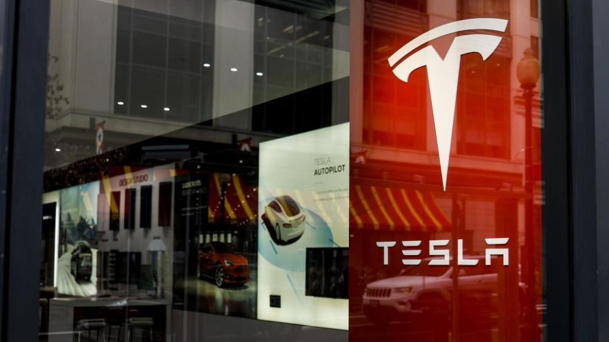

# 特斯拉降价拉动需求，马斯克：1月订单量达到产能两倍

全球大降价之后，特斯拉的需求大增。

1月26日，在2022年第四季度财报电话会议上，特斯拉CEO埃隆·马斯克表示，需求一直是众多特斯拉投资者最为关注的问题，尽管汽车市场可能正在收缩，但目前特斯拉的需求大幅增加。他透露，今年一月份，特斯拉的订单量几乎达到了产能的两倍之多。

近几个月来，特斯拉在中国、美国、欧洲等主要市场开启了多次大幅度降价，在回答分析师提问时，马斯克表示，“我认为有很多人想购买特斯拉汽车但却负担不起，这些价格变化确实对普通消费者产生了影响”。

在财报中，特斯拉方面预计，2023年汽车交付量将达到180万辆，这将较2022年增加37%，不过，这一增幅将略低于2022年的40.3%。

在财报电话会议中，马斯克提到，虽然财报中给出了更为保守的180万辆年产能，但其实特斯拉的年产能已经达到了近200万辆。他表示，如果今年没有供应链问题等阻碍，特斯拉“有达到200万辆的潜力”。

面对整体经济形势的不确定性，特斯拉方面也表达了担忧，并表示将在短期内加速削减成本、提高经营效率。

特斯拉方面表示，数年来特斯拉的电动车平均售价总体呈现下降趋势。要成为百万辆级别的电动车制造商，提升产品的可负担性是十分必要的。虽然在2017年至2022年间特斯拉电动车平均售价已减半，但其营运利润率持续提升，从2017年的大约-14%提高到了2022年的17%。营运利润率的增长主要得益于引入更低成本车型、增建更高效的本土化工厂、降低车辆成本和经营杠杆等因素。

对于特斯拉的投资者而言，除汽车需求之外，马斯克收购推特牵扯过多精力也是一大担忧，受此影响，特斯拉股价在2022年创下了历史最大跌幅，同时，马斯克的口无遮拦也进一步加剧了投资者的顾虑。

马斯克在财报电话会上就此表态说，他在该平台上拥有大约1.27亿粉丝，且还在不断增长，“这表明我相当受欢迎，相信推特可以提升特斯拉的需求，”马斯克说道，虽然不少人在抱怨，但是推特的价值是巨大的。此外，他还不忘做下广告，鼓励其他汽车品牌使用推特进行推广。

在新车型方面，特斯拉介绍，下一代平台正在开发之中，不过对于备受市场关注的2.5万美元以下车型，特斯拉方面并未透露更多信息，而是表示将于3月1日的投资者关系日上发布相关内容。

对于美国市场而言，皮卡车型是影响车企竞争力的一个重要因素，特斯拉首辆皮卡车型Cyber​​truck量产时间再度推迟。此前，特斯拉方面称Cyber​​truck将于2023年开启量产。然而在电话会议上，马斯克提到，可能会在2023年夏季开始生产Cyber​​truck，不过真正的量产工作将于2024年开始。特斯拉方面表示，生产Cyber​​truck所需的设备已经在得克萨斯州工厂开始安装。

2022年第四季度，特斯拉实现营收243.18亿美元，同比增加37%，净利润为36.87亿美元，同比增加59%，营收与净利润在创下历史新高的同时，也都超出了市场预期。

超预期的表现让不少分析师重拾了对特斯拉的信心，CFRA Research分析师Garrett
Nelson认为特斯拉第四季度表现稳健，并表示“特斯拉的需求前景比任何其他汽车制造商都要乐观得多”。

受业绩拉动，特斯拉美股盘后上涨5.51%，报152.39美元/股。

