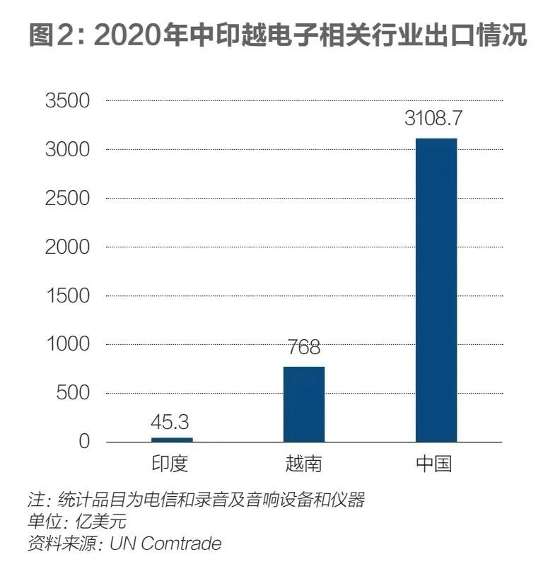

# 电子产业链从中国外迁，越南印度竞逐世界工厂

**文｜《财经》记者 柳书琪 陈伊凡 顾翎羽**

**编辑｜谢丽容**

过去20年是中国科技制造产业波澜壮阔大步向前的时代：560万平方米的富士康园区在郑州拔地而起，淡旺季之间吞吐着约30万名青壮年，全球一半的苹果手机来自这里。蓬勃发展的电子、计算机、通信行业催生出了超过800家A股上市公司。近十年间，中国电子信息制造业平均增加值增速保持在11%以上，始终高于整体工业增加值增速。

深圳又是中国科技制造业的核心，华为、中兴、大疆、比亚迪等一众科技企业坐落于此。2021年，深圳制造业增加值占地区生产总值30%以上，其中七成以上来自先进制造业。

人头攒动的深圳龙华汽车站人才市场，是大多数深圳电子厂打工人的第一站。数十家招工中介的店面依次排开，拖着行李箱的人们在这里被分发到深圳不计其数的电子厂中，成为车间里的一员。

**今天，相似的情形正在印度、越南等地上演。**
据中印越电子（手机）企业协会统计，印度与越南分别有约200家和150家电子企业的工厂，其中绝大多数企业来自海峡两岸暨香港。这些还只是叫得出名字的供应链企业，更多配套的小微企业也在当地生根落地。

以手机行业为例，它是目前最深入、系统参与全球分工的细分电子产业，中国曾经是全球手机工厂，但情况正在发生变化。第三方研究机构Counterpoint数据显示，
**中国手机产量在全球中的占比由2016年的75%逐年下降至2021年的67.4%。与此同时，印度与越南的手机产量不断攀升。**

**电子产业迁移的背后有一系列复杂的成因，大致可被归为以下三点：**

一是自然的产业转型升级，较低附加值的环节流向劳动力及地价成本更低的国家；

二是各国关税政策的变化，企业出于经济效益的考量转换产地，带动产业链上游迁移；

三是受近年来政治、疫情等外部环境的影响，外资企业在中国面临较大挑战，部分撤出了中国。

需要厘清的是，多位研究印度及东南亚产业链迁移的专家向《财经》记者表示，电子产业链并不是完全离开中国，而是在全球多地分散布局，这既是为了开拓新市场，也是一项分散风险的策略。
**外资企业的战略由过去的“All in中国”全部在中国转变为“中国+N”，短期内中国的优势地位不会改变。**

“与其说是转移，不如说是延伸。原来的‘孩子’还在，只是又生了一个。”一位在印度工作十余年的中资企业负责人形容道。

更进一步说，留在中国本土的产业已在逐渐升级。同样是一组来自海关的手机产业数据能够侧面说明：2021年中国出口手机同比下降1.2%至9.5亿部，与此同时产值却增长了9.3%至9447亿元，近五年来情况大致相同。

**“产业链外移是一个中性的表述。”**
徐奇渊是中国社科院世界经济与政治研究所副所长、国际金融研究中心副主任，他告诉《财经》记者，过度的产业外移可能会导致中国的产业空心化，但合理的产业外移是产业升级的自然过程，更加有助于形成以中国为关键节点的国际分工网络，扩大中国产业链的国际影响力。

但这不意味着中国科技制造产业链便可以高枕无忧。在新一轮的产业革命和地缘政治摩擦下，稳固中国科技制造业既有优势地位、形成新旧产能紧密转接，合纵连横、越迁升级，这需要极高的智慧。

**迁徙：多重因素叠加**

谢泓是广东省中小企业发展促进会会长，在过去的17年间，他和他的团队走访了上万家中小企业。作为会长，谢泓能感知到全球供应链的风吹草动。

**这一轮产业转移始于十年前，中国不断上涨的各类经营成本迫使工厂转向更“草莽”的海外。**
一方面，人力支出不断上涨，东南亚多国的工人月工资在700元-1000元，而在珠三角地区则要达到5000元-7000元。一个千人规模的工厂，每个工人的成本少5000元，一个月就意味着多出500万元的利润。

**另一方面，工厂二房东的生意在珠三角遍地开花，上涨的租金成本让工厂难以为继。**
一位在东南亚开设五金厂的企业主给《财经》记者算了一笔账，2012年前后他身边在东莞开电子厂、鞋厂的朋友一年的利润不到100万元，但厂房出租的租金能接近300万元。于是越来越多工厂主将厂房交给二房东另谋他事，这又再度推高了厂租的价格。

**与此同时，东南亚多国为了招商引资大开国门。**
以越南为例，第三方咨询机构安永2021年发布的《东盟投资指南》显示，企业的投资项目在数年内或整个投资期内可享受10%-17%不等的优惠税率，还能享受最高四年的免税期和最高九年的减半征收期（“四免九减半”）。

诸多推力与拉力作用之下，过去十年间珠三角科技制造产业一直处于缓慢外迁的进程中，近几年来国际贸易环境的改变，悄然加速了这一过程。

核心原因之一是中美贸易摩擦。2018年以来，中美间贸易摩擦白热化，美国连续多轮对中国进口产品加征关税，其中电子零部件是重点征税领域。截至目前，实际涉及产品价值已超过5000亿美元。

谢泓观察到，与早期主要搬迁的劳动密集型产业（服装、家具等）不同，这一轮的迁移以科技制造产业为主。

压力在供应链自下而上传导。一个位于越南北部的产业园区，建成十年后一直空置大量厂房，但在2018年中美贸易摩擦后，园区在短短一两个月内就塞满了。入驻的企业大部分都是在美国第一批制裁清单中的电子企业及上下游企业。

**美国客户的要求是简单明了的。“找三家供应商，谁愿意搬到东南亚，订单就给谁。”谢泓说。**

汉宇集团董事吴格明对这件事印象深刻。三年前与美国客户开电话会议时，对方提出，让他们把一部分供应链搬迁到海外，否则，客户可能会考虑更换新的供应商。汉宇集团主营高效节能家用电器的排水泵研发、生产和销售，是家用电器排水泵行业的龙头，客户包括惠而浦、通用电气、三星等。在特朗普政府加征的关税清单中，他们的产品赫然在列。

吴格明考虑了三个地方，越南、印度和泰国。印度太远，越南和中国风俗相近，但有发生不可控因素的可能性。几番权衡之后，他们把厂址选择在了泰国。他将注塑车间和部分组装产线搬到了泰国川布里的平通工业区。这里位于曼谷和芭提雅之间，聚集了一批日、韩企业，供应链相较成熟。后来，他们在泰国林查班港（Siracha）附近建了自己的厂房。

排水泵生产主要有两个部分，一是马达，二是组装。其中最核心的马达尚未搬至泰国，这部分产线仍留在国内，因为供应链和当地技术还不成熟，泰国没有相应的供应链，例如钢厂，也没有排水泵所需要的原料，如铝线、铜线和稀土。

珠三角的一家主要生产圣诞电子工艺品的企业也受到冲击。企业主钟清告诉《财经》记者，美国是他的主要市场之一，关税的压力提高了出口成本，大洋彼岸的美国客户明确要求供应商，在1000万美元的订单中，只能在中国出口700万美元，剩下的300万美元订单要在中国以外的港口出货。

有时美国客户还会要求除代工厂外，相关的配套企业也要一并行动。谢泓发现，近年来一批做工厂建筑施工的企业、钢构企业也在向外转移。他的预判是，如此下去，约3年-5年东南亚就能形成极其完善的电子产业链。

徐宁是广东邦泽创科电器股份有限公司的董事长，这家公司长期从事办公设备和厨房电器的制造与全球营销，美国是它最大的市场。为了应对美国对华关税的压力以及产能的扩张，徐宁在越南海阳省成立了新的生产基地，生产碎纸机、装订机等美国市场所需的办公设备。

**越南海阳的机会早在十年前就已萌芽，当时由于政治摩擦，日本政府曾要求日企将制造转移到东南亚。如今这里已是全球打印机、复印机生产的中心。**

越南是美国对华关税战的最大受益国。自2019年起，越南的出口总额已连续数年超过深圳，关键得益于美国这一最大出口市场的增长。2021年，越南对美国的出口额增长了约25%至963亿美元，其中计算机、电子产品及其零件的出口额超过了百亿美元，在所有出口门类中名列前三。

如果说美国施加的关税迫使部分电子厂迁离中国，那么印度的关税政策则在客观上将电子产业留在了南亚大陆。

2014年印度莫迪政府提出“印度制造”（Made in
India）计划，要将制造业占印度国内生产总值（GDP）的比重从15%提升至25%，解决印度制造业长期短板的问题。其中一项策略是提高手机及零部件进口的关税，从而使得手机及零部件生产厂商不得不在印度建厂。

从2017年起印度连续上调手机进口关税，从10%起阶梯式上涨，中印越电子（手机）企业协会秘书长杨述成告诉《财经》记者，目前手机进口的关税在25%以上，供应链关税在15%左右，仅有少量元器件或辅料没有关税。

前述驻印中企负责人亲历了中国手机产业向印度转移全过程，他回忆，最初中国手机企业向印度迁移的意愿并不强，但印度本土手机品牌Micromax约在2014年前后就开始在印度铺设组装线，印度政府随后抬高了手机整机进口关税。如果其他手机企业不效仿，就会因为关税过高而失去价格优势。

目前OPPO已在印度工厂投资240亿卢比，vivo也已投资190亿卢比，并表示到2023年要增加到350亿卢比。小米在印度没有自建工厂，但与富士康、伟创力等厂商合作已建立了七家智能手机制造工厂。

此外，印度智能手机市场以千元左右的中低端机为主，利润空间极窄。
**为了压缩生产成本，一些手机厂商会要求供应链企业必须在印度设厂。“如果不设厂，连国内的订单也接不到了。”** 这位亲历者说。

如今，在印度北方邦，有一座名为诺伊达的城市正承载着印度制造兴国的期望。此处距印度首都新德里仅半小时车程，密布着来自中国的电子工厂：OPPO、vivo、传音、主营电池的新旺达、外壳机构件的长盈精密、摄像头的丘钛、指纹识别的合力泰，乃至产品包装的六甲包材等。

如果不是穿梭其中的年轻男女都是印度面孔，你甚至以为误入了深圳的龙华。

**分野：合作的越南，竞争的印度**

虽然越南和印度是承接中国电子产业的两大国家，但不同的关税政策与区位条件，让他们走上了两条不同的电子制造业发展之路，一条是“世界工厂”，一条是“制造大国”。二者都不是对中国地位的简单取代。

受限于狭窄的本土市场，越南在全球电子产业链中更多承担加工转运枢纽的角色，生产的产品漂洋过海前往北美、欧洲等地。而印度之所以能吸引相对更齐全的电子产业链，是因为两个原因：除了关税的调节，印度还有广阔的本地市场，因此在印度生产的电子产品大多在印度销售，较少出口。

据联合国贸易数据库（UN
Comtrade）数据显示，2020年印度电子相关产业的出口额为45.3亿美元，越南为768亿美元，是印度的近17倍。同时中国电子产业的出口额为3108.7亿美元，是越南的4倍，印度的68倍。

但从产业链的完整度上来看，越南比印度差了不止一个层级。

越南的电子产业主要围绕着三星、富士康、佳能、LG这几家有限的大厂展开，其中三星对越南投入最重。三星手机败走中国市场后，2019年三星关停了最后一家位于广东惠州的中国工厂，将产能全面转移向越南、印度和印度尼西亚，带动了约200家供应链厂商向东南亚迁移。越南一度有六成的供应链厂商只服务于三星和LG。

截至去年底，三星在越南的总投资额达到177.4亿美元。今年2月，三星子公司三星电机还宣布将向越南投资8.5亿美元，建设FC-BGA封装基板产线。FC-
BGA封装基板是高端半导体封装基板，主要用于CPU、GPU等大计算芯片的封装。这意味着三星正在将更先进的工艺与技术引入越南。

有人评价， **“三星以一己之力撑起了越南的电子产业。”这一说法有些夸张，却也不无道理。**

反观印度，由于更低廉的人力成本和更高的关税要求，除三星、苹果的供应链外，OPPO、vivo、小米、联想、TCL、海尔、美的等电子及家电产业链都已在印度生根壮大。“手机供应链上除了盖板和模具，其他在印度已经全了。”杨述成告诉《财经》记者，目前这两类厂迁往印度的条件还未完全成熟，比如对水质要求很高，或者工厂不能停电等。

近年来，三星也将部分低端手机产线转向人力成本更低的印度。据韩媒THE
ELEC报道，三星2022年将重组全球智能手机生产计划，将印度工厂的产能由每年6000万部扩大到9300万部。目前越南和印度分别占据三星60%和20%的产能，重组完成后将变为50%和29%。

苹果的情况有所不同。在苹果全球200大供应商中，设立在越南的工厂数量呈现快速上升趋势，从2018年的14家增加到目前的23家；设立在印度的工厂数量较少且增长更慢，从2018年的7家增至目前的9家。

然而，印度反倒比越南承担起了苹果更核心的产品线。Counterpoint资深分析师Ivan
Lam对《财经》记者介绍，越南主要生产AirPods和少量iPad，而印度则已负责生产老款iPhone。虽然苹果主力机型的生产大头依然是郑州的富士康工厂，但种种迹象表明，印度已经越来越有能力承接苹果更新款手机的组装工作。

**印度制造崛起的速度不容小视。**
此前印度生产的主要是iPhoneSE、iPhone6S这类机型，但从2020年起，从iPhone11到iPhone13，苹果的部分产能都转向了印度。Ivan
Lam预测，2022年印度的iPhone产量将占总产量的5%左右。

截至2021年，苹果产品中超过90%在中国生产，超过3%在印度，在越南的比例不足1%。

如今的印度已然不满足于只在本土消化产能，它的目标是成为全球制造中心。2019年印度曾提出《电子产品国家政策》（NPE），预计到2025年印度将生产10亿部手机，其中6亿部用于出口。这些手机将为印度创造1300亿卢比的营业额，占电子制造业的一半。

据《财经》记者了解，过去由于印度市场消费能力低下，OPPO、vivo主要在印度生产售价800元-1600元的产品，中高端产品只在中国生产。但现在情况开始变化。vivo印度业务战略总监Paigam
Danish在接受采访时表示，vivo今年将在印度生产高端旗舰手机X80系列，并将在年底前将vivo在印度的年产能从5000万部提高到6000万部，增加的产能主要用于出口。

**“越南是合作的越南，印度是竞争的印度。”多位受访者向《财经》记者表达了相似的观点。**

徐奇渊告诉《财经》记者，越南与中国的竞争与互补关系并存，但从竞争角度来看，二者互相面对的压力指数完全不对称，可以说中国完全占据绝对优势。而从互补角度看，两国间的出口结构差异较大，供应链唇齿相依，比如2020年中国处于疫情期间时，越南许多行业的供应链也相应陷入停摆。

“事实上，中国向越南的直接投资和产业转移，使得中越在国际分工上的关系更为紧密。”徐奇渊认为，部分中国对欧美国家的顺差转变成了中国对越南以及越南对欧美的顺差，中国国际收支失衡过于集中的压力得以减轻。

中国人民大学国际关系学院教授、经济外交研究中心主任李巍对《财经》记者说，越南的发展是中国经济空间的外延，因为越南和中国的产业链是密切相融的。
**作为地理上的邻居，一个富裕的越南比贫穷的越南对中国更有益处，中国不必过于担心越南产业崛起所带来的挑战。**

至于印度，劳动力的红利期、广袤的市场腹地、趋于完善的电子产业链、更发达的软件信息产业、与欧美接轨的语言能力，都让
**印度初步具备成为下一个世界工厂的资质，也更有可能成为中国的挑战者。**

李巍判断，在未来很长一段时间内，印度都将会保持比中国更高的增速。只要它的经济规模达到中国的一半，就会对中国产生实质性的影响。

**“在越短的时间维度上看，越南对中国的替代效应越大；但在越长的时间维度上看，印度的替代效应反而会越大。”** 徐奇渊说。

**新题：洄游还是继续往外走**

许多人在向外走，钟清最近却在考虑回到东莞。

美国总统拜登5月10日表示，可能会取消对中国进口商品征收的部分关税。消息传出，在东南亚生产圣诞电子工艺品的钟清发现，客户对于海外订单的限制已不如往日严格。“如果有可能，还是希望能够把大部分业务回迁中国。”钟清说，“当然，还要看国际形势的变化。”

此时距离他2019年来到柬埔寨，已过去了三年。

与珠三角相比，柬埔寨有近乎“白菜价”的地租、廉价的劳动力。但基础设施过于落后，至今柬埔寨还没有一条高速公路，也没有铁路。

**工人罢工，是每个前往柬埔寨投资的企业都会遇到的麻烦事。**
在柬埔寨，一个月要发放两次工资，罢工也要发基本工资。工资发完后，次日可能会有一半的人不来了。如果要加班，要到国家劳动部报批，加班费发放现金。

“前三年盈利可能性很小。”钟清说，这位白手起家的广东企业主能快速算清每一笔账，细致计算着成本和利润。尽管中国的劳动力成本和地价高，但算上劳动效率，柬埔寨并没有太大优势。

厂房外迁是一系列正负因素叠加后的决定。对许多企业主而言，搬迁工厂固然有诸多便利，但同样意味着要在陌生的异国土地上重新建立一整套系统。前期资金投入、员工培训、适应环境、应对无数复杂而具体的问题，同样是成本。

领亚智能总经理段荣斌对于走出国门格外谨慎。领亚智能主营世界各国安规电源线，这在东南亚大多都是组装的生意。主要原材料还需从中国发货，比如越南的铜纯度不如中国，也没有模具厂。

段荣斌算了一笔账，一件产品出口到美国，从中国还是越南出货，价格不一。尽管从中国出货需要加关税，但算上供应链、劳动效能的总成本，中国制造仍然最划算。

“如果简单把工厂搬到越南，其实不能带来增长。”段荣斌说。领亚智能的做法是，与越南当地的企业合作，由领亚控股，提供技术和订单，这样一来，就解决了国外客户要求拥有海外供应链的规定。中国劳动力成本较高的问题则用自动化设备解决。

事实上， **当前这轮产业迁移已进行了十年，越南的人力成本优势正在逐渐淡去。**
虽然目前越南普通工人的月薪普遍未超过3000元，但徐宁观察到，他到越南建厂三年，人力成本上涨了20%左右。尤其加班加点的时候，一些工厂还会给员工涨工钱。

一位在越南建厂的企业主计算，越南的月平均工资大概是东莞的三分之一，关键岗位的月薪接近3000元，非关键岗位在2500元-2800元左右。

**谢泓告诉《财经》记者，随着越南人力成本和地价逐渐提高，越南的投资窗口期最多5年-10年。他计划疫情结束后和企业家们去东南亚其他地方考察，寻找新的投资目的地。**

非经营性的因素同样困扰着这批“走出去”的企业。王岗从2017年起接连在印度和越南摸爬滚打了一圈，最终选择了撤退。

他的工厂主营电子成像产品，包括监控、摄像头、记录仪等。“做了这么多年，在产品上我有信心，但我实在应付不来当地官员。”他感慨。

**无论越南还是印度，外来者都需要遵守一套“规矩”。只要出货量有了起色，就有无数类似税务、工商等执法部门上门。**
起初只需要少量小费就能解决问题，最后却演变成封仓库、交解封费的种种麻烦。

“制度性腐败。”宋欣是周掌柜管理全球政策顾问、前欧盟中欧政策顾问，她对《财经》记者总结道。在印度做生意，当地的政治体系中官员自上而下的约束力并不绝对，不同事务官员间的分工与管辖范围也相对模糊。摸不清门道的外来企业常常迷失其中。

中印关系的摩擦加剧了这种不确定性。近两年，印度出台了一系列对中国企业的限制：封禁200余款中国App、要求接壤国（包括中国）的投资需经事前审批，并对几乎所有在印中国企业展开了税务和合规等问题的地毯式调查。

一位协助中资企业赴印投资的财税公司负责人告诉《财经》记者，投资需审批的政策一出，中国企业赴印投资数量断崖式下跌，明面上几乎没有了新的中国企业的身影。

**更严重的是，对税务和合规等问题的搜查正在摧毁中国企业在印度生存的基石。**
为了规避风险，大批印度本土公司的CA（认证会计师）、CS（公司秘书）拒绝为中国公司的审计及工商变更和年审等重要事项签字，一批印度董事也集体从中资企业离职。这都将直接导致中国企业在印度面临不合规的系统性风险。

“大企业在印度已经投资了数十亿元，都是不可能放弃印度的，这样一来就相当于‘瓮中捉鳖’了。”这位财税公司负责人说。但变化肉眼可见：越来越多企业对去印投资转为观望状态，一批小微企业也正在离开印度。

“国内是我们的退路。”前述在东南亚开五金厂的企业主说，他的观念有一定的代表性。几乎没有中国企业会彻底关停在中国的工厂，人们大多只是维持或缩小国内生产规模，“如果遇到了问题，至少还可以回去。”

不过，产业从中国向东南亚转移，对于更多企业来说，仍是不得不走的一条路。“走出去”只是时间问题，贸易摩擦加速了他们海外投资的步伐。他们将这次的转移，视为一次机会。

在海外建厂的同时，他们也将中国的管理模式对外输出。“要与当地社会的民情结合。”徐宁说。 **企业到东南亚面临最多问题之一就是罢工。**
徐宁他们与越南当地的工会组织合作，一起做一些员工关怀，例如出现需要赶货或者加班的情况，他们会通过工会组织宣传，告诉工人公司的状况，能否予以支持。

徐宁的经验是，一定要有详细、清晰、足够细节的工厂操作指南。工人培训后，要有文字考核，还要让越南人学会中文，便于中国管理层直接管理，“通常半年内就能学会。”

吴格明已经在考虑拓展东盟的市场以及利用当地的供应链寻找新的机会。他把目光放在了东南亚之外，下一步，他计划在墨西哥、非洲布局。

**重构：外扩，内硬**

企业、资本、工厂、技术，诸多生产要素在全球范围内的重组与流动，已是历史上第四轮。从美国到日本，再到亚洲四小龙，再到中国，如今又转向东南亚、印度等地。

清华大学经济管理学院教授朱恒源将这一次产业版图重构的推动力称之为“范式变迁”。

物理学上有一个现象，叫电子跃迁，即围绕原子核旋转的电子，处于不同的能级轨道上，当低能级轨道的电子吸收足够的能量时，就能够跃迁到新的高能级轨道上。类似地，在经济发展中，每当产业革命发生时，也会面临不同的范式轨道的转换。

**电子产业链的外迁，事实上是范式变迁下的必然结果。范式变迁引发新的产业革命，原有格局被解构，新的产业版图出现。**

要理解中国在这一轮产业革命中所处的位置、面临的机遇与风险，首先要厘清电子产业链外迁中的两类主体。其中既有过去在华投资的外资企业，也包括中国企业，需要分情况讨论。

“中美战略竞争是目前促使外资企业产业转移的最大动力。”李巍对《财经》记者说，供应链韧性战略，是拜登上台以来推行的最重要的经济外交战略，换言之，就是加快将供应链从中国转移、减少美国对中国的供应链依赖。

美国财政部长耶伦近期表态，美国将划定“朋友圈”，将供应链转移到信得过的贸易伙伴国家。如今的美国政府，与欧洲建立美欧供应链联盟，在亚太地区拉拢日韩，一方面推动高端制造业回流美国，另一方面以越南和印度作为中国低端产业的主要转移地。

“美国的供应链韧性战略对中国的产业发展所带来的影响，可能会高于此前的关税战，而且它会是长期且不可逆的。”李巍说。

不过，中国依然具有完备的产业集群优势、技术积累和配套优势，短期内没有国家可以取代。工信部数据显示，2021年规模以上中国电子信息制造业增加值依然相当可观，较上年增长15.7%，增速创下近十年新高。

以苹果为例，2020年全球200大供应商中，苹果位于中国大陆的工厂数量仍大比例领先，占比超过四成，比第二名日本高出约27个百分点。“无论是印度还是越南，从供应链完整度上都比中国大陆差了太多，条件远远没有成熟。”Ivan
Lam说。

但值得警惕的是，产业接收地的产业集群会如滚雪球一般，发展越来越快，并逐渐形成一个日益完善的产业生态系统。李巍判断，如果长三角不能尽快恢复正常生产，供应链反应还会加速，疫情的负面效应将在今年集中显现。

**而对于主动“走出去”的中国企业来说，产业链外溢本身不是坏事。**
朱恒源对《财经》记者说，这一过程中，中国不断向东南亚输出技术和管理方式，这并不代表中国失去了原有的在全球产业链中的地位，而是反映出了更强的韧性和实力。

他认为，一个国家产业能力的积累，绝不是一蹴而就，这需要时间，也需要一点运气。中国制造业过去30年的产业能力积累，在全球范围内，都不是一个普遍的现象。其他国家要积累产业能力，还需要一个过程。

“现阶段，只要中国的产业能力仍是全球供应链中重要的一极，产业链本身不可能移走，也不会大规模脱钩。”朱恒源说。

上述印度中资企业负责人的切身感受是，尽管中国电子企业大规模向印度迁移，但资金、产品、技术、经验依然在中国企业中循环，印度并没有长出足够有实力的本土电子企业。“产业链上上下下都是中国工厂，只要中国企业保持铁板一块，我们依然有相当大的优势和主动权。”

综合内外两重因素，可以看出，尽管中国目前面临复杂的政商环境，但一个基本的事实不变：产业链并没有完全离开中国，而是在全球多地分散布局， **外企策略由“All
in中国”向“中国+N”转变，** 短期内中国的优势地位不会被动摇。

但在新一轮的浪潮中，中国要想稳固优势、迭代升级，内外同样需要两个抓手：

**第一，对外构建“朋友圈”。**
李巍总结，欧洲、东南亚这是两个必须要重点经营的战略方向。欧洲国家对中国没有战略威胁，且欧美之间存在分歧。而东南亚已是中国的最大贸易伙伴，即便以后中国和西方国家之间的市场遇到阻碍，东南亚也可以发挥中转站的作用。日韩的友好关系也需要尽可能地发展，虽然二者目前都在减少对中国的经济依赖，但中国的广阔市场是它们难以割舍的。

**第二，对内要在原有的产业轨道上，从“高增长”走向“高质量增长”。**
中国最大的优势，是全球最大的消费市场。朱恒源认为，这是新技术的孕育和发展的宝贵土壤，因为产业革命虽然发端于技术，但技术落地却离不开具体的市场需求与应用场景。

这一轮产业链版图重构，是自然规律与政治环境共同作用下的产物。与前三次产业转移相比，中国没有太多经验可以参考，但大方向是一致的。朱恒源的观点是，在新一轮产业革命中，探索出新的产业发展之道。中国不仅要增强自身产业链结构的韧性，还要把自身发展的成果与周边国家共享，成为共同发展的带动者，这将是中国未来很长一段时间内的重要课题。

（王岗为化名，《财经》研究员刘丁对此文亦有贡献）

