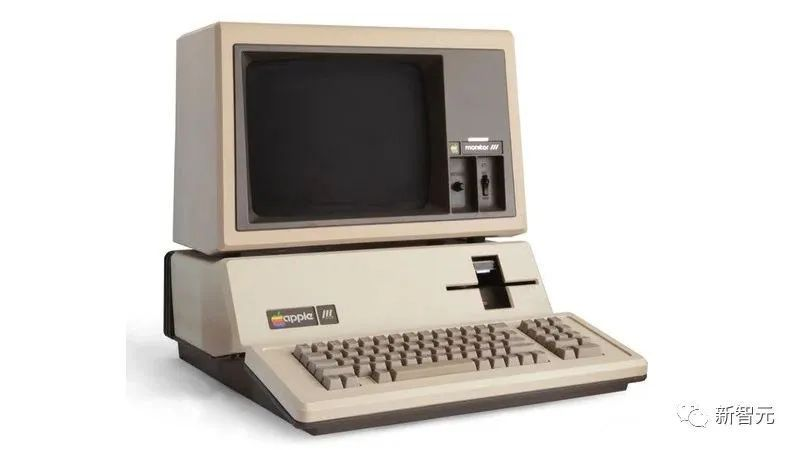
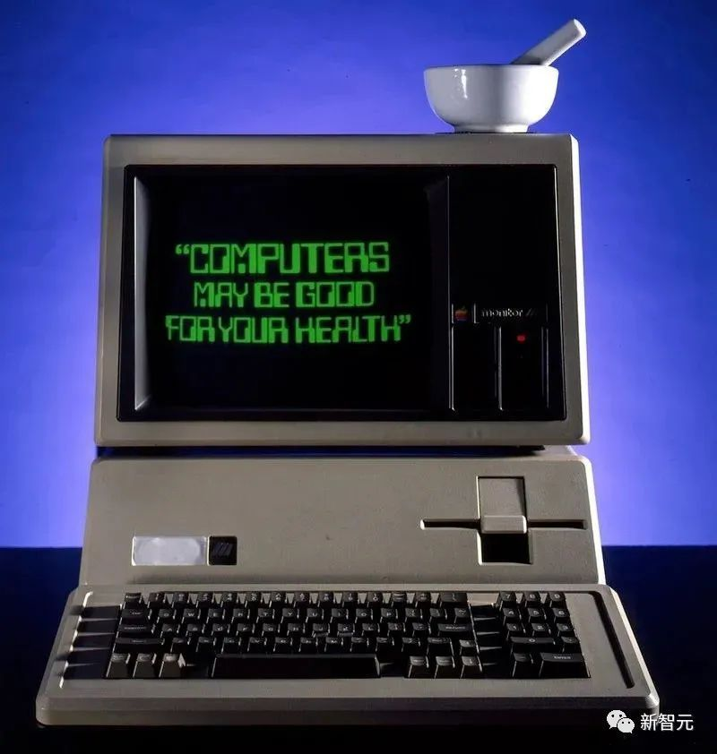
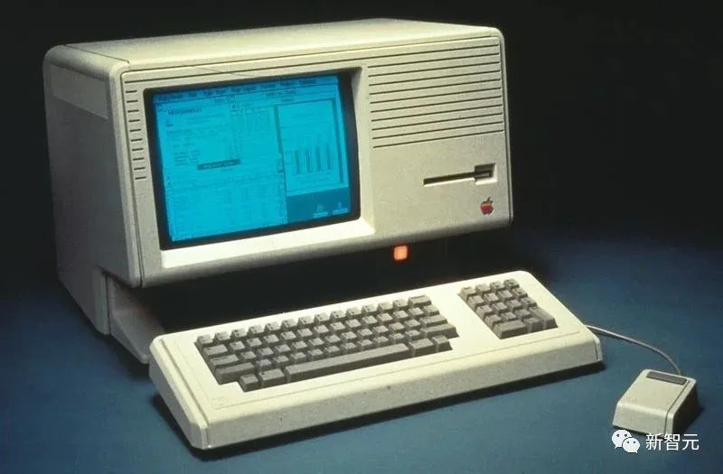
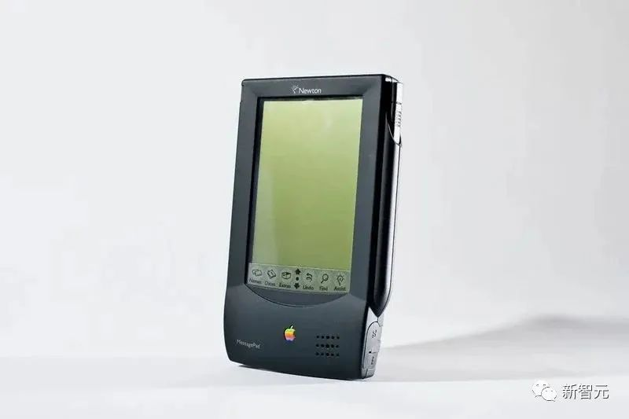
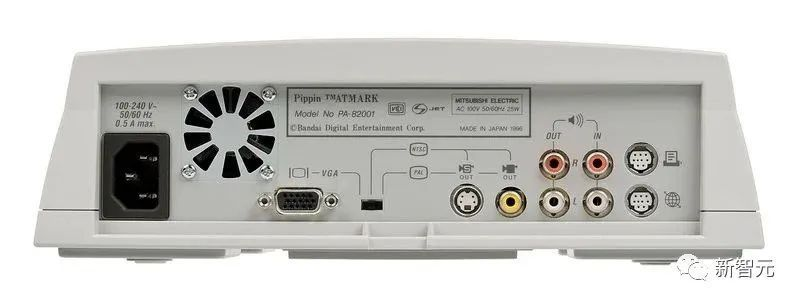
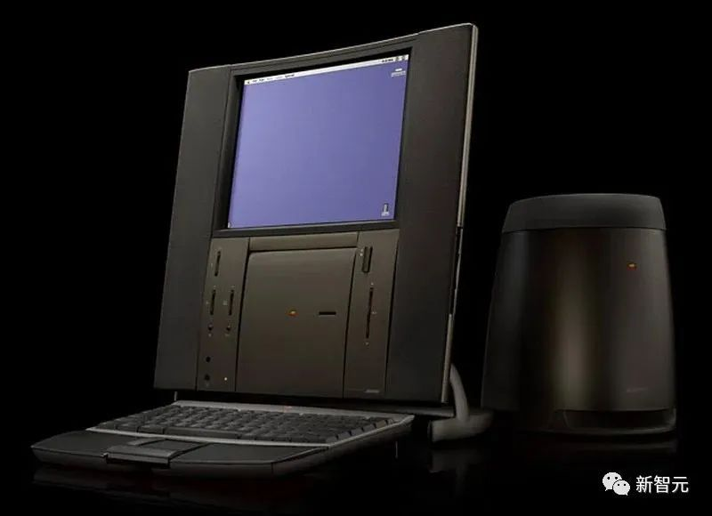
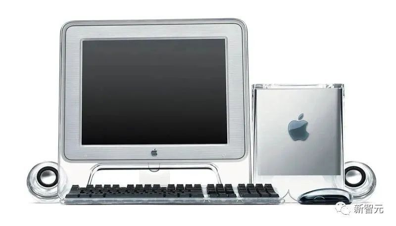

# 起底Apple“黑历史”！盘点那些年，苹果卖不掉的赔钱货们

一提到苹果公司，大家肯定会想到iPod、iPhone、iPad、MacBook等改变我们生活方式的科技产品。

但是，即使是世界上最有价值的公司，也有因营销失误和质量问题而出现的滑铁卢时刻。

历史上的苹果公司，并不总是像今天这样赚得盆满钵满。一些早期产品的失败程度，可能会使大多数其他科技公司直接破产。

在此，我们回顾一下苹果最失败的6款产品。

**Apple III：「热」得离谱**

Apple III是苹果公司首次尝试制造功能强大的商用计算机。经过两年之久的研发，于1980年发布。

虽然1977年发布的Apple II在小企业当中广受好评，但苹果意识到，IBM正在开发专门针对商业用户的个人电脑。这让苹果警铃大作。

为了保护市场份额，苹果对Apple III极为重视，要求其配备诸多功能，满足用户的不同需求。

为此，苹果安排了一个工程师委员会负责该项目。这是第一台不是由系列设计师史蒂夫 ·沃兹涅克（Steve Wozniak）设计的Apple计算机。

然而，每个人都对Apple III应该具有哪些功能有自己的想法，而成品也将所有想法都包括在内。该项目本应在10个月内完成，但最终花了两年时间。

1980年11月，Apple III终于推出，起价高达3，495美元。苹果声称，Apple III性能和内存都是Apple II的两倍。

它是第一台内置软盘驱动器的苹果电脑，并运行一个名为Apple SOS的新操作系统，具有先进的内存管理系统和分层文件系统。

遗憾的是，这些创新都无法将Apple III从其有缺陷的底层设计中拯救出来。由于严重的过热问题，苹果被迫召回生产的第一批14，000台机器。

造成机体过热的部分原因，是乔布斯坚持不在机箱中安装风扇（万恶之源找到了）。更夸张的是，机体受热膨胀，导致芯片经常弹出。苹果甚至告诉客户将过热机器抬起来散热，冷却后再放下它。

苹果最终于1983年发布了名为Apple III Plus的修订型号，解决了广泛存在的故障。但三代对Apple系列计算机声誉的损害已经造成。

乔布斯后来表示，该公司在Apple III上损失了「无限的，无法估量」的资金，其糟糕的反响导致上万家美国企业购买IBM的电脑。

**Apple Lisa：垃圾场里的划时代产品**

Lisa于1983年发布，是「本地集成软件架构」（Local Integrated Software
Architecture）的首字母缩写。这款产品，是乔布斯以女儿的名字命名的。

Lisa问世前，计算机依赖于文本的界面和键盘输入，而Lisa是第一台具有图形UI和鼠标功能的个人计算机，这是乔布斯在访问施乐帕克（Xerox
Parc）研究实验室时得到的启发。

尽管这台计算机意义非凡，但其高昂的价格劝退了大批感兴趣的用户。Lisa售价约1万美元（按照今天的标准约为3万美元，约合20万元人民币），除了最富有的家庭之外，其他人压根感受不到这台划时代产品的魅力。

定价的失误直接导致Lisa的失败。Lisa在1986年被终止，余货被埋在了犹他州的垃圾堆填区。

回想起来，乔布斯觉得苹果迷失了方向。「首先，它太贵了，要一万美元，」他在1985年接受《花花公子》采访时说。「我们成为了世界500强企业，就试图把产品卖给那些大公司，然而，我们的运营之本是卖给普通人。」

**Apple Newton：被群嘲的世界首个掌上电脑**

1992年5月，苹果首席执行官约翰·斯卡利（John Sculley）在美国消费电子展（CES）上，向狂热的观众宣布了新产品Newton
MessagePad。他将这个时尚的黑色手持设备称为PDA，大小与磁带差不多。

他说，Newton是一种全新的设备类别。它带有手写笔，可用于记笔记，存储联系人和管理日历。放在当下，这些是现代智能手机的标配，但在1993年，Newton的出现是颠覆性的。

PDA（Personal Digital
Assistant），又称为掌上电脑，是智能手机之前的高级产物。虽然在那个时代，PDA的领军者是黑莓、PPC等产品，但第一个提出PDA概念并生产出成品的，却是苹果。

然而，苹果宣称，Newton真正的杀手锏是手写识别。或者至少说，这是苹果最初的计划，因为这项功能几乎没有奏效。

14个月后，苹果以900美元的价格推出了第一款Newton
MessagePad，但那时，其他公司已经将自家的PDA推向市场，而Newton在将手写笔记翻译成文本方面仍然存在很大问题。

众多批评声中，Apple
Newton成为了群嘲的对象——漫画《Doonesbury》花了整整一周的时间讽刺它的笔迹识别问题；《辛普森一家》甚至也嘲笑该设备的糟糕表现。

苹果努力使Newton后续版本取得成功，随着1996年3月牛顿OS 2.0的发布，手写识别得到了显著改善。但一切都太迟了。

Newton经历了八个版本的迭代，苹果在其开发上花费了1亿美元，估计只售出了20万台。但这并不全是浪费，PDA背后的设计理念成为了iPhone问世的起点 。

**Pippin：一次坑俩**

1996年，苹果联合万代，在日本和美国推出家用多媒体系统Pippin。

该系统使用兼容Mac OS
7.5x的操作系统「PippinOS」，作为网上游戏、学习和娱乐的游戏主机。与同类型产品不同的是，Pippin只有CD，没有硬盘，需要连接电视。

从表面上看，Pippin 就是这样，拥有所有其他游戏机竞争对手所缺乏的一些独特功能。

Pippin的独特构造，源自苹果对产品的商业定位。当时，个人电脑尚未普及，苹果希望通过这款多媒体设备改变市场的格局。

然而，由于缺乏合适的软件支持，且市场当时已经被任天堂N64、世嘉和PS等游戏设备所占领，Pippin自问世以来一直反响平平。

苹果曾希望每年出货五十万台游戏机，但在该设备短暂的使用寿命中，总共只售出约42，000台。

惨淡的销量导致苹果和联合开发的万代损失超过65亿日元，甚至万代方面负责此事务的子公司就此解散。这成为了苹果当年的黑历史。

**20周年纪念版麦金塔：虎头蛇尾**

1997年3月，为纪念公司成立 20 周年，苹果公司发布「20周年纪念麦金塔」（TAM）。哪怕以今天的标准来看，这也是苹果最具未来感的产品。

纤薄直立的「一体机」设计包含多项新颖功能，包括内置12.1英寸LCD平板显示器、垂直安装的CD-ROM和软盘驱动器以及集成的电视/FM 调谐器。

不仅如此，TAM还配备定制的Bose音响系统，20周年纪念版以其独特的外观和奢华的配置，成为苹果公司充满未来感和完美工业设计的杰作之一。

苹果营销部门将TAM定位为高端产品，买家下单后，会有一个穿着燕尾服的服务人员，开着豪华轿车，亲手送到买家面前。其代价是，买家需要支付7，500美元。

由于人傻钱多的客户太少，在上市的最后几周，苹果将TAM的价格削减至2000美元，但这只会激怒那些已经支付全价的人。为了平息他们的怒火，苹果被迫用新的PowerBook偿还全价购买的用户。

苹果一共生产了12，000台TAM，其中许多从未售出。该系统在苹果的产品阵容中仅持续了12个月，一年后的1998年3月停产。不久后，苹果便推出iMac
G3，规格类似，但屏幕更大，而且价格仅为1，299美元。

**Power Mac G4 Cube：优雅，但贵**

Power Mac G4
Cube于2000年7月19日亮相，这是Apple工业设计最具个性的作品之一。这款无风扇机器的尺寸不到当时大多数PC的四分之一，代表了一类全新的计算机。

Cube具有强大的G4 PowerPC处理器，独立的英伟达视频卡，用于Wi-
Fi的AirPort卡和DVD刻录机，所有这些都整齐地包装在一个优雅的八英寸立方体中，悬挂在透明的亚克力盒中。

乔布斯称其为「有史以来最酷的计算机」，从第一印象来看，很难不同意。

但Cube几乎从一开始就注定要失败。它的可升级性受限：电脑底部的手柄允许用户将内部从外壳中拉出，有三个RAM插槽和插入AirPort卡的空间的，但没有PCI插槽，视频播放卡也为适应紧密空间而被缩小。

同时，即使按照苹果的标准，它也太贵了。丐版售价1，799美元，比可升级的Power Mac G4还高出200美元。

近一年时间，苹果售出不到150，000台。2001年7月3日，苹果宣布无限期暂停生产Cube。

现任苹果CEO库克后来将Cube描述为「一次惊人的失败」。

虽然苹果公司在价格上屡屡踩坑，但不得不惋惜，很多天才的想法都因「生不逢时」被逐渐遗忘。商业失利固然遗憾，但正是这些不断的试错，让苹果迎来了iPhone、迎来了iMac、迎来了市值第一的称号。

近些年来，苹果公司的产品被人吐槽「挤牙膏式更新」。库克领导下的苹果，发展更稳健、刀法也更准，但人们的期待也不断降低，低到一个灵动岛就让大家直呼好绝。

世界的目光聚焦在苹果VR。它会成为iPhone、iPad一样的传奇产品，还是成为下个十年盘点的素材？时间会给我们答案。

