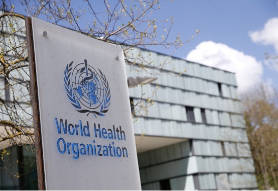
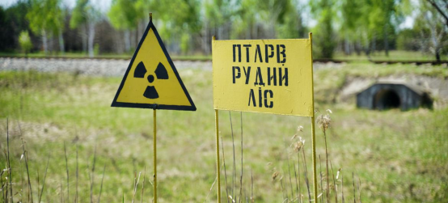

# 世卫更新应对辐射和核紧急情况关键药物清单：各国政府必须做好准备

【环球网报道】“世界卫生组织敦促各国储备以应对核紧急情况”——俄罗斯卫星通讯社28日以此为题的报道注意到，世卫组织27日在其官网更新了应对辐射和核紧急情况建议储备的药物清单，这是自2007年以来的首次，世卫组织发言人玛格丽特·哈里斯说，这份清单花了两年多的时间准备。

据世卫组织官网发布的“世卫组织更新用于应对辐射和核紧急情况的关键药物清单”，这些药物储备建议，包括防止或减少辐射影响的药物，或在接触辐射后用于治疗损伤的药物。

_世界卫生组织（WHO）大楼外标识
图自外媒_

“在辐射紧急情况下，人们可能暴露在剂量从微不足道到危及生命的辐射中。各国政府需要迅速为有需要的人提供治疗，”世卫组织改善人口健康部门助理总干事玛利亚·内拉说，“各国政府必须做好准备，保护人民的健康，并立即对紧急情况作出反应。这包括随时准备救生药物，以降低风险并治疗辐射造成的伤害。”

世卫组织官网发布的清单中称，辐射和核紧急情况可能导致暴露在高剂量辐射下，这足以导致严重健康后果甚至死亡。因此，各国政府对此类威胁迅速作出反应是极其重要的。然而，根据向世卫组织秘书处提交的年度报告，许多国家仍然缺乏应对辐射紧急情况的基本要素。而本次更新内容考虑的潜在情况包括核电站、医疗或研究设施的放射性或核紧急情况，或放射性材料运输期间发生的事故，以及恶意故意使用放射性材料等。

_在乌克兰切尔诺贝利，一个警告有辐射危险的标识
图自世卫组织官网_

据清单具体内容，典型的辐射应急储备包括以下药物：

·稳定碘，用于阻止或减少甲状腺对放射性碘的吸收；

·普鲁士蓝，用于去除人体内部的放射性铯 (Cs) 和铊 (Tl)

·在急性辐射综合征（ARS）情况下，用于缓解骨髓损伤的细胞因子

·用于治疗呕吐、腹泻和感染的其他药物

