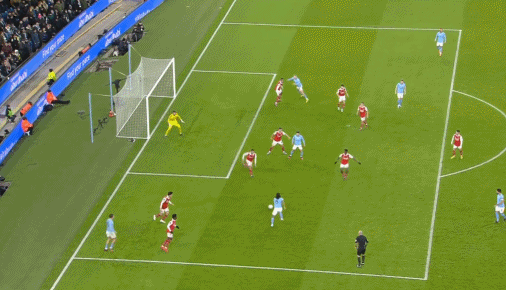

# 体育早知道｜足总杯曼城1-0淘汰阿森纳 美国主办2024美洲杯

早间必读

2022-23赛季英格兰足总杯第4轮一场焦点战，曼城主场1-0淘汰阿森纳，阿克贴地斩制胜，哈兰德倒钩差点进球，德布劳内弧线球稍稍打偏，斯通斯伤退，替补门将奥尔特加此役表现十分稳健，力保大门不失。

南美足联和中北美及加勒比海足联官方宣布，2024年美洲杯将在美国举行，而且将有多达16支球队参加！

湖人考虑换来拉文；勇士是卡鲁索的潜在追求者；火箭对特纳感兴趣，送走戈登的意愿增强。八支球队竞争科林斯。森林狼有意沃尔，庄神很可能又要换队了……

足球早报

足总杯第5轮，曼城1-0淘汰阿森纳，哈兰德虽然没有取得进球，但有过几次不错的机会，甚至还差点儿打入了远距离的倒钩世界波！

足总杯第4轮，曼城1-0击败阿森纳，进入16强。而出局之后，阿森纳也确定无缘本赛季的三冠王，不过更重要的是，2月16日两队的英超天王山之战！

根据名记罗马诺带来的消息，纽卡斯尔将以4500万欧元签下本土飞翼戈登，这是他们在冬窗的首笔重要签约。

根据名记罗马诺的消息，切尔西已经与里昂就古斯托的转会达成协议，这名19岁右后卫将在夏天正式加盟，转会费3000万+奖金。签下古斯托后，切尔西已经敲定2笔今夏加盟的球员，恩昆库和古斯托的转会费总价高达9000万欧元，蓝军真是不差钱。

法国国家队与德尚续约后，齐达内的未来是人们关注的话题，原本他最感兴趣的是出任国家队主帅，但现在他需要评估自己的未来。根据法国RMC体育带来的消息，齐达内计划在2023年复出执教，下家4选1，重返皇马成为他首先考虑的事情。

已经连续多日爆料“李铁案及所涉人员信息”的前央视“足球之夜”记者、前《体坛周报》记者冉雄飞，在1月27日再次大爆猛料——且这次竟是批量式的爆出了有关中国足协的大把猛料。

篮球早报

湖人官方更新社媒，晒出了他们准备登机的画面。官方配文写道：“下一站，波士顿！”他们的下一个对手是目前排在联盟第一的凯尔特人。

数据网站StatMuse晒出了一月至今，场均得分篮板和助攻总和排名前三的球员，詹姆斯达到51.0，是唯一总和过50的球员。

著名记者Woj报道了独行侠队球星东契奇的伤病情况，东契奇被诊断为左脚踝轻度扭伤，被列入每日观察名单。

FIBA国际篮联官方晒出科比的海报，并且缅怀致敬，“曼巴永恒，永远传奇。”科比除在NBA成就伟大，他在国际篮球赛场，曾经两次夺得奥运金牌。

在全明星投票中，恩比德的球迷投票排名东部前场第4位，球员投票和媒体投票都排名第3位，最终不敌字母哥、杜兰特和塔图姆排名第4位。

法甲联赛迎来新一轮的比赛，文班亚马所在的大都会92队84-102不敌Roanne队。文班亚马轰下31分14篮板5盖帽的数据，投篮28中12，三分9中3，罚球6中4。

NBA官方公布最新一期常规赛MVP排行榜，掘金核心约基奇连续五周高居榜首，继续冲击3连MVP壮举，恩比德反超塔图姆升至第二，字母哥反超东契奇升至第五，哈登、小萨博尼斯与兰德尔均是进入榜单前十位，而库里与欧文获得提名。

综合早报

卡塔尔男排联赛豪门阿尔阿拉比俱乐部宣布中国男排国手、主攻俞元泰加盟。这是俞元泰职业生涯首次留洋，他将身披6号球衣代表球队出战。目前俞元泰已经抵达卡塔尔。

重要赛事预告

08:00 NBA常规赛 雄鹿VS步行者

08:30 NBA常规赛 灰熊VS森林狼

09:30 NBA常规赛 魔术VS热火

09:00 NBA常规赛 骑士VS雷霆

11:00 NBA常规赛 猛龙VS勇士

22:30 德甲第18轮 弗莱堡VS奥格斯堡

22:30 德甲第18轮 美因茨VS波鸿

22:30 德甲第18轮 霍芬海姆VS门兴

22:30 德甲第18轮 柏林赫塔VS柏林联合

22:30 德甲第18轮 不莱梅VS沃尔夫斯堡

23:15 西甲第19轮 赫罗纳VS巴萨

次日

01:00 意甲第20轮 克雷莫内塞VS国米

01:30 德甲第18轮 拜仁VS法兰克福

02:00 足总杯第4轮 普雷斯顿VS热刺

04:00 足总杯第4轮 曼联VS雷丁

04:00 NBA常规赛 掘金VS76人

