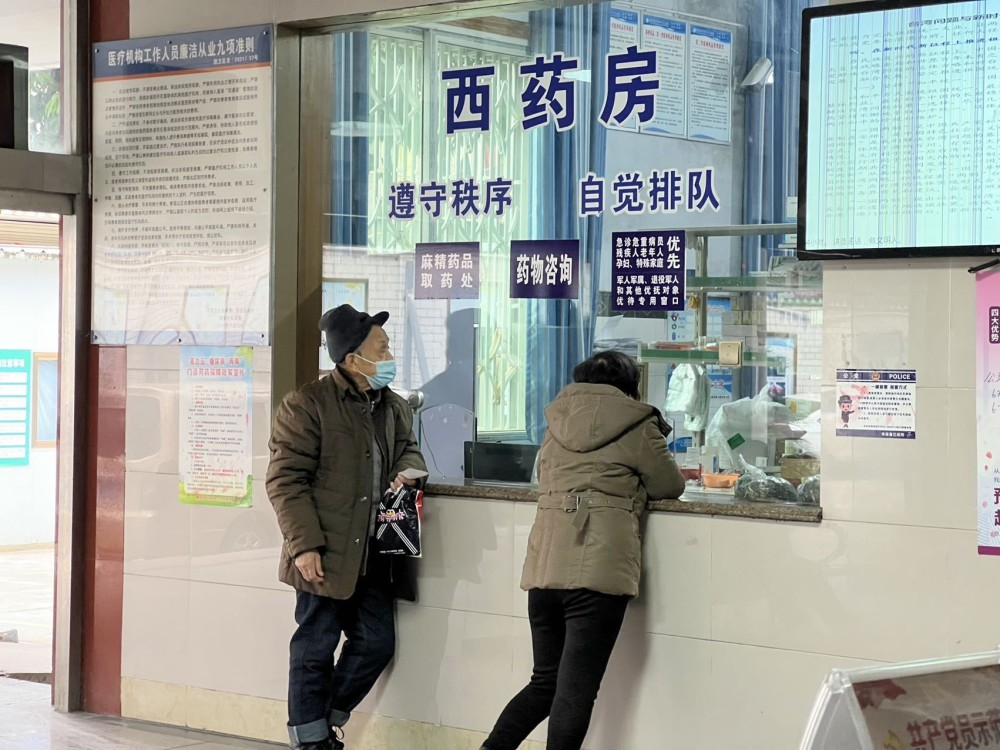
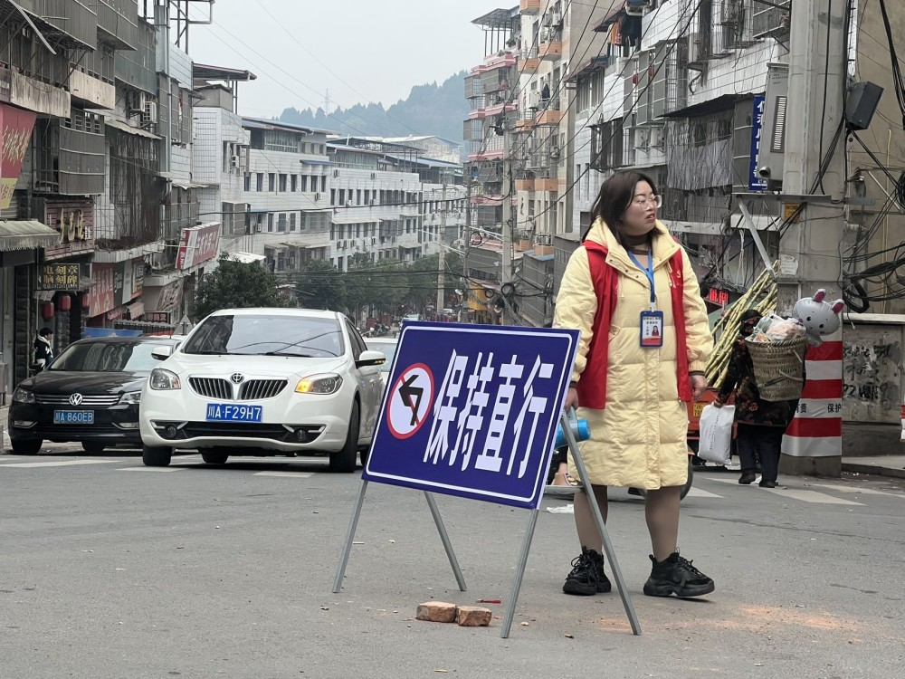
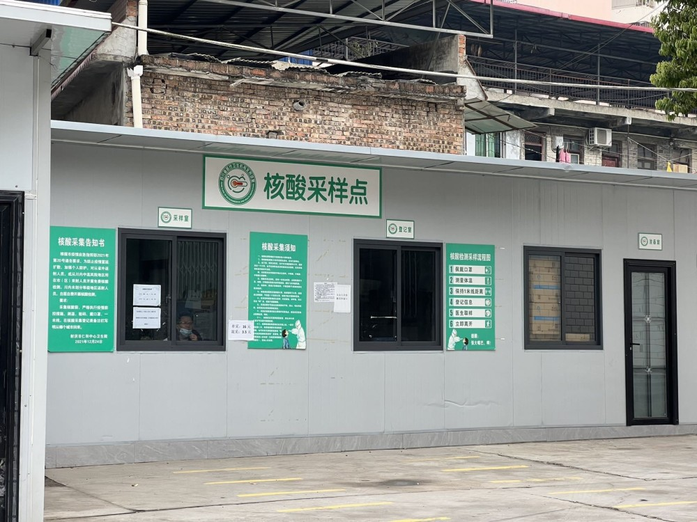
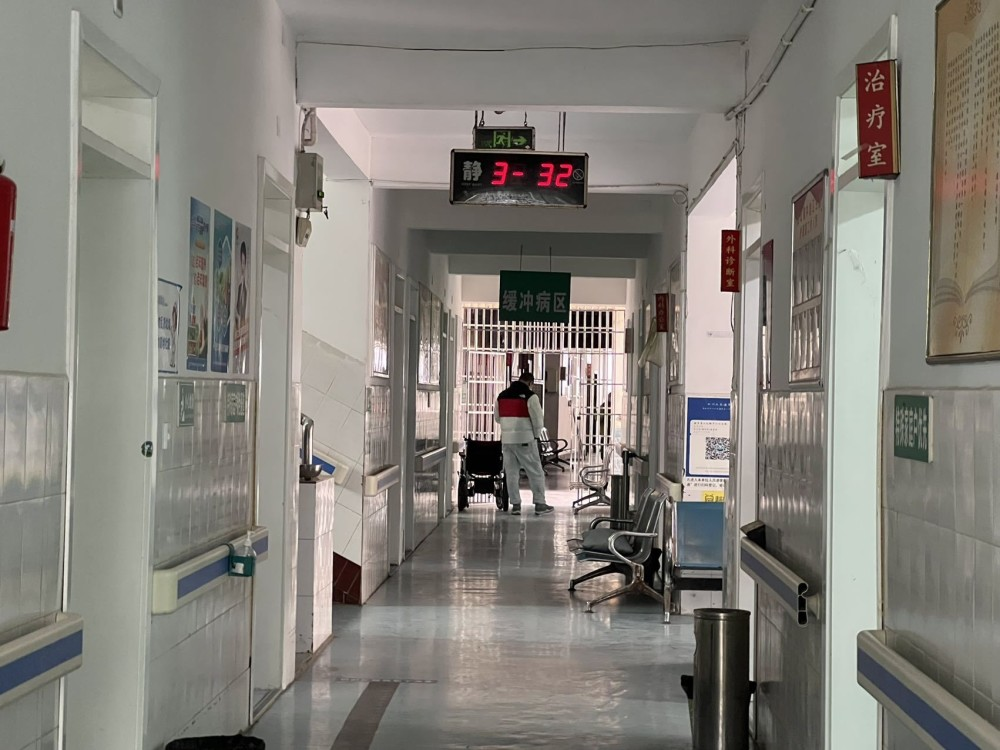
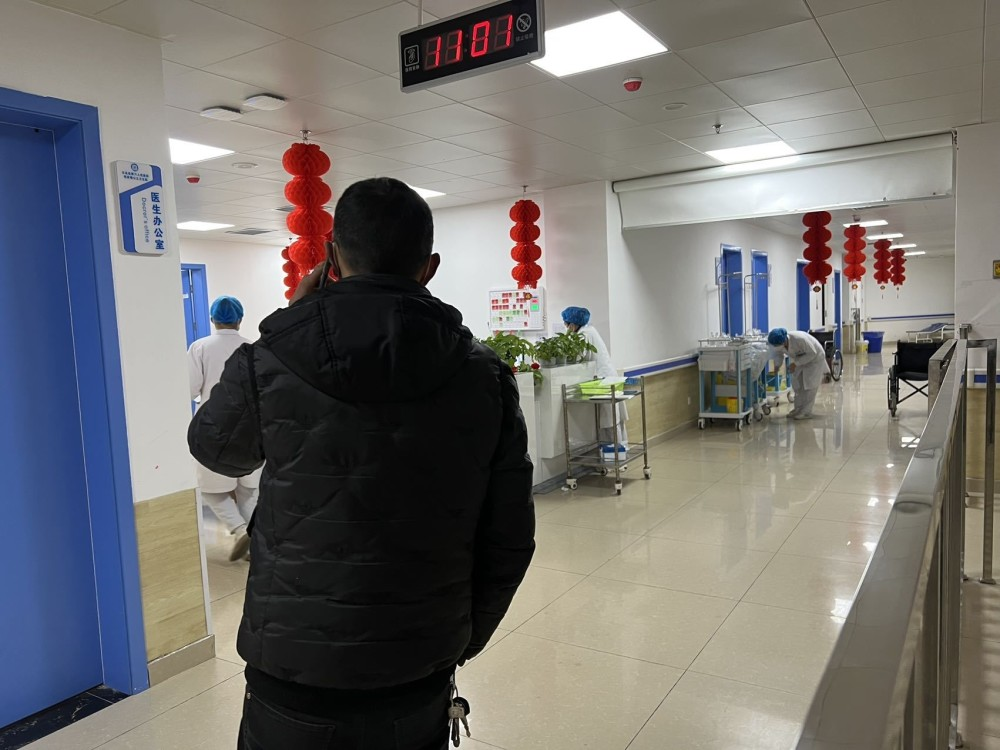

# 探访四川基层卫生院：感染高峰没出现 核酸检测口没有一个做核酸的人

春节期间大规模的城乡人员流动，是否引发了新一波新冠感染潮？

一周来，澎湃新闻（www.thepaper.cn）在四川多个市县基层探访发现，无论是在村级卫生室还是在乡镇卫生院，医生们反映发热病人并未增加。大年初一、初二都在值班的一位镇卫生院医生说，今年从外地返乡过年的人明显比前两年增加了很多，但他在医院值班但两天却是比较轻松的。

_射洪市仁和中心卫生院
本文图片均为澎湃新闻记者 胥辉 摄_

1月24日，四川射洪仁和镇卧龙村卫生室医生胥锋告诉澎湃新闻，从他所在卫生室的情况来看，过年前后没有出现疑似感染新冠的情况，甚至感冒的人似乎也比往年少了，这多少让他感到有点意外。

据国务院联防联控机制春运工作专班数据：截至1月22日，全国春运客流总量突破6亿人次。四川作为劳务输出大省，春节期间也迎来大量归乡人流。此前，四川多个县级医疗机构负责人向澎湃新闻表示，他们做好了应对春节可能出现的疫情的准备。

_在药房等待取药的人_

1月20日，在位于仁和镇的仁和中心卫生院大厅里，一边的药房有两个人在窗口等待取药，另一边的挂号收费、医保结算处有十来个人在排队。还有一天就是大年三十，不少住院的人选择这一天出院回家过年。

“高峰期的时候药品还是紧张，现在不存在这个问题了。”该卫生院药房一位医生告诉澎湃新闻，12月中下旬经历了第一波疫情高峰之后，现在药品问题已经缓解。

_门诊走廊里两人在候诊_

1月20日，该卫生院门诊走廊里，只有两人在候诊，门诊二楼的输液室里只有三名输液患者和一名陪护家属。医院左侧的核酸检测窗口，有一名采样人员值班，但没有一个做核酸的人。整个医院看上去格外冷清。与之形成鲜明对比的是，医院大门外的街上热闹非凡，街道两边的商铺生意异常火爆，购置年货的人和通行的车辆使宽敞的街道变得拥挤。为了解决春节期间场镇拥堵的问题，镇政府工作人员在各个路口值守，引导车辆在场镇内单向循环。

_拥挤的场镇，政府工作人员在路口引导交通。_

_场镇上人车拥堵_

_医院核酸检测点_

胥锋所在的卧龙村卫生六室位于场镇上场口。1月20日，临近中午12点，胥锋在吃午饭，几个就诊的年轻人在门口坐着等他，卫生室内几名患者在输液。他说，一个月前的疫情高峰期，他一个小小的卫生室，每天要接诊六七十个病人，午饭都没时间吃。

他说，那时农村人还不算多，在外面的人还没有回来，医院、诊所可能是整个场镇上人流量最多的场所，现在人反而少了。最让他意外的是“感冒病人好像都比往年同期少许多”。

_盐亭县玉龙镇卫生院_

与胥锋有同样感觉的，还有盐亭县玉龙卫生院发热诊室的值班医生王波。大年初一、初二都在医院里值班的王波说，今年外地返乡过年的人明显比前两年增加了很多，大年初三，他值班结束回家，驾车通过玉龙场镇用了15分钟，这在平时两三分钟就可以通过。但他在医院值班但两天却比较轻松。

“不仅感冒发热的人少，连酒后打架、摔伤的人都少了。”王波说，值班两天，他每天只接诊了10多个患者。

一个月前，这里和很多基层卫生院一样，大量有发热症状的病人涌进医院，医护人员也纷纷感染，医院面临着前所未有的就诊压力。春节大规模人员流动会不会带来新一波感染潮，成为一个普遍担忧的问题。

“现在看来，这个担忧暂时应该不会出现。”一名基层医生对澎湃新闻说，他认为，经过第一波感染高峰以后，人群已经普遍具有了抗体，这可能是春节没有出现疫情高峰的主因。

_成都大邑悦来镇公立卫生院_

“从家乡返程后是否会有感染风险？从全国的表现上来看，这种担忧已经多余。春节假期已过半，并没有出现大规模的疫情。”上海市肺科医院呼吸与危重症医学科副主任胡洋近日接受媒体采访时也说，“大家都刚感染过，身体内还有抗体，短期内再感染的概率是比较低的。”

_成都悦来镇卫生院住院区_

