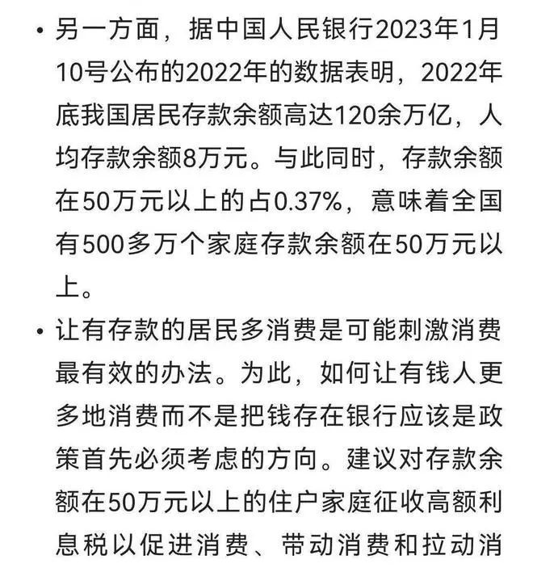

# 有人建议对50万以上存款征收高额利息税，专家：此举不能刺激消费

近日，今日头条一位认证为四川农业大学经济学教授的网友发布了一篇文章，题为《对50万以上存款征收高额利息税，促消费的最佳途径》。

文章指出，高收入人群再怎么刺激他们也不消费，低收入人群没有钱去消费，所以带动消费的主要动力就落在了中收入人群身上。中收入人群有较可观的存款余额，所以对50万以上的存款收利息税，让高额存款变得没有收益空间，就能促消费。

该文章发出后在网络上遭到了广大网民的质疑，那么征收存款利息税，是否能刺激消费？

多位专家在接受蓝鲸财经记者采访时均表示：“不能。”

天使投资人、北京卫视（BRTV）财经评论员郭涛表示，利息税并不能刺激消费，刺激消费需要政府有关部门进一步健全或完善生活型服务业支持政策，对文旅、餐饮、消费电子等热点民生领域发放政府消费券，提升市场消费热情，促进消费市场整体回暖。

鲸平台专家张雅芝表示，消费作为国民经济三大马车之一，是经济上行的主要动力。但是面对三年疫情带来的影响，并不是简单将群体切分为高收入、中收入、低收入，再粗暴地将中产抽出来，施加财务压力就可以解决。刺激国民消费，源头在于国民实际收入的增加以及对未来收入的积极评估，更深沉是要增加创业机会、就业机会、择业机会，以及用政策帮扶企业发展，让社会上的钱、企业的钱、民众手上的钱积极主动流通起来，才是解决之道。

科技部国家科技专家、方融科技高级工程师周迪认为，刺激消费最重要的是培育完整的消费体系，提升消费产品的价值，提升供给质量，使消费者愿意购买。而不是简单地收利息税，那还不如降息预期。

目前《对50万以上存款征收高额利息税，促消费的最佳途径》一文已被删除。

