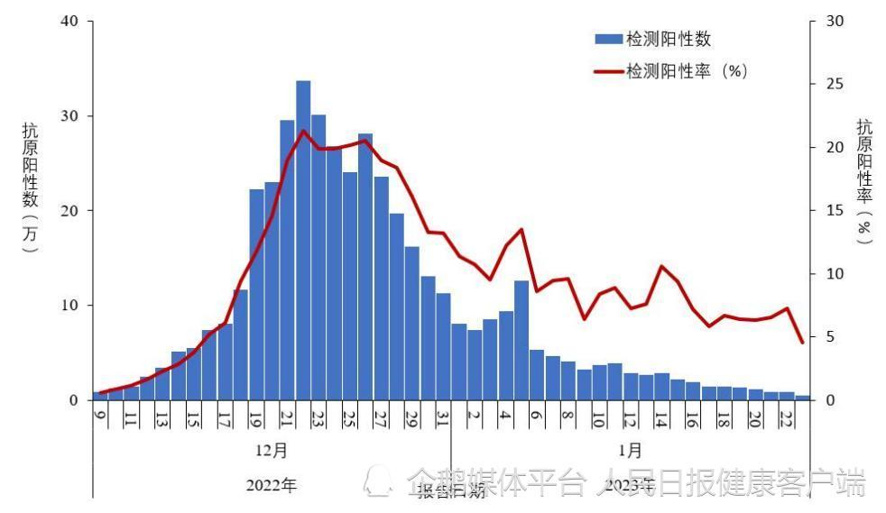

# 病毒有点传不动了！新冠感染率呈下降趋势，专家：符合病毒传播规律

**人民日报健康客户端 林敬**

1月25日，中国疾病预防控制中心官网发布全国新型冠状病毒感染疫情情况（https://www.chinacdc.cn/jkzt/crb/zl/szkb_11803/jszl_13141/202301/t20230125_263519.html），核酸检测结果方面，2022年12月9日以来，各省份报告人群核酸检测阳性数及阳性率呈现先增加后降低趋势，阳性人数12月22日达到高峰（694万）后逐步下降,
2023年1月23日降至最低1.5万；检测阳性率12月25日（29.2%）达高峰后逐步下降，1月23日降低到5.5%。

_全国报告人群新型冠状病毒抗原检测阳性数及阳性率变化趋势。中国疾病预防控制中心
图_

1月27日，上海中医药大学急危重症研究所所长方邦江教授告诉人民日报健康客户端，“新冠病毒传播渐渐变弱，并非因为病毒本身有重要变化，而是社会面维持一定低水平传播，巩固了免疫屏障，加上绝大多数人都感染了，形成了群体免疫，病毒有点‘传’不动了。”

“疫情从高峰到低谷，再从低谷到高峰，呈周期性发展，这是符合病毒发展规律的，像美国、日本便经历了新冠疫情以来的好几个高峰。”北京市丰台区中西医结合医院呼吸与重症医学科主任乔树斌也在1月27日向人民日报健康客户端表示，二十条实施以后，全国陆续有将近80%的人感染了新冠病毒，呈现了一个小高峰，短期内虽然不会再有高峰，但并不意味着新冠病毒会消失了。目前的情况下，做好个人防护还是很有必要的。

