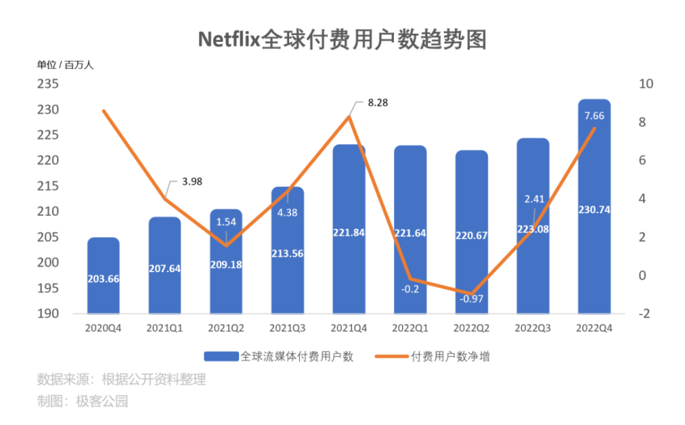
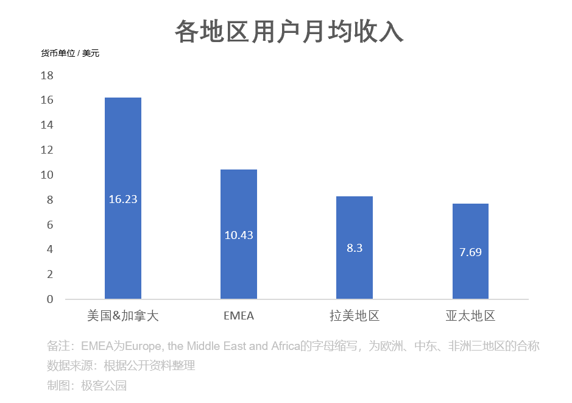
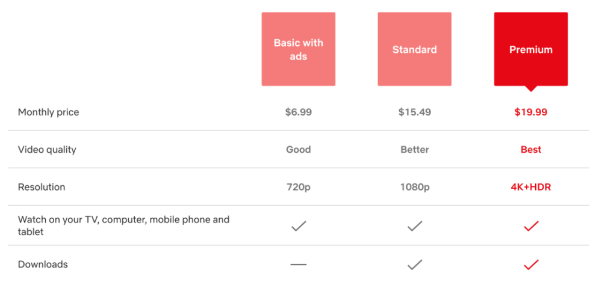

# 硅谷都在裁员，奈飞却在增长

2022下半年，过去20年最寒冷的冬天笼罩硅谷。一年里，FAAMG跌去了超过3万亿美元，蒸发掉相当于6个腾讯的市值。谷歌、亚马逊、微软、Meta等公司在开年不到两周的时间里裁员数万人，以应对增长放缓和利润下降的压力。

在这个冬天里，早早被五巨头「开除」的奈飞，却悄然打了一场漂亮的翻身仗。继三季度取得超预期的用户增长后，奈飞四季度的付费用户增长766万，远超市场预期的450万，此外，利润率、盈利都关键指标也都高于预期，股价在财报发布后的几天里上涨了约10个百分点。

_奈飞近一年股价走势_

互联网公司的寒冬并非是几家巨头的经营出了问题（也许Meta是一个例外），而是高通胀、货币政策收紧、消费疲软的宏观环境下的大势所趋。FAAMG
尚不能免俗，上半年经营惨淡的奈飞却逆势增长，这不禁引起了我们的好奇。

对2022年的奈飞，刚刚宣布退居二线的前CEO Reed Hastings有过一个总结，「疫情和近期面临的业务挑战，就像受到烈火的洗礼」。

01 低开高走的一年

回顾2022全年，与大多数大型互联网公司高开低走不同，奈飞上半年业绩惨淡，却在下半年里神奇逆转。

付费会员增速一直是资本市场衡量奈飞的关键指标。2022年前两个季度，奈飞全球付费用户分别净流失20万和97万户。这是奈飞自2007年推出流媒体业务以来，付费用户首次出现负增长的情况。

奈飞对此给出了许多理由：智能电视增长放缓、用户分享账号、流媒体市场竞争加剧、通货膨胀以及退出俄罗斯市场（损失70万用户）等……但是这些理由完全无法阻止资本市场的恐慌，四月底发布一季报后，奈飞一度跌至162美元，与高点相比市值蒸发了2000多亿美元。

奈飞的糟糕表现也导致华尔街降低了对流媒体市场的预期，业绩尚可的迪士尼一度股价下跌，程度远高于同期的市场跌幅。

业绩惨淡、股价暴跌的奈飞比其他欧美互联网巨头更早进入寒冬，开始勒紧裤腰带调整成本，包括裁减人员、出租部分办公场所；调整内容策略，集中资源拍摄规模更大、更好的影视项目，并放缓影视剧发行节奏，奉行「更大、更好、更少」原则。

但还没等这些降本增效措施看到成果，2022年下半年，奈飞的业绩却神奇转好。

在外界普遍不看好的情况下，第三季度奈飞付费用户数大幅增长241万，远超市场预期的100万。而在一向强势的四季度，奈飞取得了766万的全球付费会员增长，远高于分析师预期的450万，利润率、盈利都财务指标也高于预期，与普遍处于增长放缓、利润下降的同行形成了鲜明的对比。

此外，与2021年四季度靠《鱿鱼游戏》打开亚洲市场不同，2022年四季度奈飞在北美市场取得突破，新增91万付费会员。作为奈飞的大本营，北美是用户付费价值最高的地区，用户月均收入达15.95美元，拉美亚太仅有其一半左右。而在北美地区，奈飞的用户增长已经陷入一段时间的停滞，甚至2022年初还因涨价等原因导致用户流失。

_2022年第四季度奈飞各地区用户月均收入_

靠着下半年的表现，奈飞股价从低点翻了一倍多。目前奈飞股价约370美元，几乎与2022年初持平，而同期纳斯达克指数下降了近30%。

02 款助奈飞走出困境，但解决不了所有问题

能让奈飞从业务低迷中走出，广告订阅套餐与打击共享更多是辅助策略，优质的内容是拉动奈飞业务增长的核心。

2021年，《鱿鱼游戏》风靡，在66个国家（地区）中摘得收视冠军，也促使奈飞股价达到历史新高。彭博社报道称，奈飞内部估计《鱿鱼游戏》带来了超过40倍的利润，成本2140万美元，带来的收益是近9亿美元。

2022年奈飞的「逆袭之路」同样如此。2022年7月之后，奈飞相继推出《怪奇物语（StrangerThings）》第四季、《星期三（Wednesday）》、韩剧《黑暗荣耀》等爆款剧集，在下半年拉起了付费用户的增长。

其中，《怪奇物语》在全球的受欢迎程度仅次于2021年的《鱿鱼游戏》，成为奈飞史上第三个播出28天内达到10亿小时观看量的作品；11月上线的黑色剧集《星期三》，仅一周全球播放量就超过3.4亿小时，成为奈飞有史以来最受欢迎剧集的第三名。

联席CEOTedSarandos在回答分析师提问时称，「好的内容效果就能推动业务的增长」，提升用户参与度后，就能实现盈利、创造营收。对内容型公司而言，爆款剧集，不仅能在付费用户上带来提升，股价上也会有直接的反应。同样的，优质内容的缺失也会让奈飞增长、营收告急。过去就曾发生过，因失去《老友记》版权，奈飞的美国订阅用户数出现了首次下滑的状况，直接导致股价在一周内跌去20%。

正因此，为了解决内容供给，奈飞不断向全球市场伸出触手，一边投资本土化的作品，一边挖掘本地市场的潜在用户。

这个策略在韩国取得了巨大的成功。2015年至2022年的八年里，奈飞对韩国本土电影和电视剧投资了约12亿美元，前有《鱿鱼游戏》，后有《黑暗荣耀》，奈飞对韩国本土内容的投资收到了成效。

奈飞曾经公开过一个数据，2022年约有60%全球观众观看了奈飞上的韩国作品，观看次数最多的十部作品中有三部是韩国制作的。而在2023年，奈飞对韩国作品的投资也将达到历史最高，将推出34部韩国作品。其中包括《鱿鱼游戏》第二季、《黑暗荣耀》第二季在内的21部电视剧。

随着这些爆款续订剧集的播出，奈飞很可能将迎来收获的季节。

在北美用户增长几乎见顶的现在，亚太地区是奈飞突破增长瓶颈的新区域，奈飞这两年也在不断加大对日韩、中国台湾的内容投资以吸引本地用户。2022年，亚太地区成为奈飞全球订阅用户数扩张的主力，其中，第三季度新增订户143万（占66%），第四季度新增180万户。市场对2023年一季度的预期同样如此，预计新增的350万户付费用户，亚太地区将贡献近40%。

奈飞内容总会出现爆款，这与他们提供的相对宽松自由的创作环境有很大关系，曾经爆火的韩剧《王国》编剧金银姬就曾公开表示，「奈飞从不发表任何意见，只给钱。」尊重本地的文化输出，再叠加奈飞的资金、数据支持，帮助奈飞与全球各地的影视创作团队构建出默契和方法论。

但不能忽视的是，随着全球付费用户突破2亿，单纯的用户增长越来越难以成为驱动奈飞增长的主要动力。美国订阅服务数据供应商Antenna数据显示，第四季度奈飞平均每月取消订阅数130万，2022年12月用户流失率达3.1%，爆款和优质内容带来的用户增长在未来更多可能只是与流失的用户打平。

用户快速增长的时代已经结束，对奈飞而言，挖掘存量用户的价值才是未来最重要的工作。

03 一个新的奈飞正在形成

2007年推出订阅付费以来，奈飞是今天流媒体视频平台商业模式的缔造者。随着内外部环境的剧变，奈飞也开始「更新」自己持续了15年的运营策略。

随之变化的还有奈飞的掌舵者。奈飞在四季报上公布，公司联合创始人ReedHastings将从联席CEO过渡到执行董事长，并任命GregPeters与TedSarandos以联席CEO身份执掌公司。据报道，资深高管GregPeters是推动奈飞创建更多订阅选项和广告业务的关键人物，而TedSarandos在奈飞创办第三年就已经加入，是奈飞重要的开创者。

_奈飞创始人Reed Hastings_

告别Hastings所代表的创业时代，奈飞已经度过了发展业务资金密集程度最高的阶段，光靠付费用户数量的变化，奈飞已经很难有新的、长期令市场满意的突破。从2023年开始，奈飞开始停止公布付费会员数量，盈利成为最重要的指标。这也是奈飞应对复杂的市场竞争作出的调整。

事实上，越来越多的巨头开始进入到细分领域，这加剧了流媒体市场的竞争。曾经为奈飞提供内容的迪士尼，奈飞曾经最亲密的合作伙伴HBO，分别创建了自己的流媒体平台Disney+和HBOMax，成为奈飞强劲的竞争对手。此外，苹果的AppleTV、亚马逊的AmazonPrime、谷歌的YouTube，以及字节跳动的TikTok，都在以不同的方式分流奈飞的用户，冲击着奈飞的业务。

TedSarandos认为，消费者通过互联网点播，向流媒体转移，逐渐摆脱线性电视系统的束缚，这是奈飞所属的业务形式发生的根本性转变。在奈飞业务最成熟的美国市场，奈飞也只占到电视总观看时间的8%。奈飞由此判断，这场向流媒体的转移刚刚开始。

这些都迫使奈飞走出自己的安全区，探索新的业务模式，以寻求更有想象力的盈利结构。

2022年以来，奈飞一边在拓展各种内容类型，挺进游戏，健身，直播等领域。一边不断尝试更大范围地挖掘潜在用户，过去的奈飞向来反对在内容中植入广告，但2022年，奈飞推出了每小时包含4到5分钟广告的低价订阅套餐。这是管理层为应对一季度惨淡的付费用户情况提出的新订阅计划。

引入广告对奈飞的挑战是不言而喻的。这需要一支新的业务团队，从0开始构建技术、客户、销售体系。奈飞最终选择依赖广告业务成熟的合作方，通过微软销售视频广告。

奈飞对广告业务的发展预期很明确。财报电话会上提到，奈飞主要竞争对手是传统的电视广告服务提供商，未来一段时间内，都不准备与谷歌和Mata竞争。Peter提到，这类品牌广告全球总市场规模（除中国和俄罗斯）是1800亿美元。2022年，奈飞的年营收在320亿美元左右，预期是，未来广告业务的贡献至少将达到10%，随着时间推移，占比会更大。

哪怕在2022财年的结尾，奈飞交上了一份令市场惊喜的增长成绩单，但奈飞不得不面对的一个现实是，付费订阅用户的增长空间已经很小，2022年的增长也是过去几年中最慢的一年。

为此奈飞大幅调整了会员付费体系，2022年推出的低价广告订阅，以及将在2023年第一季度推出的有偿共享计划（多个用户可使用同一账号），都是在招揽价格敏感的用户，增加营收。奈飞也明确表示，在推出广告支持服务后，未来将更注重整体收入增长，而非订阅用户净增加这个单一指标。

以美国订阅费用为例，广告订阅版本价格不到标准版本的二分之一。

奈飞管理层提到，他们未来的目标是，维持双位数收入增长，扩大经营利润率，持续提升自由现金流入。

2020年，奈飞被称作是美国上市18年后，股价涨幅十强之一，甚至一度超越迪士尼成为全球市值最高的娱乐公司。但2022年的疲软增长让奈飞摔了一个跟头，也让奈飞开始以一家「商业公司」要求自己，重新关注自己的变现能力，多条腿走路创造多元化的营收。对奈飞来说，2022年疲软的业务在第四季度得到了提振，但新的挑战才刚刚开始。

