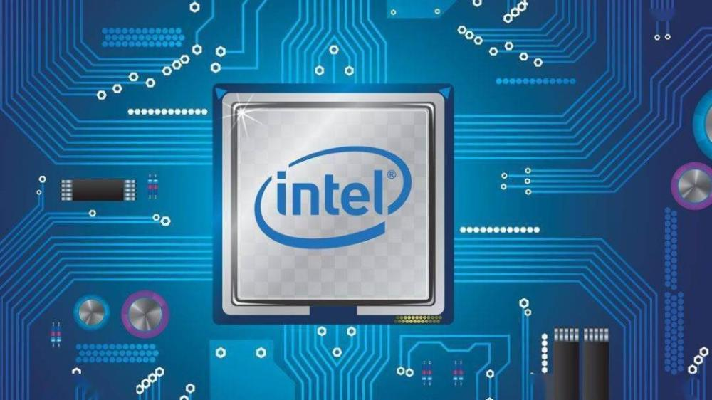

# 英特尔面临历史性崩溃？预计将出现30年来首次连续两个季度亏损

英特尔 资料图

由于个人电脑（PC）芯片销售的下滑幅度超出预期以及利润丰厚的服务器硬件市场竞争激烈，美国芯片巨头英特尔四季度业绩栽了跟头。

1月26日美股盘后，英特尔发布2022年第四季度及全年财报。报告显示，英特尔第四季度营收为140.42亿美元，与上年同期的205.28亿美元相比下降32%；净亏损为6.61亿美元，相比之下上年同期的净利润为46.23亿美元；不计入某些一次性项目（不按照美国通用会计准则），英特尔第四季度调整后净利润为4亿美元，与上年同期的47亿美元相比下降92%。

英特尔给出的2023年第一季度业绩指引为营收在105亿至115亿美元之间，远远低于此前市场预期的140亿美元，英特尔还预计今年第一季度继续亏损。分析师称这份业绩指引是英特尔的“历史性崩溃”，会引发芯片股抛售。

面对这份不达预期的业绩，英特尔首席执行官帕特·基辛格（Pat
Gelsinger）承认，艰难的环境因芯片库存过剩而雪上加霜，公司第四季度业绩和一季度业绩指引都低于期望。

《华尔街日报》援引标普全球市场财智的数据称，至少在过去30年中，英特尔还没有出现过连续两个财季亏损的情况。

随着疫情期间远程工作的蓬勃发展，英特尔最重要的两个市场在经历了两年的强劲增长后表现疲软。现在，在消费电子产品需求下降，担心经济衰退的商业客户正在放缓数据中心的支出后，PC行业正与芯片过剩作斗争。

《华尔街日报》称，根据研究机构Gartner数据，去年第四季度PC出货量下降28.5%，这是自Gartner上世纪90年代开始追踪该市场以来的最严重回落。而英特尔制造的CPU是绝大多数个人电脑的标配。

从英特尔的财报看，英特尔最大的现金奶牛部门英特尔客户计算集团第四季度净营收为66.25亿美元，相比之下上年同期为103.33亿美元，同比下降36%，低于分析师预期；英特尔数据中心和人工智能（AI）集团第四季度营收为43.04亿美元，相比之下上年同期为64.26亿美元，同比下降33%。

基辛格重返英特尔后重点发展的英特尔代工业务业绩表现还不错，但其规模仍然很小，无法“拯救”公司整体业绩。第四季度，英特尔代工服务事业部营收为3.19亿美元，相比之下上年同期为2.45亿美元，同比增长30%；运营亏损为3100万美元，相比之下上年同期的运营利润为300万美元。

目前看，英特尔的前景相当暗淡，尽管英特尔在个人PC芯片市场占有70%的市场，但整体个人PC市场需求不振，这影响英特尔芯片出货。其次，英特尔的数据中心芯片在竞争中不占优势，市场份额一直输给AMD等竞争对手。

此前，英特尔预计2023年个人电脑的总目标市场为2.7亿至2.95亿台。而在电话会议上英特尔表示，目前预计市场将处于该区间的末端。

英特尔计划今年削减30亿美元的成本，据估计，2023年的资本支出约为200亿美元，有分析师表示，该公司应该考虑削减股息。

为了削减开支，英特尔也加入了硅谷裁员潮。基辛格承认，正在调整近期的支出，以管理成本，裁员已经开启，上半年将继续裁减相关岗位。

值得注意的是，英特尔正在努力扩大芯片制造业务，并计划在美国和德国新建工厂，这是基辛格为重振英特尔制定的计划，《华尔街日报》称，在用体积更小的晶体管制造运算更快的芯片的竞赛中，英特尔已经落后于亚洲竞争对手。

受成本开支影响，基辛格推动英特尔芯片建厂计划可能也会受到影响。日前，有媒体报道称，英特尔在德国工厂的建设计划目前被推迟。据德媒报道，英特尔现在看到了“困难的市场形势”，无法再承诺于今年上半年继续推进在德国建设半导体工厂的计划。基辛格在电话会议上回应称，将维持长期战略投资，这是一个旷日持久的发展进程。

截至1月27日美股收盘，英特尔收跌6.41%，报收28.16美元，市值1162亿美元。

