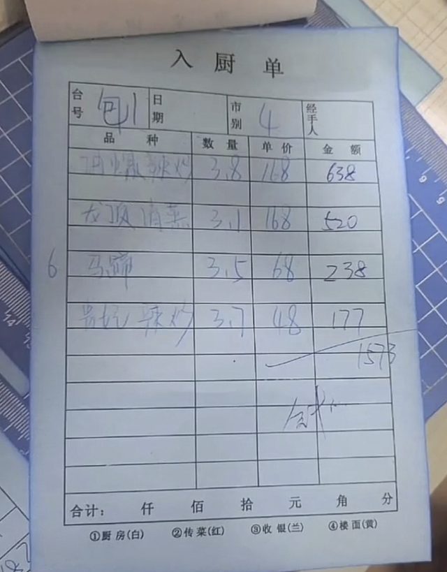
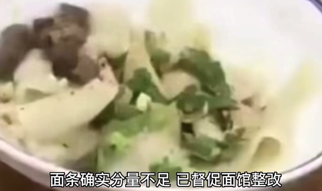

# 4个菜1500元，6根面条20元，“逢节必涨”怎么破？

春节满心欢喜出游，不料却遇到“美食刺客”。

日前，有消费者反映，春节期间在北海一家海鲜饭店用餐，结果4个菜花了1500元，这个价格令消费者“好难受”。

无独有偶，近期网上频频出现消费者“就餐被宰”的新闻，“20元6根面条”、“58元烩菜没有肉”，相关话题一经报道立刻引发网友热议。

每逢传统节日，特别是春节，与百姓生活休戚相关的商品，如交通、旅游等产品，尤其是餐饮，“涨”字总能触动消费者。为何“逢节必涨”？这一怪圈又该如何破？

**消费者遭遇“美食刺客”**

据报道，1月24日，消费者一行4人到广西北海银滩游玩后，被一出租车司机带去“侨港渔村美食”饭店用餐。在消费者表示极少吃海鲜、对海鲜不了解的情况下，店主现场推荐了4样海鲜并当面称重宰杀。点菜单由消费者本人签字确认。

然而消费者在吃完结账时才发现，4个菜居然要1573元。回到住宿的地方，民宿老板表示价格实在太离谱了，消费者觉得心里好难受，“我们那么相信那个司机大哥，不仅钱被骗了，信任感也被骗了”。

_4个菜花了1500元。图/网络视频截图_

上述事件一经报道，迅速引发关注。1月28日凌晨，北海市市场监管局发布对此事的调查处理情况。

根据通报，当事人当天所点的四道菜分别是油螺辣炒、龙趸石斑、马蹄螺和贵妃螺辣炒。其中：油螺辣炒3.8斤，单价168元/斤，金额638元；龙趸石斑（店家标注为“龙顶”）清蒸3.1斤，单价168元/斤，金额520元；马蹄螺3.5斤，单价68元/斤，金额238元；贵妃螺辣炒3.7斤，单价48元/斤，金额177元。

4个海鲜菜品共1573元，加上米饭、纸巾金额14元，实际消费共计1587元，店家实收1500元。

通报显示，该店海鲜池内的海鲜产品全部明码标价，消费者所点的四道海鲜在点菜单上的价格也与海鲜池标注价格一致。经与市内多家同档次餐厅进行价格比对，该店定价基本符合春节期间海鲜餐饮消费价格；经与北海海产品市场当日价格比对，该店四类海鲜产品经加工、烹饪后的价格在合理区间。

针对消费者质疑四道海鲜烹饪后分量不足问题，为确保核查真实，执法人员按照点菜单标注的重量，逐一称斤并复原烹饪菜品。经比对，未发现有海鲜掉包、掺杂掺假等行为。不过油螺加工后可食用部分缩水明显，马蹄螺和贵妃螺经对比也存在份量略少的情况。

此外，监管部门经调查发现，该店家存在支付出租车司机回扣招揽客人、未与消费者充分沟通即匆忙配菜下单、部分海鲜经烹饪后份量略少等问题。

目前已责令该店家停业整顿、限期整改并立案处罚。店家表示将向消费者致歉并退款。对涉事出租车司机，相关部门已责令出租车公司对其进行约谈、罚款和限期停运处罚。

北京市东元律师事务所律师孔磊告诉中国新闻周刊，在上述消费过程中，商家未与消费者充分沟通即匆忙配菜下单，该行为涉嫌利用信息不对称，侵害消费者知情权；而出租车司机未经乘客同意，通过采取回扣的方式，欺骗了乘客，客观上也损害了乘客的知情权。

中国法学会消费者权益保护法研究会副秘书长陈音江向中国新闻周刊指出，涉事餐馆给与司机回扣，还涉嫌商业贿赂，扰乱市场经营秩序，属于不正当竞争。

《中华人民共和国反不正当竞争法》第七条规定：经营者不得采用财物或者其他手段贿赂下列单位或者个人，以谋取交易机会或者竞争优势：（一）交易相对方的工作人员；（二）受交易相对方委托办理相关事务的单位或者个人；（三）利用职权或者影响力影响交易的单位或者个人。

**如何打破“逢节必涨”的怪圈**

游客感觉被宰的事件还发生在同为热门旅游城市的西安。

1月25日，一段游客投诉西安回民街某面馆6根面卖20元的视频引关注。视频中，这名游客正用筷子拨弄着面条，并不满地说道，“这是20块钱的油泼面，连大带小只有6根面。”

26日，事发辖区市场监管所工作人员称，面条确实分量不足，已督促面馆整改，油泼面增加50%的分量，价格明码标价，同时提升服务人员的服务质量。

_6根面条20元。图/网络视频截图_

还有消费者表示，在西安华清宫外的“天下第一面”，点了一碗烩菜，上菜后发现这道58元的菜品内压根没有肉，像是一碗“白菜汤”。属地市场监管部门表示，目前正在调查处理此事。

事实上，“逢节必涨”并不局限于餐饮行业，也出现在酒店住宿、美容美发、家政洗车等服务业。客观上来说，服务业在春节期间涨价，是市场价值规律调节的结果，具有一定的合理性。

从法律层面来讲，我国价格法规定的价格有3种：市场调节价、政府指导价、政府定价。除极少数商品和服务价格实行政府指导价或者政府定价外，大多数商品和服务价格实行市场调节价，这其中就包括属于完全竞争状态的餐饮、住宿、旅游等服务业。

孔磊表示，从经济学角度讲，供求关系决定价格。春节期间，一些热门城市、热门景点游客井喷，这些城市和景点周边，用餐和住宿的需求大幅增加，处于卖方市场，价格必然会上涨。

此外，不少服务业从业者选择在春节返乡回家，这也导致用工成本增加。餐饮行业人士秦伟告诉中国新闻周刊，以餐饮业为例，从过去多年的经验看，春节前后，用工成本上升、阶段性用工短缺等已经成了常态。“尽管大多餐馆为了能留住员工，开出金额不菲的奖励，但大量员工依然选择回家过年”。

云海肴发布的寒假工招募显示，日薪为150元/天，并给出了春节三薪、免费提供工作餐和员工公寓的待遇。

即便涨价有一定的特殊性，但必须正视的是，不少市民对消费市场涨价乱象感到心塞，这也意味着涨价不可任意而为。

陈音江指出，对于服务业来说，涨不涨、涨多少，最理想的情况还是应该交给市场，但不能盲目交给市场，尤其是春节期间。“在明显供不应求的情形下，消费者无法经由行使消费选择权对不合理涨价发挥抑制作用。因此，政府部门应当出面干预，加强监管，引导市场主体诚信经营。”

**化解涨价困局需双管齐下**

在陈音江看来，解决“逢节必涨”困局，需要监管部门和市场主体双向奔赴。

一方面，监管部门应加大监管力度，对不明码标价、坐地起价、串通涨价、虚假宣传等违法违规行为从重从快查处，切实维护好人民群众的切身利益，避免个别不良商家损害城市的形象。

在国新办1月19日的新闻发布会上，市场监管总局价格监督检查和反不正当竞争局负责人陈志江指出，要密切关注酒店、旅游、餐饮行业消费情况，规范景区、餐饮、住宿、娱乐、购物、停车等环节价格秩序。正确区分价格恢复性上涨和乱涨价问题，指导经营者明码标价、收费公示。

1月27日，三亚市海鲜餐饮协会发起倡议，除政府实行限价的78种常规海产品外，其他各类海产品要合理计算成本，控制加价率，建议各餐饮商家针对各类珍稀海产品平均加价率控制在50%以内。

三亚市海鲜餐饮协会秘书长汪裴在回应中国新闻周刊时称，目前三亚海鲜市场加价率基本在50%以内，不过今年春节当地也出现了个别商家加价率超出50%的情况。

据汪裴介绍，近年来三亚针对海鲜餐饮市场实施分级管理。其中78种常规海产品，主要依据政府指导价格：三星级店家依据政府指导价格，四星级店家可自主上调10%价格，五星级店家可以自主定价，“这些商家加价率也是控制在50%以内”，珍稀海鲜店家可以自主定价，但必须明码标价。

除对餐饮商家发出倡议外，协会还建议相关职能部门对供货及采购环节的海产品等价格进行检查。汪裴表示，今年有的供货商价格甚至比往年春节翻了2-3倍。

另一方面，市场主体也需要认识到，节假日适当涨价可以，但不能任性而为。孔磊表示，服务行业内部要提高共识，一时的“宰客”是无法发家致富的，弄砸了口碑，倒霉的是当地的整个服务行业。此外，在涨价的同时还要做好服务，不要让消费者在浓烈的节日气氛中，花了钱还寒了心。

在秦伟看来，在“4个菜1500元”事件中，虽然北海市场监管部门的通报显示商家做到了明码标价，价格也属于合理区间，但服务依旧有优化提升的空间。

“对于海鲜餐馆这种现杀现做的餐饮业态，明码标价通常指的是单品单价，而不是菜品最终的出品价格，尤其对于海鲜并不了解的消费者，往往对最终的价格没有概念。因此，商家应该对消费者给与更多建议，避免最终超出消费心理预期。”

春节涨价，不仅关乎眼前的小账，更关乎长远的大账。陈音江分析道，疫情后，消费迎来回补，但消费信心的恢复仍然需要一个过程，现阶段大幅涨价会伤害消费者的积极性，不利于行业长远发展。

作者：余源

