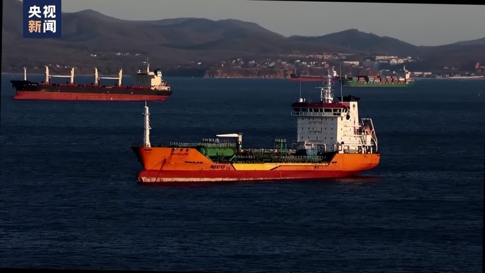

# 七国集团：同意“限价” 俄罗斯警告：2月1日起断供

西方国家对俄罗斯能源的新一轮制裁将于2月5日开始，届时将对包括柴油在内的俄出口成品油实施新的价格上限。彭博社1月28日报道称，欧盟各成员国经协商后同意，将俄柴油出口价格限制在每桶100美元至110美元之间，而这一方案也得到了七国集团的同意。

去年2月俄乌冲突爆发之后，西方国家对俄罗斯实施了多轮制裁。去年12月5日，以美国为首的七国集团、欧盟及澳大利亚开始对俄海运出口原油设置每桶60美元的价格上限。在这一限价机制下，如果以高于每桶60美元的价格运输俄原油，将无法获得由西方保险公司和航运公司提供的海运和保险服务。

不仅如此，这些西方国家还同意今年2月5日开始，针对俄成品油也实施类似的限价令，以进一步限制俄能源收入。限价令将针对俄成品油设定两个价格限制，一个适用于柴油等价格高于原油的产品，另一个则适用于燃料油等价格低于原油的产品。

按照欧盟委员会此前提出的方案，针对俄柴油的价格上限为每桶100美元，针对燃料油的价格上限为每桶45美元。这两个价格上限将从2月5日起生效，但在此前购买并在4月1日前卸载的成品油将获得宽限期。而七国集团则主张，将俄柴油出口价格上限设定在每桶100美元至110美元区间，以避免国际柴油市场出现供应短缺。

从27日开始，欧盟各成员国代表开始就欧盟委员会提出的限价方案展开磋商，各成员国首先需要在欧盟内部达成一致，并且还需要得到七国集团的同意。

而针对西方国家的限价令，俄罗斯此前已出台反制措施，宣布从今年2月1日起，禁止向实施限价令的国家供应石油产品。

**欧洲国家加紧从俄罗斯采购柴油**

随着2月5日针对俄成品油限价令的临近，欧洲各国近来纷纷开始加速采购步伐。数据显示，去年欧盟从俄罗斯购买了大约2.2亿桶柴油，占其柴油进口总量的一半。而今年以来，欧洲国家每天从俄罗斯购买超60万桶柴油，远远高于去年同期的水平。

来源 央视财经

编辑 谢永利

流程编辑 马晓双

