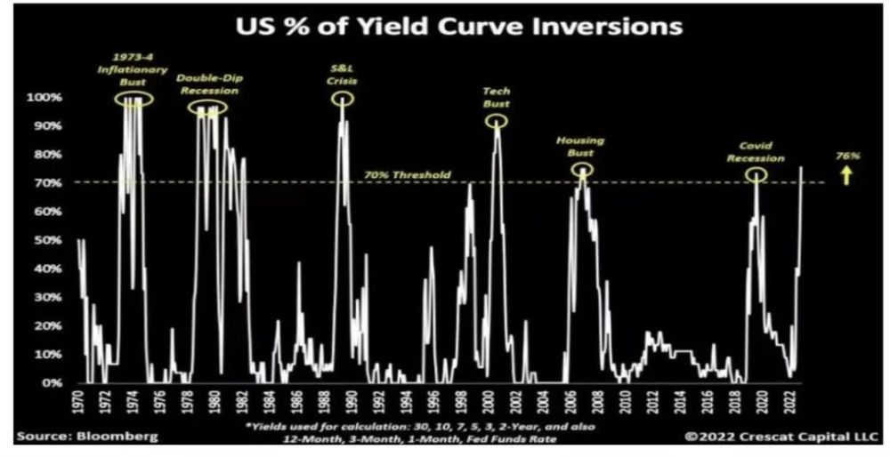
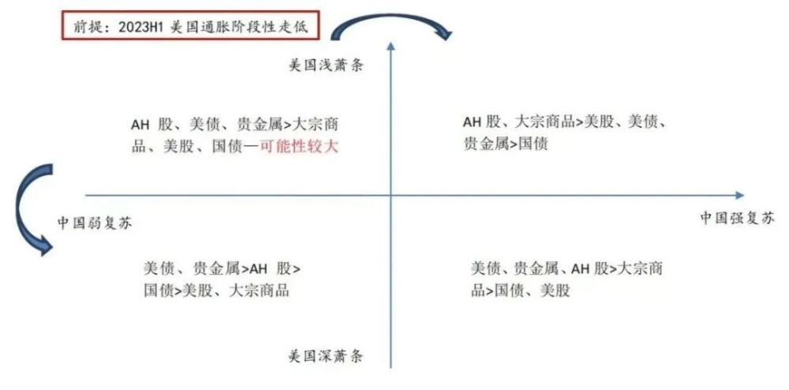

# 中国弱复苏、美国浅衰退：2023年投资展望

· 这是第5018篇原创首发文章 字数 5k+ ·

  * _1_ “投资是对社会经济历史进程的一种反映。我们的投资就像科学实验，首先大胆假设，然后根据实验过程持续性地对我们的假设做出修正，并映射到投资操作中。”
  * _2_ “2022年的底是一个比较夯实的底部。展望2023年，我们认为概率比较大的宏观情境是中国弱复苏、美国浅衰退，中美在经济走势上发生交错。”
  * _3_ “未来不太可能再现以往那种一个转折就推升出巨大牛市、甚至产生泡沫化的情况。如果投资者心平气和去参与，中国经济增长的基本面大概率能够给大家提供一个获得8%～10%的长期年化复合回报的机遇。”

**宏观判断**

投资是对社会经济历史进程的一种反映。我们的投资非常强调自上而下和自下而上的双重逻辑思维，强调大胆假设和小心求证。放眼变局，要跟得上历史发展的趋势节奏，对未来有思想准备和认知预设。

许多人称当下是“百年未有之大变局”。比如2022年的俄乌战争，加速引发了一场全球性的通胀。前几年，美西方世界持续维持大规模货币宽松，叠加通胀高企，带来了美国一波凌厉的加息，以非常快的速度从0利率一直加到4.5%。随之而来的结果，就是整个世界经济很可能将陷入一个很深的调整困难期。

经过2008年次贷危机和2020年疫情危机，美联储两次大规模放水，货币扩张，实际上已经超出、脱离了它的经济实力本身，这对美元的信用冲击巨大。

另外，先进生产力的进步，也没看到有特别大的突破。特斯拉也好，苹果也好，没有多少新的东西。热核聚变的突破也不大。真正能拿得出来，代表未来5～10年带来巨大增值空间的产业和技术突破并没有什么。

还有很重要的一点是，MMT货币理论认为，所有的赤字、所有的货币缺口、所有的供需不足，都可以通过印钞来解决。但这其实是建立在过去十几年中国的生产力和供给大规模增长的前提上的。美国跟中国打贸易战，本身就在破坏这个前提。中国在现有基础上不可能继续扩大自己的供应，而像印度和越南等替代国家，他们的工业化基础和整体潜力明显还不足。

地缘政治问题频发、货币过度发行、科技发展缺少实质性突破、全球化秩序受到破坏，这一切使得接下来的世界可能会在脱钩、全球供应链分化的方向上走得更深。

未来的十年，世界整体的状态也许会回到类似70年代的那种通胀和滞涨中。

有一个值得乐观的情况是，中国仍是世界上最大的产能国，且国内通胀相较于国外还是比较弱的。只要我们在未来通过一带一路、通过RCEP与中亚、海湾包括像俄罗斯等经济互补的国家，做好各方面的供应链合作，我们的通胀是可以管理得比较好的。而主要的滞涨风险，大概率集中在欧洲等发达国家里面。

中国经济经过过去几年的洗礼，有能力也有内在的需求去复苏。不论是消费天然的复苏，还是通过政府各项政策的持续干预，比如像房地产、互联网等，国家会进行一些非常灵活的调整，来驱动经济的复苏。

根据OECD（经合组织）的预测，中国2023年的经济增速可望达到4.6%，我们知道，OECD对中国的预测一直是比较偏悲观的。中国2023经济的潜在增长率，根据人民银行的测算，基本上是在5%～5.5%的水平，达到目标的可能性还是比较大的。

而美国，大概率会走向衰退。为什么？根据研究，历史上当美债各个期限的利率出现倒挂时，比如30年、20年、7年、5年、3年、2年，包括短期债，计算他们互相之间的利差发生倒挂的比例，一般达到70%以后，就会产生非常明确的衰退效应，这个信号被历史屡屡证明。

_美债收益率曲线倒挂——美国走向衰退_

_大类资产配置比较（中国经济复苏—美国走向衰退）_

2023年在中国经济走向复苏、美国经济走向衰退的大判断下，我们用四象限来假设各种可能情况。

第一个可能是中国弱复苏，美国浅衰退。这个也是现在较为主流的预判，美国有可能会出现软着陆。在大类资产配置方面，显然是A/H股、美债和贵金属这些资产有比较好的表现机会，配置价值大于大宗商品、国债和美股等。美股还面临着一个”杀业绩”的潜在压力。

第二个可能是中国强复苏，美国浅衰退。这种情景下，A/H股、大宗商品的投资价值会相对突出。

第三个可能，假如美国出现深衰退，出现一个非常显著的经济衰退，中国则保持弱复苏。那么美债和贵金属的投资价值会显著高于A/H股的投资价值，大于中国国债的投资价值，同时美股和大宗商品可能会受到比较大的冲击。

最后一种情景，中国强复苏，美国深衰退。这种概率我们认为比较小。

综合地来看，我们认为，2023大概率情况是中国弱复苏，美国浅衰退。在中国复苏的情况下，我们会看好A/H股，还看好大宗商品里贵金属、一般工业金属、原油。在美国衰退的预设下，可能会使得大家更多地去配置像美债这样的资产。

接下来，再从中美经济周期的差异来说。过去一年，美国进入了非常强烈的加息周期。实际上在2015/2016年的时候，它也曾经尝试过，但最后没有做到。后来特朗普上台，又进入了继续降息的过程。

而这一次从货币周期来说，美国还是要完成一次持续加息的。所以出现了美债10年债利率终于高过中国10年债利率的情况，而且还高不少。这是过去这么多年都没有出现过的情况，也导致了去年（2022年）不论是经济还是股市，我们都走得比美国要弱一些。

在接下来中强美弱的走势下，美国利率的边际可能会继续往下走，而中国利率的边际可能会稍微往上走。虽然我们认为中国也没有很强烈的通胀压力，但是一个向好的经济是有可能会带动利率边际稍微往上走一点的。

因此我们认为2023年人民币的走势也应该会比较强，并有望获得政策持续驱动。

新一届政府大概率将会以经济发展为首要目标，会在政策托底上做得比较好，而且强调以市场化方式来驱动经济的发展。二十大报告也非常强烈地提出了高质量发展的清晰规划，强调在高科技领域要实现长足发展，政府也持续提出发展数字经济等一系列政策。
**这些清晰的规划有望产生一些更清晰的新的经济增长点。**

**市场估值**

**关于A股**

2022年资本（股票）市场在经历了一轮非常惨痛的调整之后，我们又回到了一个A股比较夯实的底部区域。十几年下来，上证指数还是在3000点中枢位置上下震荡，简单从指数对应的投资回报率角度来说，确实非常令人诟病，但它也实实在在地夯实了我们A股的资产。

经过了去年的持续两波的下跌，现在资本市场的估值分位回到了极低的历史分位。沪深300、上证50最低位的绝对跌幅达到了一半，明显处在一个机会区里边。否极泰来的估值修复可以期待。

**去年全年人民币存款增加26.26万亿元，其中住户存款增加17.84万亿元，这个数字非常吓人。只要有一小部分配置到资本市场来，就可能产生非常好的资本市场持续回报。**

那么再结合今年初始我们看到的，不论是经济内在的自发要求，还是政府的有形之手推动，一系列政策的驱动，都会给经济复苏带来空间。所以关于资本市场今年的机会，我们认为还是比较有信心的。

但与此同时，我们对市场依然保持敬畏，短期内我们认为不太可能再现以往那种一个转折就推升出巨大牛市、甚至产生急速泡沫化的情况。无论是内外部的环境经济、新增长点的突破、全球利率的走势，都不太支持在这个位置产生一波巨大的牛市的机会。

关于当下资本市场中长期投资回报目标的测算，基于中国经济增长的基本面，再看上证50、沪深300整体的PB都还是在净资产附近，基本面推算总体ROE仍有9%～10%的水平。结合十四五规划到2035年人均GDP翻一倍的目标，我们倒推算了一下，人均GDP得按照4.8%左右的年复合增长才能实现这个目标，加上通胀的因素，应该是7%～8%的复合增长水平，而股市ROE在9%～10%。这意味着作为一个长期投资者，未来的资本市场只要大家心平气和地去参与，中国经济增长的基本面大概率能够给大家提供一个获得8%～10%的长期年化复合回报的机遇。

另外我们单独探讨一下港股市场。港股及中概股，纯粹从价值投资、内在价值角度来说有很大吸引力。

**关于港股**

我们对港股投资有一个总结，即港股是A股的基本面加上美股的流动性。换句话说就是它的流动性是跟着海外市场走的，但是它的基本面又是跟着内地市场走的。

在去年它就遇到了海外收缩流动性，且内地基本面弱化的状况，所以出现了明显的双杀，跌出了一个便宜到令人发指的状态。有很多公司，特别是大型国企央企，普遍比内地的A股估值要打三五折，A股很多公司股价也是净资产以内，甚至是0.5～0.6倍PB，但港股可能是0.2～0.3倍的PB。

这些公司的可持续经营能力是没有问题的，再加上分红等因素，对投资者有提供持续回报的能力。那么低估值的重要原因，一个是经济的整体、宏观预期比较差，另外就是流动性问题。在双杀的情况下，定价受到显著压制。

另外有很多创新资产，无论是创新药，还是医疗服务、互联网、新能源车，也跌到了一个非常便宜的水平，甚至很多个股的价格已经跌到了净现金以内的状态。这种投资机会是多年一遇的。当然这段时间市场也已产生了很多修复，未来的投资机会还是需要根据其基本面与具体投资环境的确认来做定价评估。

从长期来看，中国无论是在应对通胀，还是在促进科技创新方面，对比美国，我觉得还是相对有潜力的。就这点而言，我们应该长期看好中国的资产，国际资本也有这样的眼光，这一类极度便宜、打折的资产，应该存在着很多投资机会。

**市场的波动其实就是人心的波动，是对未来的不确定性产生的波动。**
我们不断思考，用什么样的方法在不确定的市场中保持定力，参与到中国的伟大崛起中。我们是坚定的中国国运的信仰者。在中美未来的博弈中，中国是追赶者，我们有强大的驱动力继续去发展，中国人均GDP只有美国的1/5，各个方向的发展都还有很多的空间，就凭这一点，我们应该要有足够的信心。

**重点行业研究及判断**

**数字经济：**

数字产业化未来会随着人工智能等行业的快速发展而发展，数据要素的重要性正在显现。国家对数据产业的发展和安全监管的意愿明确，顶层设计发力，细则大约会在2023年落地，该领域未来将会形成一个很大的蛋糕。

**创新药：**

这个领域会迎来政策压力缓释、行业竞争出清、产业成长增量的多重拐点。不同于2015～2020年第一波创新药浪潮中大量公司开发雷同靶点的情况，经过两年调整，创新药行业中，真正有全球创新能力的公司留存了下来。

随着管线的进展，多个重磅产品有望未来2～3年在国内或者全球上市，一批适应巨大的未被满足的临床需求的FIC（First in
Class，首创药物）乃至全球BIC（Best in class，同类最优）新药即将出现，第二波创新药浪潮初现。

另外，可能不同于大家认知的是，医保经历过去几年的集采，近年实际形成了比较大的结余，未来医保对创新药的支持会比较好地体现出来。当然，我们的企业离成为全球性的大型创新医药企业还有比较长的路要走，这需要耐性。

**贵金属：**

前面谈到，今年中国不管是强复苏还是弱复苏，在美国出现衰退的环境下，周期是一个非常重要的投资方向。美国在过去一年多的时间里，下跌修正也非常充分。

美国的实际利率已经接近历史高位，在美债各期限利率、收益率极限倒挂的情况下，海外衰退预期在升温。加息周期已到尾声，流动性会边际改善，美元指数也过了峰值，贵金属的价格有望上升。我们这个判断在去年四季度已经基本形成。

**工业金属和原油：**

全球PMI（经理人采购指数）在全球央行的货币政策转向之前是难言见底的，但中国经济的回升会给其带来一定推动作用。中间这个过程现在还没有确定是否见底，而由中国需求因素带动的黑色系金属可能会阶段性跑赢有色金属，如铜和原油的机会。

我们可以再做一些观察，但是确实需要等海外的衰退先确凿地实现。下一轮经济刺激出现的前后，新的投资机会就会出现，在时间上目前不能太着急。

**化工新材料：**

这个领域总体来说也是跟着PMI走的，所以我们会加大对一些底部利润扎实、有显著增量的大化工企业的关注。另外，一些细分高壁垒行业、有显著增量的新材料公司也值得关注。

**基建及一带一路：**

国家去年年初提出把稳增长作为投资的主要基调和抓手，全年看下来，在基建方面的投入还是非常明确的，基建企业的状态整体也非常好。另外，一带一路的互利共赢政策无论是作为新的经济增长点还是在地缘政治方面的影响都举足轻重。基建板块在过去两年虽有向上姿态但并没有充分兑现价值，作为绝对回报的一个方向，值得重视。

**军工：**

它在未来不确定的全球环境里是一个重要的对冲配置方向。首先是它的行业高景气；第二，军工企业本身的激励制度有明显的改善，在公司治理、业绩兑现方面，我们相信未来会有更好的表现。

**电力新能源：**

对整个生产制造的环节包括上游硅料到组件，我们保持相对谨慎的态度。因为上游硅料价格的下跌会带来整个销售价格的明显下跌。从行业营收上看，尽管有可能会带来量的增长，但在整体收入和盈利方面，表现可能会差一些。由于整个制造环节的大规模产能投放，我认为供需格局的恶化会导致利益向下游转移。我们关注包括新能源电源建设、电价的市场化也会带来一些投资的机会。

**新能源汽车：**

刚好最近特斯拉进一步降价，搅了一个很大的局，可以看到行业可能也会面临一些阶段性的整合和内部竞争，这会促进强者愈强的状态，同时对造车新势力形成比较大的压力。因此，我们相对看好龙头企业，特别看好其中新能源车出口的机遇。以我们在新能源车这个行业现在的沉淀，未来一定会大放异彩。

**房地产：**

这也是2022年给大家带来非常大预期差的板块，年底的时候有很多房地产企业的股价年度回报已经回正。我们看到稳定经济需要稳定的房地产政策的支持，特别是需求侧应该还会持续地去发力，未来强者愈强的情况也会出现，特别是那些2022年有能力维持比较正常的运营、尤其是能够以低价在中心城市拿地的企业，可能会出现一些机会。但是，我们认为房地产整个行业的长周期增长已经见顶，行业总体性投资机会已经不太突出。

**应对策略**

**第一还是“价值锚定”。**

选择有基本面支撑的优秀公司，以追求长期回报的方式尽量熨平过程中的风险波动，最终靠国家的经济增长，靠企业发展带来的价值创造获得长期的投资回报。

我们选择两大类方向资产。一类是经营稳健、估值合理的龙头价值型企业，他们有能力真正获得整个行业发展的红利，坐享所在行业统一后的头部利润。另一类，我们不断挖掘能力突出、发展空间巨大的成长型公司，并愿意为这种成长性付出适当的溢价。

**第二是 “顺势而为”。**

从底部开始挖掘、提早介入，跟踪它的右侧改善上行机会并加大参与力度，在市场快速轮动和极度分化中适当地把握节奏而非教条性地穿越牛熊，在把握资产内在价值的前提下有效提高组合的风险收益比。

**第三是“灵活管理”。**

总的来说就是胜不骄、败不馁，保持清醒的定力。在做到“价值锚定、顺势而为”的前提下，应对市场大的调整时还要对仓位管理保持一定的主动性和警惕感。

最后还要说明一下，入市有风险，投资需谨慎。以上看法仅供交流，不构成任何投资建议。

作者：CFA，清华大学生物系学士、金融硕士，曾在中国人民银行、大鹏证券和香港西京投资等机构任职，2005年加盟深圳市红筹投资有限公司，现任红筹投资总经理兼投资总监。

「 图片 | 视觉中国 」

