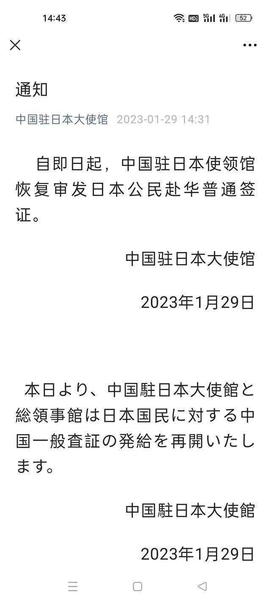

# 中国驻日使领馆恢复日本公民赴华普通签证审发！日韩入境政策如何调整

在传统的春节旺季没有等来中国游客，日本与韩国的入境防控政策出现新变化。

其中，
**日本政府已在27日召开的新冠对策本部会议上，正式宣布将自5月8日起把新冠病毒在《感染症法》上的定位，即“2类”下调为与季节性流感同级的“5类”，也就是危险度最低级别。**
值得注意的是，日本内阁官房长官松野此前在记者会上已表示， **随着下调新冠感染等级，入境措施也会重新做出调整。**

**中国驻日大使馆29日最新消息显示，自即日起，中国驻日本使领馆恢复审发日本公民赴华普通签证。**

而同一天， **韩国中央灾难安全对策本部表示，将延长针对中国公民的暂停签发赴韩短期签证措施至2月28日。**
对于延期的理由，据韩媒报道，韩中央灾难安全对策本部表示，韩国境内防疫防控形势向好，但不能完全排除春节之后海外输入性确诊病例导致疫情再次扩散的可能性。

针对此前日韩的入境限制，1月9日，外交部发言人汪文斌表示，中方发布新冠病毒感染“乙类乙管”总体方案和中外人员往来暂行措施之后，多国表态予以欢迎，但也有少数国家宣布对来自中国的旅客采取入境限制措施。对此，中方以最大的诚意，本着实事求是的态度，与有关国家进行了充分沟通，详细介绍了中方优化调整防疫措施的科学性、合理性和当前中国国内的疫情形势。汪文斌指出，但令人遗憾的是，少数国家罔顾科学和事实，仍执意针对中国采取歧视性入境限制措施，对此中方坚决反对，并将采取对等措施。我们再次呼吁各方从事实出发，科学适度制定防疫措施，避免将防疫政治化。

日本入境政策调整如何跟上？

按照日本的传染病法，根据症状分类与采取措施等不同，传染病症被分为五类。第一财经查阅相关信息显示，第一类为埃博拉等；第二类为结核、SARS、新冠等；第三类为霍乱等；第四类为狂犬病等；第五类则为季节性流感等。在日本，要改变新冠病毒的传染病等级，须在听取专家意见的基础上，国会通过修改传染病法相关规定的议案。

此次新冠应对等级下调后，日本社会将出现诸多变化。比如，无需在指定地点隔离或者疗养；室内无需佩戴口罩；检测、疫苗、治疗等费用由此前的日本政府买单转为个人支付等。目前，由日本的百货公司、超市、便利店、餐饮机构等组成的12个行业协会正在考虑修改此前在餐饮、购物方面的防疫规则。

值得注意的是，由新冠应对等级下调而带来的诸多改变也将影响日本的边境口岸防疫政策。日本已在2022年3月恢复了外国人新入境。但自今年1月8日起，日本政府加强以中国入境者为对象的新冠病毒口岸管理，比如在机场落地后进行准确度更高的核酸检测或抗原定量检测、要求提供72小时内的核酸阴性证明、呼吁航空公司不要增加中日间航班数量等。而一旦被检测出阳性，将被安排在指定地点隔离5日。

鉴于日本政府在5月8日下调新冠防疫等级，多位在日华人均告诉第一财经，目前大家都在观望，5月8日后日本政府的种种限制是否会失效，以及届时往来中日间的航班数量将如何跟上。

1月27日，日本出入国在留管理厅发布的最新数据显示，2022年新入境的外国人为420万，与2021年（35万人）相比上升显著，但依旧不及2019年的3119万人。

细分入境种类来看，留学及部分就业相关在留资格入境人数超过了新冠疫情前的2019年的水平。但以旅游为目的入境日本的短期访客数为286万，虽然明显好于去年水平，但疫情前2019年数据为2781万。

就入境日本的国家和地区来看，韩国约为95万人，位居第一，其次为美国等。2019年在总入境日本外国人数中占比近3成的中国大陆此次排在第7位，仅为15万人左右。

韩国要在今年开启“旅游大国”元年

据韩联社报道，韩国文化体育观光部（下称“文体部”）计划在旅游业投入约1.23万亿韩元（约合人民币67亿元），将2023年作为“旅游大国元年”，力争到2027年吸引3000万人次外来游客赴韩，实现300亿美元旅游收入的目标。

为此，韩国文体部表示，正在积极将文化与旅游相结合，比如推动青瓦台一带的历史、文化、旅游资源全面融合，建成旅游产业集群，开发面向国内外游客的特色旅游商品等。

对于韩国这一计划，韩国留学生小郝告诉第一财经，在不对中国游客打开大门的情况下，这一目标能否实现，还有待观望。

2019年，韩国放宽了针对中国多群体的签证条件。韩国观光公社的统计显示，当年赴韩中国游客数量创新高，几近600万，与2018年相比增长了近30%，占当年外国人赴韩总数的1/3左右。而疫情以来，包括中国游客在内的赴韩外国游客数量断崖式下降，韩国旅游业随即“速冻”。去年，赴韩中国游客人数已锐减到17万左右。

在中国调整疫情防控政策后，不少韩国旅行社就已经着手重组处理中国旅游的团队，希望借中国游客的回归重振萧条的旅游业。“但韩国政府针对中国游客的限制，对这些旅游业商家来说无疑浇了盆冷水。”小郝说道。韩媒也提到，在中国出境游迎来高峰之际，韩国此次没有挤进中国游客海外十大热门目的地。

