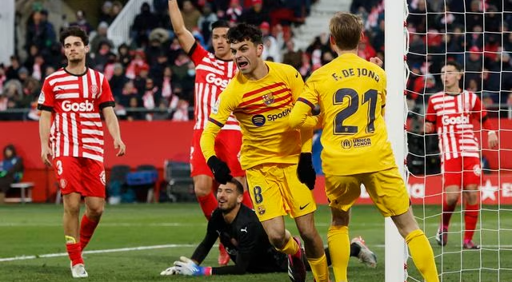
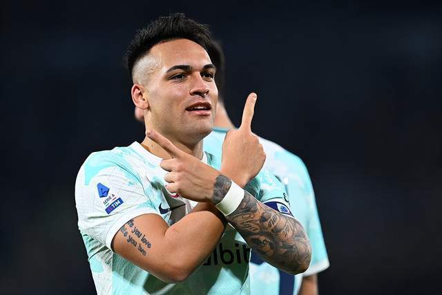

# 体育早知道｜恩比德轰47＋18KO约基奇 孙兴慜梅开二度

编者按：据著名记者罗马诺报道，巴黎圣日耳曼已经与国米中卫什克里尼亚尔达成协议。豪门之夜曼联、巴萨、国米纷纷取胜，拜仁遭遇3连平。NBA常规赛，恩比德轰出47+18+5！

早间必读

据著名记者罗马诺报道，巴黎圣日耳曼已经与国米中卫什克里尼亚尔达成协议，他将在今年夏天免签加盟大巴黎！

欧洲足坛上演多场精彩较量。曼联、巴萨、国米纷纷取胜，拜仁遭遇3连平，劳塔罗、孙兴慜则是梅开二度。

据名记Woj报道，中锋迈尔斯-
特纳和步行者达成了一份2年6000万美元的续约协议，其中，还包括给本赛季（2022-23赛季）加薪1710万美元的条款。他的经纪人奥斯汀-
布朗已经确认了这一消息。

足球战报

英格兰足总杯第4轮，曼联主场3-1淘汰英冠球队雷丁，成功晋级。拉什福德进球被吹，卡塞米罗梅开二度，安东尼助攻，弗雷德传射。

西甲第19轮中，巴萨客场1-0小胜赫罗纳，联赛三连胜后继续领跑，领先少赛1场的皇马6分。佩德里百场里程碑进球，近4场打入3球，登贝莱伤退，伊万-
马丁终场前错失必进球良机。

意甲第20轮，国米客场2-1击败克雷莫内塞，在上轮落败后做出反弹。奥科雷克帮助克雷莫内塞先拔头筹，佩戴队长袖标的劳塔罗梅开二度帮助国米反败为胜，同时劳塔罗也成为国米史上第3位至少四个赛季联赛进球10+的外籍球员。

德甲联赛第18轮拜仁主场迎战法兰克福的比赛，上半场萨内扫射破门先下一城，下半场穆阿尼推射扳平比分，最终拜仁1-1法兰克福遭遇联赛三连平。

足球早报

在对阵赫罗纳一战，状态爆棚的登贝莱早早因伤退场，这是他14个月以来第一次受伤。

曼联在足总杯第4轮3-1淘汰雷丁，巴西国脚安东尼送出加盟以来的第一次助攻，在一定程度上缓解了自己的压力。

利雅得胜利的主帅鲁迪-加西亚在采访时表示，C罗不会在沙特退役，他未来还会回到欧洲的。

意甲第20轮继续进行，卫冕冠军国米客场2-1逆转副班长克雷莫内塞。这一场比赛，劳塔罗的表现如有神助，他上演梅开二度好戏，帮助国米2-1实现逆转。世界杯回来后，劳塔罗强势复苏，最近7场比赛收获6球。

篮球早报

NBA常规赛继续进行。一场焦点之战中，76人队主场以126:119击败掘金队，取得了7连胜！

据美媒报道，孟菲斯灰熊的主场统计员涉嫌造假小杰克逊的防守数据，球迷曝光了多项证据。在主场比赛时，一些队友的数据被记入小杰克逊的名下。据悉，小杰克逊的客场和主场防守数据相差悬殊。

NBA常规赛继续进行。据名记Woj报道，篮网队正积极寻找机会补强球队前场深度。同时，伊巴卡和里德很有可能成为篮网队的补强目标人选。

Hoopshype名记Michael
Scotto采访多位高管，谈到了湖人换来八村垒的这笔交易。一方面，八村垒提供了一些前场保障，但另一方面，他的到来也意味着湖人休赛期得到明星球员的可能性大幅下降。

热火被罚款的原因是，本周三巴勒特因伤缺席了对阵凯尔特人的比赛，但他此前并未出现在伤病报告中。时隔43天，热火因为同样的原因吃到联盟罚单。

杜兰特在节目中直言詹姆斯是个得分手，传球优先是对他的贬低，还盛赞詹姆斯是运动员们的标杆；杜兰特发推为八村垒鸣不平而回应奥尼尔；另外NBA匿名高管表示八村垒或阻碍湖人追求欧文这样的明星。

综合早报

2023年世界羽联巡回赛超级500印尼大师赛结束了半决赛争夺，在五个单项角逐中，国羽顺利进入了男双、女双以及混双决赛，其中混双更是实现了会师，提前包揽了冠亚军。而男单和女单比赛中，国羽出战的石宇奇、王祉怡以及韩悦，全部输球出局，国羽新赛季连续三站大赛男女单打均无缘决赛。

在美国阿斯彭进行的2023年冬季极限运动会，结束了单板女子超级池争夺，中国选手蔡雪桐给出高水准发挥，最后获得第三名。韩国14岁小将Gaon
Choi获得冠军，成为冬季极限运动会该项目最年轻的冠军选手。

重要赛事预告

06:30 NBA常规赛 尼克斯VS篮网

08:00 NBA常规赛 火箭VS活塞

08:00 NBA常规赛 公牛VS魔术

09:30 NBA常规赛 快船VS老鹰

09:00 NBA常规赛 国王VS森林狼

09:00 NBA常规赛 奇才VS鹈鹕

09:00 NBA常规赛 太阳VS马刺

09:30 NBA常规赛 湖人VS凯尔特人

10:00 NBA常规赛 独行侠VS爵士

11:00 NBA常规赛 猛龙VS开拓者

19:30 意甲第20轮 AC米兰VS萨索诺

21:30 足总杯第4轮 布莱顿VS利物浦

22:00 意甲第29轮 尤文图斯VS蒙扎

22:30 德甲第18轮 沙尔克04VS科隆

次日

00:30 德甲第18轮 沃库森VS多特

02:00 NBA常规赛 热火VS黄蜂

03:45 法甲第20轮 巴黎VS兰斯

04:00 西甲第19轮 皇马VS皇家社会

