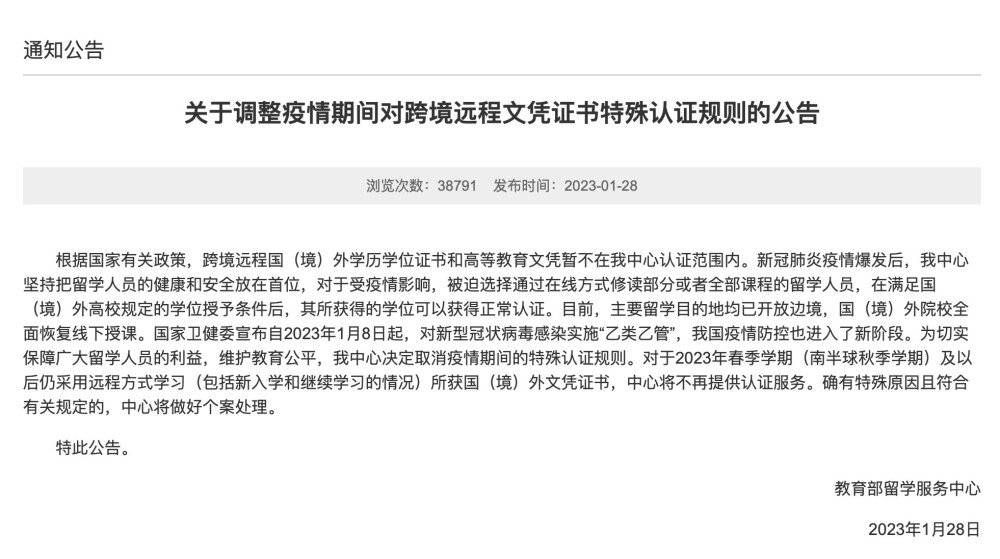

# 教育部留学服务中心：2023年起不再为跨境远程文凭证书提供认证

教育部留学服务中心1月28日发布通告称，根据国家有关政策，跨境远程国（境）外学历学位证书和高等教育文凭暂不在该中心认证范围内。

新冠肺炎疫情爆发后，教育部留学服务中心对于受疫情影响，被迫选择通过在线方式修读部分或者全部课程的留学人员，在满足国（境）外高校规定的学位授予条件后，其所获得的学位可以获得正常认证。目前，主要留学目的地均已开放边境，国（境）外院校全面恢复线下授课。为切实保障广大留学人员的利益，维护教育公平，教育部留学服务中心决定取消疫情期间的特殊认证规则。对于2023年春季学期（南半球秋季学期）及以后仍采用远程方式学习（包括新入学和继续学习的情况）所获国（境）外文凭证书，中心将不再提供认证服务。确有特殊原因且符合有关规定的，中心将做好个案处理。

**《关于调整疫情期间对跨境远程文凭证书特殊认证规则的公告》解读问答**

一、《关于调整疫情期间对跨境远程文凭证书特殊认证规则的公告》（以下简称“《公告》”）中的2023年春季学期（南半球秋季学期）有具体的时间要求吗？

由于各国各校学期设置差异较大，2023年春季学期（南半球秋季学期）泛指2023年各国各校上半年开学的第一个学期。不管是已开学还是尚未开学的国家和院校，学生都应尽快返校学习。

二、如境外院校仍然允许通过在线学习模式完成余下课程，是否必须出境才能获得认证？

依据《国（境）外学历学位认证办法》，通过跨境远程学习方式获得的国（境）外学历学位证书和高等教育文凭不在认证范围。《公告》发布后，在2023年春季学期（南半球秋季学期）及以后仍然采用跨境在线方式学习（包括新入学和继续学习的情况）获颁的文凭证书，将不能获得认证。

三、如有特殊情况，无法及时返校学习怎么办？

对于有特殊情况，因客观原因无法在2023年春季学期（南半球秋季学期）返校的留学人员，须留存好与此相关的书面证明材料，并在获颁文凭证书后，提交认证申请时一并提供。我中心将结合具体情形，完成对相关文凭证书的个案评估。

四、如《公告》发布时，学生已学完全部学位课程，还需要出境完成论文撰写才能通过认证吗？

攻读课程型学位（以修读课程为主）的申请人，按照颁证院校的相关要求继续完成学业即可。攻读研究型学位（以开展研究和撰写论文为主）的申请人，2023年春季学期（南半球秋季学期）及以后，应赴留学国别（地区）完成学习和研究。

