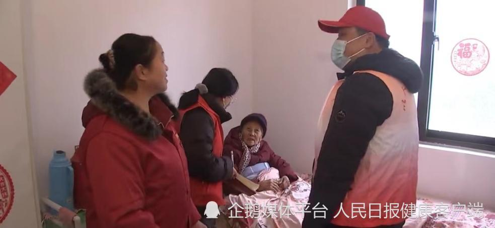

# 春节感染高峰没来，XBB.1.5会引发下一波疫情高峰吗？专家回应

**人民日报健康客户端记者 杨晓露**

“春节假期结束了，还好第二波疫情高峰没有来。”1月28日，刚从老家返回北京的晓阳（化名）对人民日报健康客户端记者说，“过年这几天，家里景区、公园都人满为患，而且很多人都不戴口罩了，也没听说谁家有人又感染了新冠。”

_春节期间，安徽合肥某农村社区工作人员探望新冠康复的村民，了解需求。合肥新闻联播截图。_

1月28日，山西、广西、贵州、河南、陕西等多地村医对人民日报健康客户端表示，“基本没有新增”“年三十到今天都没有新增病例”。

北京佑安医院呼吸与感染性疾病科主任医师李侗曾在接受人民日报健康客户端记者采访时表示，春节期间没有出现疫情高峰是因为节前多数易感人群已经感染了新冠病毒，获得了感染后的免疫，短时间内确实不会再感染。

1月21日，中国疾控中心流行病学首席专家吴尊友在个人社交媒体上发文指出，优化防控方案后，新冠疫情在全国范围内出现了快速传播流行。目前，全国总体已经度过了疫情发病的高峰期，全国大、中、小城市及县城基本都处在疫情回落阶段。春节期间的大量人员流动，虽然在一定程度上可能会促进疫情扩散，在局部地区会出现感染人数上升，但由于这一波疫情已经使得全国约80%的人感染过，短期内，比如未来2-3个月，全国范围内出现较大规模疫情反弹或者第二波疫情的可能性很小。

不过李侗曾指出，3到6个月后，大家的保护水平会下降，感染风险也会增加。尤其是如果病毒继续变异，免疫逃逸能力增加，再出现新冠感染高峰的风险也会增加，但是不会像去年年底这么严重。

近日，奥密克戎变异株XBB.1.5正在美国引发疫情高峰。截至1月28日当周，奥密克戎毒株亚型XBB.1.5占美国新冠病例总数的61.3%。

XBB.1.5是否会引发我国下一轮疫情高峰？李侗曾介绍，XBB.1.5在美国再次流行也说明病毒变异后，再感染的风险会增加。我国人群感染后形成的免疫屏障，在短时间内对XBB系列的毒株也有交叉保护，但是随着时间延长，对变异病毒尤其是免疫逃逸能力比较强的重组变异病毒的保护力下降会更明显，再感染风险也会增加。

