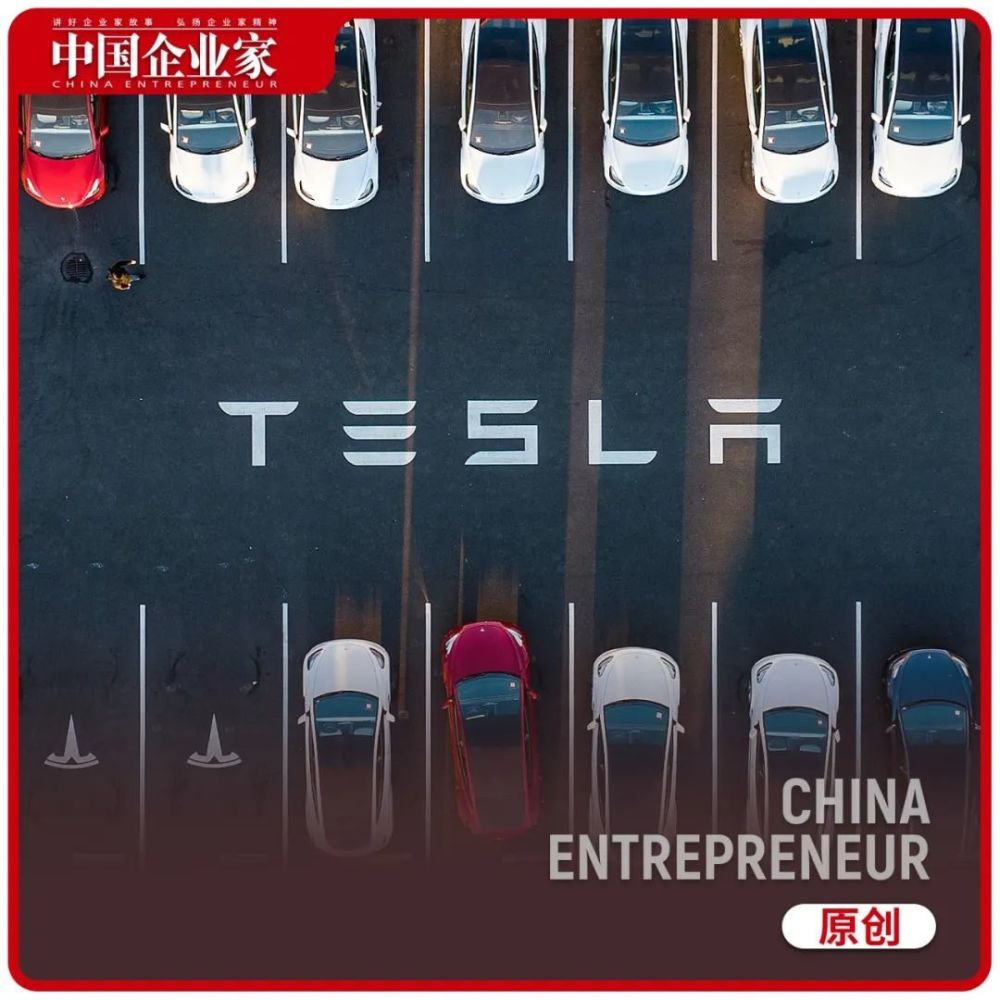
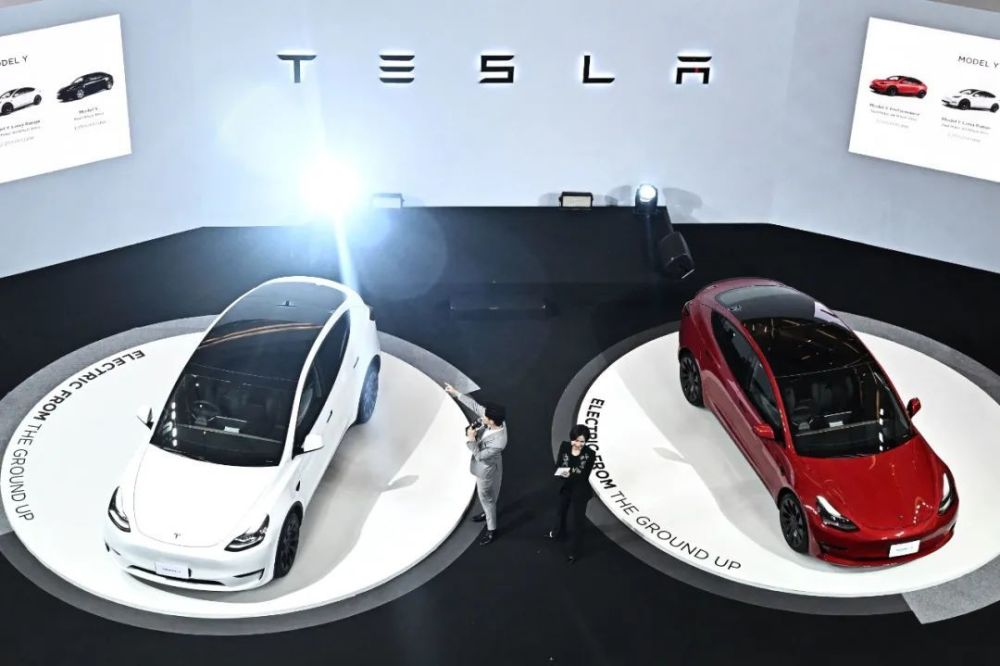

# 特斯拉“史上最好一年”，马斯克凭什么如此赚钱

**文｜《中国企业家》记者 魏帅 编辑｜马吉英**

近期，马斯克心情应该不错。

美东时间1月27日（周五）美股收盘，特斯拉股价涨幅11%，报收177.90美元/股，当日市值上涨约567亿美元，约合人民币3800亿元。在当周，特斯拉创下公司2013年5月以来最大单周涨幅，股价累计大涨33%。

有观点认为，特斯拉股价此轮反弹或与美股大盘走势相吻合，另一方面，其公布的2022年全年财报数据也让投资者信心增强。

1月26日，特斯拉发布2022年财报数据显示，2022财年特斯拉实现总营收814.62亿美元，同比增长51%；毛利润为208.53亿美元，同比增长53%；总毛利率为25.6%，相比去年微增0.3%。

交付量方面，四季度特斯拉交付量约为40.5万辆；全年新车交付量为131.38万辆，均创下交付量新高。

在财报电话会上，特斯拉CEO马斯克毫不掩饰地表示，“在各个层面上，这都是我们有史以来最好的一年。”

**虽然财务指标看上去不错，但特斯拉的成绩单仍算不上满分。** 毛利率的下跌与交付目标未达成，是特斯拉的减分项。

四季度财报数据中，特斯拉的汽车毛利率由2022年一季度的32.9%，降至25.9%；全年新车交付量也未达到原计划的150万辆。

马斯克认为，特斯拉的管理团队最关注营业利润率是多少。2017年~2022年，特斯拉的营业利润率从大约-14%提高到17%。

2022年，特斯拉除汽车业务外，诸如储能业务的重要性和营收占比出现了明显提升；备受关注的软件业务也在昭示着特斯拉未来的盈利能力。

但前提是，特斯拉能卖出更多的车。

过去的2022年，比亚迪超越特斯拉，成为2022年全球新能源汽车销量冠军。美林证券2022年发布的一份汽车研究报告显示，特斯拉在美国电动车市场的份额将可能从2021年的70%骤降至2025年的11%。

在2023年乃至更远的将来，特斯拉还会是那个全球最赚钱的新能源车企吗？

不仅仅靠卖车赚钱

2022年财务数据，印证了特斯拉不仅仅是一家电动汽车公司。

相比于公司总体业务收入50%的增长，特斯拉能源业务营收达到13亿美元，同比增长90%，布局储能业务的重要性开始凸显。

数据显示，第四季度特斯拉储能业务已经部署至2.5463GWh，同比增长152%，布局持续加速。“虽然在发展这项业务和改善成本方面还有很多工作要做，但相信我们走上了正轨。”马斯克表示。

在马斯克的构想中，可持续绿色未来的三大支柱分别为电动汽车、太阳能/风能、固定储能。目前，Megapack(特斯拉最大的固定式储能系统)产能增幅已经超越了汽车产能增幅。

Megapack是特斯拉储能业务中的重要模块，是适用于大型企业和公共事业单位的储能产品。

**在财报中，特斯拉表示市场对于储能产品的需要超过其供应能力，位于加州的专用工厂正在提高产量。**

据咨询机构麦肯锡预测，长时储能的潜在市场空间将从2025年开始大规模增长。

另一件对于特斯拉来说颇具意义的事，是其FSD（full self-
drive，完全自动驾驶）在北美的全量推送。在马斯克看来，可实现自动驾驶的汽车，价值远高于非自动驾驶汽车。

2022年第四季度，FSD为特斯拉带来3.24亿美元收入。马斯克还在财报电话会议中透露，除高速以外，FSD的总行驶里程达到1亿英里（约合1.6亿公里）。

此前，由于特斯拉并不在财报中披露FSD的收入体量，外界并没有公开透明的途径获得相关信息。2020年一季度，特斯拉CFO Zachary
Kirkhorn首次公开了软件“递延收入”的概念，并对FSD收入的财务确认规则进行了详细介绍。

当消费者选择激活FSD套件后，特斯拉会获得6000美元（现已上涨至8000美元）的现金，公司会将其中一半确认为当期收入，另一半则记为递延收入；后续收入的确认规则为，当特斯拉在FSD中新增加一项功能，就可将递延收入余额部分转换为当期收入。

截至2022年四季度，特斯拉目前账上短期递延收益还有17亿美元。 **根据特斯拉披露的消息显示，FSD所实现的递延收入部分的毛利率高达90%。**

如此高的毛利率意味着，卖车只是开始，软件服务收费才是特斯拉未来最核心的商业模式。

成本控制是基本盘

当行业内的新能源汽车企业仍在亏损时，特斯拉在2022年实现了137亿美元的营业利润，营业利润率达16.8%。强悍的成本控制能力，被行业内视为特斯拉取得利润以及发展的基本盘。

**在马斯克看来，营业利润率的增长归功于引入更低成本车型、增建更高效的本土化工厂、降低车辆成本和经营杠杆等因素。**

此前，马斯克曾数次表示，特斯拉真正的竞争优势，也是其他公司最难复制的，就是拥有先进的生产制造技术。

过去，特斯拉在不断降低生产成本。2020年9月，特斯拉电池日上，马斯克宣布Model
Y将通过一系列一体化压铸技术，将原来通过零部件冲压、焊接的总成一次压铸成型。天风证券一份关于特斯拉的研究报告显示，一体式压铸地板后总成可减少零部件79个，制造成本直接降低40%。

本土化生产则进一步强化了特斯拉的成本控制能力。从2019年宣布建设，仅用10个月时间，特斯拉上海超级工厂即建成投产。国产化之后，在包括流水线改造等一系列降本措施之下，加之中国较低的产业工人成本、物流成本等，特斯拉上海工厂以极高的成本效率，供应着除北美市场外的全球大部分市场。

而在核心零部件方面，特斯拉所坚持的电池自研于近期取得新进展。特斯拉在其社交平台账号和财报中，均声明4680大型圆柱电池的量产，取得了重大突破。目前位于美国加州的弗里蒙特工厂每周的电池产能已经能够支持1000辆Model
Y装车，接下来可能会迎来批量化生产装机。

马斯克曾在2022年三季度财报电话会表示，4680电池相比上一代的2170电池能量密度提升了5倍，续航里程提升了16%，输出功率提升了6倍，并且成本降低了14%。如若结合材料与车辆设计的改进，单纯的生产成本最高可降低54%。

除此之外，财报中还提到， **2022年特斯拉的利润中，有很大部分来自二手车和特斯拉车队扩增的支持性交易，比如配件销售、付费超级充电等等。**

截至2022年年底，特斯拉在中国大陆地区开放使用的超级充电站数量已突破1500座，超级充电桩数量超10000个。

光环能维持多久

无论是软件实力带来的更高毛利收入，还是近乎严苛的成本控制动作，似乎都在成为特斯拉降价的“本钱”。

今年1月，特斯拉宣布降价，在不少老车主看来，单刀直入的降价，历来是特斯拉证明存在感的方式。而这种毫无预兆的降价方式，也直接引发了国内多地车主的维权活动，不少车主聚集在体验店内要求补偿，甚至做出一些激烈举动。

对此马斯克解释称， **近期全球范围内大幅降价的举措，是为了缓解投资者对于严峻经济环境下需求减弱的担忧。**

在2022年的财报中，马斯克坦言，对于普通消费者，汽车售价起着关键作用。这也是今年年初特斯拉降价的关键因素。“我认为有很多人想买特斯拉汽车，但买不起。所以这些价格变化对普通消费者来说确实有影响。”

此前，马斯克在推特空间的交流活动中表示， **在经济衰退之时，增加销量、调低价格，在不把公司置于危险境地的情况下，尽可能快地增长。**

过去的五年内，特斯拉的电动车平均售价总体呈现下降趋势。 **2017年至2022年间，特斯拉电动车平均售价已减半。**

在分析人士看来，降价是特斯拉销量趋于疲软的一个迹象。美国投资研究机构Bernstein表示，特斯拉2022年在中国和美国市场的促销降价，意味着特斯拉可能存在需求问题。

据《中国企业家》统计，2022年特斯拉的降价举动共有两次，年内降价力度最高达5万元。即便如此，数据显示，2022年特斯拉新车生产量超出交付量近6万辆。

在电话会议上马斯克也提及了今年交付预期。 **特斯拉2023年预计交付180万辆新车，最多可能交付200万辆汽车。**
在与分析人士进行的网络直播中，马斯克透露，今年1月迄今，特斯拉接到的订单数量创有史以来同期最高水平。“1月份迄今为止，我们已经看到了有史以来最强劲的订单。我们目前看到的订单几乎是生产速度的两倍。”

但是，180万辆的交付量目标，并未达到特斯拉过去对于交付量设定的每年50%增长目标，180万辆意味着40%左右的增长，与2022年的增速持平。

标准普尔全球移动公司认为，虽然特斯拉目前仍是美国最畅销的电动汽车品牌，但竞争对手推出越来越多更实惠的车型，特斯拉在电动车市场的主导地位正在被削弱。

以中国市场为例，据乘联会数据，特斯拉在中国市场的主要对手比亚迪市场份额从2021年的19.5%上升至31.7%，同期特斯拉市场份额从10.7%降至7.8%。

资本市场则在去年就感受到了“寒意”。2022年，特斯拉年内股价跌幅65%，市值缩水超过7000亿美元。

更重要的是，特斯拉自动驾驶再次遭受严重质疑。据路透社1月18日报道，特斯拉自动驾驶软件总监Ashok
Elluswamy在一段证词中承认，2016年特斯拉用来宣传其自动驾驶技术的一段视频是伪造的，视频中的汽车根本不是在自动驾驶。为了制作这段视频，特斯拉在预定的路线上使用3D地图进行导航。此外，在演示过程中，人类司机也进行了干预，同时出现了车辆撞到围栏上的情况。

特斯拉的市场表现，或许会因这一质疑而蒙上一层阴影。“我对于特斯拉最大的认可就是来源于自动驾驶等软件实力。”一位特斯拉车主表示，“以后我不会再买特斯拉了，我需要为我家人的安全负责。”

回归产品本身，特斯拉也已经近三年没有发布新车型，目前主力车型依旧是Model 3和Model
Y。新车Cybertruck的量产时间一再被推后，据特斯拉官方表示，Cybertruck“将在今年晚些时候开始生产”。

在特斯拉的财报中，特斯拉重申已经为短期的不确定性做好了准备，包括专注于自动驾驶、电气化和能源解决方案等。

未来，特斯拉要做的，便是在诸多不确定性中，增加马斯克宏大梦想的确定性。

图片来源｜视觉中国

