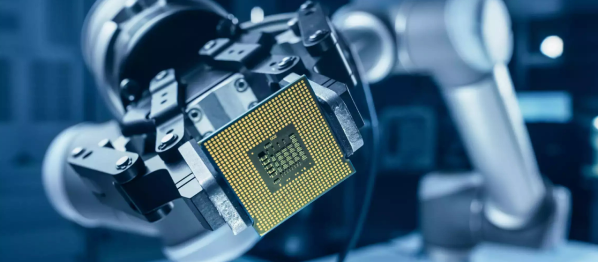
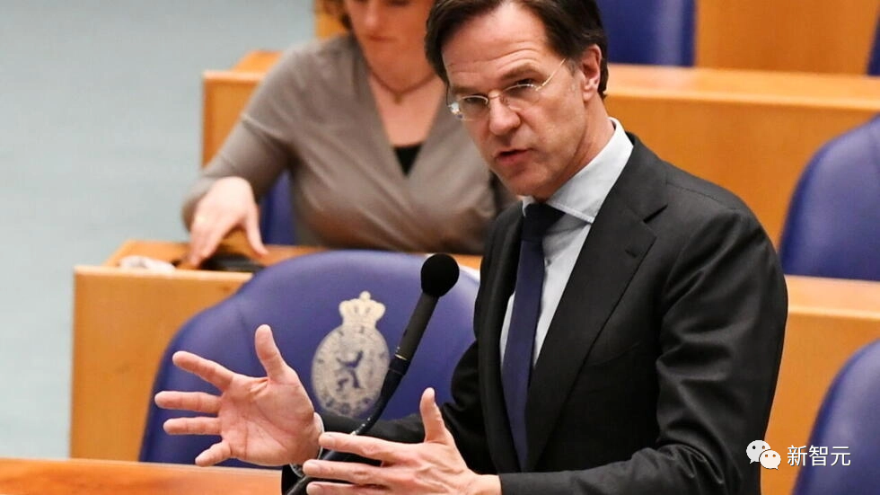
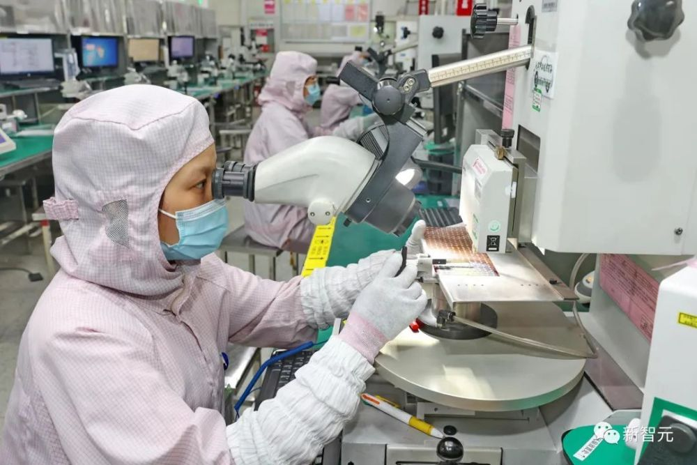
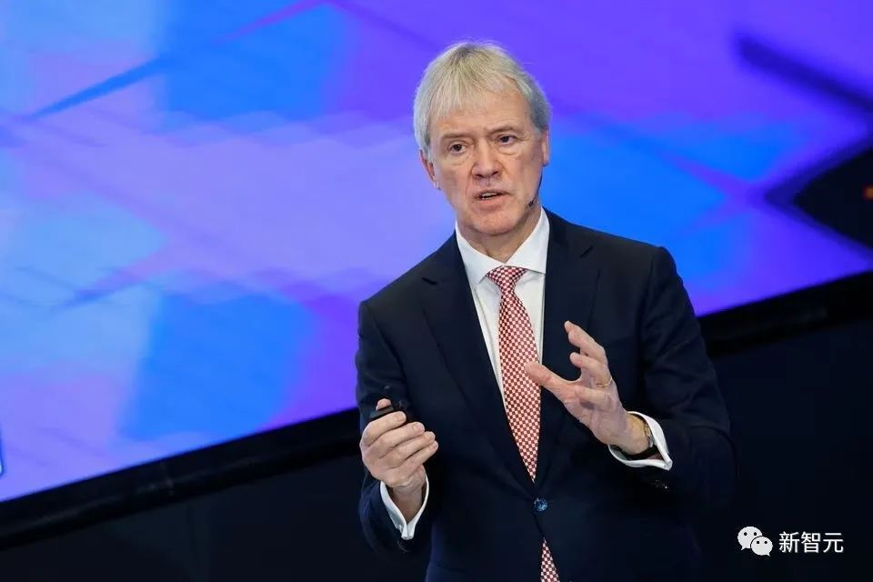
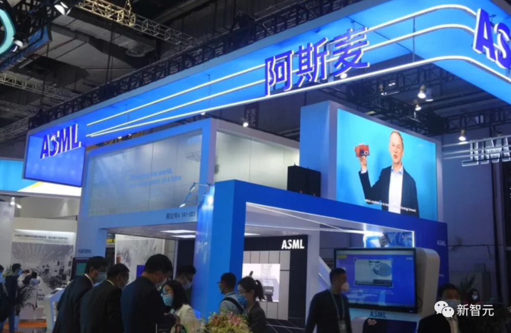

# 芯片围剿新花招！美国牵头组建“三国同盟”，日本荷兰已入局

编辑：David 昕朋

自从去年8月美国历史性的「芯片法案」正式落地以来，拜登政府针对中国芯片产业的「胡萝卜加大棒」一波接着一波。

从全球大撒钱，吸引全球芯片企业来美设厂，到严厉禁止本国企业将先进芯片产能设在中国，再到形形色色的贸易黑名单，与芯片和AI技术相关的企业一批批上榜...

看得出，100多年前的那一套思维，大洋彼岸的人如今用的还是那么熟练。

最新消息，在针对中国芯片这件事上，又有两个国家，和美国谈妥了。

**紧跟美国：日本荷兰「组团围堵」中国芯**

据多家媒体报道，周五，在历时数月的谈判后，美、日、荷三国已经就限制对中国出口先进芯片制造设备达成协议。

荷兰和日本都是世界上一些最先进的半导体制造设备制造商所在国。据熟悉该协议的人士说，两国在周五已经达成协议，与美国一起禁止向中国出售其最先进的芯片机器设备。

据悉，该协议是在与美国国家安全官员在华盛顿举行高级别会议之后达成的，将进一步扩大美国政府去年10月单方面发布的关于禁止中国共享半导体技术的全面限制令的范围。

去年10月，美国政府宣布，全面限制向中国出售半导体技术，旨在削弱中国获得从超级计算到制导武器等一切所需关键技术的途径。

按照禁令规定，除非获得特别许可，否则美国公司将不允许向中国供应先进的计算芯片、芯片制造设备和其他产品。在特别许可的审批上将会格外严格，但其中大部分许可申请将被拒绝。

美国商务部官员表示，这个规定不仅是美国企业要遵守的贸易制度，而且希望在世界各地的盟友也遵循类似的规定。

自那时起，美国就一直在向荷兰和日本施压，要求两国进一步限制向中国出口先进技术。

而此次日本和荷兰的加入，标志着美国「拉拢盟友」的计划已经迈出了实质性的一步。

这三个国家是生产芯片制造设备的最重要的公司的所在地。

荷兰半导体设备制造商阿斯麦尔（ASML）、日本的大型光学仪器制造商尼康（Nikon）和半导体制造设备巨头东京电子（Tokyo Electron
Ltd）都是全球芯片产业链上从原料、制造到设计不可或缺的、掌握核心技术的企业。

目前，尼康和东京电子对此消息均未回应。

不过，由于协议的敏感性，日、荷两国并没有公开宣布该协议，协议的细节内容仍不清楚。另外，由于荷兰和日本仍须敲定本国各自的最终立法程序，协议的实际落实可能还需要数月时间。

另据路透社报道，美国白宫国家安全发言人表示，新兴技术的安全和保障肯定是此次会议议程，并称相关事务对「我们三个国家都很重要」。

_马克·吕特，荷兰首相_

荷兰首相吕特周五在海牙表示，目前尚不清楚荷兰政府是否会披露与美国就半导体新出口限制进行的谈判结果。

「这是一个敏感话题，谈判一直在持续，已经谈了很长时间，但即使谈判有了结果，我认为也不会对外公开太多具体内容。」

尽管三方都对该协议的具体内容讳莫如深，但可以确定的是，一个以美国为首的、旨在围堵中国芯片产业的美日荷「三国同盟」已经初见雏形。

**ASML：别把中国逼急了**

针对三国达成的协议，荷兰光刻机巨头阿斯麦表示，公司对此的理解是，该协议侧重于先进的芯片制造技术，包括但不限于先进的平版印刷工具。

AMSL补充说，预计这些措施不会对其2023年的财务预测产生重大影响。在生效之前，必须详细列出并实施到需要时间的立法中。

同时，ASML也担心，由美国牵头的芯片限制政策越来越激进，可能会刺激中国更快地成功开发出先进芯片。

阿斯麦首席执行官彼得·温宁克（Peter
Wennink）近日就表示，「如果中国从我们这儿买不到这些机器，他们就会自己开发。这确实需要时间，但最终他们会成功。」

_ASML首席执行官彼得·温宁克_

实际上，尽管美荷两国正在就对该公司向中国销售设备的具体限制政策进行谈判，但2023年，该公司对中国出口额大概与去年的水平持平。

2019年，在美国的压力下，阿斯麦宣布不再向中国出售最先进的极紫外线光刻机（EUV），理由是担心可能被用于制造具有军事应用的芯片。

不过目前，该公司仍在向中国出售较旧的上一代深紫外线光刻机（DUV）。去年，DUV销售额总计约21.6亿欧元，占公司总收入的14%。

换句话说，最新型的不让卖了，但旧型号仍然继续在卖，而且卖的还不少。

据悉，此次美国与荷兰的谈判重点之一，就是进一步限制和削减阿斯麦对中国的DUV光刻机的出货量，想把旧型号这条路也堵死。

实际上，在限制芯片制造设备问题上，温宁克过去曾质疑美国的「双标」做法。他表示，EUV机器占阿斯麦销售额的50%，因为不向中国出口最新技术，阿斯麦「已经失去够多了」。

而与此同时，美国的芯片公司，如LAM Research和Applied Materials，在去年10月宣布全面新措施之前，并没有受限制出口政策的影响。

**欧盟：不想再被美国背刺**

欧盟一位高级贸易官员于周五表示，欧盟「全力」支持美国遏制中国半导体行业的目标。

「我们完全同意阻止中国获得最先进芯片的目标」，欧盟内部市场专员Thierry Breton表示。「我们不能让中国获得最先进的技术。」

然而，虽然嘴上说要全力支持美国，可真正到了政策落实上，欧盟却变得很谨慎。

面对美国方面的施压，荷兰首相马克·吕特表示，虽然荷兰在安全政策上与美国保持一致，但不会简单地追随美国，采用新的限制措施。

荷兰外贸大臣施赖纳马赫尔接受采访时表示，荷兰的对华政策不会照抄美国，不会草率同意美国提出的限制对华出口的新举措。

_施赖纳马赫尔，荷兰外贸与发展合作大臣_

施赖纳马赫尔称：「你不能说，美国已向我们施压两年，现在我们必须签字。我们不会的。」

她表示，荷兰不会立即遵守美国对中国的限制，并且正在与亚洲和欧盟的盟友进行磋商。

「在确保我们共同的技术安全方面，欧洲总是站在美国这一边，」Breton说，但他同时补充道，任何行动都应该「仅限于安全方面的必要举措」。

不过，虽然欧、美两方都对中国的芯片发展围追堵截，但二者的同盟关系并非牢不可破。自去年拜登签署《通胀削减法案》以来，欧盟一直谴责其所谓的保护主义和「美国优先」的做法，称其「明显违反了国际贸易规范」。

上周在达沃斯举行的世界经济论坛上，欧盟委员会主席乌尔苏拉·冯德莱恩宣布，欧盟正计划发布《净零工业法案》，作为欧洲对《通胀削减法案》的回应。「欧洲人需要更好地培育我们自己的清洁技术产业，」她说。

对国产芯片行业来说，美国对华芯片出口的步步紧逼，既是冬天，也是春天。

美日荷三国的围堵就像海浪，将没有核心科技的企业拍在岸上；但同时，这个过程就像大浪淘沙，让真正有技术、有能力的中国公司会浮现出来。

应该相信，国产芯片一定会崛起。

参考资料：

https://www.reuters.com/technology/asml-steps-made-towards-deal-curbing-
exports-china-2023-01-28/

https://www.scmp.com/news/china/diplomacy/article/3208279/eu-stand-us-
depriving-china-most-advanced-chips-trade-official-says

https://www.nytimes.com/2023/01/28/business/economy/netherlands-japan-china-
chips.html

https://www.nippon.com/en/news/yjj2023012800241/u-s-japan-netherlands-reach-
chip-accord-against-china-reports.html

