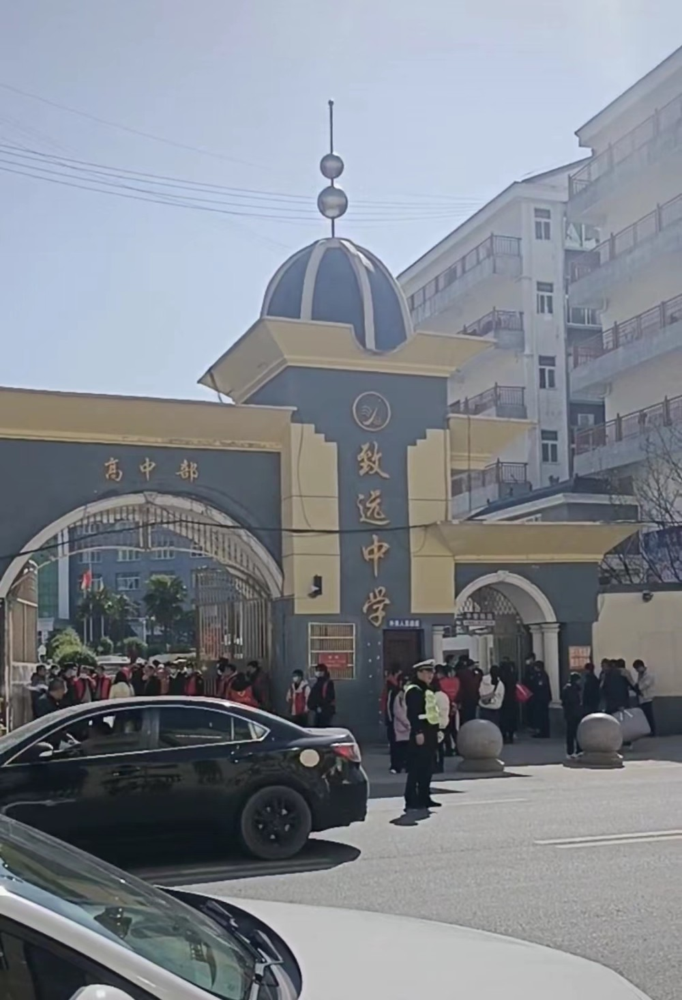

# 警方通报胡鑫宇遗体被找到，致远高中于同日开学

1月29日，据多位网友发布视频，称致远高中于今日开学。附近一位商家告诉潇湘晨报记者，今天学校开始报名，校外来往的人、车很多。

也是在当天，江西省、市、县公安机关联合工作专班发布警情通报称，在河口镇金鸡山区域树林中发现一具缢吊尸体，经DNA检验，确定死者为胡鑫宇。

据网友发布视频显示，致远高中校门大敞，有人提行李进出，道路上有交警正在指挥交通。另一则校内视角的视频显示，校园操场上和教学楼前都有人在行走。

致远高中附近一家酒店工作人员告诉记者，致远高中今天开始报名，校外来往的人、车很多。

家长姚先生也告诉记者，致远高中今天全校开学，自己的小孩就读高一，也于今日报名。姚先生也知道了胡鑫宇遗体被找到一事。他的小孩与胡鑫宇同届，但两人并不相识。

另据1月29日警方通报，胡鑫宇遗体被发现时为“缢吊”状态、衣着与失踪时一致；现场勘查过程中发现一支录音笔。当日中午，记者从胡鑫宇家属委托的律师之一郑晓静处得知，“家属决定尸检，查清真相”。

潇湘晨报记者 吴陈幸子

