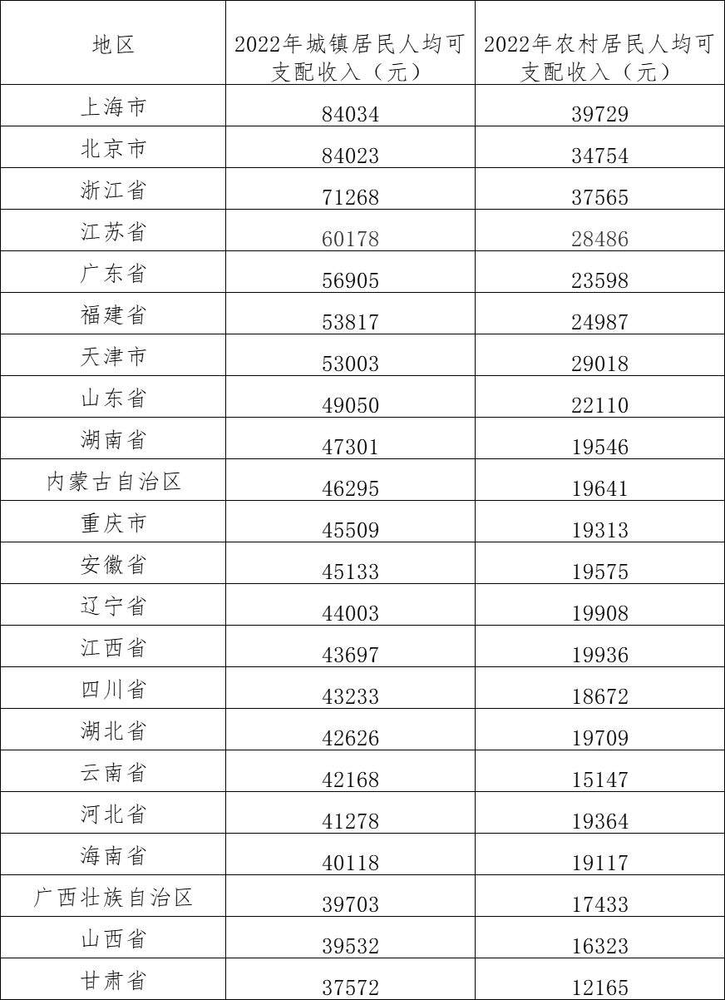

# 超20省居民人均可支配收入出炉：京沪逼近8万遥遥领先，浙江首超6万

据澎湃新闻记者不完全统计，已有超20个省份近期公布了2022年居民人均可支配收入数据。

居民可支配收入，是指居民可用于最终消费支出和储蓄的总和，即居民可用于自由支配的收入，既包括现金收入，也包括实物收入。按照收入的来源，可支配收入包括工资性收入、经营净收入、财产净收入和转移净收入。

京沪逼近8万元，浙江首破6万元

2022年，上海和北京居民人均可支配收入超过7万元，遥遥领先其他省份。数据显示，上海2022年居民人均可支配收入达79610元，逼近8万元，居全国之首。北京仅次于上海，居全国第二位，为77415元。北京的居民人均可支配收入在2021年首次突破7万元，而上海于2020年突破7万元大关。

2022年，浙江的居民人均可支配收入首次跨入6万元门槛，为60302元。江苏、天津、广东三地去年的居民人均可支配收入超4.5万元，分别为49862元、48976元、47065元。福建也处于4万元阵营，为43118元。

_已公布的部分省份2022年居民人均可支配收入数据。
数据来源：各地统计局、国家统计局 制表 澎湃新闻 彭艳秋_

2022年，全国居民人均可支配收入36883元，比上年名义增长5.0%。扣除价格因素，实际增长2.9%，与经济增长基本同步。

与全国居民人均可支配收入相比，上海、北京、浙江、江苏、天津、广东、福建、山东等8个省份2022年居民人均可支配收入超过了全国水平。

城乡居民收入相对差距继续缩小

分省份看城乡居民收入数据，城镇居民人均可支配收入方面，上海北京两地2022年的这一数据均超8万元，分别为84034元和84023元。值得一提的是，京沪两市的城镇居民人均可支配收入均在2021年已突破8万元大关。浙江与江苏2022年的城镇居民人均可支配收入分列7万元和6万元阵营。广东、福建、天津三地的2022年城镇居民人均可支配收入在5万元-6万元这一区间。

从农村居民人均可支配收入来看，上海、浙江及北京三地2022年这一数据超3万元，浙江高过北京，2022年浙江农村居民人均可支配收入为37565元，仅次于上海的39729元。从目前公布的数据来看，2022年农村居民人均可支配收入在2万元-3万元这一区间的省份包括：天津（29018元）、江苏（28486元）、福建（24987元）、广东（23598元）、山东（22110元）等省份。

_已公布的部分省份2022年的城乡居民人均可支配收入数据。
数据来源：各地统计局 制表 澎湃新闻 彭艳秋_

从全国的城乡差距来看，农村居民收入增长继续快于城镇居民。2022年，城镇居民人均可支配收入49283元，名义增长3.9%，实际增长1.9%；农村居民人均可支配收入20133元，名义增长6.3%，实际增长4.2%。农村居民人均可支配收入名义增速和实际增速分别快于城镇居民2.4和2.3个百分点。城乡居民收入比由上年的2.50降至2.45。

从全国的不同区域来看，中西部地区居民收入增长较快。2022年中部和西部地区经济发展受疫情影响相对较小，能源和原材料价格保持高位，带动居民人均可支配收入分别增长6.0%和5.3%，快于全国居民收入增速1.0和0.3个百分点。东部地区和东北地区居民人均可支配收入分别增长4.5%和2.9%。以西部地区为1，东部与西部地区居民人均可支配收入之比由上年的1.62缩小至1.61，下降0.01，地区间居民收入相对差距继续缩小。

