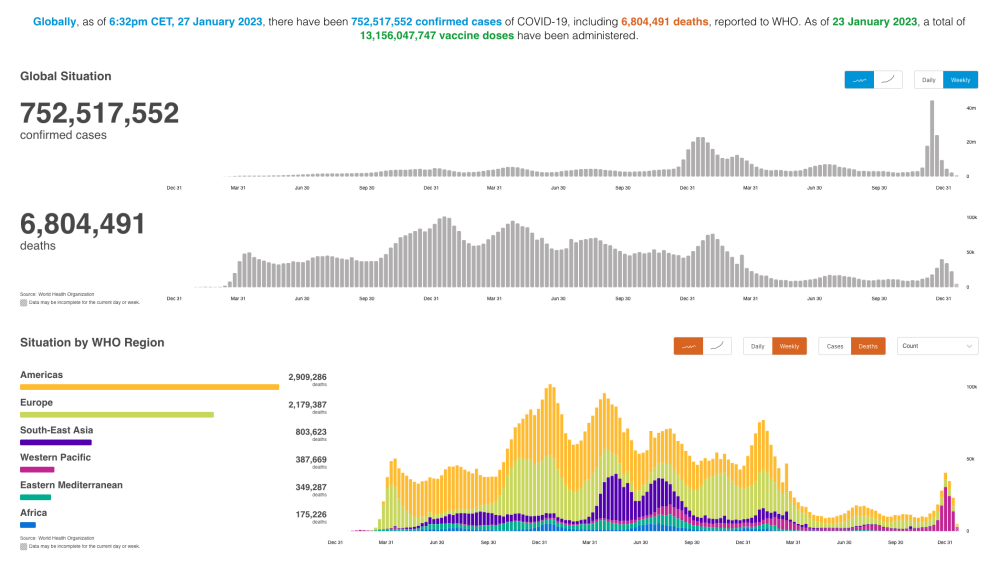

# 世卫组织讨论结束新冠全球紧急状态，最快今明出结果

“当我们进入大流行的第四个年头时，我们现在的处境肯定比一年前好得多。”谭德塞表示，奥密克戎（Omicron）疫情顶峰时期，每周向世卫组织报告的死亡人数超过
7 万人。而到了去年10月，这一数字降到不到1万人，接近新冠大流行以来的最低水平。

日内瓦时间1月27日，世界卫生组织（WHO）举行关于新冠（COVID-19）大流行的《国际卫生条例（2005）》（IHR）突发事件委员会第十四次会议，讨论和评估当前的新冠大流行是否仍构成国际关注的突发公共卫生事件（PHEIC）。会后世卫组织总干事谭德塞将根据委员会建议做出最终决定。相关结果预计最早将在1月30日公布。

三年前的2020 年1 月30
日，世卫组织宣布将新冠疫情列为国际关注的突发公共卫生事件，并发布了联合国机构的最高警报级别。当年3月11日，世卫组织宣布新冠疫情构成全球大流行（global
pandemic）。

此后每隔几个月，该突发事件委员会都会召开一次会议，讨论新冠大流行是否符合称为“国际关注的突发公共卫生事件”的标准。距今最近的第十三次会议于2022年10月13日举行，会议结果仍维持新冠全球紧急状态。

根据具有约束力的国际条约《国际卫生条例》，国际关注的突发公共卫生事件需要符合三个标准：严重、突发、异常或意外；它有可能跨越国界传播；它可能需要协调一致的国际反应。

在去年12月14日举行的新闻发布会上，谭德塞曾表示，希望2023年能够宣布“新冠大流行不再是一个国际关注的突发公共卫生事件”。据介绍，结束新冠全球紧急状态的标准将在2023年1月世卫组织新冠突发事件委员会会议上讨论。

**中国当下的疫情是否影响决定**

1月27日，谭德塞在新冠突发事件委员会会议上致开幕词，总结了当前的全球疫情状况。

“当我们进入大流行的第四个年头时，我们现在的处境肯定比一年前好得多。”谭德塞表示，奥密克戎（Omicron）疫情顶峰时期，每周向世卫组织报告的死亡人数超过
7 万人。而到了去年10月，这一数字降到不到1万人，接近新冠大流行以来的最低水平。

不过，他指出，自去年12月初以来，全球每周报告的死亡人数一直在上升。中国解除限制导致这个世界上人口最多的国家的死亡人数激增。“上周，向世卫组织报告的近 4
万人死亡，其中一半以上来自中国。在过去的八周里，总共报告了超过 17 万人死亡。实际数字肯定要高得多。”目前，世卫组织已更新相关数据页面（WHO
COVID-19 Dashboard），以纳入中国最近几周报告的病例和死亡人数。

_全球新冠病毒感染和死亡病例数据。来源：WHO官网_

世卫组织发言人玛格丽特·哈里斯（Margaret
Harris）在接受财新记者采访时表示，2023年1月26日，中国向世卫组织报告了更多病例和死亡病例。在2022年12月9日至2023年1月23日期间，中国（不包括香港特区、澳门特区和台湾）报告了8700多万例病例和75000多例死亡。有了这些额外的数据，全球累计病例已从超过6.64亿上升到超过7.51亿。全球累计死亡人数已从670多万上升到近680万。

哈里斯称，中国疾控中心于1月15日、21日和25日发布了额外的公告，但所分享的数据没有按日期分类，因此世卫组织无法将其纳入报告。而被问及中国提供的信息将在多大程度上影响紧急状态解除与否的决定，哈里斯仅表示，“委员会审查了关于所审议问题的所有相关全球数据。”

据中国疾控中心网站披露，2022年12月8日至2023年1月26日，全国累计在院新冠病毒感染相关死亡病例78960例，其中新冠病毒感染导致呼吸功能衰竭死亡6473例、基础疾病合并新冠病毒感染死亡72487例。

加州大学洛杉矶分校公共卫生学院流行病学系主任、终身教授张作风教授近日在专栏文章中表示，考虑到中国新冠感染和重症死亡的未来发展和控制情况，世卫组织不大可能在本月底会议上就决定终止“突发公共卫生事件”的紧急状态。他估计，如果中国的新冠感染和重症死亡得到有效的控制，世卫组织会在今年内宣布结束紧急状态。但对新冠所致的可能的后遗症需要继续深入的研究，并采用有效的方法来预防和治疗。

**各国调整防疫政策**

在1月27日的致辞发言中，谭德塞提出，还存在以下几点挑战：

疫苗、治疗方法和诊断方法对于预防严重疾病、挽救生命以及减轻卫生系统和卫生工作者的压力至关重要。但全球的反应仍然步履蹒跚，因为在太多国家，这些强大的救生工具仍未到达最需要它们的人群——尤其是老年人和卫生工作者。

世界各地的许多卫生系统都在努力应对 COVID-19，此外还要照顾患有其他疾病（包括流感和 RSV）的患者，以及工作短缺和疲惫不堪的卫生工作者。

与此同时，全球范围内的监测和基因测序急剧下降，使得追踪已知变异和检测新变异变得更加困难。持续不断的错误和虚假信息正在削弱公众对安全有效的新冠控制工具的信任。

美国俄亥俄州立大学华裔病毒学家、美国微生物科学院院士刘善虑近期接受澎湃科技记者采访时表示，最近奥密克戎毒性减弱，可以认为是从pandemic（全球大流行病）到endemic（地方性流行病）的转变。“病毒进化的整体趋势是致病性越来越弱，虽然在某些阶段也会增强。”他指出，仍需警惕新冠病毒跨种群传播以及新冠病毒基因重组问题，但只要这类产生有威胁的全新毒株的情况不出现，他希望在2023年内能看到世卫组织宣布结束新冠“全球大流行”。

针对国际关注的突发公共卫生事件，世卫组织会向各国发布一套行动建议，包括：加强监测以确定新的病例，隔离病例和对接触者进行检疫；在边境、机场、港口或入境点采取措施进行筛查；向民众宣传有关该疾病的风险，宣传个人可以采取的额外保护措施；以及如果目前还没有任何疫苗，可能需要进行额外研究以研发治疗方法或疫苗。

日前，日本和韩国已陆续调整防疫级别或相关防疫政策。

1月27日，日本厚生劳动省宣布，将于5月8日把新冠病毒在《传染病法》中级别下调为与季节性流感相同的“5类”。在变更后，感染者和密切接触者等的观察时间将被取消，医疗分阶段转为正常体制。此外，无论室内外都由个人决定是否佩戴口罩。

1月20日，韩国国务总理韩德洙主持防疫会议，讨论对室内强制口罩令的调整事宜。1月30日，韩国政府宣布即日起仅建议民众在室内佩戴口罩，不再强制要求。韩国政府口罩令时隔27个多月全面解除。不过，医疗机构、药店、高风险场所、公共交通车厢等将继续维持室内口罩义务。对于5种高风险情况，韩国防疫部门强力建议佩戴口罩。

中国政府也已从1月8日起将新冠病毒感染从“乙类甲管”调整为“乙类乙管”。对新冠病毒感染者不再实行隔离措施，不再判定密切接触者；不再划定高低风险区；不再对入境人员和货物等采取检疫传染病管理措施。检测策略调整为愿检尽检。

