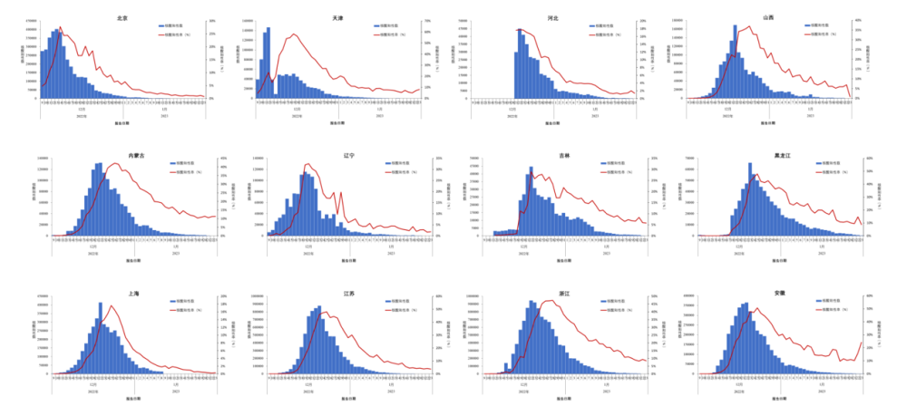
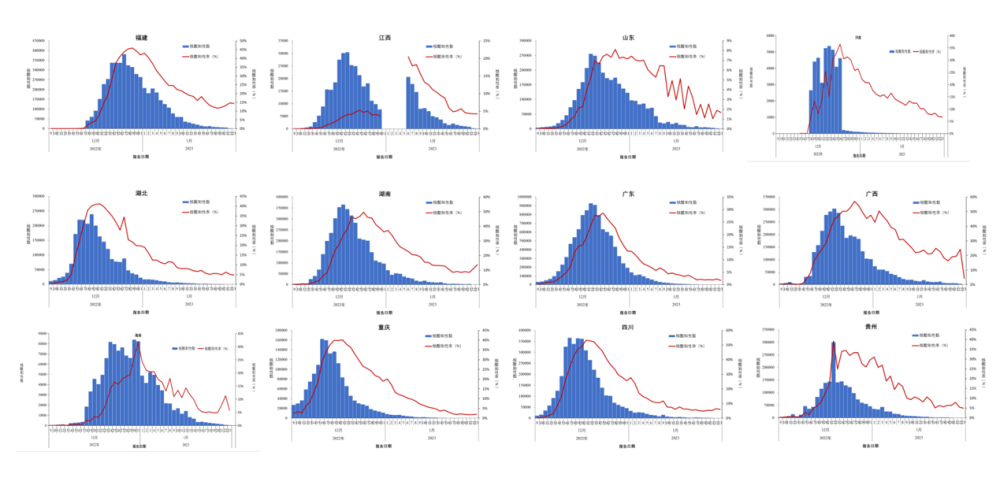
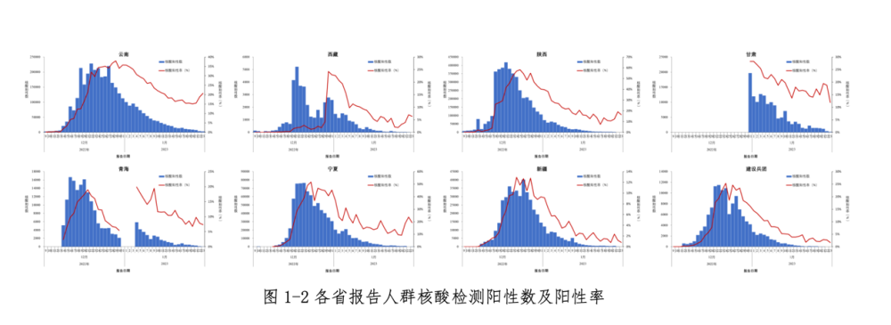
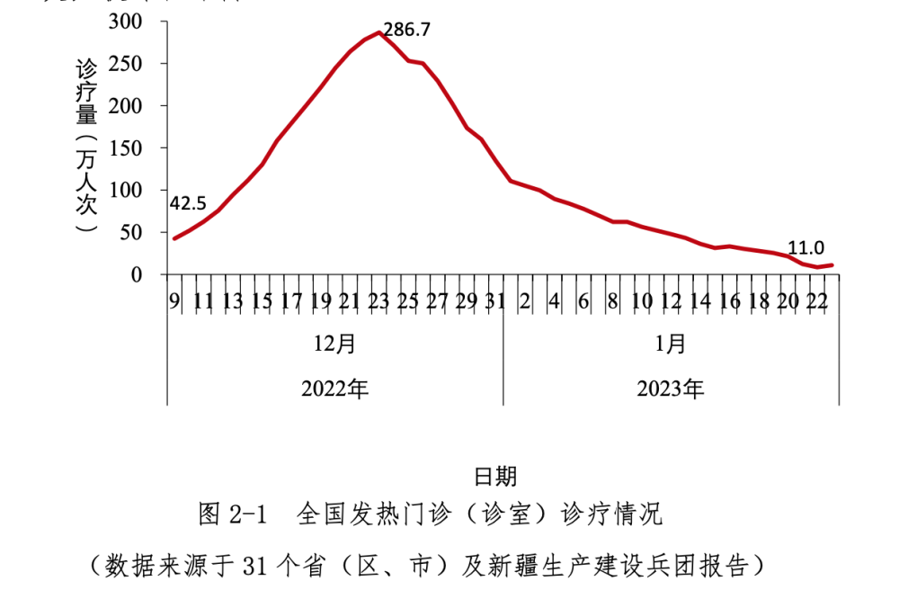
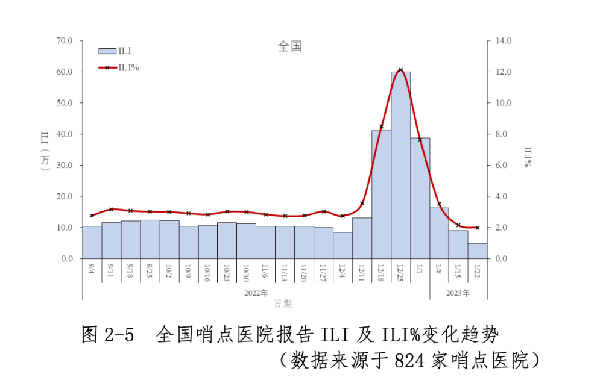
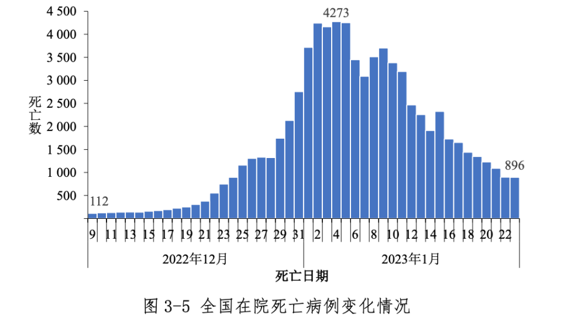
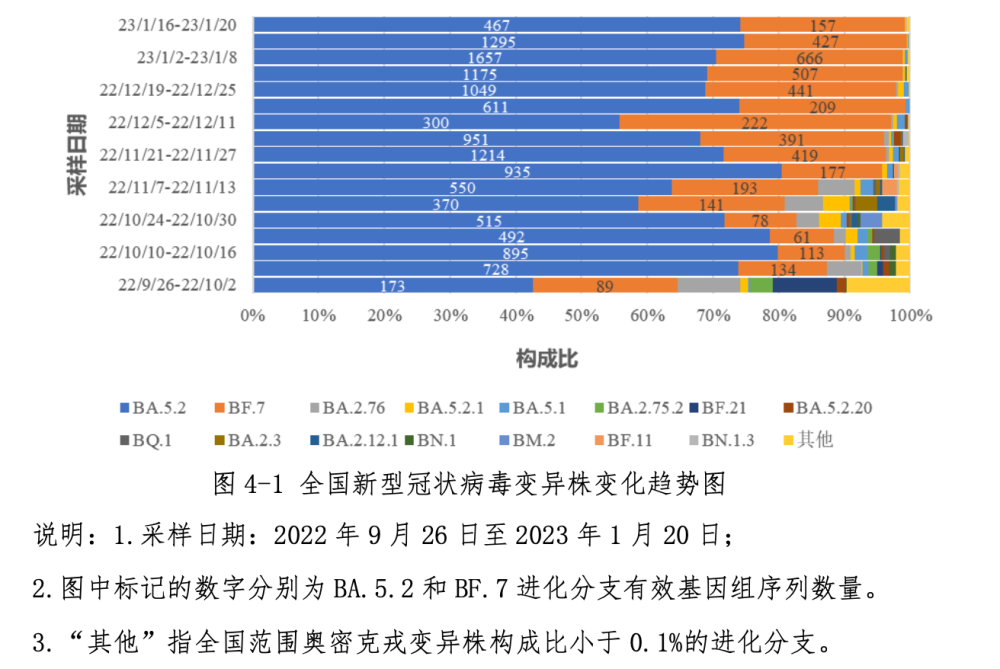
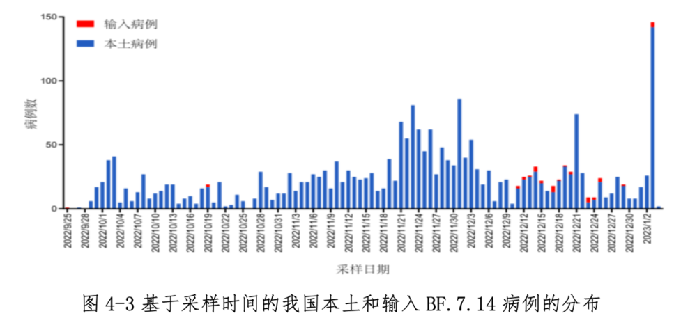

# 中疾控周报：春节期间疫情未明显反弹，我国本轮疫情已近尾声

“春节假期，疫情未出现明显反弹，在整个流行过程中，未发现新的变异株，我国本轮疫情已近尾声。”最新一期的《China CDC
weekly》（《中国疾病控制中心周报》）刊登的《全国新型冠状病毒感染诊疗和监测数据概述》（以下简称《概述》）如此总结。

该《概述》由中国疾控疾控中心1月25日发表。《概述》利用各省报告的监测数据，对2022年12月9日至2023年1月23日，全国新冠病毒感染诊疗和监测数据进行初步分析。

《概述》显示，我国本轮疫情在2022年12月下旬达到高峰，其后不断下降，各省走势基本相近，城乡也基本同步，门（急）诊人数、在院重症人数、在院死亡人数均呈现下降趋势，至2023年1月下旬全国整体疫情已降低至较低水平，医疗救治压力进一步放缓。

具体而言，我国核酸检测阳性率在2022年12月25日达高峰（29.2%），抗原检测阳性率在12月22日达高峰（21.3%），并均于2023年1月下旬降至6%以下。同时，全国发热门诊就诊人数也在2022年12月下旬达峰，单就城市情况来看，北京、天津、河北等省份达峰时间稍早；至2023年1月下旬，发热门诊城乡就诊人数较峰值均下降90%以上。

全国在院患者达峰比感染达峰稍晚，于1月5日达峰，达到162.5万人；其中阳性重症患者也在当日达到峰值，为12.8万人，其后在1月23日回落至3.6万人。在院死亡病例数于1月4日达到每日峰值4273人，1月23日回落至896人。

**去年12月下旬全国感染达峰，各省达峰时间不一，城乡基本同步**

《概述》报告了全国感染监测数据，既有核酸检测数据，也有抗原检测数据，还有哨点社区人群感染监测情况。其中，核酸检测阳性率在2022年12月25日达高峰（29.2%），抗原检测阳性率在12月22日达高峰（21.3%），并均于2023年1月下旬降至6%以下。

2022年12月8日以后，全国（不含港澳台，下同）不再开展全员核酸筛查，实行愿检尽检，同时部分地区对重点人群开展定期核酸检测。受居民检测意愿影响，各省核酸检测量不断减少，如12月9日检测量达1.5亿，2023年1月1日降至754万，23日降至最低28万人。

2022年12月9日后，各省份报告人群核酸检测阳性数及阳性率呈现先增加后降低趋势，阳性人数12月22日达到高峰（694万）后逐步下降，2023年1月23日降至最低1.5万；检测阳性率2022年12月25日（29.2%）达高峰后逐步下降，2023年1月23日降低到5.5%。

各省核酸检测阳性率达峰时间不一，其中北京和天津分别在2022年12月14日和19日达峰；四川、重庆、湖北等15省份在12月21-24日期间达峰；湖南、浙江、广西等15省份在12月26-28日期间达峰。各省达峰后下降速度不一，目前均已降至较低水平，超过七成省份降至10%以下。

本文图片均为《概述》附图。

就抗原检测情况来看。2022年12月以来，部分省份建立居民抗原检测信息收集应用程序（APP），居民可自愿上传抗原检测结果。各省份报告抗原检测量较低，并逐渐减少，从2022年12月19日的最高189万下降到2023年1月23日的最低10.5万。

报告省份的抗原检测阳性数及阳性率自2022年12月9日后快速上升，12月22日达高峰（33.7万、21.3%）后波动下降，2023年1月23日降至最低，分别为4773和4.5%。

近日少数省份核酸和抗原检测阳性率略有上升，可能受有症状人群、有暴露风险人群检测意愿更高，社区人群检测量不断降低有关，同时春节假期人群流动性增加，也可能造成部分未感染人群感染风险加大。

自2022年12月16日，在各省设立社区人群哨点开展感染情况监测。采用多阶段分层整群抽样方法在各省各选取省会城市、一个大城市和一个县，每个省会城市至少抽样2000户（不少于5000人），每个大城市至少抽样1500户（不少于3000人），每个县至少抽样1000户（不少于2500人）。最小抽样单位为家庭，所有选定家庭的家庭成员都作为监测对象，共约42万人，主要了解核酸和抗原检测情况。

从2022年12月16日至2023年1月12日，对哨点社区人群每周进行两次调查（共开展8轮），1月13日起，每周一次调查。日均新增阳性率（指本轮调查期间平均每日的新增核酸和抗原检测阳性率），从第一轮（2022年12月16日至19日）的4.13%下降到第9轮（2023年1月13日至20日）的0.13%，第二轮（2022年12月20日至22日）最高为6.30%。其中城市地区日均新增阳性率从第2轮最高的6.89%下降到第9轮的0.13%。农村地区日均新增阳性率从第2轮最高的4.79%下降到第9轮的0.12%。结果显示，目前全国疫情社区人群感染水平已降至较低水平，城乡疫情走势基本同步。

**全国发热门诊去年12月下旬达到就诊高峰，次月下旬大幅回落**

《概述》显示，全国农村地区乡镇卫生院发热门诊（诊室）及全国二级以上医疗机构和城市社区卫生服务中心发门诊（诊室）的就诊人数均在2022年12月下旬达峰，其后于2023年1月下旬大幅回落，较峰值下降90%以上。

全国发热门诊（诊室）就诊人数于2022年12月23日达到峰值286.7万人次，之后连续下降。2023年1月23日回落至11.0万人次，较峰值下降96.2%。

全国农村地区乡镇卫生院发热门诊（诊室）就诊人数于2022年12月23日达到峰值92.2万人次，其后波动下降。2023年1月23日回落至5.0万人次，较峰值下降94.6%。

全国二级以上医疗机构和城市社区卫生服务中心发门诊（诊室）就诊人数于2022年12月22日达到峰值195.4万人次，之后连续下降。2023年1月23日回落至5.9万人次，较峰值下降97.0%。各省城市发热门诊诊疗量趋势基本相近，除北京、天津、河北等省份达峰时间稍早外，其他省份均在2022年12月下旬达峰。

《概述》还提供了哨点医院每周流感样病例检测数据，流感样病例在2022年12月19日-25日这一周达到高峰12.1%，其后在2023年1月16日-1月22日这一周回落至2.0%。

2022年12月12日起，在我国已建立的流感监测网络哨点医院（共824家哨点医院，包括国家级哨点医院546家、非国家级哨点医院278家）和国家级网络实验室（402家）开展了新冠病毒感染监测。

2022年9月-12月上旬，哨点医院每周流感样病例（ILI，Influenza-like
Illness，体温≥38°C，伴咳嗽或咽痛之一）数稳定在10万左右，流感样病例占门（急）诊就诊人数比值（ILI%）在2.7%~3.6%区间波动。ILI第50周快速上升，第51周（12月19日-25日）ILI达到最高60万。

ILI%从50周开始快速上升（8.5%），51周达到最高12.1%，从52周起快速下降，至2023年第3周（1月16日-1月22日），已回落至2.0%（图2-5）。

从不同片区看，各片区ILI%到达峰值的时间接近，其中西南和华中地区在2022年第50周达到高峰（分别为
11.8%,9.2%）；西北、华南、华东、华北地区和东北在51周达到高峰（分别为11.3%，15.3%，13.7%，5.6%，11.2%），随后持续下降（图2-6）。目前各地ILI%均回落至本轮疫情之前水平，甚至更低。

网络实验室对流感样病例标本同时进行新冠病毒和流感病毒检测，从2022年第49周（12月9日），新冠病毒阳性率开始逐渐增加，全国整体在第51和52周期间到达高峰后开始波动下降；同期流感病毒阳性率则逐步降低，至12月下旬降至极低水平（图2-7）。从不同地区来看，各地区流感样病例标本中新冠病毒阳性率达峰时间接近，其中华中、西南、西北、华北和东北地区在51周达到高峰（分别为:73.2%、72.5%、58.3%、44.4%、38.4%）；华东、华南地区在52周达到高峰（分别为:73.0%、68.4%），随后下降（图2-8）。

**全国在院患者1月5日达峰，当月下旬明显回落**

《概述》显示，全国在院新冠患者于2023年1月5日达峰，达到162.5万人；其中阳性重症患者也在当日达到峰值，为12.8万人，1月23日回落至3.6万人。在院死亡病例数于1月4日达到每日峰值4273人，1月23日回落至896人。

全国在院新冠感染者于2023年1月5日达到峰值162.5万人，之后持续下降，1月23日回落至24.8万人，较峰值数量减少84.8%。

全国在院阳性重症患者数于2022年12月27日至2023年1月3日期间每日增量接近1万，1月4日增量明显下降，1月5日达到峰值12.8万人，之后持续下降，1月23日回落至3.6万人，较峰值下降72.0%。

目前，各省在院新冠感染者和阳性重症患者均仍处于持续下降过程。在院阳性重症数，除广东、山东、广西、福建4个省份略超2000例以外，其余28个省份均已下降至2000例以下。

在院死亡病例数于2023年1月4日达到每日峰值4273人，之后持续下降，1月23日回落至896人，较峰值下降79.0%。

**此轮流行株为BF.7和BA.5.2，未发现新变异株**

《概述》显示，我国持续开展新冠病毒变异监测，就病毒变异监测情况来看，2022年12月12日后，各省又在3个不同地区各选择一家医院作为病毒变异监测哨点医院，采集门诊和在院病例标本进行核酸检测并进行序列测定。同时，在全国陆路、水路和空港口岸开展入境人员病毒变异监测。监测结果表明，此轮疫情流行株为BF.7和BA.5.2，未发现新的变异株。

监测显示，我国本土病例中，BF.7.14占BF.7的96.7%；BA.5.2.48占BA.5.2的60%。《概述》总结了BF.7.14及BA.5.2.48变异株的流行情况。

2022年9月26日至2023年1月23日，全国共报送18906例本土病例新冠病毒基因组有效序列，均为奥密克戎变异株，共存在69个进化分支，主要流行株为BA.5.2（70.8%）和BF.7（23.4%），BA.2.76等13种进化分支构成比在0.1%~1.3%之间，54种进化分支的构成比小于0.1%（共占1.1%）。

2022年12月1日至2023年1月23日，全国共报送10165例本土病例新冠病毒基因组有效序列，全部为奥密克戎变异株，共存2个进化分支。主要流行株BA.5.2（70.2%）和BF.7（28.3%）。共发现重点关注变异株11例，其中，1例XBB.1，1例
BQ.1.1.17，4例BQ.1.1，3例BQ.1.2，2例BQ.1.8。

就各省份情况而言，总体来看，北京和天津以BF.7为优势株；江苏和内蒙古BF.7和BA.5.2基本持平；其他省份均以BA.5.2为优势株。

《概述》还总结了BF.7.14及BA.5.2.48变异株的流行情况。

根据Pango命名法的最新数据，BF.7含有4个特征氨基酸突变位点：ORF7a:H47Y、ORF1b:L238F、S:C1243F、ORF1a:V274L和一个特征核苷酸突变位点C29632T被命名为BF.7.14。测序结果表明，输入病例中，BF.7.14占BF.7的37.4%，主要集中在2022年12月，最早报告时间为2022年9月25日。本土病例中，BF.7.14占BF.7的96.7%，最早报告时间为2022年9月27日。

根据Pango命名法最新数据，BA.5.2含有4个特征性核苷酸突变位点：C2710T、C8626T、C16887T和T17208C的变异株被命名为BA.5.2.48。测序结果表明，输入病例中，BA.5.2.48占BA.5.2的6.2%，最早报告时间为2022年8月15日。本土病例中，BA.5.2.48占BA.5.2的60%，最早报告时间为2022年7月13日。

