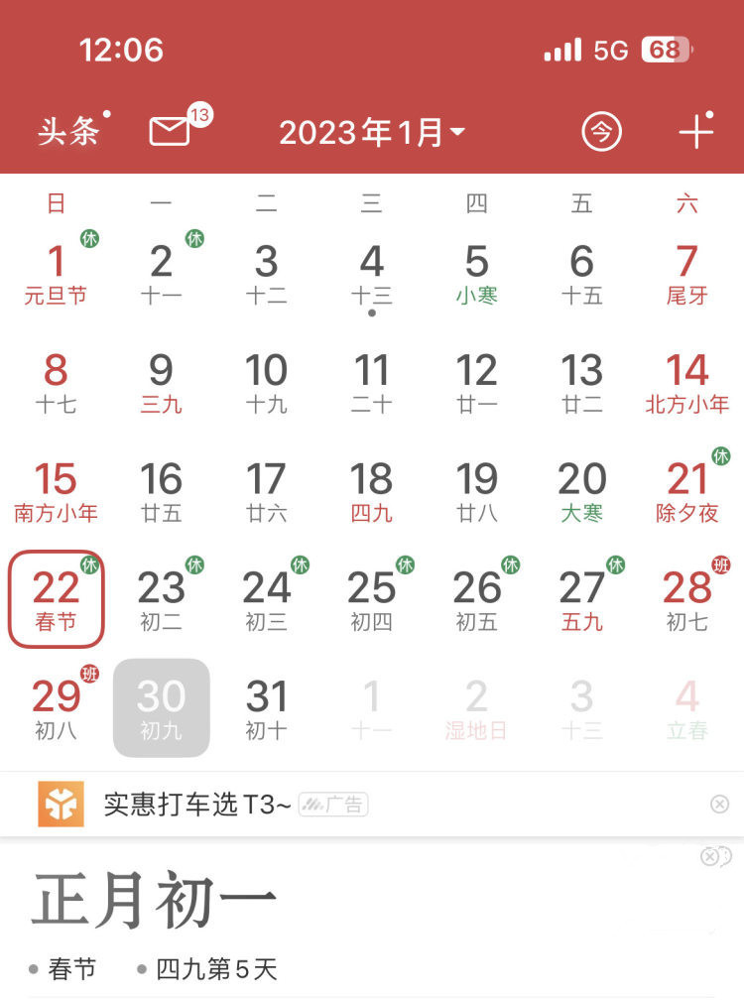
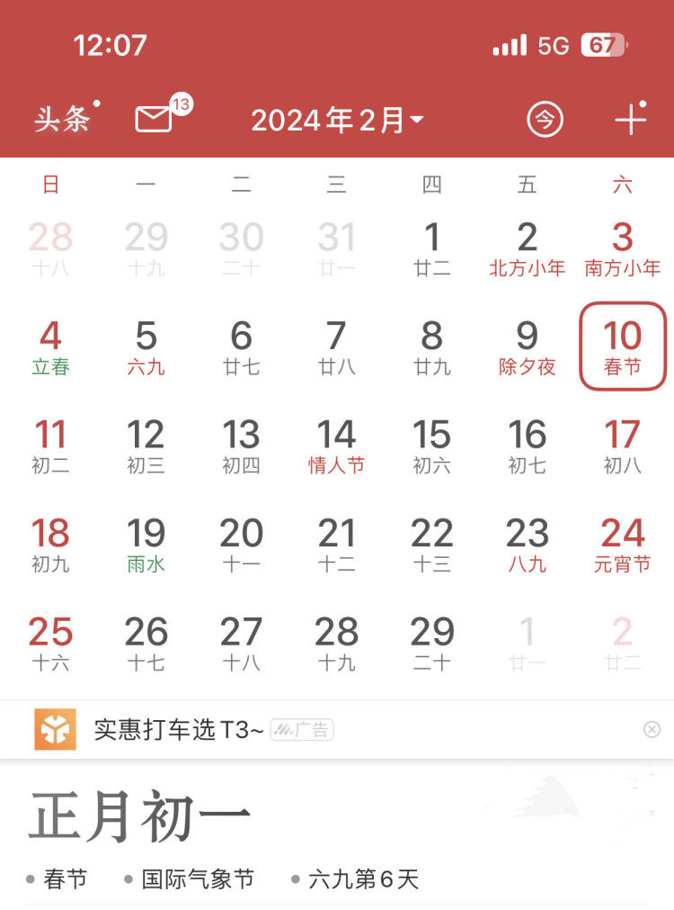

# 今年兔年竟然有384天谁晓得多出来的19天哪来的？

近日，不少网友发现，下一年的春节离今年春节有384天，这个发现在网络上引起热议，“一年不是只有365天吗，这多出来的19天哪来的？”有网友感叹，“这多出来的都是打工人的辛酸泪堆成的！”

1月30日，上游新闻记者查阅日历发现了2024年的春节（农历大年初一）在2月10日，2023年春节（农历大年初一）在1月22日，两者相差384天。

为什么发生这种现象？上游新闻记者采访了重庆师范大学历史与社会学院历史系副教授邹登顺。

邹登顺介绍，人们所说的一年365天是按公历计算，而春节是中国农历年的节日，农历以月亮绕地球转的周期为依据，一个朔望月为一个月，约29.53天，全年一般是354天或355天，比公历年的365天或366天少了11天。

为了使农历年接近公历年的长度，中国古代古人采用了增加闰月的方法。

按照农历的计算方法，在19个农历年中有7个闰月，有闰月的那一年有13个月，全年一般是384天或385天，叫做闰年。

至于闰月具体安置在哪一个月，这和二十四节气的“中气”有关。二十四节气由12个节气和12个中气组成，月首叫“节气”，月中叫“中气”。农历每个月中，不含中气的月份就算上一个月的闰月。今年是农历癸卯兔年，是“闰二月”，所以是384天。

邹登顺介绍，今年还是一个“双春年”，也就是一年之内出现两个立春节气。根据统计，19个农历年中有7年达到384或385天，有7年是“双春年”。

上游新闻记者 石亨

编辑：夏洪玲

责编：周尚斗

审核：冯飞

