# 体育早知道｜冷门夜！米兰尤文利物浦输球巴黎皇马平，日本球星封神战

早间必读

爆冷1夜！米兰尤文利物浦输球 大巴黎遭绝平皇马交白卷

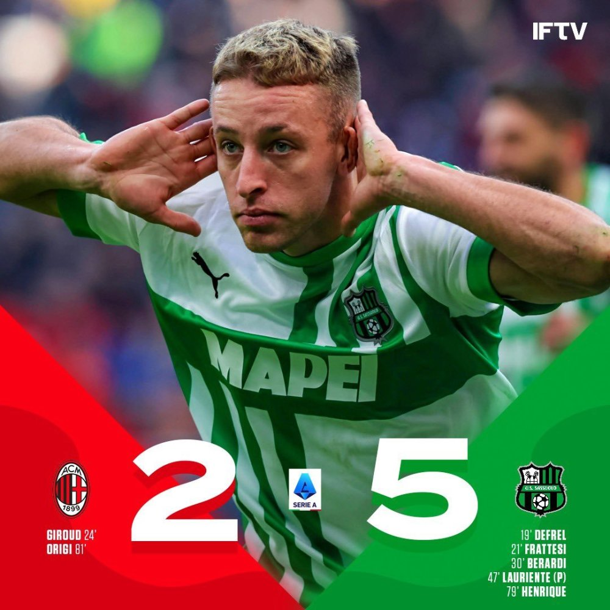

欧洲足坛冷门迭爆，AC米兰和尤文双双输球，利物浦足总杯出局，大巴黎遭绝平，皇马则交出白卷。

挑球绝杀利物浦！三苫熏致敬冰王子，6次“军训”阿诺德太残暴啦

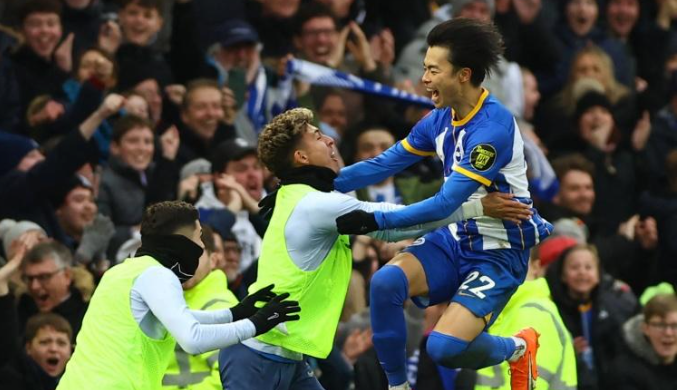

足总杯再现经典一战，布莱顿坐镇主场凭借着三苫熏的绝杀进球，2-1逆转淘汰强敌利物浦。本场比赛的最佳球员，肯定属于日本球星三苫熏。

詹姆斯绝杀球确实被犯规！官方裁判报告出炉：湖人2次获利仍输得太冤

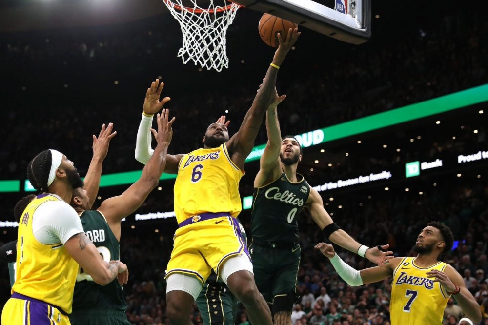

NBA官方正式公布湖人和凯尔特人最后2分钟裁判报告，末节和加时最后2分钟总共出现3次漏判，詹姆斯绝杀球确实被塔图姆打手犯规，湖人2次获利仍输得太冤。

足球战报

1-0到1-2！足总杯：利物浦1-2负布莱顿，三笘薫92分钟绝杀

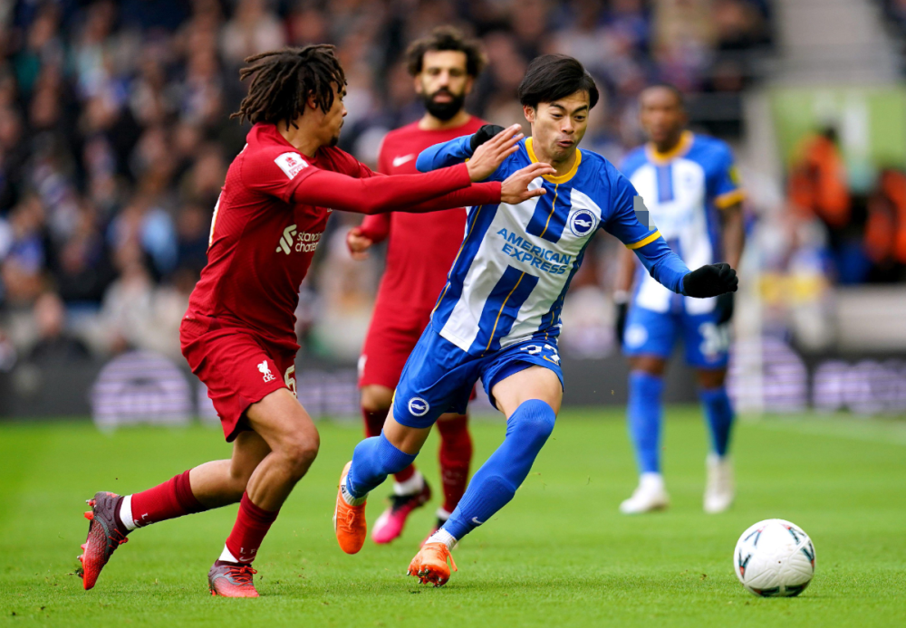

2022-23赛季英格兰足总杯第4轮，利物浦1-2遭布莱顿逆转，卫冕冠军就此出局无缘足总杯16强。第30分钟，萨拉赫助攻，年仅19岁的埃利奥特打破僵局。第39分钟，兰普泰的爆射打在敦克腿上折射入网。第92分钟，三笘薫送出绝杀。

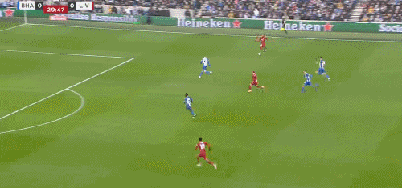

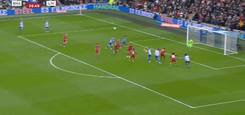

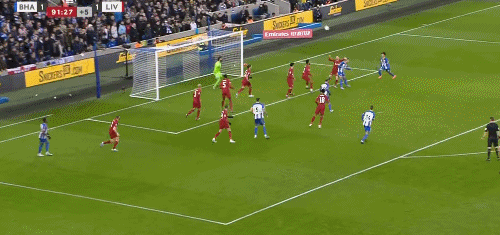

法甲：十人巴黎1-1遭读秒绝平 内马尔破门 维拉蒂染红 梅西0射正

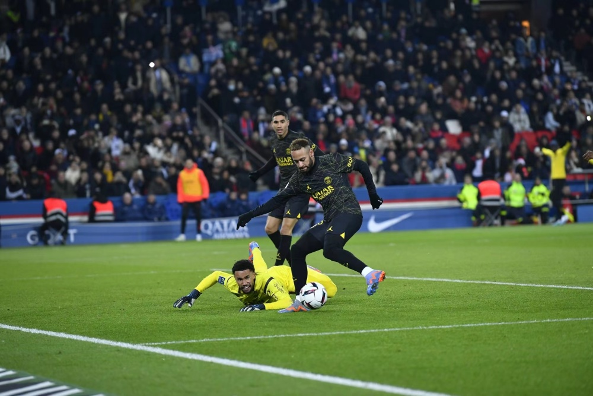

法甲第20轮一场焦点战中，坐镇主场的法甲卫冕冠军巴黎圣日耳曼1-1被兰斯队逼平。被绝平后，大巴黎积48分以3分的优势继续领跑法甲积分榜。

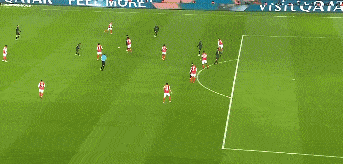

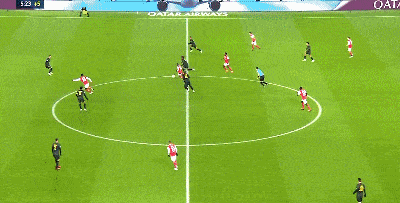

意甲-布雷默进球被吹！尤文主场0-2不敌蒙扎，遭两回合双杀

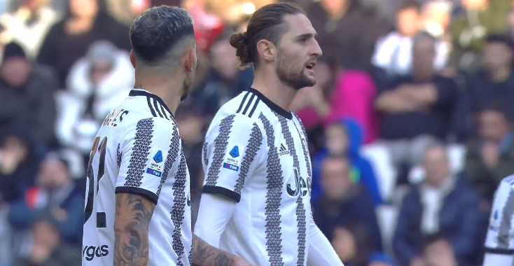

意甲第20轮，布雷默进球被吹，丘里亚和丹尼-莫塔各进一球，尤文主场0-2爆冷不敌蒙扎，遭遇三轮不胜。

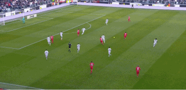

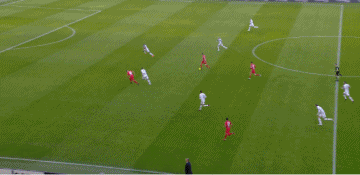

西甲：皇马0-0平劲敌 落后巴萨5分 王牌连失单刀良机

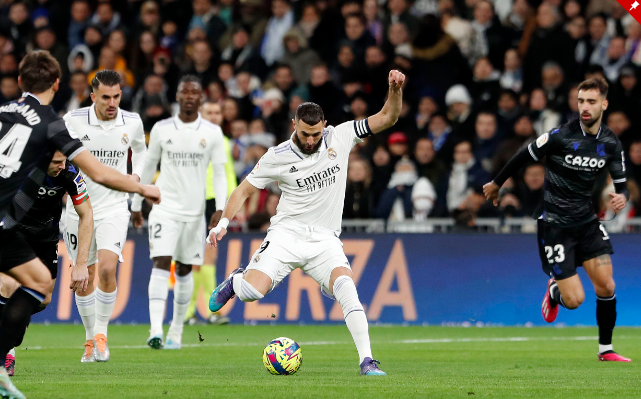

西甲第19轮中，皇马主场0-0战平皇家社会，联赛主场第3次战平，落后巴萨5分。西甲二三名之战平局收场，韦尼修斯连续错失单刀得分良机。

2-1绝杀！他们杀死意甲争冠悬念，13分遥遥领先，穆帅太可惜

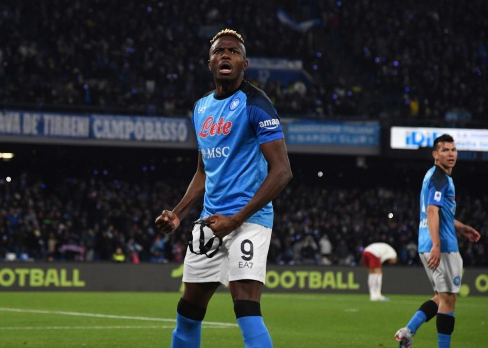

意甲第20轮焦点战，那不勒斯坐镇主场对阵罗马。上半场，奥斯梅恩率先破门，下半场沙拉维一度扳平比分，但小西蒙尼完成绝杀，那不勒斯2-1险胜，主客场两回合双杀罗马，迎来主场8连胜。那不勒斯的积分优势达到13分，基本杀死意甲争冠的悬念了。

2-0，3连胜！多特只落后拜仁3分，德甲争冠乱了，6队混战冲击榜首

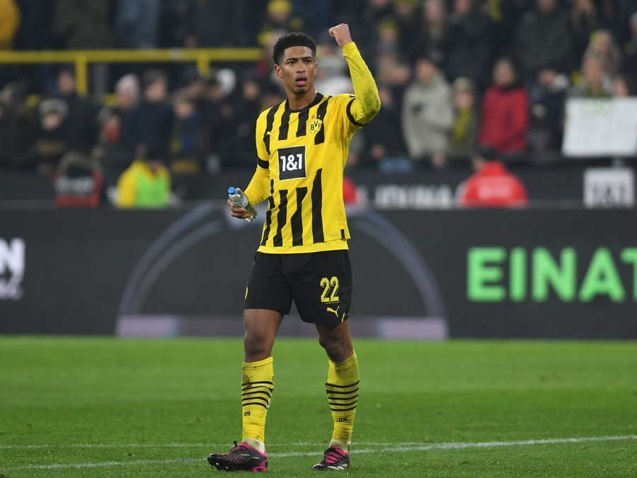

2022-23赛季德甲第18轮战罢，多特蒙德客场2-0力擒勒沃库森拿到3连胜。阿德耶米建功，沃尔夫传中造乌龙。此役过后多特积34分重返前4，距离榜首的拜仁只差3分，德甲争冠进入混战局面。

足球早报

姆巴佩虐菜？五子登科后哑火！6.3分倒数第二 梅西最低

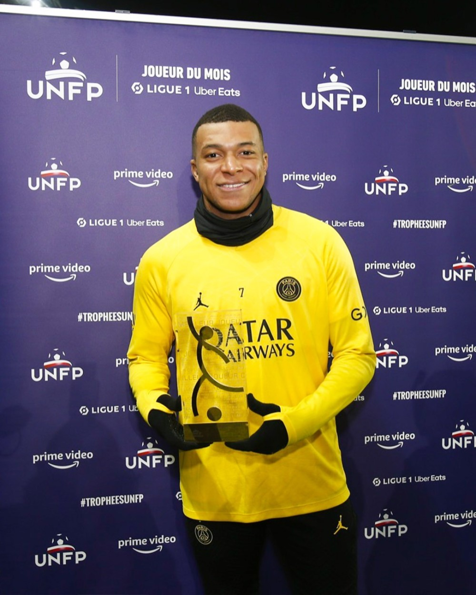

法甲第20轮，巴黎圣日耳曼主场1-1战平兰斯。进球功臣是内马尔，然而梅西和姆巴佩状态欠佳，评分分列倒数第一和倒数第二！

太狠了！利物浦大将输急眼：爆踹18岁新星脚踝，还好意思偷笑

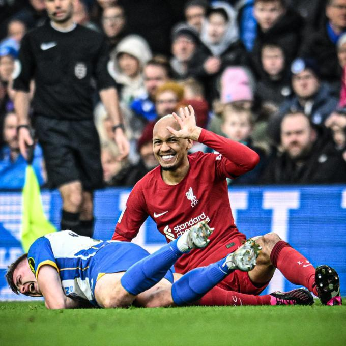

利物浦客场1-2被布莱顿逆转，卫冕之路就此打住。这一场比赛，利物浦中场大将法比尼奥一次犯规动作招来巨大的争议，在逃过红牌处罚之后，他还得意洋洋地偷笑。

风云变幻！五大联赛冠军全部卫冕失败？2大超级霸主恐翻车

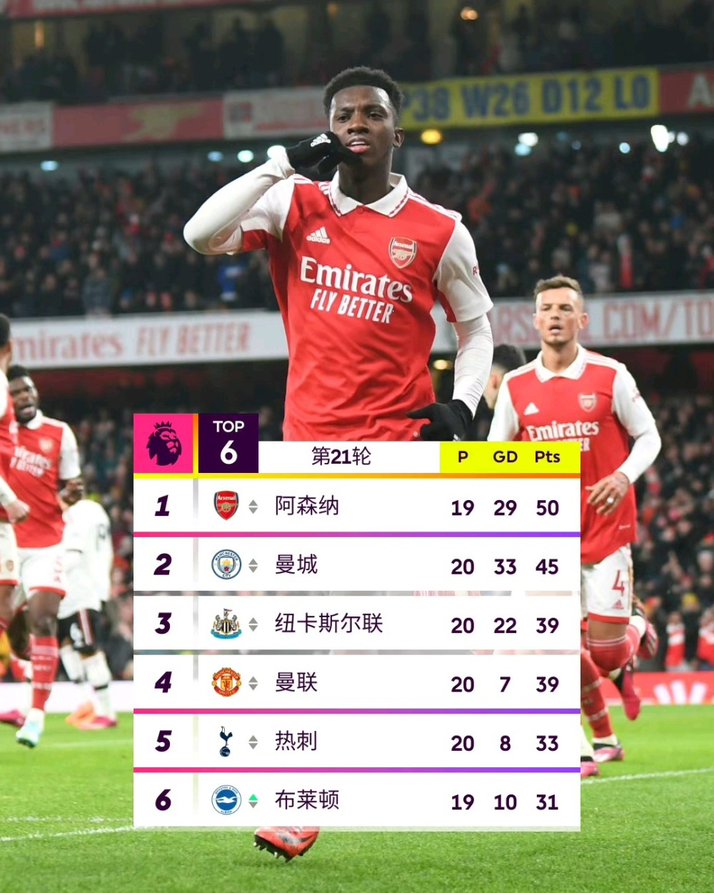

欧洲五大联赛的新一轮较量结束，卫冕冠军们的日子并不好过，赛季结束时全部卫冕失败？不是没有可能的事情！

篮球早报

黄蜂爆冷灭热火！罗齐尔31分＋两中压哨三分 巴特勒28分遭里程悲

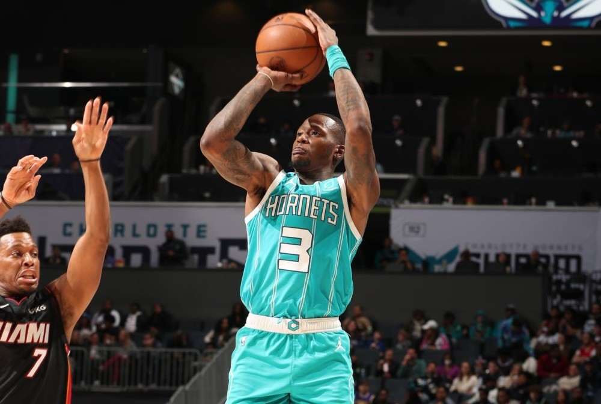

黄蜂主场122-117爆冷击败热火，完成13分逆转，避免被对手三杀。罗齐尔发挥出色，轰下31分，两次命中压哨三分。热火最多领先黄蜂13分，但黄蜂在下半场完成逆转。巴特勒得到28分，本场比赛解锁13000分里程碑，但输给黄蜂这支东部排名倒二的球队，里程碑也变成了里程悲。

全明星扣篮大赛名单出炉：鹈鹕小将搭上末班车 官媒一周前喊话奏效？

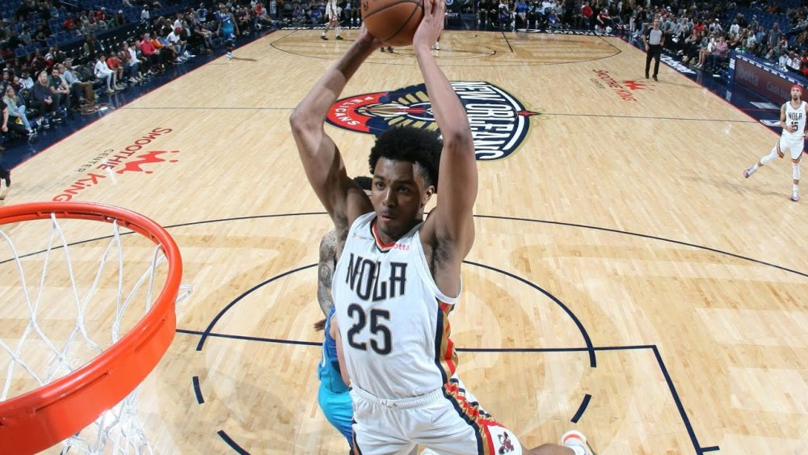

据NBA记者Andrew
Lopez报道，墨菲三世受邀参加2023年全明星扣篮大赛。美媒晒出了扣篮大赛的最终4人名单，他们分别是鹈鹕的墨菲三世、G联赛的麦克朗、开拓者的夏普和火箭的小马丁。墨菲三世搭上了末班车，谁将成为NBA的新扣篮王？

抗议联盟？湖人官宣战篮网轮休詹皇浓眉 魔术师发声：裁判搞砸了一切

湖人官方正式公布下一场对阵篮网的伤病报告，詹姆斯（左脚踝酸痛）和浓眉（右脚应激反应）都轮休不打，另外里夫斯（左腿筋拉伤）、小皮蓬和斯威德也缺席比赛，朗尼-
沃克大概率出战；湖人篮网大战，詹眉同时轮休，这是湖人向联盟抗议的一种方式。

意难平！詹皇时隔13小时再喊不理解 突破获得哨子占比仅9.5％

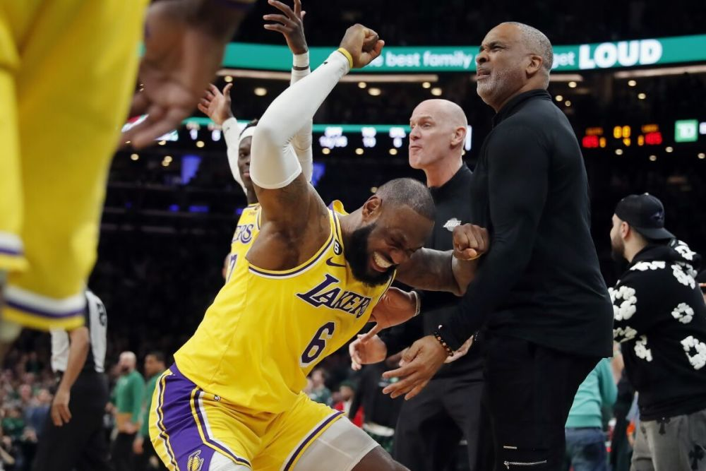

美媒pickuphoop晒出湖人在两周内四次争议动作均未被吹罚的图集。詹姆斯转发并评论道：“我不理解。我真的不理解。”这是詹姆斯时隔13小时再次更新社媒，此前，他在当地时间凌晨曾发推写道：“这场失利太受伤了！！！我不理解。”

转会市场动态汇总：小卡希望快船补强控卫 联盟高管关注保罗交易情况

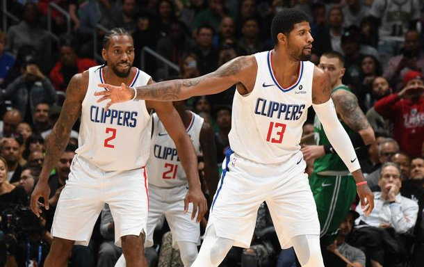

NBA交易截止日倒计时11天，联盟又有哪些市场动态呢？小卡表态希望快船补强控卫，快船与多支球队争夺洛瑞；开拓者仅利拉德、格兰特和安芬尼三人是非卖品；联盟高管关注保罗的情况。

重要赛事预告

07:00 NBA常规赛 步行者VS灰熊

08:00 NBA常规赛 快船VS骑士

09:00 NBA常规赛 鹈鹕VS雄鹿

