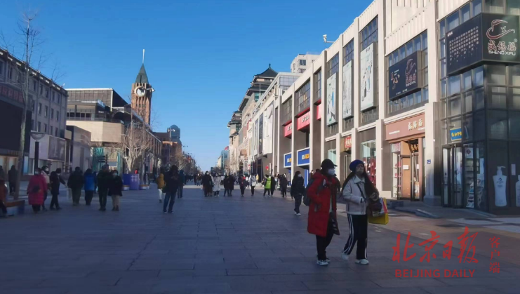

# 北京：重点商圈将开展外摆试点，经营者向所在街道网上报备

北京日报客户端 | 记者 曹政

近日，北京市发改委、北京市商务局联合印发了《清理隐性壁垒优化消费营商环境实施方案》。方案提出51项改革任务打通痛点堵点，其中包括在重点商圈组织开展外摆试点，由区政府统筹组织相关部门划定外摆位。

_图为王府井商业街。谢永利摄_

“《实施方案》推动符合消费企业特色的改革创新，聚焦促进消费提质升级的创新经营需求，进一步放宽准入限制，调整工作流程，完善标准规范，提出8方面24项改革任务，推动实现‘企业有创新，政府跟得上’。”市发改委相关负责人说。

根据方案，本市将加快规范商圈广告、外摆、展示、促销等事项办理流程和标准。针对企业反映的户外广告设施设置规划编制进展慢、外摆经营缺少管理实施细则、户外展示设施管理规则不明确、举办活动管理不规范等问题，完善户外广告设施管理配套制度，制定实施商圈外摆经营管理规则，优先出台位于重点商圈的规划，及时公开户外广告设施、牌匾标识设置方案。

同时，在重点商圈组织开展外摆试点，由区政府统筹组织相关部门划定外摆位，明确外摆时间、经营品类等细则，由经营者向所在街道进行网上报备，由街道对细则落实情况进行监管。出台户外展示设施设置标准规范及管理细则，明确办理流程、申请材料、办理时限等内容并向社会公布。优化促销“无需许可活动报告”内部管理流程，属地公安、消防等部门提前开展安全指导。

