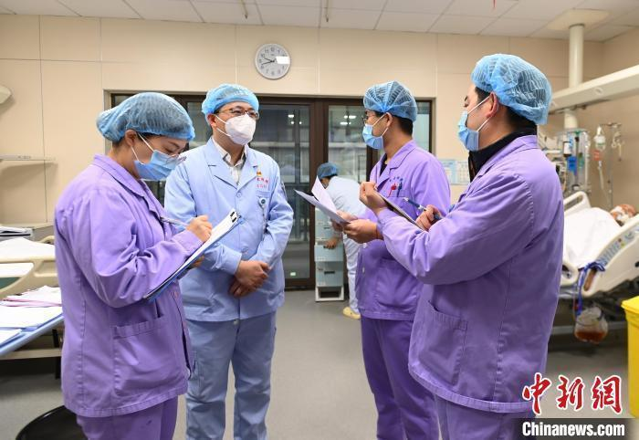

# 新冠病毒传不动了？专家称目前尚未感染人群受影响最大

中新网北京1月30日电(韦香惠)近日，中国疾病预防控制中心发布的全国新型冠状病毒感染疫情情况显示，新冠病毒感染率呈下降趋势。专家认为，该情况并非病毒本身发生变化，而是与先前大规模人群感染形成免疫屏障有关，短期内病毒传播速度会变慢。后期仍有可能出现高峰，但情况不会像去年年底一样严重。

_全国报告人群新型冠状病毒核酸检测阳性数及阳性率变化趋势
图片来源：中国疾病预防控制中心_

**新冠病毒传不动了？**

中国疾病预防控制中心官网于25日发布的全国新型冠状病毒感染疫情情况显示，2022年12月9日以来，各省份报告人群核酸检测阳性数及阳性率呈现先增加后降低趋势。2022年12月以来，部分省份建立居民抗原检测信息收集应用程序(APP)，居民可自愿上传抗原检测结果。结果显示，各省份报告抗原检测量较低，呈现逐渐减少趋势。

据人民日报健康客户端27日报道，对于新冠病毒感染率所呈现的下降趋势，上海中医药大学急危重症研究所所长方邦江教授解释称，“新冠病毒传播渐渐变弱，并非因为病毒本身有重要变化，而是社会面维持一定低水平传播，巩固了免疫屏障，加上绝大多数人都感染了，形成了群体免疫，病毒有点‘传’不动了。”

对此，北京佑安医院呼吸与感染性疾病科主任医师李侗曾29日向中新网介绍，过去两个月大部分地区有80%以上人群感染，从而建立了免疫屏障，短期内病毒传播速度会变慢，感染人数会下降。

_资料图：除夕探访医院重症医学科 安源
摄_

**专家：目前受疫情影响最大的是尚未感染人群**

李侗曾进一步表示，未来3到6个月后，感染后获得的免疫保护水平会下降，感染风险会增加，如果病毒继续变异出免疫逃逸能力更强的变异株，大家再感染风险会增加，出现新的高峰的概率会增加。

“但是不会像去年底的那一次那么严重了。” 李侗曾指出，免疫功能正常的人群感染后会获得免疫力，即使再次感染，重症风险也会更低，症状会有所减轻。

病毒学家、德国埃森大学医学院病毒研究所教授陆蒙吉29日向中新网表示，参考德国的情况来看，感染人数会持续在高位，而发病就医人数比以前会有所降低，但数量是波动的。

他认为，目前受疫情影响最大的是尚未感染人群，估计在15%到20%。这和此前整体人群都易感的情况相比，影响程度已有所减少。但鉴于中国人口基数，涉及到的人群规模还是巨大的。

北京市丰台区中西医结合医院呼吸与重症医学科主任乔树斌也认为，疫情从高峰到低谷，再从低谷到高峰，呈周期性发展，符合病毒发展规律。“像美国、日本便经历了新冠疫情以来的好几个高峰。”他表示，目前情况下，仍有必要继续做好个人防护。

李侗曾建议，感染过的人半年后可再接种加强疫苗获得更好保护，尤其是老年人和有基础疾病的人，应该优先通过接种疫苗获得更好的保护。

_资料图：医护人员在交流病人病情 安源
摄_

**中疾控：提升疫情预测与风险研判能力，重点监测变异株**

29日，中国疾病预防控制中心官网发布消息，17日上午，第66次新冠病毒感染疫情一级响应工作例会上，中国疾控中心主任沈洪兵强调，新冠疫情流行尚未结束，病毒变异仍存在不确定性，各单位仍须高度重视，特别是春节期间要加强应急值守。

沈洪兵指出，下一步，一是要进一步完善中心应急响应机制，特别是“乙类乙管”以后的平急转换机制；二是要尽快启动系列专项调查研究，为疫情防控提供科学支撑；三是要加强监测工作和监测系统建设，提升疫情预测与风险研判能力，尤其是对病毒变异株的监测。

中国疾病预防控制中心党委书记卢江也表示，当前的防控工作压力大、责任大，要把应急响应机制工作落实到位，思想不能松懈，确保召之即来、来之能战。(完)

