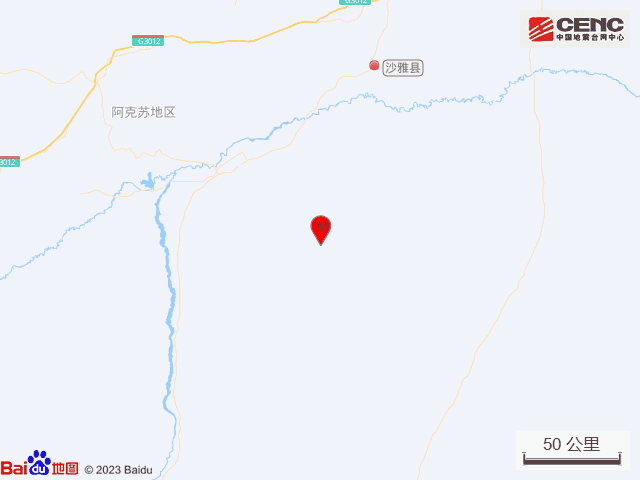
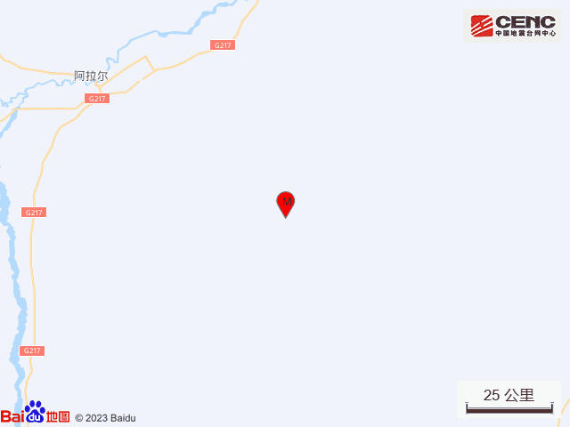
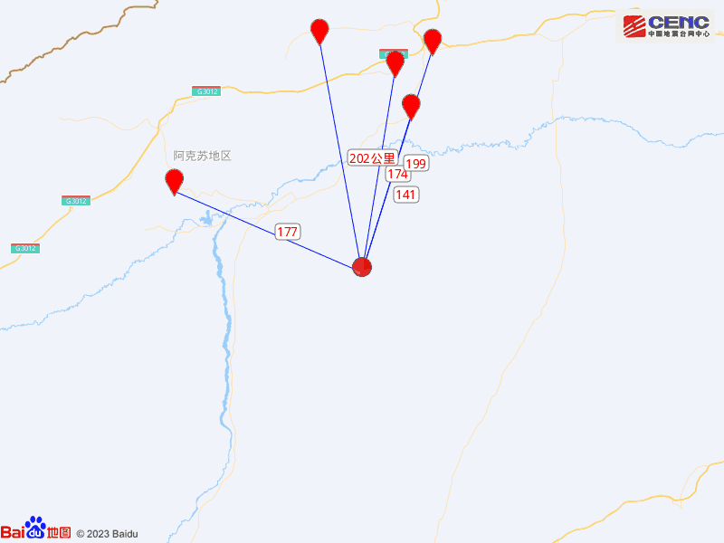
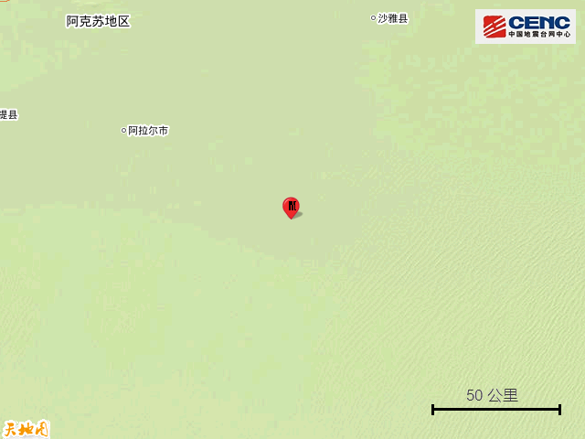
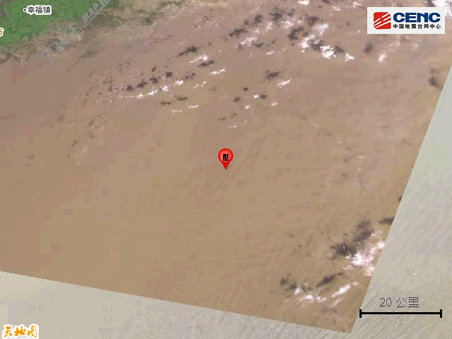

# 新疆阿克苏地区沙雅县发生6.1级地震，周边20公里内无村庄分布

据中国地震台网正式测定，1月30日7时49分在新疆阿克苏地区沙雅县发生6.1级地震，震源深度50千米，震中位于北纬40.01度，东经82.29度。

本次地震周边20公里内无村庄分布，100公里内无乡镇驻地分布。震中距沙雅县141公里、距新和县174公里、距阿瓦提县177公里、距库车市199公里、距拜城县202公里，距阿拉尔市105公里，距阿克苏地区215公里，距乌鲁木齐市611公里。

震中5公里范围内平均海拔约1024米。

根据中国地震台网速报目录，震中周边200公里内近5年来发生3级以上地震共218次，最大地震是本次地震按震级大小前50次历史地震分布如图。

官方提醒震中附近的网友注意安全，小心强余震。

