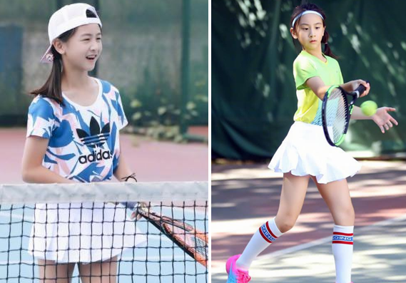

# 田亮女儿打职业赛！中国网坛新希望，14岁长到1米7，森碟出息了

近日，在ITF官网上显示，跳水奥运冠军田亮的女儿田雨橙（绰号是森碟），获得外卡机会，将首次亮相国际职业赛场，参加新加坡青少年冠军赛J30，之前就有媒体爆出过森碟练习网球的视频，而从她小小年纪就已经拥有修长身材、力量感十足的状态，可能田亮真的想要把女儿朝着职业化培养了。

根据赛程，森碟的第一场正式比赛的对手，是来自新加坡的网球女选手，两人年纪相仿，能力情况还不知道，相信田亮会认真给女儿进行赛前动员和心态调整，毕竟父亲是奥运冠军，这方面的经历很多，应该会帮助森碟克服很多压力。

众所周知，田亮的女儿森碟是14岁了，目前她已经跟妈妈叶一茜差不多高了，要知道，叶一茜的官方身高是1米70，在女性中算是很高了，而她的女儿已经接近母亲的个头，看来身材发育还是很到位的。

毕竟如果未来要成为职业网球选手，身高是一个硬指标，很多顶尖的女网球运动员，都是身高体壮、爆发力十足的，森碟其实具备这个潜在条件，至少在同龄人当中，森碟已经比较拔尖了。

森碟简直就是田亮的翻版，虽然性别不同，但她完美继承了“跳水王子”的颜值基因，从小就是五官精致，样貌清新，眼神无比坚毅和笃定，未来肯定是运动系女神一枚。

不仅如此，森碟还有“童星”标签，如果可以在网球事业上取得突破，她的商业价值将无限大，绝对会超越老爸田亮，毕竟中国体育圈非常缺少这样“偶像”与“实力”并存的女运动员，期待森碟可以不急不躁，努力训练，将来能成大器。

