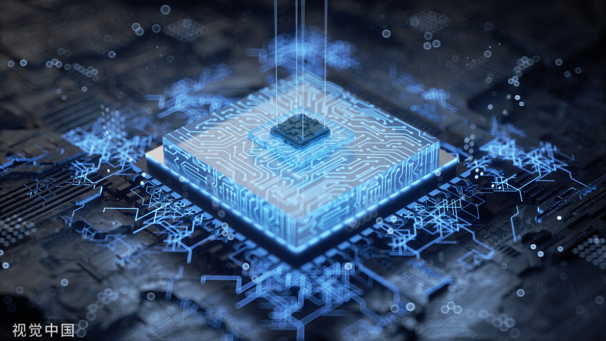

# 美日荷“神秘协议”对华设限，日荷不愿公开与美谈判细节

【环球时报驻日本、荷兰特派特约记者 岳林炜 张亮 环球时报记者 乔文姝】
“这是一个神秘的协议。”在美国媒体放风“美已和荷兰、日本就限制向中国出口先进芯片制造设备达成协议”两天后，三国政府仍拒绝置评。《纽约时报》28日称，因为其敏感性，三国没有公开宣布该协议，细节也尚不清楚。

美国专家认为，日本和荷兰需要时间来修改其法律法规以实施新的限制措施，相关措施“可能需要数月甚至数年才能相互呼应”。经常高调宣扬“围堵中国”的白宫此次异乎寻常地低调，引发媒体猜测。《金融时报》引述专家的分析称，虽然美国官员希望将该协议视为“胜利”，但他们面临着约束：不想进一步激怒盟友。目前尚不清楚这些国家将使用什么机制限制其芯片设备公司的对华出口。

在该事件中最受关注的荷兰光刻机生产企业阿斯麦28日发表声明称，新措施不会对其2023年度的销售额产生影响。但荷兰和日本媒体普遍认为，如果相关措施实施，将会对本国企业在中国市场的前景产生重大影响，促使中国寻求其他供货商并自行研发技术。

**美国为何不公开协议内容？**

彭博社、《华尔街日报》等媒体28日引述知情人士的话说，美国、荷兰和日本三国的国家安全事务官员27日在白宫结束高级别谈判，就限制向中国出口一些先进的芯片制造设备达成协议，将把美国于2022年10月采取的一些出口管制措施扩大到荷兰阿斯麦、日本东京电子和尼康等公司。

这些报道被多家媒体转载、求证，但相关三国政府均拒绝置评。日本内阁经济产业大臣西村康稔28日对媒体表示，将在国际协商的基础上“严格实施出口管制”，“希望根据各国的管制动向采取恰当的应对措施”。他以外交事务为由拒绝透露日美荷三国协商的具体内容。《日本经济新闻》称，日本目前实施对外出口管制的依据是《外汇及外贸管理法》。经济产业省将根据日美荷协议的具体内容，着手研究包括修改法律法规在内的应对措施。

据荷兰即时新闻NU报道，荷兰首相吕特27日在其每周新闻发布会上称，政府内阁不太乐意披露与美国、日本就新出口限制进行谈判的结果，“这些会谈已经进行了很长时间，我们对此什么也没说”。路透社称，当被问及阿斯麦公司是否需要被告知相关决定以实施新限制时，吕特表示，政府与该公司的沟通“也是私密的”。报道提到，吕特政府此前曾表示，它打算与美国就出口管制达成某种协议，但不会简单地采用美国的规则。荷兰国家电视台称，负责审批阿斯麦公司出口许可证的荷兰外贸大臣施赖纳马赫尔27日称，荷兰政府不会根据美国的要求作决定。

美国为什么不公布协议内容？《金融时报》28日引述一家咨询公司技术专家保罗·特里奥洛的分析称，“美国官员可能希望将任何协议视为胜利，但要避免在（2022年10月）单方面宣布限制措施后进一步激怒盟友”，“美国政府现在强调与盟友合作，但其《通胀削减法》正面临欧盟和亚洲盟友的批评”。

“我们现在需要与相关部门进行对话，看看它究竟意味着什么。”阿斯麦公司发言人28日表示。路透社称，阿斯麦是全球芯片生产设备主要供货商之一，自2019年以来一直被限制不得向中国出售最先进的光刻机。该公司28日发表声明称，它了解到政府间已采取措施达成协议，协议针对先进的芯片制造技术，包括但不限于先进的光刻设备。“在它生效之前，必须详细说明并完成立法，这需要时间。”声明说，根据政府官员的评论及其对时间表的理解，“我们预计这些措施不会对我们公布的2023年预期产生实质性影响”。阿斯麦公司本月25日公布财报，预计该公司2023年销售额同比将增长25%以上。

“如果日本引入新限制措施，中国有可能采取对抗措施。”《日本经济新闻》29日称，针对美国的对华出口管制措施，中国已于2022年12月12日在世贸组织（WTO）提起诉讼，批评美方“滥用出口管制措施，阻碍芯片等产品的正常国际贸易，威胁全球产业链供应链稳定，破坏国际经贸秩序，违反国际经贸规则”。

“这就是历史性的阿斯麦协议，一个相当神秘的协议，再次标志着全球化和自由贸易时代的暂时结束。”比利时荷兰语媒体《晨报》27日称，美国的目的是扼杀中国在芯片、超级计算机和人工智能领域的进步，挫败中国的“军事现代化”。

**“美国、荷兰、日本都担心对手抢占中国市场”**

《纽约时报》28日称，美国、荷兰与日本都有能力制造全球最先进水平的半导体设备。“新协议能让这些国家的科技行业处于更平等的地位，防止日本和荷兰的公司争先恐后地夺取被美国公司放弃的中国市场份额。美国公司曾表示，这种可能性会使他们处于不利地位。”华盛顿智库战略与国际问题研究中心高级研究员艾米丽·本森说，与美国人一样，荷兰人和日本人担心，如果他们退出中国市场，外国竞争对手会取而代之。报道称，该协议实施的另一个担忧是，日本和荷兰政府面临着是否拥有像美国那样发布出口限制的合法权力，以及关于限制哪些技术的广泛讨论。本森称，日本和荷兰可能需要一些时间来修改其法律法规，这三个国家的限制措施可能需要数月甚至数年才能相互呼应。

美国这种为阻挠中国高科技发展而牺牲其他国家利益的行为，引发各方不满。荷兰《电讯报》称，中国大陆市场占阿斯麦去年营收的15%。少了中国买家，虽然短期内对阿斯麦影响不大，但长期而言仍会流失潜力巨大的市场，且禁令将促使中国更积极寻求其他供货商并自行开发技术，为阿斯麦制造对手。

《日本经济新闻》29日称，全球半导体制造设备市场由排在第一位的美国应用材料公司、第二位的荷兰阿斯麦及排在第三位的日本东京电子等展开竞争。日本和荷兰的企业拥有不依赖美国技术的产品，因此对华出口不受美国政策限制。据日本半导体制造设备协会介绍，2021年度，对中国的销售额占日本半导体设备出口额的33％。其中，东京电子2021财年（截至2022年3月）的约2万亿日元合并销售额中，对中国的销售额占26％。报道称，如果引进美国要求的限制措施，日本企业将受到很大影响。日本政府一直在“水面下”探索可采取的措施，将在考虑对日本企业影响的同时，确定实际引入的具体措施。

**“最终他们会到达那里”**

《晨报》27日称，冷战时期分隔东西方的是“铁幕”，如今全球半导体领域降下的是“硅幕”。报道认为，芯片制造技术非常复杂，但全球芯片产业结构却非常简单：最重要的芯片设计商在美国，制造商在中国台湾和韩国，设备商在荷兰和日本。这些国家联手降下“硅幕”，就有机会阻挡中国。

“中国能把光刻机做出来，我对此从不怀疑”，中国信息消费联盟理事长项立刚29日对《环球时报》记者表示，日本和荷兰在美国的逼迫下加入对华限制行列，他们自己将承受巨大损失。这些措施不能说对中国完全没有影响，但是想借此完全改变世界芯片产业的格局，或者击垮中国的芯片产业，这不符合事实。对于美国主导的对华“芯片围堵”，我们早有准备。

“由于美国的制裁，中国最终将学会制造那些无法进口的半导体生产设备。”阿斯麦公司首席执行官温宁克1月25日接受彭博社采访时说。“如果他们无法获得这些机器，他们将自己开发。这需要时间，但最终他们会到达那里，”他说，“你越给他们压力，他们就越有可能加倍努力。”

