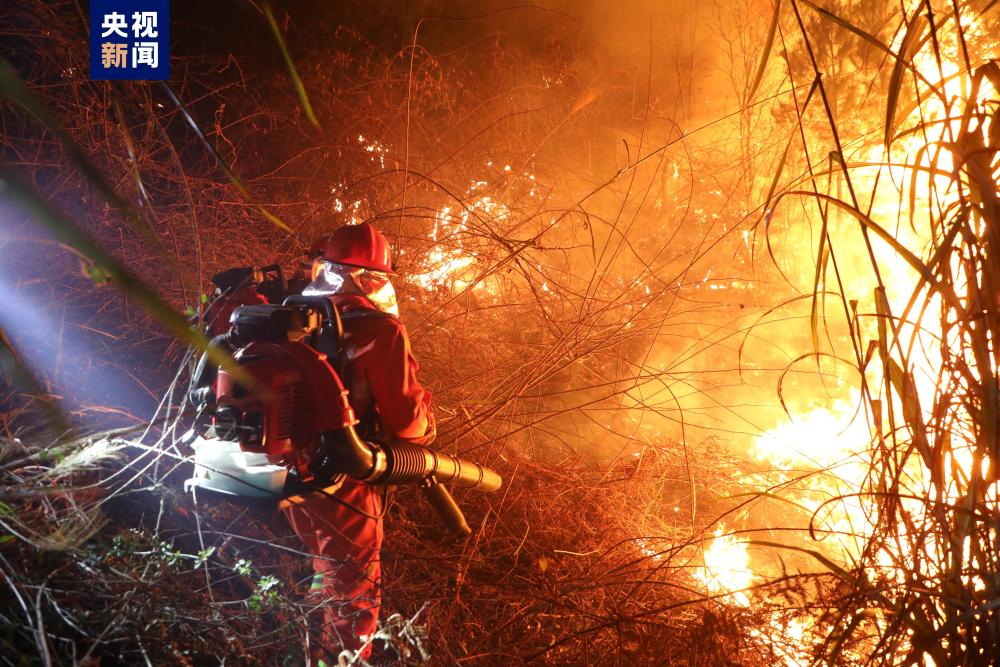
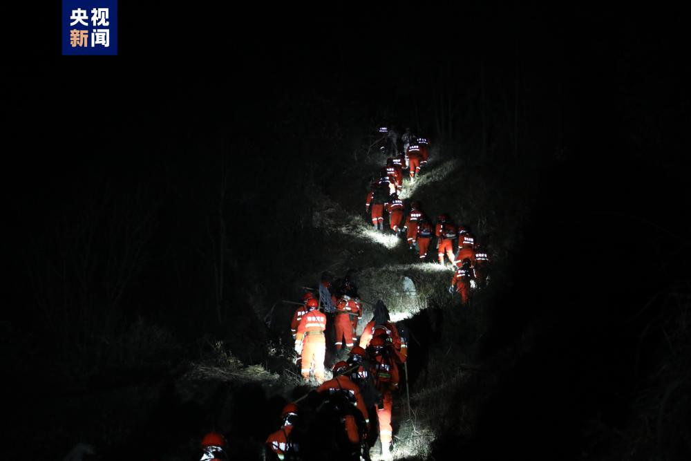
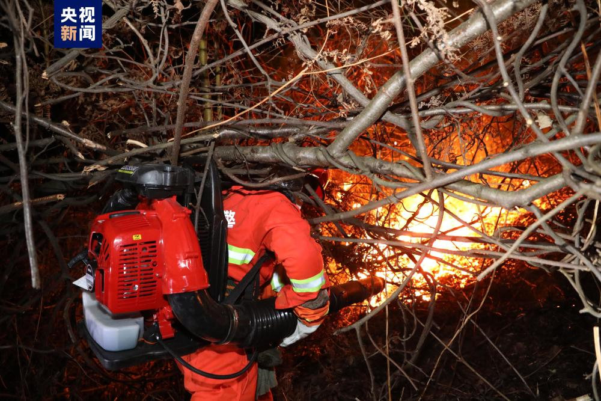
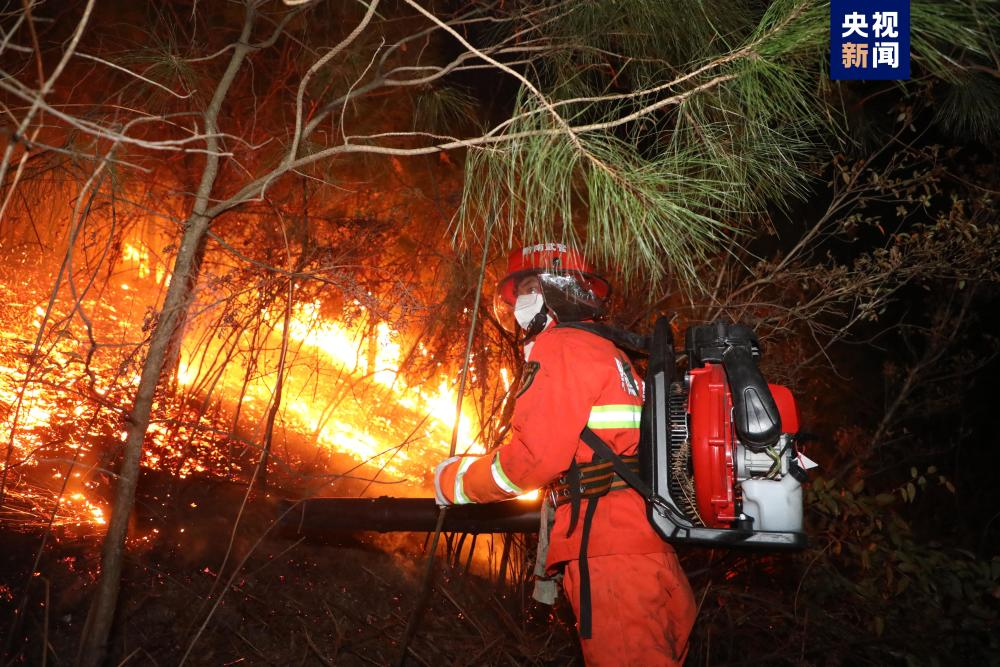
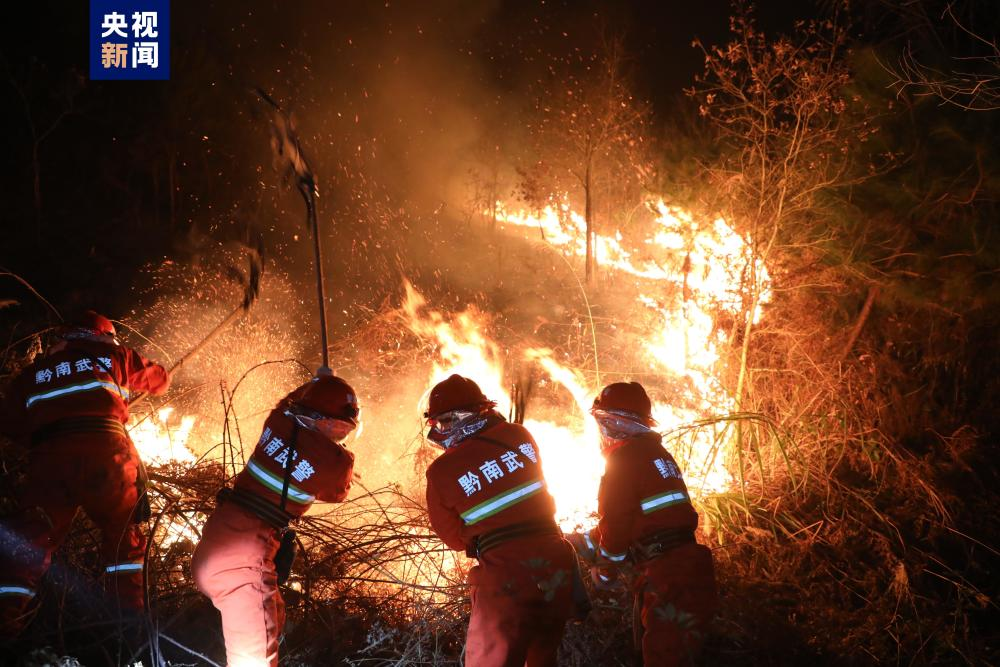

# 贵州都匀突发山林大火，过火面积逾千亩涉3个乡镇

1月29日上午9时，贵州黔南州都匀市发生一起山林火灾，过火面积千余亩，涉及3个乡镇。目前救援人员仍在紧张扑救中。

据了解，火场为山地地形，地势险要，平均坡度均在50°以上，最大坡度84°，火场植被主要为松树林和灌木林，林下杂草丛生，昼夜温度相差20℃左右。灾情发生后，武警黔南支队分三个梯次，先后出动数百名官兵全力扑救山火。

截至1月30日晚，任务官兵连续鏖战达25个小时，转战4个火场，仍然奋战在灭火一线。

来源 央视新闻客户端

编辑 曾佳佳

流程编辑 马晓双

