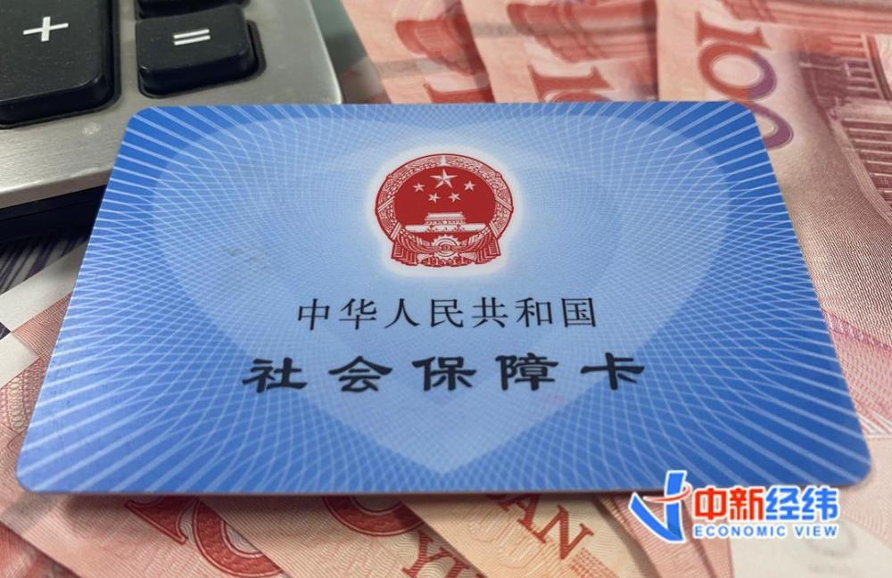

# 2月新规来了！事关炒股、出境游，贵州将上调最低工资标准

中新经纬1月31日电
(熊思怡)试点恢复旅行社出境团队旅游业务、不得违规限制证券投资者销户、贵州上调月最低工资标准、深圳恢复限行……2023年2月，一大波新规将施行，影响你我生活！

**全国性新规**

**试点恢复旅行社出境团队旅游业务**

文旅部消息，2023年2月6日起，试点恢复全国旅行社及在线旅游企业经营中国公民赴有关国家出境团队旅游和“机票+酒店”业务。即日起，旅行社及在线旅游企业可开展产品发布、宣传推广等准备工作。

**不得违规限制证券投资者销户**

《证券经纪业务管理办法》2023年2月28日起施行。《办法》提到，证券公司应当将交易佣金与印花税等其它税费分开列示，保护投资者知情权；为投资者转户、销户提供便利，不得违反规定限制投资者转户、销户。

**减少企业中长期外债监管盲区**

《企业中长期外债审核登记管理办法》将于2023年2月10日施行。国家发展改革委有关负责同志介绍，《管理办法》对债务工具类型予以细化，在有效满足市场主体需要、鼓励创新的同时，减少监管盲区。

**新版《城镇污水排入排水管网许可管理办法》施行**

住建部修改《城镇污水排入排水管网许可管理办法》，自2023年2月1日起施行。办法明确，排水户
**不得有向城镇排水设施排放有害气体和烹饪油烟、擅自向城镇排水设施加压排放污水** 等危及城镇排水设施安全的活动。

**室内空气质量指标增至22项**

GB/T 18883-2022《室内空气质量标准》自2月1日起实施，增加了三氯乙烯、四氯乙烯和细颗粒物等3项化学性指标及要求，
**室内空气质量指标由原来的的19项变为22项**
。调整了5项化学性指标(二氧化氮、二氧化碳、甲醛、苯、可吸入颗粒物)、1项生物性指标(细菌总数)和1项放射性指标(氡)要求。

**工业节能监察不得向被监察单位收取费用**

工业和信息化部近日公布《工业节能监察办法》，自2月1日起施行。办法强调，工业节能监察遵循依法、公开、公平、公正和效能原则。工业节能监察不得向被监察单位收取费用。

**微波通信系统频率优化调整**

为进一步满足经济社会发展对微波通信的需求，有效提高频率使用效率和综合效益，促进微波通信产业健康发展，工信部印发通知对微波通信系统可用频率进行调整，调整后微波通信系统可使用频率为4500-4800MHz、7125-7725MHz、7725-8500MHz、10.7-11.7GHz、12.75-13.25GHz、14.5-15.35GHz、21.2-23.6GHz和71-76/81-86GHz，同时规定了更灵活的波道带宽配置。上述通知自2023年2月1日起施行。

**新修订的《烈士安葬办法》施行**

新修订的《烈士安葬办法》自2023年2月1日起施行。主要修订内容包括：一是调整主管部门，将烈士安葬活动的主管部门由民政部门调整为退役军人工作主管部门；二是完善烈士送迎仪式；三是健全烈士安葬仪式；四是增加搜寻发掘烈士遗骸安葬内容；五是拓展失踪烈士或者境外安葬烈士祭扫纪念途径；六是与战时牺牲人员收殓安葬等规定做好衔接。

**地方性新规**

**贵州：上调月最低工资标准**

2月1日起，贵州省最低工资标准调整。调整后，月最低工资标准为：一类地区每月1890元，二类地区每月1760元，三类地区每月1660元。2019年印发的《关于调整贵州省最低工资标准的通知》(黔人社发〔2019〕16号)废止。

**武汉：普通门诊费用可报销**

在前期实现职工医保个人账户家庭共济的基础上，2月1日起，武汉市将正式实施职工医保门诊统筹，“普通门诊费用不能报销”将成为历史。届时，武汉市职工门诊治疗费用将纳入医保统筹基金支付范围，报销比例从50%起步，并同步调整职工医保个人账户的计入办法。

_资料图。中新经纬熊思怡摄_

**上海：禁止“将住房用于群租”**

《上海市住房租赁条例》将于2023年2月1日起施行。据悉，此次立法明确禁止“将住房用于群租”，加大对“二房东”监管力度，促进租赁双方建立稳定的租赁关系，从公共安全和秩序方面，进一步规范租赁行为和完善管理制度。

**深圳：6日起恢复原定限外措施**

深圳市公安局交通警察局通告，2023年1月1日至2023年2月5日期间(腊月初十至正月十五)，暂停执行限外措施，期间允许所有非深圳号牌小型载客汽车在深圳全市全时段通行。2月6日起，恢复原定限外措施。

_资料图。中新经纬熊思怡摄_

**济南：全面恢复举办展览活动**

济南市商务局通知，拟定自2023年2月1日起，济南市全面恢复举办各类展会活动。展会举办期间，各会展企业、会展场馆要按照新时期新阶段国家、省、市疫情防控有关要求抓好落实，确保全市各类展会活动安全有序。

**重庆：生活垃圾分类质量监测管理办法施行**

为加强重庆市生活垃圾分类管理，提高生活垃圾分类水平，规范生活垃圾分类质量监测工作，重庆制定《生活垃圾分类质量监测管理办法》，自2月1日起施行。《办法》指出，生活垃圾分类质量监测通过
**暗访抽查** 方式，进行抽样监测，分析和监督生活垃圾分类质量状况。

**四川：“双不”新规施行**

《四川省市场监管领域不予行政处罚、不予实施行政强制措施适用规则》(下称《“双不”新规》)出台2月1日起正式施行，
**以清单形式明确不予行政处罚和不予实施行政强制措施的市场监管领域部分违法行为。**

**江苏：预备性工作时受伤可算工伤**

江苏省《关于执行工伤保险有关政策的意见》2月1日起正式施行，条款明确，职工在上班前和下班后的一段合理时间内，搬运、清洗、准备、整理、维修、堆放或收拾其工具和工作服，或者根据法律法规、行业操作规程、用人单位规章制度规定，为完成工作所作的其他准备或者后续事务，视为预备性或者收尾性工作。在此期间受到的伤害均可认定为工伤，从而进一步规范了全省工伤认定工作。

**宁夏：修订科技奖励办法，新设两大奖项**

新修订的《宁夏回族自治区科学技术奖励办法》对办法内容做出了诸多调整，奖项类别由5项增加至7项，由一年一评调整为两年一评，2023年2月1日起正式实施。其中，宁夏重大科学技术贡献奖奖金为200万元，获奖者事迹载入宁夏地方志。(中新经纬APP)

**中新经纬版权所有，未经书面授权，任何单位及个人不得转载、摘编或以其它方式使用。**

