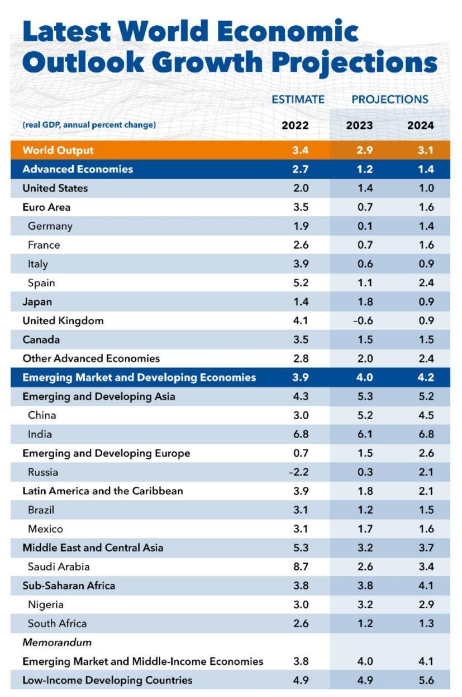

# IMF：今年全球增长预计2.9％，欧美经济放缓，中印将成主要引擎

**21世纪经济报道记者 郑青亭 北京报道**

当地时间1月31日，国际货币基金组织（IMF）在新加坡发布最新一期《世界经济展望》报告。报告称，2022年的全球增长率估计约为3.4%，2023年预计将降至2.9%，2024年升至3.1%。

与去年10月的预测相比，2022年增长率的估计值和2023年的预测值均被上调了约0.2个百分点，这是因为许多经济体的增长表现和韧性都强于预期。自2021年10月以来，IMF已三次下调全球经济增速预期，因此，这次上调或许意味着全球经济终于在漫长的隧道中看到了曙光。

尽管如此，2023年和2024年的全球增长率预计将低于3.8%的历史（2000-2019年）年均水平。IMF首席经济学家皮埃尔-
奥利维耶·古兰沙说，各国央行为抗击通胀采取的加息政策以及俄乌冲突将继续在2023年对经济活动造成拖累。

与全球需求走势相一致，报告显示，2023年世界贸易增速预计将降至2.4%，尽管供给瓶颈将有所缓解；2024年，世界贸易增速将升至3.4%。

根据IMF的预测，发达经济体的增速放缓将更加明显，其整体增速预计将从去年的2.7%大幅下降到今明两年的1.2%和1.4%。预计约90%发达经济体的增速将在2023年放缓。

受美联储陡峭加息路线的影响，美国的增长率预计将从2022年的2.0%下降到2023年的1.4%和2024年的1.0%。欧元区的情况更具挑战性，其增长率预计将在2023年触及0.7%的谷底，并于2024年回升至1.6%。英国2023年的增长率预计为-0.6%，2024年将反弹至0.9%。

根据IMF的预测，新兴市场和发展中经济体的增长率，预计将从2022年的3.9%小幅升至2023年的4.0%和2024年的4.2%。约一半的新兴市场和发展中经济体2023年的增长率将低于2022年。

在中国优化调整防疫政策后，随着经济活动的复苏和人员流动的改善，预计中国经济增速将从去年的3.0%大幅升至今年的5.2%，明年小幅回落到4.5%。印度的增长率将从2022年的6.8%下降到2023年的6.1%，2024年将回升至6.8%。东盟五国（印度尼西亚、马来西亚、菲律宾、新加坡、泰国）今明两年的增长率预计将分别为4.3%和4.7%。

“印度与中国将占今年全球增长的一半，而美国和欧元区加在一起仅占全球增长的十分之一。”古兰沙指出，中印两国将成为今年全球经济的主要引擎。受中国经济影响，亚洲新兴和发展中经济体2023年和2024年的增长率将分别上升至5.3%和5.2%。

全球经济不利风险有所缓解

IMF认为，全球经济面临的不利风险在最近几个月已有所缓解。“前景并不像我们在去年10月的预测那样悲观，随着增长触底反弹、通胀开始下降，这可能代表一个转折点的到来。”古兰沙说道。

本月早些时间，IMF总裁格奥尔基耶娃在冬季达沃斯论坛上表达了类似观点。她说，全球经济形势“没有我们几个月前担心的那么糟糕”，虽然全球经济增速会较2022年略微下降，但好消息是，增速将在今年触底，明年将出现上行。

报告显示，许多经济体（包括美国、欧元区以及主要新兴市场和发展中经济体）的2022年第三季度实际GDP增长都出人意料地强劲。在许多经济体，这种意料之外的强劲增长得益于其国内因素：在劳动力市场紧张、财政支持强于预期的环境下，私人消费和投资比预期更为强劲。

此外，欧洲能源市场对俄乌冲突做出的调整也快于预期。通货膨胀也有所改善，大多数国家的总体指标现在都在下降，虽然核心通胀在许多国家尚未见顶。中国优化调整防疫政策也为经济活动的快速反弹铺平了道路。另外，随着通胀压力开始减弱，全球金融状况有所改善，再加上美元从去年11月的高点走弱，这让新兴市场和发展中国家获得了一定程度的喘息空间。

但总体而言，全球经济前景仍面临下行风险。古兰沙列举了的下行风险包括：若出现新一波疫情，有些国家可能重启抗疫限制措施，这可能令经济复苏受阻；俄乌冲突可能会升级；全球融资环境收紧可能会加剧债务困境。另外，不利的通胀形势可能导致金融市场突然重新定价，而地缘政治的进一步割裂可能阻碍经济发展。

通胀在低增长环境中见顶

报告称，预计约84%国家的2023年总体（消费者价格指数）通胀将低于2022年水平。全球通胀将从2022年的8.8%（年平均值）降至2023年的6.6%和2024年的4.3%，但高于疫情前（2017-2019年）约3.5%的水平。

通胀预测值的下降在一定程度上反映了全球需求疲软导致的国际燃料和非燃料大宗商品价格的下跌，同时，也反映了货币政策收紧对基础（核心）通胀的降温效应。

尽管如此，IMF警告，降低通胀仍需要一定的时间。到2024年，82%经济体的年均总体通胀预计仍将高于疫情前水平，而86%经济体的年均核心通胀率仍将高于疫情前水平。

“通胀消息令人鼓舞，但这场战斗还远未获胜。货币政策开始发挥作用，许多国家的新房建设活动有所放缓。然而，欧元区和其他经济体的实际利率仍然很低甚至为负，许多国家货币紧缩的速度和有效性都存在很大的不确定性。”古兰沙说道。

古兰沙强调，在通胀压力仍然过高的情况下，央行需要将实际政策利率提高到中性利率以上并保持在该水平，直到基础通胀率处于明确的下降道路上。“过早放宽政策可能会抵消迄今为止取得的所有成果。”

此前，美国前财长萨默斯也表达了类似观点。他警告，如果各国央行没有完成他们已经开始的工作，让通胀得到控制，这将是全球经济的“最大悲剧”。“目前最大的悲剧是，如果央行过早地偏离了确保价格稳定的重点，我们将不得不两次参与这场战役。”

国际机构看好中国经济前景

在全球经济持续低迷的背景下，中国及时优化调整新冠疫情防控措施被视为“2023年最重要的经济大事”。除了IMF，不少国际组织和外资机构也纷纷上调对中国2023年经济增长预期，认为中国优化调整防疫政策将为中国和全球经济复苏创造动力。

格奥尔基耶娃就在近期表示，尽管中国经济去年的表现不尽人意，但很可能从2023年中期开始发力，并再次帮助推动全球增长。她强调，中国从动态清零政策走向复常可能是今年全球增长的最重要推动力。

摩根士丹利中国首席经济学家邢自强向21世纪经济报道记者表示，2023年将出现“西方不亮东方亮”的局面。他说，在全球经济不景气、欧美面临准衰退的背景下，中国经济今年有望实现5.7%的反弹，成为全球一道亮丽的风景线。

在邢自强看来，今年，美国和欧洲需要消化过去两年的过度刺激，并继续化解高通胀，经济不景气难以避免；而中国则是要让经济重新转起来，重燃消费和投资的热情，且无需担心通胀问题。

瑞士百达财富管理亚洲宏观经济研究主管陈东向21世纪经济报道记者表示，全球经济将在今年上半年出现温和衰退，但在下半年出现反弹，全年经济增速预计为2.5%，低于2022年的3.0%。美国和欧元区均将在年初陷入温和衰退，2023年全年分别萎缩0.2%；而中国经济今年将增长4.5%，实现温和回升。

景顺亚太区（日本除外）全球市场策略师赵耀庭（DavidChao）向21世纪经济报道记者表示，2022年底，中国经济增长受疫情影响有所放缓，但放缓幅度并没有市场预期严重。近期发布的中国12月及第四季度经济数据好于预期，这意味着2023年中国经济增长和企业盈利可能出现上行惊喜，“投资者应会继续看好中国开放，并将其视作2023年亚太区市场唯一最重要的催化剂。”

他认为，一旦此轮疫情结束，中国经济可能会在消费的带动下迎来渐进但重大的反弹。他指出，疫情期间，家庭储蓄持续累积，去年超额储蓄约至人民币2万亿元，与此同时，自疫情开始以来银行存款增长近50%。随着人们对可自由支配物品的信心改善，他们可能会开始消费这些储蓄，并将部分资金投入房地产市场或国内股市等其他资产。

