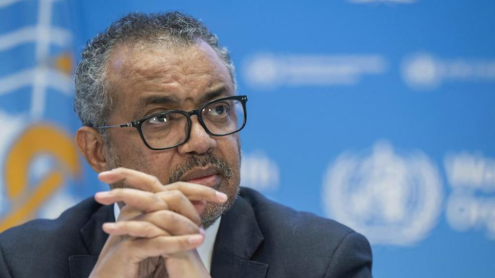

# 世卫维持新冠全球紧急状态，病毒学家呼吁新冠与流感监测并轨

_世卫组织总干事谭德塞 视觉中国
资料图_

悬念落地，新冠“全球紧急状态”仍未结束。

1月30日，世界卫生组织（WHO）官网发布《国际卫生条例（2005）》突发事件委员会第十四次会议关于新冠（COVID-19）大流行的声明。世卫组织总干事谭德塞同意该委员会提出的建议，确定新冠大流行继续构成国际关注的突发公共卫生事件（PHEIC）。会议于1月27日召开，引发公众关注。

声明称，总干事承认委员会的观点，即新冠大流行可能处于一个过渡点，并赞赏委员会有关谨慎应对这一过渡并减轻潜在负面影响的建议。

**新冠大流行接近拐点**

三年前的2020 年1 月30
日，世卫组织宣布将新冠疫情列为国际关注的突发公共卫生事件，并发布了联合国机构的最高警报级别。当年3月11日，世卫组织宣布新冠疫情构成全球大流行（global
pandemic）。此后每隔几个月，世卫组织的国际卫生条例紧急委员会都会召开一次会议，讨论新冠大流行是否符合称为“国际关注的突发公共卫生事件”的标准。

对于世卫组织维持新冠构成国际关注的突发公共卫生事件的决定，美国俄亥俄州立大学华裔病毒学家、美国微生物科学院院士刘善虑并不意外。

“现在结束还是有点早，关键是季节不是时候，冬季、春季还存在各种呼吸道疾病风险，不是结束的最佳时候。”刘善虑在接受澎湃科技记者采访时表示，如无意外，预计最快今年夏天世卫组织可能宣布终止新冠全球紧急状态，但未来几个月如果再出现毒力较强的新毒株，世卫组织也可能会延迟宣布结束全球紧急状态，“这也是世卫组织所考虑到的。”

德国华裔病毒学家、埃森大学医学院病毒研究所教授陆蒙吉认为，目前中国免疫屏障水平仍然较低，2023年年内还可能经历第二、三波疫情的冲击，因此2024年春天是（世卫）更合适的宣布时机。今年余下的几次委员会会期，“4、5月份期间无法排除第二波疫情出现，等到10月份，又快赶上季节性疫情高峰期”，世卫组织都不太可能宣布结束全球紧急状态。

根据具有约束力的国际条约《国际卫生条例》（IHR），国际关注的突发公共卫生事件需要符合三个标准：严重、突发、异常或意外；它有可能跨越国界传播；它可能需要协调一致的国际反应。

在本次会议上，委员会一致认为，新冠仍然是一种危险的传染病，有能力对健康和卫生系统造成重大损害。同时，委员会承认新冠大流行可能正在接近拐点。“通过感染和/或疫苗接种在全球范围内实现更高水平的人群免疫力，可能会限制新冠病毒对发病率和死亡率的影响，但毫无疑问，在可预见的未来，这种病毒仍将是人类和动物体内永久存在的病原体。”

委员会认为，
因此迫切需要采取长期的公共卫生行动，“虽然从人类和动物宿主中消除这种病毒的可能性很小，但减轻其对发病率和死亡率的破坏性影响是可以实现的，并且应该继续作为优先目标。”

**中国“目前整体疫情已进入低流行水平”**

上述会议前一天的1月26日，中国向世卫组织报告了更多病例和死亡病例。据中国疾控中心网站披露，去年12月8日至今年1月26日，全国累计在院新冠病毒感染相关死亡病例78960例，其中新冠病毒感染导致呼吸功能衰竭死亡6473例、基础疾病合并新冠病毒感染死亡72487例。

被问及中国提供的信息将在多大程度上影响紧急状态解除与否的决定，世卫组织发言人玛格丽特·哈里斯（Margaret
Harris）在接受财新记者采访时表示，“委员会审查了关于所审议问题的所有相关全球数据。”在声明中，委员会表示需要改进对住院、重症监护室入院和死亡的监测和报告，以更好地了解当前对卫生系统的影响，并适当描述新冠的临床特征和新冠病后的状况。

据陆蒙吉介绍，“世卫组织需要清楚了解中国疫情现状是否已经稳定下来。”

陆蒙吉指出，全球公认新冠不再构成紧急状态的条件，首先是新冠病毒对人群健康损害的严重性要下降到很低水平，最直观的数据是新冠阳性死亡人数非常低，或者处于稳定水平，其次是突发性要降到最低，不再出现特殊的有冲击力的突变株。这都要求人群建立很高的免疫屏障水平。

他拿德国举例，免疫逃逸能力极强的变异株XBB.1.5至今未能在德国成为主流毒株，
正表明德国人群对新冠病毒已建立较高的免疫屏障。这背后的主要原因是，德国mRNA疫苗接种率很高，年轻人普遍接种三针，而老年人已经接种四五针，再加上反复自然感染，“这是必然发生的，对于大部分健康人来说不会有很大影响。”

在免疫屏障水平普遍较高的欧美国家，病毒进化进程愈发受限，加速向免疫逃逸增强方向进化，突变位点逐渐趋同，从而可以预测。“对德国来说，许多专家认为现在已经具备宣布结束紧急状态的前提条件，新冠全球大流行对我们的影响不大，如果更多国家进入这种状态，问题自然解决了。”

“中国疫情还存在不确定因素，是否会出现新突变株，或者病毒进化是否会出现新的发展途径，都很难说。”陆蒙吉表示，由于免疫屏障水平较低，国外现已不再流行的毒株，可能在中国人群中还会有一定传播。因此一些老毒株可能会创造出新的进化空间，导致一些未知的毒株出现，其特征和致病力目前都无法预测。

“相当于国外人群免疫屏障到处筑围墙，把奥密克戎的路逼得比较窄，卡死了，但在中国人群里，新冠病毒却有可能突然冲开新路，这是一个潜在的问题。”陆蒙吉说。

他指出，目前许多国家对中国旅客入境还要求核酸阴性证明，少量入境时抽检发现的阳性病例，没有足够代表性，也不能说明国内的流行株状况。

1月30日，中国国务院联防联控机制召开新闻发布会，国家卫健委新闻发言人、宣传司副司长米锋在会上指出，“‘乙类乙管’措施落地见效，目前全国整体疫情已进入低流行水平，各地疫情保持稳步下降态势。”

**新冠与流感监测并轨**

世卫组织突发事件委员会承认，虽然目前在全球传播的奥密克戎（Omicron）亚系毒株具有高度传播性，但与早期的关注变种相比，感染和严重疾病之间存在脱钩。然而，病毒保留了进化成具有不可预测特征的新变种的能力。

在声明中，世卫组织秘书处也对相关问题表示关切，一是新冠病毒在不受控制地传播的情况下会继续进化，二是会员国报告与新冠发病率、死亡率、住院和测序相关数据的大幅减少。世卫组织重申及时共享数据以指导正在进行的大流行病应对工作的重要性，敦促各国保持警惕并继续报告监测基因组测序数据。

陆蒙吉指出，要降低新冠疫情的突发性，必须建立新冠病毒全球监测系统以及有效的合作机制。“如果这一步没有建立，世卫组织恐怕也不会轻易结束紧急状态，否则后面召集全球会议或者向某国要一个数据，都会很困难。所以我想还是会有一个比较长的过程。”

世卫组织总干事向所有缔约国发布了七项临时建议，其中重要一项是改进向世卫组织报告新冠病毒监测数据的工作。他建议缔约国采取利用全球流感监测和应对系统的综合方法进行呼吸道传染病监测。监测信息来源应包括：代表性哨兵人群、基于事件的监测、人类废水监测、血清监测和动物-
人类-环境监测。

在陆蒙吉看来，全球流感监测和应对系统（GISRS）已被证明是十分有效的交流评估机制，这套系统完全可以移植到新冠病毒监测上来，“中国也参与全球流感监测，取样、序列分析、全球通报机制等工作，都做得非常好，如果中国把新冠病毒监测整合到流感监测汇报体系中去，国际社会就不用担心了。”

刘善虑也对全球报道的病毒测序数据的下降表示担忧，“病毒的进化和重组都是将来可能发生的事，全球各国都应及时监测和分享病毒序列，全球性的汇报非常关键。”他同样强调，病毒监测和序列分享，不光是在人群中进行，在动物中也非常重要，“因为动物中传播的病毒，很可能会再传回到人。”

**结束紧急状态影响几何**

在1月27日的会议上，世卫组织突发事件委员会讨论了是否需要继续实施紧急状态，以维持全球对新冠的关注，如果国际关注的突发公共卫生事件结束可能产生的潜在负面后果，以及如何以安全的方式过渡。委员会还要求世卫组织秘书处评估如果国际关注的突发公共卫生事件在未来几个月内结束，对开发和授权疫苗、诊断和治疗的监管影响。

刘善虑称，结束紧急状态，意味着国际疫苗和药物将恢复专利保护，各国应思考如何应对和过渡，比如尽快批准mRNA疫苗，加紧新冠药物开发。

他还指出，目前许多国家推行免费接种疫苗，届时公众可能需要自费，因此也鼓励大家在合适条件下抓紧打疫苗，包括加强针。此外，许多学术期刊会从开放获取恢复为收费，也难免给科研工作带来一些不便。“世卫组织给大家留出这样一个缓冲期，可能也是个策略。”

陆蒙吉表示，在世卫组织确立的国际关注的突发公共卫生事件（PHEIC）框架下，各国法律可以授权政府采取强制管制措施，因此一旦结束全球紧急状态，政府的相应权限也理应收回。目前在“大框架”存在的情况下，各国也在根据本国疫情状况逐步调整防疫措施，社会逐步“正常化”。

据其介绍，2月1日起，德国大部分联邦州将解除所有疫情管制措施，如公交车上不再强制戴口罩，也不再强制要求阳性患者居家隔离。但医院仍保留较严格的防护措施，工作人员每周两次新冠自测，以保护院内许多易感病人。

陆蒙吉强调，新冠病毒更易导致老年人重症和死亡。陆蒙吉特别指出，各地人口特征和疫情状况千差万别，决定了公共卫生资源分配的不同。比如非洲人群非常年轻，许多国家人口年龄中位数仅14岁，新冠病毒对当地公共卫生的影响相对比较小，倒不如优先选择控制其他疾病和接种疫苗。而像欧美、日本、中国等老龄化国家（中国60岁以上人群占比超过19%），新冠自然是重要的公共卫生事件。

