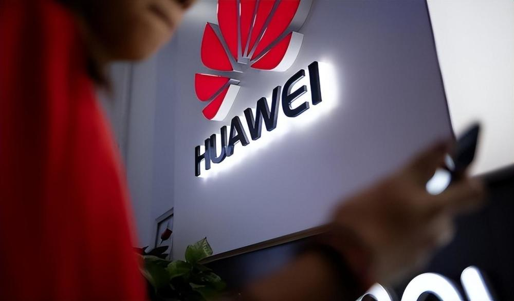
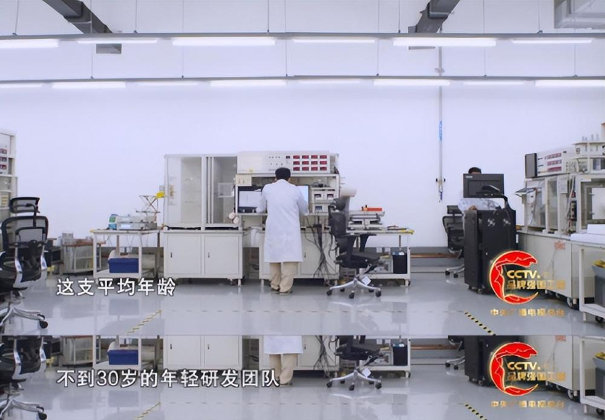
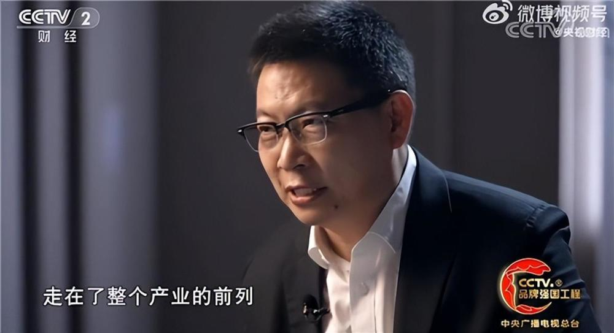
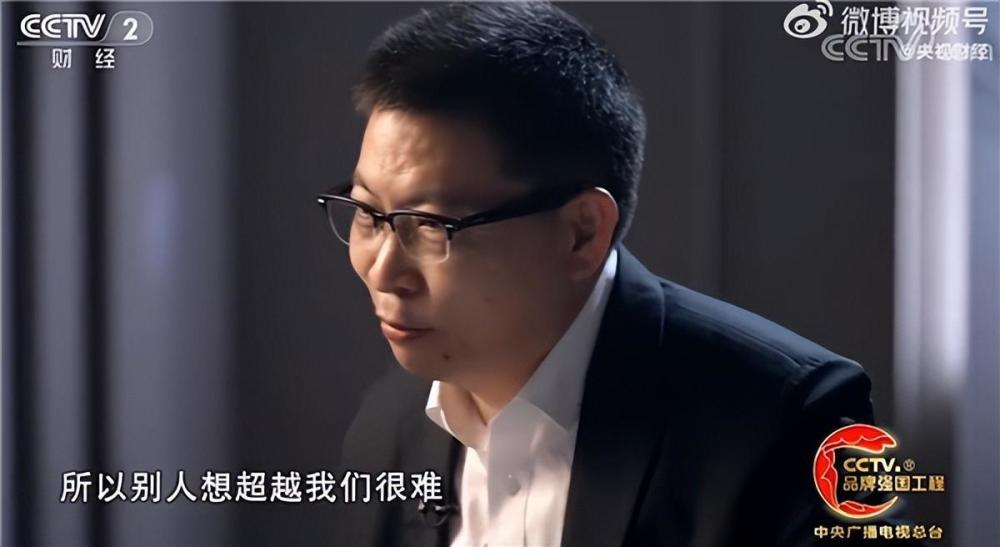
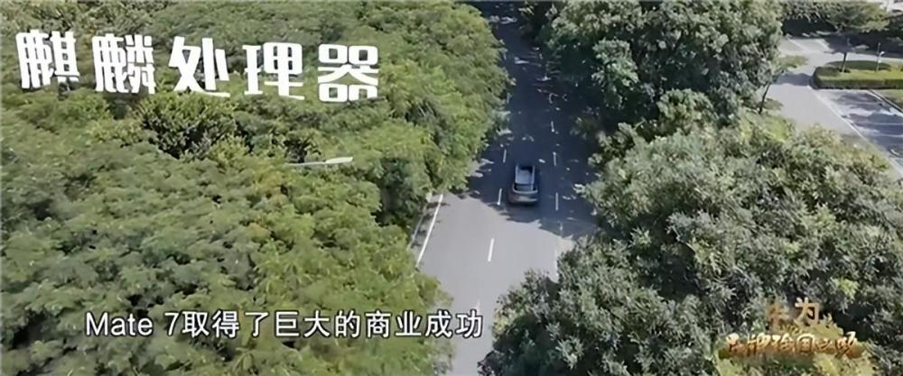
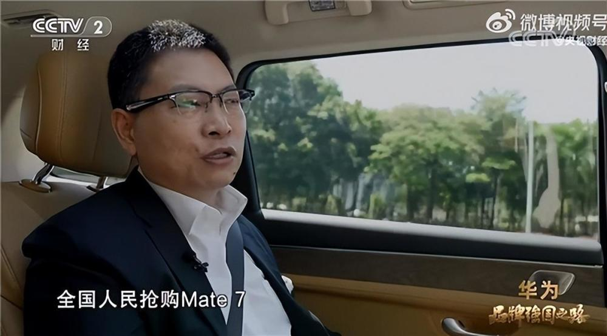

# 华为常务董事余承东：我们很多技术走在产业前列，别人想超越很难

Tech星球1月31日消息，近日，在央视“品牌强国之路”节目中，华为常务董事余承东、华为手机产品线副总裁李小龙，揭秘了华为Mate 50系列研发背后的故事。

据悉，在华为Mate 50系列上，华为通过北斗卫星消息硬件能力，首次将卫星消息功能带到大众智能手机上，让用户即使身处无网之地也能与外界进行联系。

据透露，华为卫星消息研发团队平均年龄不到 30 岁，参与研发的首款支持北斗卫星消息的智能手机华为 Mate 50
系列，突破地面网络限制，开启大众卫星通信新时代。

另外，华为还在Mate
50系列中带来了自研的昆仑玻璃，让整机耐摔抗跌落能力比普通玻璃提升10倍。据悉，昆仑玻璃从“钢筋混泥土”的初期灵感，到实际的商用落地整整历时 4
年，期间一度面临“夭折”。据悉，华为昆仑玻璃，经过 24 小时晶体生长、108 道工序、1600
度熔炼工艺打造，坚若磐石。一片手机面板玻璃中含有数以亿亿个高强度纳米晶体，抗冲击阻开裂。数据显示，搭载昆仑玻璃使整机耐摔能力提升至 10 倍。

余承东表示，因为我们很多技术走在整个产业的前列，所以别人想超越我们很难，要超越他们的往往只有我们自己。

余承东强调，这不断地去创新、不断地突破，但也让消费者受益了，消费者能买到更好的产品，带动了整个产业的进步。

值得一提的是，余承东此前还感慨称，“若不是因为美国的打压，可能全球主要的手机厂家就是华为和苹果，其他都是小厂家。包括那家韩国企业，可能主要在美国和韩国两个市场，其他市场基本都被干得差不多了。”

据了解，在中国企业联合会发布的2021年专利发明数企业排名榜单中，华为以99000个专利数领先，蝉联第一。

此外，余承东还在采访时首次谈到了自己最自豪的时刻，他说：“Mate 7取得了巨大的商业成功，开始大家都没想到能卖这么多，全国人民抢购华为Mate 7”。

据了解，华为Mate
7是华为2014年9月发布的高端旗舰，采用6英寸大屏，搭载麒麟925处理器，内置4100mAh电池，配备前置500万像素，后置1300万像素主摄。

值得一提的是，在央视采访中，余承东还谈到了自己为什么要做Mate系列，他表示，10年前就坚定了信心，要打造高端品牌、要做最伟大的产品、最好的产品。

