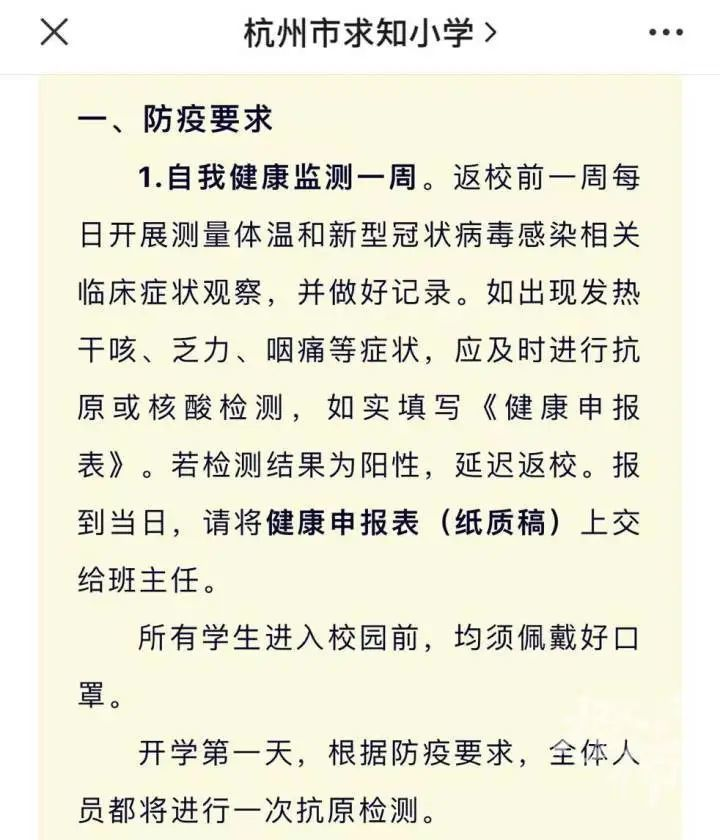
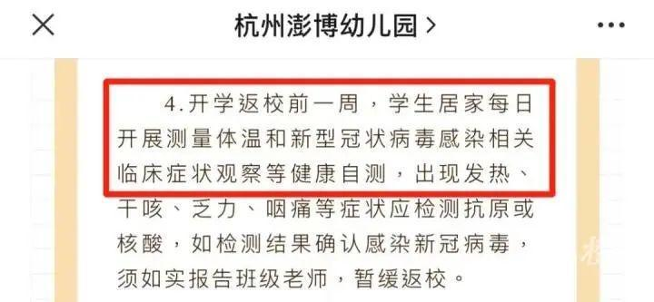
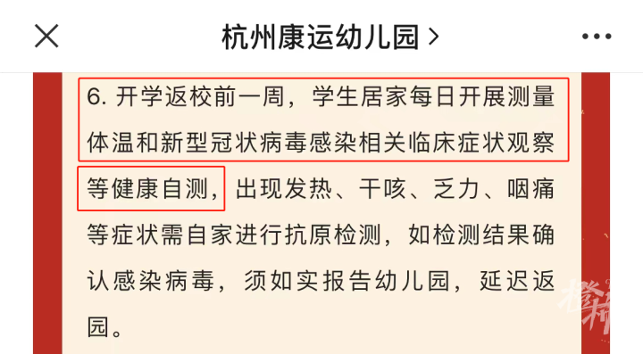
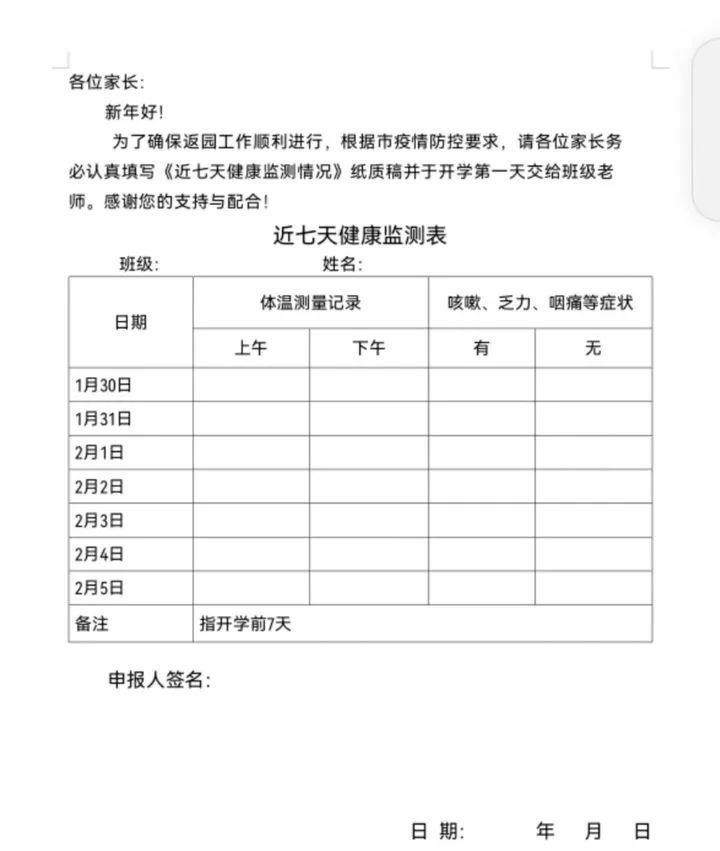
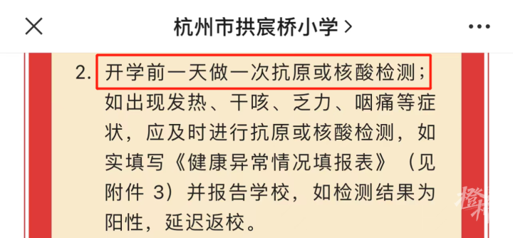
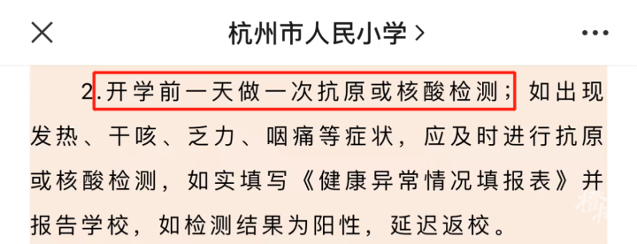

# 杭州有学校发通知，开学前一天做一次抗原或核酸！新学期还要做核酸吗？

寒假进入倒计时，杭州中小学、幼儿园再过一周就将迎来开学。许多家长关心：开学返校，要提前做核酸吗？新学期，校内还会不会组织核酸筛查？

这两天，杭州一些学校陆续发布开学返校告知书，许多都提到了开学前一周的健康监测——

返校前一周每日开展测量体温和新型冠状病毒感染相关临床症状观察，并做好记录。如出现发热干咳、乏力、咽痛等症状，应及时进行抗原或核酸检测，如实填写《健康申报表》。若检测结果为阳性，延迟返校。所有学生进入校园前，均须佩戴好口罩。

有学校通知，开学第一天，根据防疫要求，全体人员都将进行一次抗原检测。

比如，有幼儿园要求家长开学前一周填写《近七天健康监测表》。

也有学校提到，开学前一天做一次抗原或核酸检测；如出现发热、干咳、乏力、咽痛等症状，应及时进行抗原或核酸检测，如实填写《健康异常情况填报表》并报告学校，如检测结果为阳性，延迟返校。

来源：橙柿互动·都市快报 记者 林佳琦

