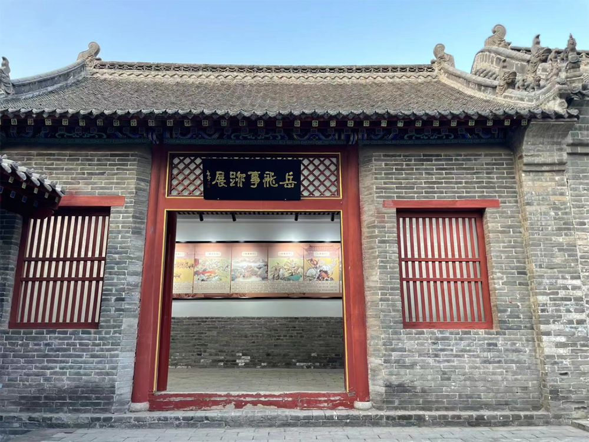
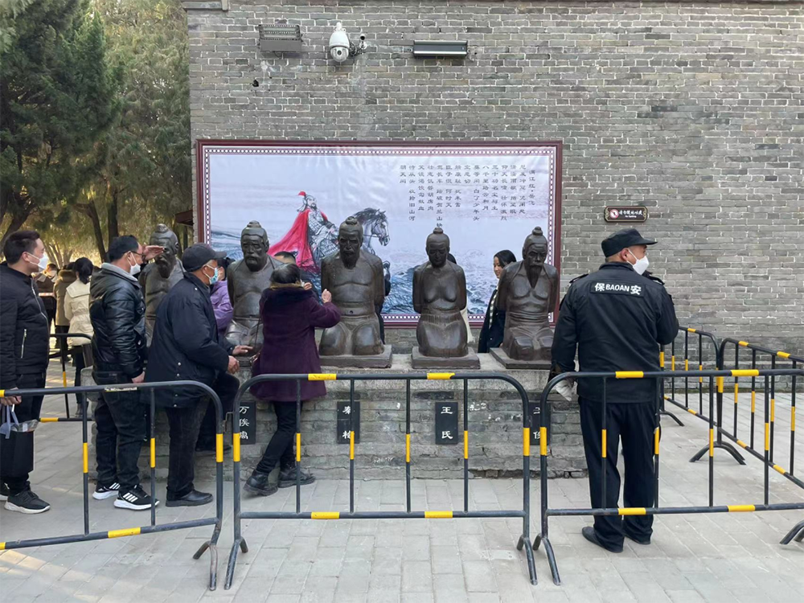

# 河南太昊陵一游客拿铁板打砸秦桧像，高喊“还我河山”，公安已受案

据河南省周口市淮阳区太昊陵文物保护中心微信号“太昊伏羲陵”消息，太昊伏羲陵1月30日晚作出《关于游客近日在太昊陵岳忠武祠不文明行为的情况说明》称，抽打秦桧雕像不能“极端”，别把憎恶发泄到雕像上。公安部门已经受理该案件。

太昊陵内景点之一的岳忠武祠（岳飞观）的正殿前，有1985年复铸的秦桧等五佞臣跪像。

1月29日14：10左右，一名游客在岳飞观游览的过程中，突然情绪激动起来，站到岳飞观前的香炉上高喊：“还我河山”。景区工作人员再三劝阻，该游客非但不听，还强行掀起遮盖香炉的铁板去砸打秦桧等铸铁跪像，并站在跪像台基上喝问“下一个谁来？”随后在工作人员的强力劝导下离开了现场。

工作人员随即报警，公安部门已经受理该案件。

经景区工作人员检查，铸铁跪像没有受到损坏（铸铁跪像为现代仿制品，不属于历史文物）。

事情发生之后，景区管理部门高度重视，重点做了三方面工作：

一是正面引导，增加对岳飞事迹地宣传，并对岳飞事迹展馆的大门进行扩大，以便游客参观游览，学习岳飞精忠报国事迹；

二是对秦桧等跪像旁加装了护栏，同时增加安保力量，组织游客排队有序参观，引导游客文明旅游，防止再发生类似不文明行为。

三是积极倡导游客在旅游活动中遵守社会公共秩序和社会公德，尊重当地的风俗习惯、文化传统和宗教信仰，爱护旅游资源，保护生态环境，遵守旅游文明行为规范。

上述情况说明称，文明旅游不能遗忘。抽打秦桧雕像不能“极端”，别把憎恶发泄到雕像上。“面对秦桧雕像，最理智的做法，将内心的‘打’和外在的保护统一起来，这才是真正的文明进步。”

岳忠武祠，始建于明代，俗称“岳飞观”。岳飞是南宋的抗金名将，为什么在太昊陵内立观享祀呢？

太昊伏羲陵方面特别解释称，淮阳古称陈州，地处中原，历史上是兵家必争之地，南宋时期，屡受金兵侵犯。康王四年（公元1130年），金兵王善率兵围陈，岳飞战于清河，擒俘其大将孙胜、孙清，兵解陈围。绍兴六年（公元1136年），金人又南犯中原，岳飞遣部将王贵大破金军收复陈州。绍兴十年（公元1140年），金兀术侵入东京，陈州失陷，岳飞遣部将血战金兵，三复陈州。淮阳人民为表著岳飞复陈之功，感恩戴德，故在此建岳飞观。2022年，景区增设了岳飞事迹展，不少家长专程带孩子来铭记英雄、崇尚英雄、捍卫英雄、学习英雄。

