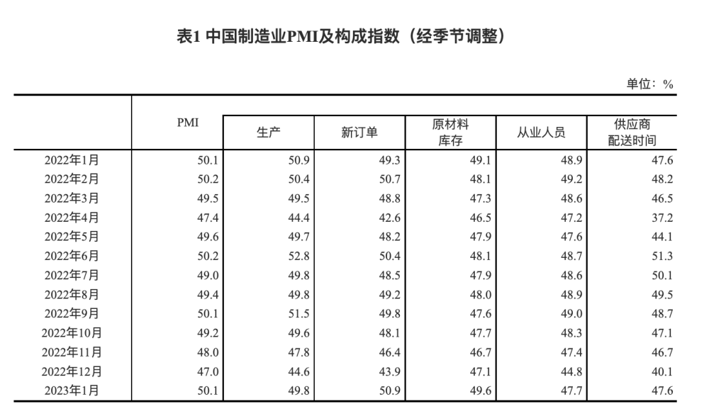
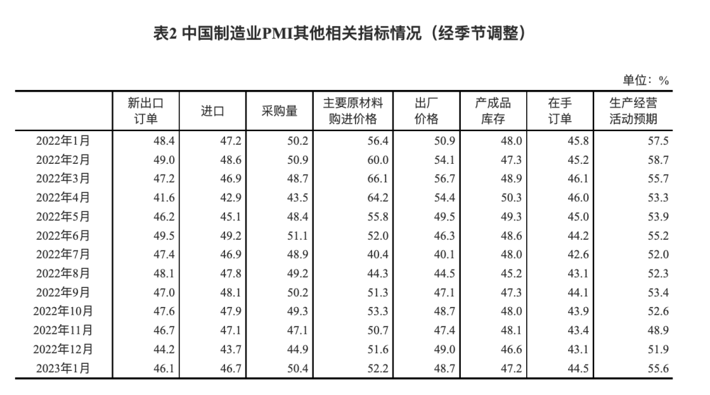
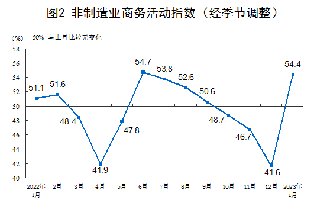
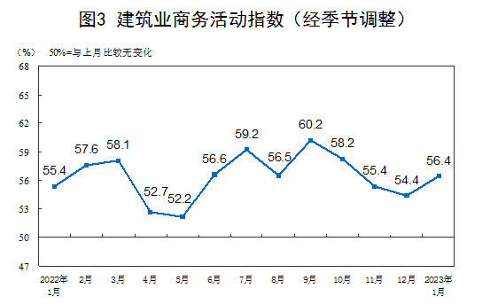
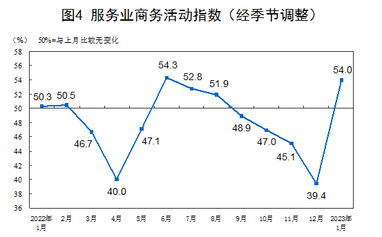
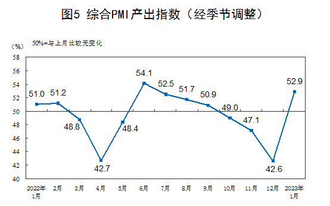

# 统计局：1月制造业PMI为50.1%重回扩张区间，建筑业景气上升

一、中国制造业采购经理指数运行情况

1月份，制造业采购经理指数（PMI）为50.1%，比上月上升3.1个百分点，升至临界点以上，制造业景气水平明显回升。

从企业规模看，大型企业PMI为52.3%，比上月上升4.0个百分点，高于临界点；中、小型企业PMI分别为48.6%和47.2%，比上月上升2.2和2.5个百分点，均低于临界点。

从分类指数看，在构成制造业PMI的5个分类指数中，新订单指数高于临界点，生产指数、原材料库存指数、从业人员指数和供应商配送时间指数均低于临界点。

生产指数为49.8%，比上月上升5.2个百分点，表明制造业生产景气水平较快回暖。

新订单指数为50.9%，比上月上升7.0个百分点，表明制造业市场需求有所回升。

原材料库存指数为49.6%，比上月上升2.5个百分点，表明制造业主要原材料库存量降幅明显收窄。

从业人员指数为47.7%，比上月上升2.9个百分点，表明制造业企业用工景气度有所上升。

供应商配送时间指数为47.6%，比上月上升7.5个百分点，表明制造业原材料供应商交货时间延长情况有所改善。

二、中国非制造业采购经理指数运行情况

1月份，非制造业商务活动指数为54.4%，比上月上升12.8个百分点，高于临界点，非制造业景气水平触底回升。

分行业看，建筑业商务活动指数为56.4%，比上月上升2.0个百分点。服务业商务活动指数为54.0%，比上月上升14.6个百分点。从行业情况看，铁路运输、航空运输、邮政、货币金融服务、保险等行业商务活动指数位于60.0%以上高位景气区间；房地产等行业商务活动指数仍低于临界点。

新订单指数为52.5%，比上月上升13.4个百分点，高于临界点，表明非制造业市场需求有所回暖。分行业看，建筑业新订单指数为57.4%，比上月上升8.6个百分点；服务业新订单指数为51.6%，比上月上升14.2个百分点。

投入品价格指数为51.5%，比上月上升2.3个百分点，高于临界点，表明非制造业企业用于经营活动的投入品价格总体水平有所上升。分行业看，建筑业投入品价格指数为55.3%，比上月上升4.1个百分点；服务业投入品价格指数为50.9%，比上月上升2.0个百分点。

销售价格指数为48.3%，比上月上升0.8个百分点，低于临界点，表明非制造业销售价格总体水平降幅收窄。分行业看，建筑业销售价格指数为52.8%，比上月上升2.8个百分点；服务业销售价格指数为47.5%，比上月上升0.5个百分点。

从业人员指数为46.7%，比上月上升3.8个百分点，表明非制造业企业用工景气度回升。分行业看，建筑业从业人员指数为53.1%，比上月上升7.4个百分点；服务业从业人员指数为45.5%，比上月上升3.1个百分点。

业务活动预期指数为64.9%，比上月上升11.2个百分点，高于临界点，表明非制造业企业对近期市场恢复发展预期向好。分行业看，建筑业业务活动预期指数为68.2%，比上月上升6.7个百分点；服务业业务活动预期指数为64.3%，比上月上升12.0个百分点。

三、中国综合PMI产出指数运行情况

1月份，综合PMI产出指数为52.9%，比上月上升10.3个百分点，高于临界点，表明我国企业生产经营景气水平有所回升。

**国家统计局服务业调查中心高级统计师赵庆河进行了解读：**

1月份，制造业采购经理指数、非制造业商务活动指数和综合PMI产出指数分别为50.1%、54.4%和52.9%，高于上月3.1、12.8和10.3个百分点，三大指数均升至扩张区间，我国经济景气水平明显回升。

**一、制造业采购经理指数升至临界点以上**

1月份，随着疫情防控转入新阶段，生产生活秩序逐步恢复，制造业PMI升至50.1%，重返扩张区间，调查的21个行业中有18个高于上月，制造业景气水平较快回升。

（一）供需两端同步改善。生产指数和新订单指数分别为49.8%和50.9%，高于上月5.2和7.0个百分点，制造业产需景气水平明显回暖，但受春节假日因素影响，生产改善力度小于市场需求。从行业情况看，农副食品加工、医药、通用设备、铁路船舶航空航天设备等9个行业的生产指数和新订单指数均位于扩张区间，其中医药制造业产需增长明显，两个指数均升至65.0%以上高位景气区间。

（二）各规模企业PMI均有回升。大、中、小型企业PMI分别为52.3%、48.6%和47.2%，高于上月4.0、2.2和2.5个百分点，各规模企业景气水平均有所回升。调查结果显示，大、中、小型企业中反映劳动力供应不足的比重均低于11.0%，较上月明显下降，员工短缺制约生产的情况有所缓解。

（三）重点行业PMI不同程度上升。高技术制造业、装备制造业、消费品行业和高耗能行业PMI分别为52.5%、50.7%、50.9%和48.6%，高于上月5.1、4.7、4.0和1.2个百分点，景气水平不同程度改善。从市场需求看，高技术制造业、装备制造业和消费品行业新订单指数分别为55.6%、52.3%和52.4%，高于上月11.2、10.3和8.5个百分点，均升至扩张区间，行业市场需求有所回暖。

（四）企业信心明显增强。生产经营活动预期指数为55.6%，高于上月3.7个百分点，升至较高景气区间，企业对近期市场恢复发展预期向好。从行业看，铁路船舶航空航天设备、电气机械器材等行业生产经营活动预期指数升至60.0%以上高位景气区间，企业对行业发展信心增强。

**二、非制造业商务活动指数大幅回升**

1月份，非制造业商务活动指数为54.4%，比上月上升12.8个百分点，重返扩张区间，非制造业景气水平触底回升。

（一）服务业景气水平由降转升。1月份，服务业商务活动指数为54.0%，结束连续6个月回落走势，升至扩张区间，本月春节假日消费市场回暖，服务业景气水平大幅回升。在调查的21个行业中，有15个位于扩张区间，其中铁路运输、航空运输、邮政、货币金融服务、保险等行业商务活动指数位于60.0%以上高位景气区间；同时前期受疫情影响较大的零售、住宿、餐饮等行业商务活动指数均高于上月24.0个百分点以上，重返扩张区间，表明居民消费意愿明显增强，市场活跃度回升。从需求看，新订单指数为51.6%，高于上月14.2个百分点，升至扩张区间，服务业恢复发展动能有所增强。从预期看，业务活动预期指数为64.3%，高于上月12.0个百分点，升至近期高点，企业预期向好。

（二）建筑业景气上升。建筑业商务活动指数为56.4%，高于上月2.0个百分点，建筑业总体保持较快扩张。从预期看，业务活动预期指数为68.2%，高于上月6.7个百分点，连续两个月位于高位景气区间，表明随着推进重大项目开工建设各项政策措施落地生效，建筑业企业对市场发展保持乐观。

**三、综合PMI产出指数升至近期高点**

1月份，综合PMI产出指数为52.9%，比上月上升10.3个百分点，升至扩张区间，表明我国企业生产经营景气水平有所回升。构成综合PMI产出指数的制造业生产指数和非制造业商务活动指数分别为49.8%和54.4%。

1月份采购经理指数重返扩张区间，反映出企业生产经营景气状况与2022年12月份相比发生明显积极变化。但同时也要看到，1月份反映市场需求不足的制造业和服务业企业仍然较多，市场需求不足仍是当前企业生产经营面临的首要问题，我国经济恢复发展基础需进一步巩固。

**附注**

1、主要指标解释

采购经理指数（PMI），是通过对企业采购经理的月度调查结果统计汇总、编制而成的指数，它涵盖了企业采购、生产、流通等各个环节，包括制造业和非制造业领域，是国际上通用的监测宏观经济走势的先行性指数之一，具有较强的预测、预警作用。综合PMI产出指数是PMI指标体系中反映当期全行业（制造业和非制造业）产出变化情况的综合指数。PMI高于50%时，反映经济总体较上月扩张；低于50%，则反映经济总体较上月收缩。

2、调查范围

涉及《国民经济行业分类》（GB/T4754-2017）中制造业的31个行业大类，3200家调查样本；非制造业的43个行业大类，4300家调查样本。

3、调查方法

采购经理调查采用PPS（Probability Proportional to
Size）抽样方法，以制造业或非制造业行业大类为层，行业样本量按其增加值占全部制造业或非制造业增加值的比重分配，层内样本使用与企业主营业务收入成比例的概率抽取。

本调查由国家统计局直属调查队具体组织实施，利用国家统计联网直报系统对企业采购经理进行月度问卷调查。

4、计算方法

（1）分类指数的计算方法。制造业采购经理调查指标体系包括生产、新订单、新出口订单、在手订单、产成品库存、采购量、进口、主要原材料购进价格、出厂价格、原材料库存、从业人员、供应商配送时间、生产经营活动预期等13个分类指数。非制造业采购经理调查指标体系包括商务活动、新订单、新出口订单、在手订单、存货、投入品价格、销售价格、从业人员、供应商配送时间、业务活动预期等10个分类指数。分类指数采用扩散指数计算方法，即正向回答的企业个数百分比加上回答不变的百分比的一半。由于非制造业没有合成指数，国际上通常用商务活动指数反映非制造业经济发展的总体变化情况。

（2）制造业PMI指数的计算方法。制造业PMI是由5个扩散指数（分类指数）加权计算而成。5个分类指数及其权数是依据其对经济的先行影响程度确定的。具体包括：新订单指数，权数为30%；生产指数，权数为25%；从业人员指数，权数为20%；供应商配送时间指数，权数为15%；原材料库存指数，权数为10%。其中，供应商配送时间指数为逆指数，在合成制造业PMI指数时进行反向运算。

（3）综合PMI产出指数的计算方法。综合PMI产出指数由制造业生产指数与非制造业商务活动指数加权求和而成，权数分别为制造业和非制造业占GDP的比重。

5、季节调整

采购经理调查是一项月度调查，受季节因素影响，数据波动较大。现发布的指数均为季节调整后的数据。

